# All Vocabulary

**Total words: 1151**

## 📑 Table of Contents

- [SpongeBob SquarePants - Vocabulary (150 words)](#spongebob-squarepants---vocabulary-150-words)
  - [S1 (150 words)](#s1-150-words)
    - [E1 (68 words)](#e1-68-words)
    - [E3 (29 words)](#e3-29-words)
    - [E4 (19 words)](#e4-19-words)
    - [E5 (34 words)](#e5-34-words)
- [Deep Learning with PyTorch - Vocabulary (660 words)](#deep-learning-with-pytorch---vocabulary-660-words)
  - [Deep Learning with PyTorch (39 words)](#deep-learning-with-pytorch-39-words)
  - [foreword (51 words)](#foreword-51-words)
  - [preface (90 words)](#preface-90-words)
  - [acknowledgments (60 words)](#acknowledgments-60-words)
  - [about this book (164 words)](#about-this-book-164-words)
  - [about the authors (22 words)](#about-the-authors-22-words)
  - [about the cover illustration (44 words)](#about-the-cover-illustration-44-words)
  - [Part 1: Core PyTorch (190 words)](#part-1-core-pytorch-190-words)
    - [Chapter 1: Introducing deep learning and the PyTorch Library (177 words)](#chapter-1-introducing-deep-learning-and-the-pytorch-library-177-words)
- [Duolingo - Vocabulary (272 words)](#duolingo---vocabulary-272-words)
  - [SECTION 1 (272 words)](#section-1-272-words)
    - [Solo trip (36 words)](#solo-trip-36-words)
    - [Delivery (29 words)](#delivery-29-words)
    - [At School (37 words)](#at-school-37-words)
    - [Interview (26 words)](#interview-26-words)
    - [Chores (39 words)](#chores-39-words)
    - [Meeting (37 words)](#meeting-37-words)
    - [Reunion (34 words)](#reunion-34-words)
    - [Health (28 words)](#health-28-words)
    - [Innovation (6 words)](#innovation-6-words)
- [Example - Vocabulary (15 words)](#example---vocabulary-15-words)
  - [foreword (2 words)](#foreword-2-words)
  - [Part 1: Fundamentals (7 words)](#part-1-fundamentals-7-words)
    - [Chapter 1: Introduction (3 words)](#chapter-1-introduction-3-words)
    - [Chapter 2: PyTorch Basics (2 words)](#chapter-2-pytorch-basics-2-words)
    - [Chapter 3: Gradients (2 words)](#chapter-3-gradients-2-words)
  - [Part 2: Deep Learning (6 words)](#part-2-deep-learning-6-words)
    - [Chapter 4: Neural Networks (3 words)](#chapter-4-neural-networks-3-words)
    - [Chapter 5: Training (3 words)](#chapter-5-training-3-words)
- [General - Vocabulary (54 words)](#general---vocabulary-54-words)
  - [game (5 words)](#game-5-words)
  - [news (6 words)](#news-6-words)
  - [social media (25 words)](#social-media-25-words)
  - [other (13 words)](#other-13-words)
  - [Wow! Words (5 words)](#wow-words-5-words)

---

## SpongeBob SquarePants - Vocabulary (150 words)

### S1 (150 words)

#### E1 (68 words)
- `aye`  /aɪ/   another word for 'yes'
- `pineapple`  /ˈpaɪnæpl/   a big fruit that is yellow inside and has a rough brown skin   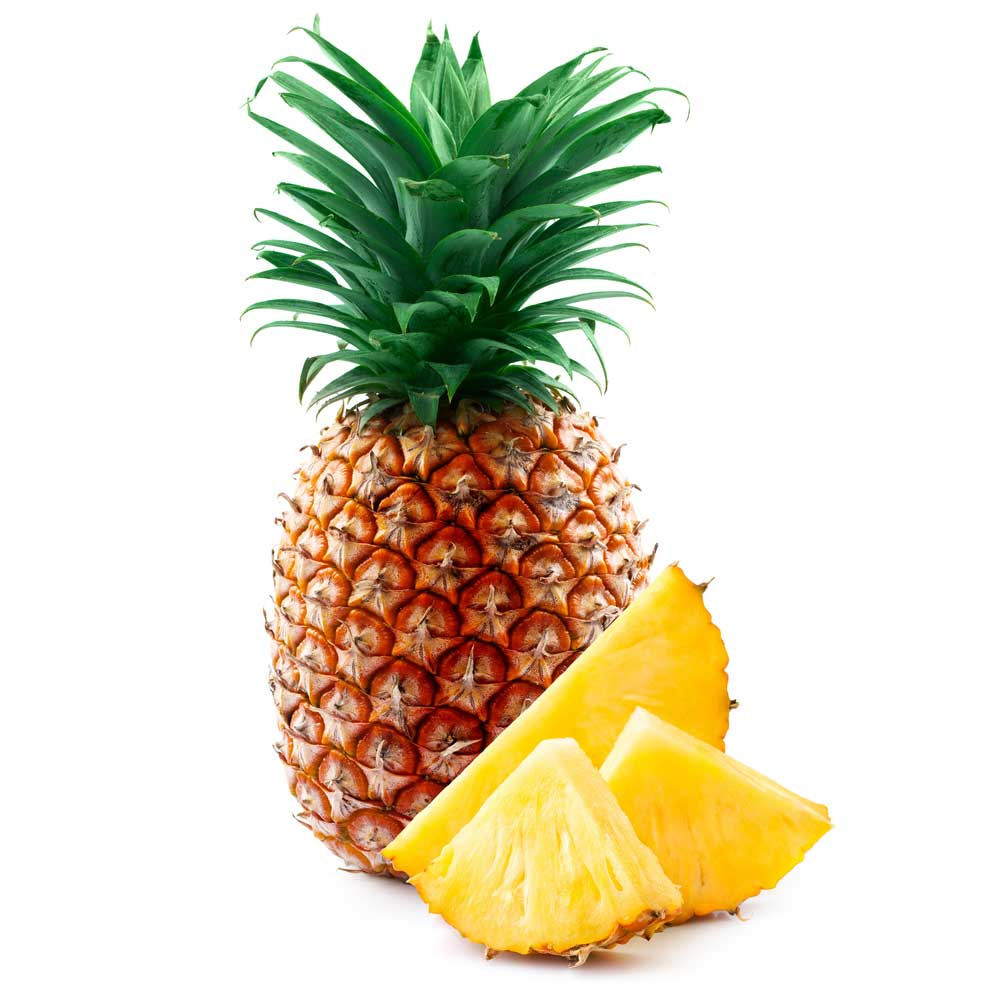
- `absorbent`  /əbˈzɔːrbənt/   able to take in and hold something,especially liquid: an absorbent cloth
- `porous`  /ˈpɔːrəs/   Something that is porous has many small holes, so liquid or air can pass through, especially slowly
- `nautical`  /ˈnɔːtɪkl/   relating to ships, sailing, or sailors
- `sail (verb)`  /seɪl/   1. to travel on the water: The ship sailed along the coast   2. to control a boat with sails: We sailed the yacht down the river
- `sailor`  /ˈseɪlər/   a person who sails ships or boats as their job or as a sport
- `nonsense`  /ˈnɑːnsens/   words or ideas that have no meaning or that are not true: It's nonsense to say that Jackie is lazy
- `drop (verb)`  /drɑːp/   1. to let something fall: I dropped my watch and it broke   2. to fall: The glass dropped from her hands   3. to become lower or less: The temperature has dropped   4. (also drop somebody off) to stop your car and let somebody get out: Could you drop me at the station? - He dropped me off at the bus stop   5. to stop doing something: I'm going to drop geography (= stop studying it) at school next year   `drop in` to visit somebody who does not know that you are coming: We were in the area so we thought we'd drop in and see you   `drop off` to fall asleep: She dropped off in front of the TV   `drop out` to stop doing something with a group of people: I dropped out of the football team after I hurt my leg
- `deck`  /dek/   1. one of the floors of a ship, plane or bus: He stood on the lower deck of the ship and looked out to sea   2. (American) (British pack) a set of 52 cards for playing games
- `flop`  /flɑːp/   to fall or drop heavily
- `laugh (verb)`  /læf/   to make sounds to show that you are happy or that you think something is funny: His jokes always make me laugh   `laugh at somebody or something` to laugh to show that you think somebody or something is funny or silly: The children laughed at the clown - They all laughed at me when I said I was afraid of dogs
- `narrator`  /nəˈreɪ.tər/   the character who tells you what is happening in a book or film
- `fascinating`  /ˈfæsɪneɪtɪŋ/   very interesting: She told us fascinating stories about her life
- `teeming`  /ˈtiːmɪŋ/   If a place is teeming, it is full of people
- `creature`  /ˈkriːtʃər/   any living thing that is not a plant: birds, fish and other creatures - This story is about creatures from another planet
- `naked`  /ˈneɪkɪd/   not wearing any clothes (SAME MEANING: nude)
- `condition`  /kənˈdɪʃən/   1. the state that somebody or something is in: The car was cheap and in good condition, so I bought it   2. conditions the situation in which people live, work or do things: The prisoners lived in terrible conditions   3. something that must happen before another thing can happen: One of the conditions of the job is that you agree to work on Saturdays
- `establish`  /ɪˈstæblɪʃ/   to start something new: The school was established in 1852
- `krusty krab`  /ˈkrʌsti ˈkræb/   fictional fast food restaurant in the American animated television series SpongeBob SquarePants
- `krabby patty`  /ˈkræbi ˈpæti/   fictional veggie burger sold by the fictional Krusty Krab restaurant
- `fiction`  /ˈfɪkʃən/   stories that somebody writes and that are not true: I enjoy reading fiction
- `veggie`  /ˈvedʒi/   vegetable
- `vegetable`  /ˈvedʒtəbl/   a plant or part of a plant that we eat: The students grow vegetables such as cabbages, beans and carrots
- `sign (noun)`  /saɪn/   1. something that tells you that something exists, is happening or may heppen in the future: Dark clouds are a sign of rain   2. a thing with writing or a picture on it that tells you something: The sign said 'No Smoking' - a road sign   3. a mark, shape or movement that has a special meaning: In mathematics, a cross is a plus sign - I put up my hand as a sign for him to stop
- `march (verb)`  /mɑːrtʃ/   1. to walk like a soldier: The soldiers marched along the road   2. to walk somewhere quickly in a determined way: She marched up to the manager and asked for her money back   3. to walk through the streets in a large group to show that you do not agree with something: They marched through the town shouting 'Stop the war!'
- `straight (adverb)`  /streɪt/   1. in a straight line: Look straight in front of you - Go straight on until you come to the bank, then turn left   2. without stopping or doing anything else; directly: Come straight home - She walked straight past me
- `lay`  /leɪ/   1. to put somebody or something carefully on another thing: I laid the papers on the desk   2. to make an egg: birds and insects lay eggs
- `whose`  /huːz/   1. used to ask who something belongs to: Whose car is this?   2. used to say exactly which person or thing you mean, or to give extra information about a person or thing: That's the boy whose sister is a singer
- `belong`  /bɪˈlɔːŋ/   1. to be somebody's: 'Who does this pen belong to?' 'It belongs to me'   2. to be a member of a group or an organization: Do you belong to any political party?   3. to have its right or usual place: That chair belongs in my room
- `spatula`  /ˈspætʃələ/    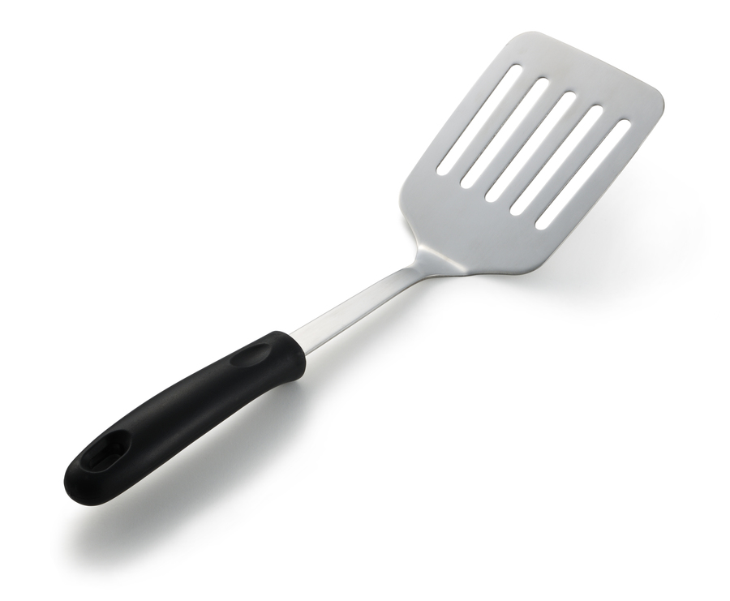
- `toothpick`  /ˈtuːθpɪk/   a small, thin piece of wood or plastic used for removing food from between your teeth   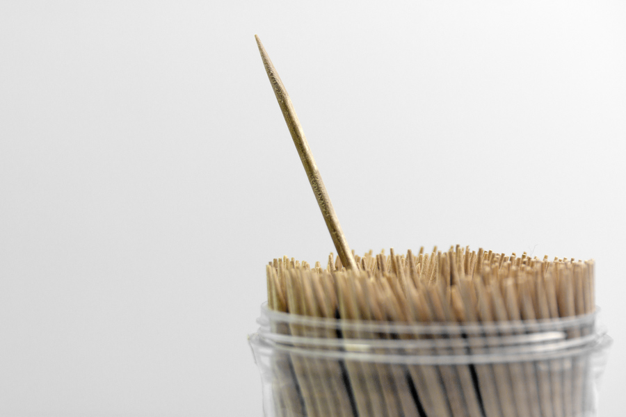
- `cube`  /kjuːb/   1. a shape like a box with six square sides all the same size   2. the number that you get if you multiply a number by itself twice: The cube of 5 (= 5³) is 125 (= 5 * 5 * 5)
- `hurry (verb)`  /ˈhʌri/   to move or do something quickly: We hurried home after school   `hurry up` to move or do something more quickly because there is not much time: Hurry up or we'll be late!
- `to come aboard`  /tuː kʌm əˈbɔːrd/   to get on a ship, plane, train, or other vehicle: We need to come aboard before the ship leaves
- `get`    1. to buy or take something: Will you get some bread when you go shopping?   2. to receive something: I got a lot of presents for my birthday   3. to go and bring back somebody or something (SAME MEANING: fetch): Jenny will get the children from school   4. to become: He is getting fat - Mum got angry - It's getting cold   5. to arrive somewhere: We got to London at ten o'clock   6. a word that you use with part of another verb to show that something happens to somebody or something: She got caught by the police   7. to make somebody do something: I got Peter to help me   8. to start to have an illness: I think I'm getting a cold   9. to travel on something such as a train or a bus: I didn't walk _ I got the bus   10. to undersatand or hear something: I don't get the joke   `get away with something` to do something bad and not be punished for it: He lied but he got away with it   `get back` to return: When did you get back from your holiday?   `get in` to reach a place (SAME MEANING: arrive): My train got in at 7.15   `get in; get into something` to climb into a car: Tom got into the car   `get off; get off something` to leave something such as train, bus, or bycycle: Where did you get off the bus?   `get on` 1. words that you use to say or ask how well somebody does something: Patrick is getting on well at school - How did you get on in the exam?   2. to become old: My grandfather is getting on _ he's nearly 80   `get on; get onto something` to climb onto a bus, train, or bycycle: I got on the train   `get on with somebody` to live or work in a friendly way with somebody: We get on well with our neighbours   `get out; get out of something` to leave a car: I opened the door and got out   `get out of something` to not do something that you do not like: I'll come swimming with you if I can get out of cleaning my room   `get something out` to take something from the place where it was: She opened her bag and got out a pen   `get over something` to become well or happy again after you have been ill or sad: He still hasn't got over his wife's death   `get through` to be able to speak to somebody on the telephone: I tried to ring Kate but I couldn't get through   `get through something` to use or finish a certain amount of something: I got through a lot of work today   `get together` to meet; to come together in a group: The whole family got together for Christmas   `get up` 1. to stand up: He got up to let an elderly lady sit down   2. to get out of bed: What time do you usually get up?   `get up to something` 1. to do something, usually something bad: I must go and see what the children are getting up to   2. to reach a particular place, for example in a book: I've got up to page 180
- `train (verb)`  /treɪn/   1. to teach a person or an animal to do something: He was trained as a pilot   2. to make yourself ready for something by studying or doing something a lot: Ann is training to be a doctor - She's training for the Olympics
- `crew`  /kruː/   all the people who work on a ship or a plane
- `lad`  /læd/   a boy or young man
- `prove`  /pruːv/   to show that something is true: The blood on his shirt proves that he is the murderer (The noun is: proof)
- `fry (verb)`  /fraɪ/   to cook something in hot oil: I will fry the eggs for breakfast - Fry the onions in butter - fried eggs
- `squidward`      
- `vouch`  /vaʊtʃ/   to be able from your knowledge or experience to say that something is true
- `port and starboard`      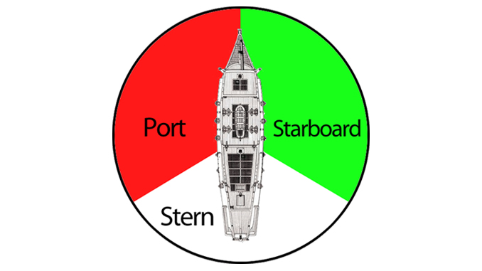
- `coming right up`    used by someone (such as a waiter) to say that something will be served or delivered very quickly: 'I'd like a turkey sandwich and a glass of lemonade, please.' 'Coming right up!'
- `lubber`  /ˈlʌbər/   a large person who often breaks things or has accidents
- `terrible`  /ˈterəbl/   very bad: She had a terrible accident - The food in that restaurant is terrible!
- `passenger`  /ˈpæsəndʒər/   a person who is traveling in a vehicle but not driving it: The plane was carrying 200 passengers
- `hatch`  /hætʃ/   When baby birds, insects, or fish hatch, they come out of an egg
- `smell`  /smel/   1. to have a particular smell: Dinner smells good - The perfume smells of roses   2. to notice something with your nose: Can you smell smoke?   3. to have a bad smell: Your feet smell
- `smelly`  /ˈsmeli/   having a bad smell: smelly socks
- `anchovy`  /ˈæntʃoʊvi/   a small or medium-sized oily sea fish   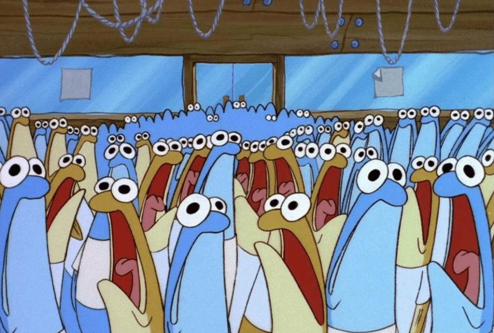
- `decency`  /ˈdiːsnsi/   behaviour that is good, moral, and acceptable in society
- `neat`  /niːt/   1. with everything in the right place and done carefully (SAME MEANING: tidy): keep your room neat and tidy - She has very neat handwriting   2. (American, informal) good; nice: That's a really neat car
- `tidy`  /ˈtaɪ.di/   1. with everything in the right place: Her room is very tidy   2. liking to have everything in the right place: a tidy boy (OPPOSITE: untidy)
- `anchor`  /ˈæŋkər/     
- `batten down the hatches`    to fasten or secure something tightly, especially on a ship before a storm
- `fasten`  /ˈfæsn/   1. to join or close something so that it will not come open: Please fasten your seat belts - Can you fasten this suitcase for me?   2. to fix or tie one thing to another thing: Fasten this badge to your jacket
- `suitcase`  /ˈsuːtkeɪs/     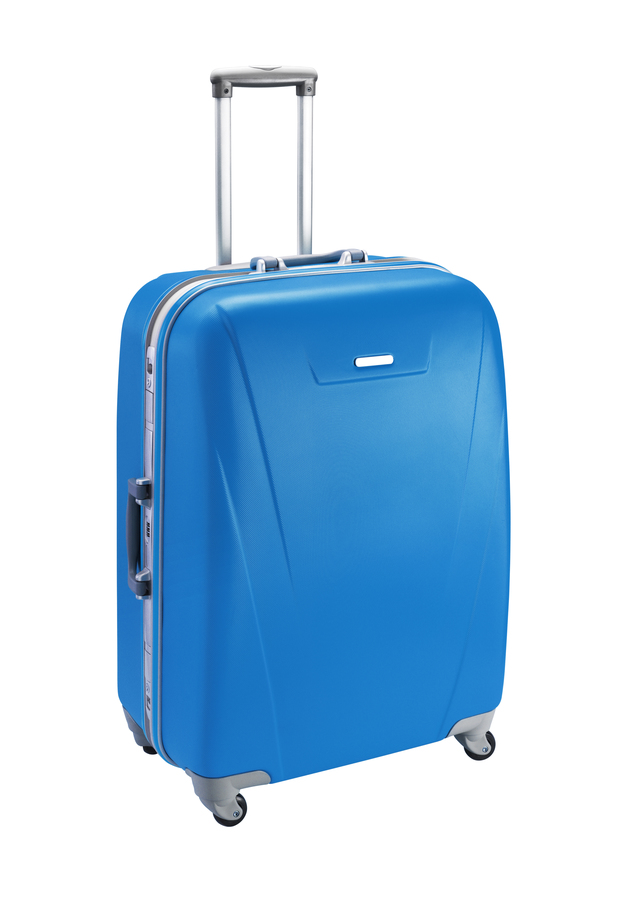
- `overboard`  /ˈoʊvərbɔːrd/   over the side of a boat and into the water: She fell overboard
- `over (adverb, preposition)`  /ˈoʊvər/   1. on somebody or something so that it covers them: She put a blanket over the sleeping child   2. above something; higher than something: A plane flew over our heads - There is a picture over the fireplace   3. across; to the other side of something: The dog jumped over the wall   4. to or in a place: Come over and see us on Saturday - Come over here! - Go over there and see if you can help   5. down or sideways: I fell over in the street - He learned over to speak to her   6. so that the other side is on top: You may turn your papers over and begin   7. more than a number, price, etc.: She lived in Mauritania for over 20 years - This game is for children of ten and over   8. not used; remaining: There are a lot of cakes left over from the party   9. used for saying that somebody repeats something: He said the same thing over and over again (= many times) - You'll have to start all over again (= from the beginning)   `all over` everywhere; in every part: Have you seen my glasses? I've looked all over - She travels all over the world
- `stock (noun)`  /stɑːk/   1. things that a shop keeps ready to sell: We have a large stock of tables and chairs - I'll see if we have your size in stock - I'm afraid that book's out of stock at the moment   2. (business) a share in a company or business that somebody has bought, or the value of those shares: stocks and shares
- `daughter`  /ˈdɔːtər/   a girl or woman who is somebody's child: They have two daughters and a son - My oldest daughter is a doctor
- `fine (adjective)`    1. beautiful or of good quality: There's a fine view from the cathedral - This is one of Monet's finest painting   2. well or happy: 'How are you?' 'Fine, thanks. And you?'   3. used for saying that something is good or acceptable (SAME MEANING: OK): 'Let's meet on Monday' 'Fine' - 'Do you want some more milk in your coffee?' 'No, that's fine'   4. not raining (SAME MEANING: sunny): I hope it stays fine for our picnic   5. very thin: I've got very fine hair (OPPOSITE: thick)   6. made of very small pieces: Salt is finer than sugar (OPPOSITE: coarse)
- `aboard`  /əˈbɔːrd/   on or onto a ship, plane, train, or bus: Are all the passengers aboard the ship? - Welcome aboard flight 603 to Nairobi
- `quarters`  /ˈkwɔːrtərz/   a place to live, especially rooms or housing for soldiers, sailors, or servants
- `booty`  /ˈbuːti/   any valuable things or money stolen by an army at war or by thieves
- `employee`  /ɪmˈplɔɪiː/   a person who works for someone else for money: The company has 500 employees

#### E3 (29 words)
- `treedome`      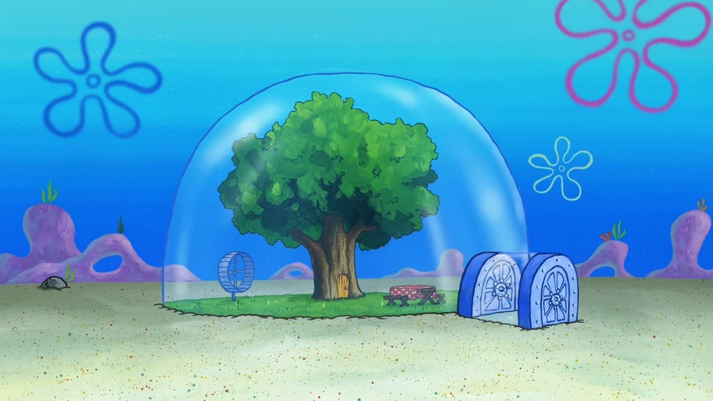
- `stinger`  /ˈstɪŋər/   the sharp pointed part of an insect or creature that can go into the skin leaving a smal, painful wound, sometimes with poison in it: a bee's stinger   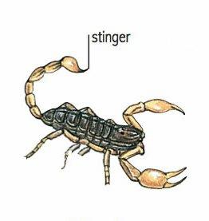
- `squirrel`  /skwɜr:əl/     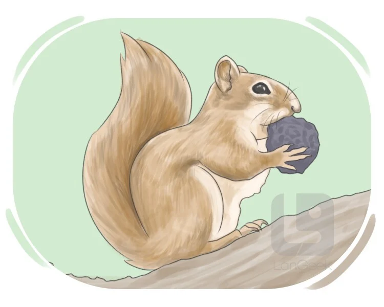
- `clam`  /klæm/   a kind of shellfish which can be eaten   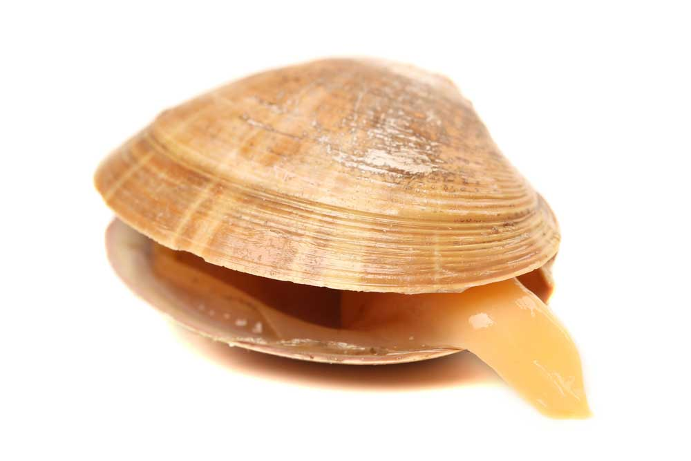
- `shellfish`    a type of sea creature with a shell, such as clams, oysters, mussels, shrimp, lobster, etc   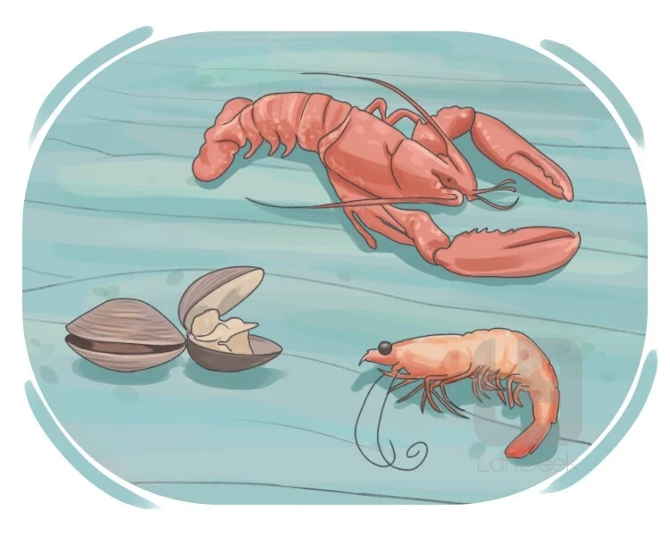
- `manner`  /ˈmæ.nɜr/   1. the way that you do something or the way that something happens: Don't get angry. Let's try to talk about this in a calm manner   2. manners (plural) the way you behave when you are with other people: It's bad manners to talk with your mouth full
- `fought`  /fɑːt/   past simple and past participle of fight
- `vanquish`  /ˈvæŋ.kwɪʃ/   to defeat someone   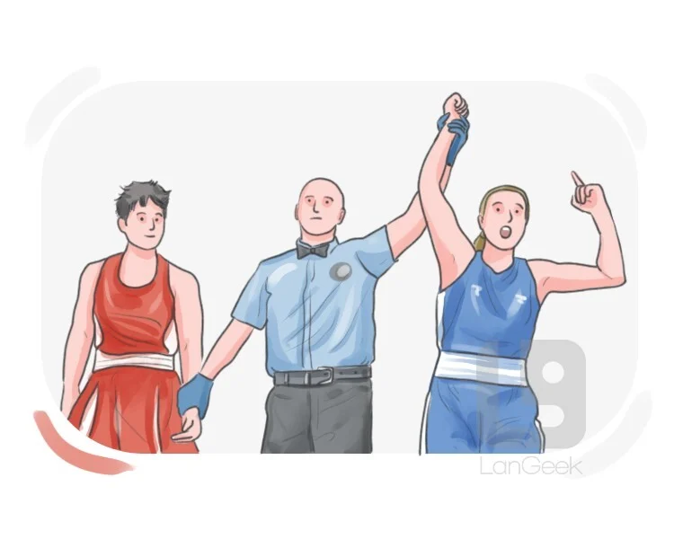
- `shell`  /ʃel/   the hard protective outer covering of some animals such as a snail, mussel, crab, or turtle, or of a bird's egg   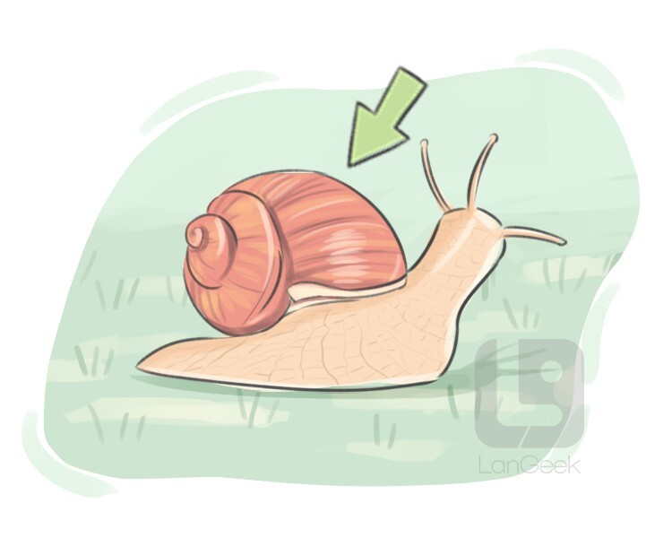
- `dude`  /du:d/   a word that we use to call a man
- `karate`  /kəˈrɑː.t̬i/   کاراته
- `take a gander`    look at; to have a quick look: Let's take a gander at your new car
- `bark (noun)`  /bɑːrk/   the hard outer covering of a tree   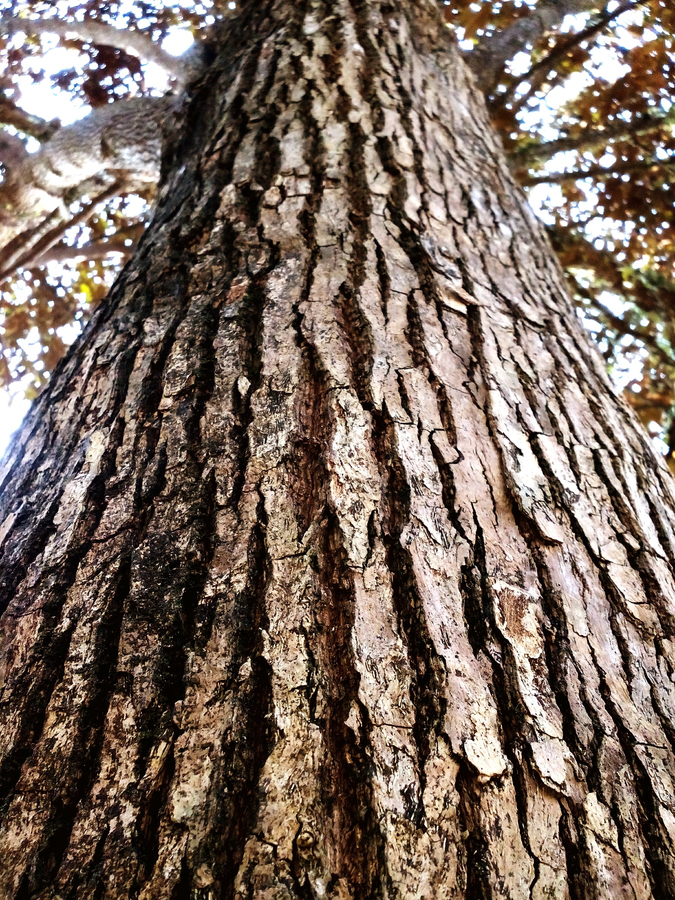
- `helmet`  /ˈhel.mət/   a strong, hard hat that covers and protects the head: a bicycle helmet - a war helmet   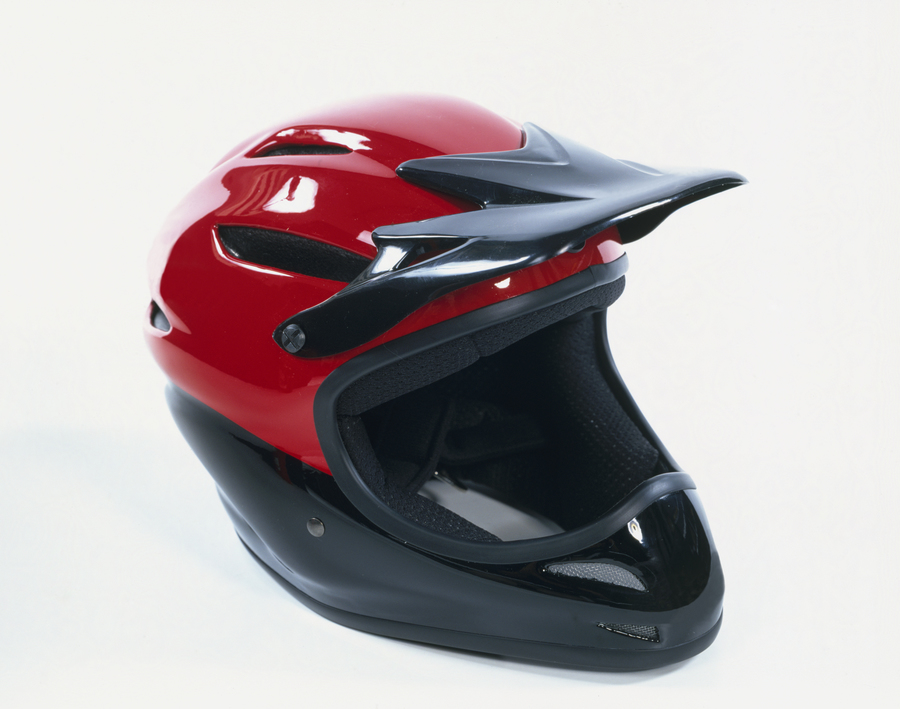
- `breathe`  /briːð/   to move air or something else into and out of the lungs   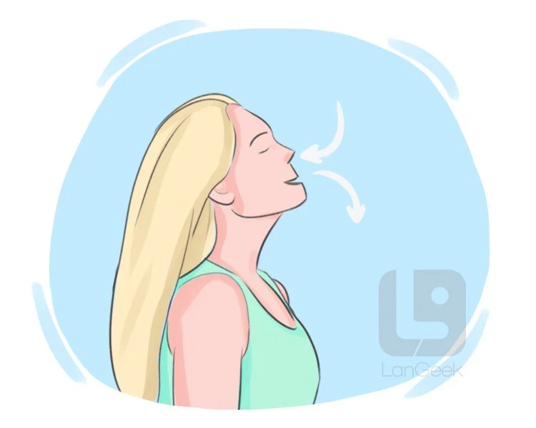
- `kid (verb)`  /kɪd/   to say something that it not true as a joke: I didn't mean it. I was only kidding - Are you kidding me?
- `fancy (adjective)`  /ˈfæn.si/   not simple or ordinary; complicated or including a lot of features: I wanted a simple black dress, nothing fancy - a fancy restaurant
- `grand tour`  /ˌɡrænd ˈtʊr/   a visit to the most important countries and cities of Europe that rich young people made in the past as part of their education
- `bubble`  /ˈbʌb.əl/   a ball of gas that appears in a liquid, or a ball formed of air surrounded by liquid that floats in the air   
- `surround`  /səˈraʊnd/   to be or go all around something: Gwen sat at her desk, surrounded by books and papers
- `pure`  /pjʊr/   1. not mixed with anything else: pure orange juice   2. clean and healthy: pure mountain air   3. complete or total: What she said was pure nonsense
- `oak tree`  /oʊk tri:/   درخت بلوط
- `dome`  /doʊm/   a building's roof that is rounded   
- `critter`  /ˈkrɪ.tɜr/   a creature
- `quitter`  /ˈkwɪtər/   a person who gives up easily instead of finishing something: I'm no quitter.
- `there`    1. a word that you use with verbs like 'be', 'seem' and 'appear' to show that something is true or that something is happening: There is a man at the door - Is there a film on TV tonight? - There aren't any shops in this village   2. in, at or to that place: Don't put the box there _ put it here - Have you been to Khartoum? I'm going there next week   3. a word that makes people look or listen: Oh look, there's Kate   `there you are` words that you say when you give something to somebody: 'There you are,' she said, giving me a cake
- `blow (verb)`  /bloʊ/   1. When air or wind blows, it moves: The wind was from the sea   2. to move something through the air: The wind blew my hat off   3. to send air out from your mouth: He blew on the soup to cool it down - Please blow into this tube   4. to send air out from your mouth into a musical instrument, for example, to make a noise: The referee blew his whistle   `blow up; blow something up` 1. to explode or make something explode, for example with a bomb: The plane blew up - They blew up the bridge   2. to fill something with air: We blew up some balloons for the party   `blow your nose` to clear your nose by blowing strongly through it onto a piece of cloth or paper (called a handkerchief)   `blow it` 1. to fail at something: I really blew it in the exam   2. an expression of anger: Oh, blow it! I've forgotten to invite Paul to the party
- `buddy`  /ˈbʌd.i/   (American, informal) (British mate) a friend: Hey buddy, how are you? - Don't worry buddy, You're doing fine
- `ask`    1. to try to get an answer by using a question: I asked him what the time was - 'What's your name?' she asked - Liz asked the teacher a question   2. to say that you would like somebody to do something for you: I asked Sara to drive me to the station   3. to try to get permission to do something: I asked my teacher if I could go home - I asked if I could go home early   4. to invite somebody to go somewhere with you: Mark has asked me to a party on Saturday   `ask for somebody` to say that you want to speak to somebody: Phone this number and ask for Mrs Green   `ask for something` to say that you want somebody to give you something: He asked for a new bike for his birthday

#### E4 (19 words)
- `shimmering`  /ˈʃɪ.mɜ.rɪng/   درخشان
- `scallop`  /ˈskæl.əp/   a sea creature that lives inside two joined flat, round shells and can be eaten   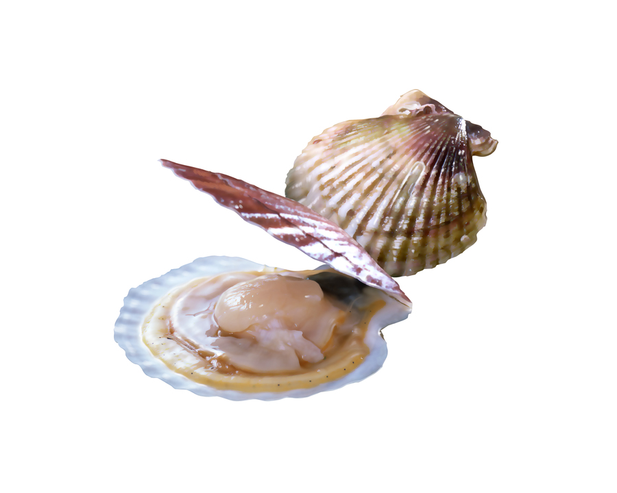
- `chirp`  /ʧɜrp/   to make the short high sound that small birds make
- `peaceful`  /ˈpiːs.fəl/   1. with no fighting: a peaceful demonstration   2. quiet and calm: It's so peaceful here
- `soothing`  /ˈsu.ðɪng/   making you feel calm: Her words had a soothing effect - I put on some nice soothing music
- `clarinet`  /ˌkler.ɪˈnet/     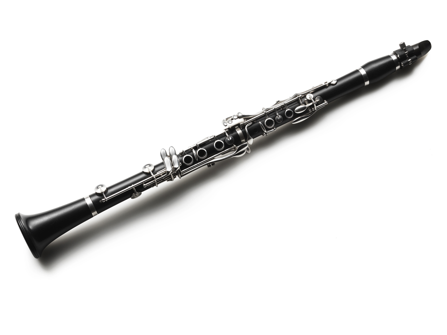
- `quarter`  /ˈkwɔr.tər/   1. one of four equal parts of something; ¼: a mile and a quarter - The film starts in three quarters of an hour   2. three months: You get a telephone bill every quarter   3. a part of a town: the Chinese quarter
- `reasonable`  /ˈriː.zən.ə.bəl/   1. fair, sensible, and ready to listen to what other people say: I tried to be reasonable even though I was very angry   2. fair, sensible, or right in a particular situation: I think $100 is a reasonable price (OPPOSITE: unreasonable)
- `booming (adjective)`    1. making a deep and loud hollow sound: a booming voice   2. increasing or becoming successful and producing a lot of money very quickly: Business is booming at the moment
- `bubble wand`      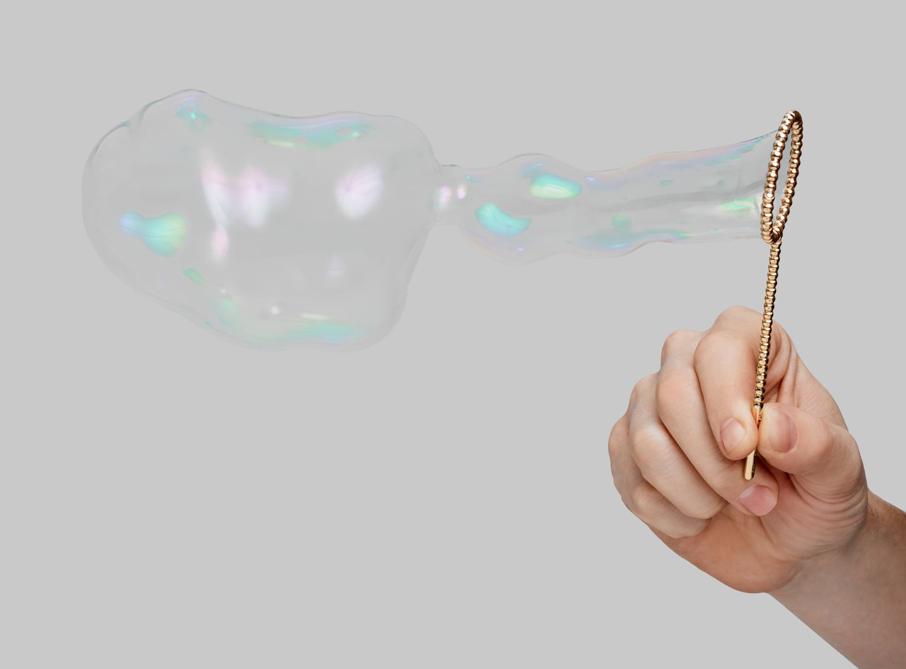
- `dip`  /dɪp/   to put something into a liquid for a short time: She dipped her toe into the pool to see how cold it was - Dip the fish in the batter, then drop it into the hot oil
- `giraffe`  /dʒɪˈræf/     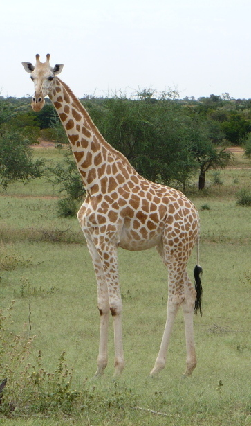
- `carefully`    with great attention: Drive carefully on those icy roads
- `annoying`  /əˈnɔɪ.ɪŋ/   if a person or thing is annoying, they make you a little angry: It's annoying when people don't listen to you
- `ashamed`  /əˈʃeɪmd/   feeling sory and unhappy because you have done something wrong, or because you are not as good as other people: I was ashamed about lying to my parents - She was ashamed of her old clothes
- `mere`  /mɪər/   only; not more than: She was a mere child when her parents died
- `step (verb)`    to move your foot up and put it down in another place when you walk, run or dance: You stepped on my foot!
- `spin`    to turn around over and over very fast   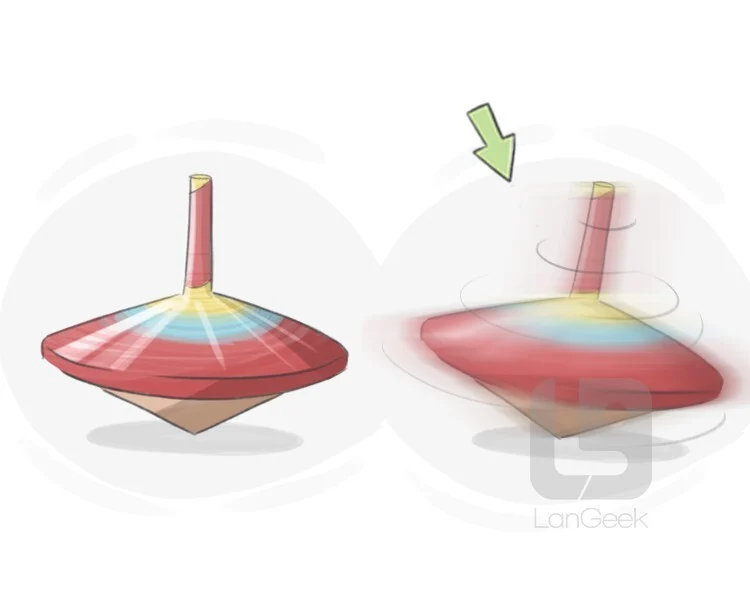
- `gene`  /dʒiːn/   a part of the DNA in a cell that controls the physical development, behaviour, etc. of an individual plant or animal and is passed on from its parents: The illness is believed to be caused by a defective gene   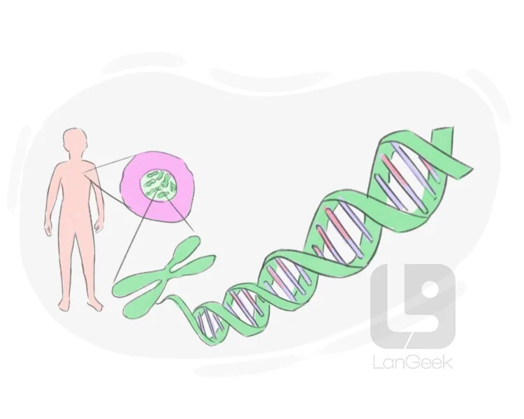

#### E5 (34 words)
- `rip`  /rɪp/   to pull apart; to tear, cut, or open or be torn something forcefully and quickly   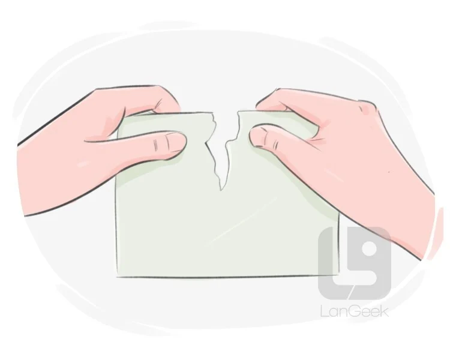
- `stinky`  /ˈstɪŋ.ki/   smelling very bad
- `mud`  /mʌd/   earth that has been mixed with water: The vehicles got bogged down in the heavy mud   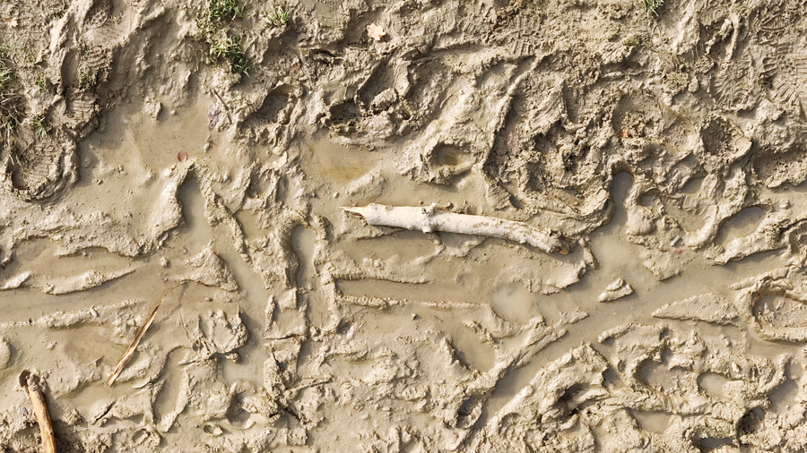
- `puddle`  /ˈpʌd.əl/   a small pool of liquid on the ground, especially from rain   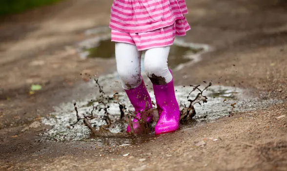
- `inhabitant`  /ɪnˈhæb.ɪ.tənt/   a person or animal that lives in a particular place: a city of five million inhabitants
- `observe`  /əb.ˈzɜrv/   to carefully watch something in order gain knowledge or understanding about the subject
- `hilarious`  /hɪˈler.i.əs/   If something is hilarious, it is extremely funny and makes you laugh a lot
- `extremely`  /ɪkˈstriːm.li/   very: They played extremely well - She's extremely beautiful
- `throw`  /θroʊ/   to make something move through the air by quickly moving your arm and hand   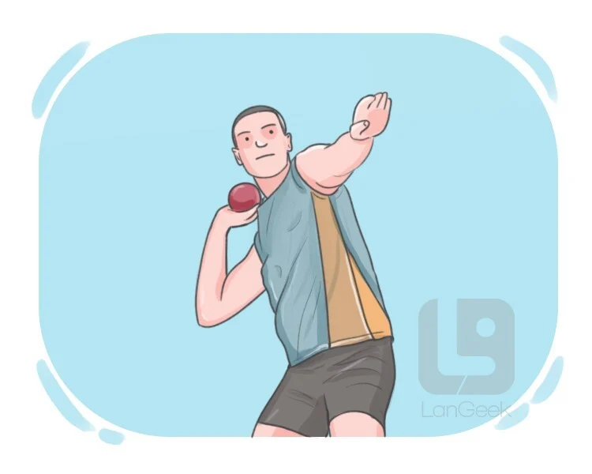
- `except`  /ɪkˈsept/   not including somebody or something: The restaurant is open every day except Sunday - Everyone went to the party except for me   `except that` apart from the fact that: I don't know what he looks like, except that he's very tall
- `announcer`  /ə.ˈnaʊn.sər/   someone who introduces programmes or reads the news on the television or radio   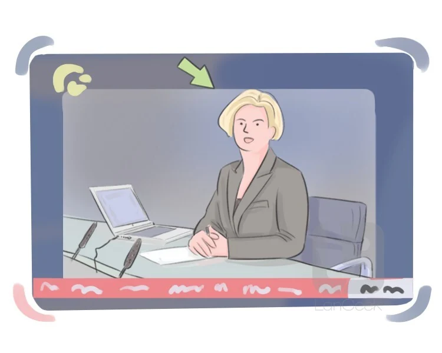
- `surf`  /sɜr:f/   to move on sea waves by standing or lying on a special board   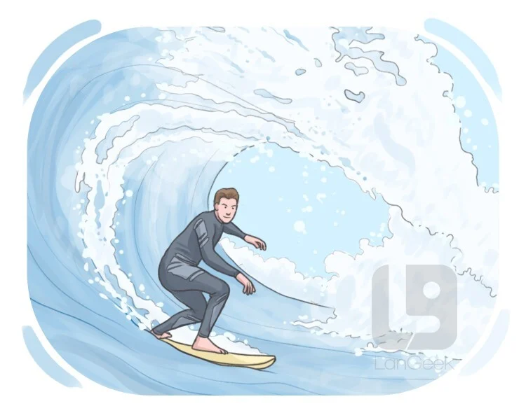
- `trademark`  /ˈtreɪd.ˌmɑrk/   1. a distinctive characteristic or attribute   2. a name or symbol on a product that shows it was made by a particular company, and that it cannot be used by other companies without permission
- `distinctive`  /dɪˈstɪŋk.tɪv/   Something that is distinctive is easy to recognize because it is different from other things
- `characteristic`  /ˌker.ək.təˈrɪs.tɪk/   a feature or quality that somebody or something has
- `cardboard`  /ˈkɑːrd.bɔːrd/   a thick and stiff type of paper material that is often used for packaging and making boxes   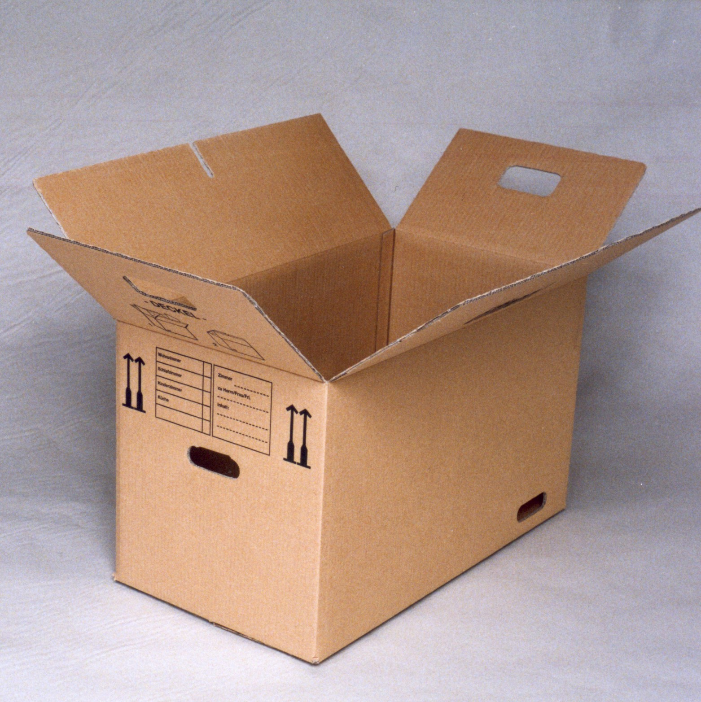
- `guy`  /ɡaɪ/   1. (informal) a man: He's a nice guy   2. guys (plural) (informal) used when speaking to a group of men and women or boys and girls: Come on guys, Let's go
- `tailor`  /ˈteɪ.lər/   a person whose job is making clothes, especially for men   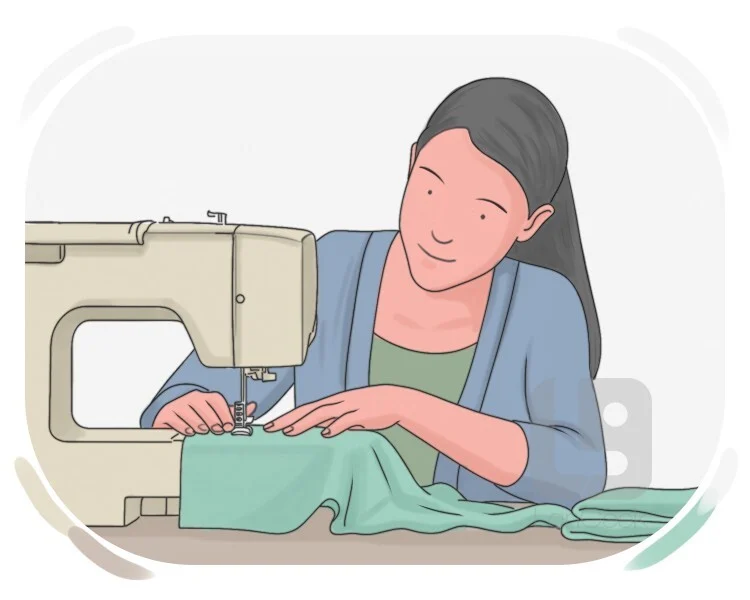
- `spectator`  /ˈspɛk.teɪ.tɜr/   a person who is watching an event, especially a sports event: There were 2000 spectators at the football match
- `uncalled for`    بی‌جا، نابجا، نامناسب، غیرضروری (معمولاً برای رفتار یا حرفی که زننده، توهین‌آمیز یا بی‌ادبانه است)
- `frisbee`  /ˈfrɪz.bi/   a round plastic disc used in some games that people can throw and catch in the air   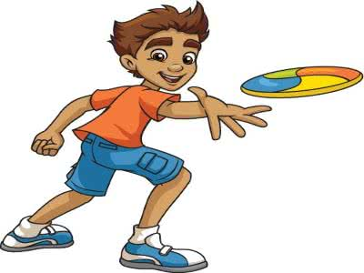
- `drown`  /draʊn/   to die under water because you cannot breathe; to make somebody die in this way: The boy fell in the river and drowned - Twenty people were drowned in the floods
- `thief`  /θiːf/   a person who steals   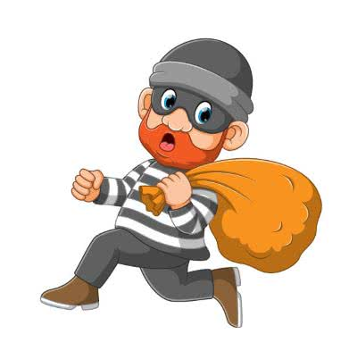
- `steal`  /stiːl/   to secretly take something that is not yours: Her money has been stolen
- `fool`  /fuːl/   a person who behaves in a silly way without thinking: You fool, you missed your chance
- `sunscreen`  /ˈsʌn.skriːn/   a cream that you put on your skin to prevent it from being damaged by the sun   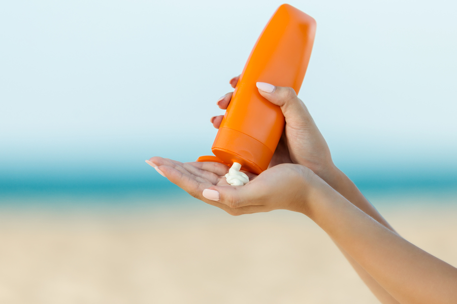
- `ouch`  /aʊtʃ/   used to express pain: Ouch! That hurts!
- `hurt`  /hɜrt/   to feel pain in a part of your body, or to injure someone or cause them pain: My head hurts
- `injure`  /ˈɪn.dʒɜr/   to hurt yourself or somebody else, especially in an accident: She injured her arm when she was playing tennis - Joe was injured in a car accident
- `bun`  /bʌn/   a small round cake or piece of bread   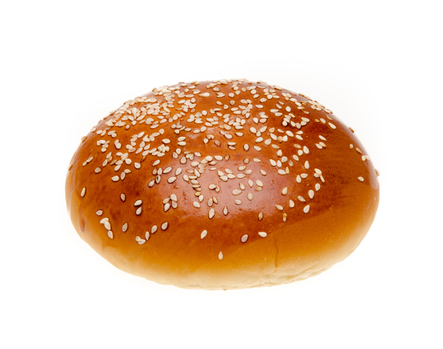
- `bury`  /ˈber.i/   1. to put a dead body in the ground   2. to put something in the ground or under something: The dog buried the bone in the garden
- `clown`  /klaʊn/   a person who wears funny clothes, has a painted face, and makes people laugh by performing tricks and behaving in a silly way   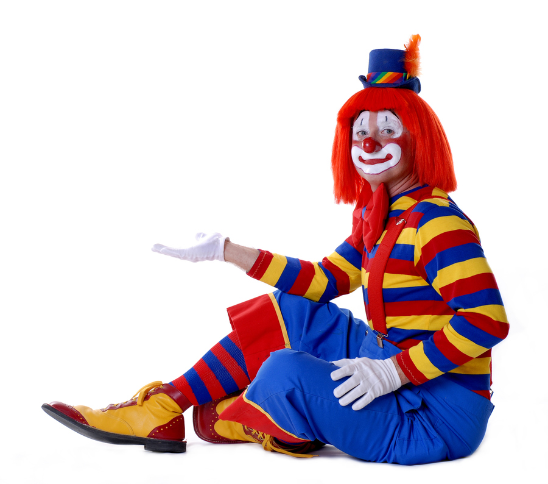
- `regret (verb)`  /rɪˈɡret/   to feel sorry about something that you did or did not do: He regrets selling his car - I don't regret what I said to her
- `righteous`  /ˈraɪ.tʃəs/   morally correct
---

---

## Deep Learning with PyTorch - Vocabulary (660 words)

### Deep Learning with PyTorch (39 words)
- `foreword`    پیش‌گفتار (معمولاً توسط متخصص یا فرد مشهور غیر از نویسنده)
- `distribute`  /dɪˈstrɪbjuːt/   to give or send things to each person: New books are distributed on the first day of school
- `order`    1. the way that you place people or things together: The names are in alphabetical order - List the jobs in order of importance   2. when everything is in the right place or everybody is doing the right thing: Our teacher likes order in the classroom - Are these papers in order (= correct and tidy)?   3. words that tell somebody to do something: He gave the order for work to begin - Soldiers have to obey orders   4. when you ask a company to send or supply goods to you: I'd like to place on order for some books   5. when you ask for food or drink in a restaurant, bar, etc.: The waiter took our order   `in order to` so that you can do something: We arrived early in order to buy our tickets   `out of order` (used about a machine, etc.) not working: I couldn't ring you _ the phone was out of order - سفارش
- `offer (verb)`    1. to say or show that you will do or give something if another person wants it: She offered me a cake - I offered to help her   2. to provide or supply something: It's an organization that offers free legal advice to people on low incomes
- `discount`  /ˈdɪskaʊnt/   a reduction in the usual price of something   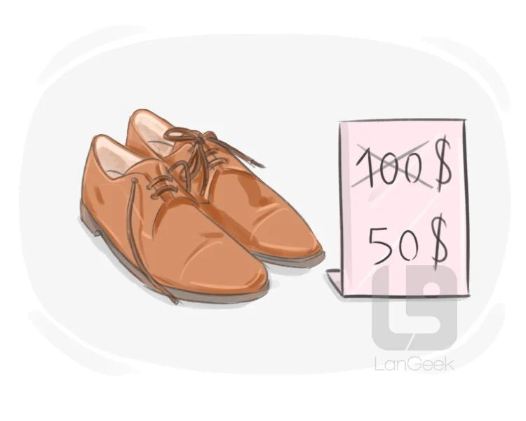
- `quantity`    تعداد یا حجم (سفارش عمده)
- `all rights reserved`    کلیه حقوق محفوظ است
- `publication`    انتشار
- `reproduced`    بازتولید شده (کپی کردن)
- `retrieval system`    سیستم بازیابی
- `transmitted`    منتقل شده
- `in any form or by means`    به هیچ شکل یا از هیچ وسیله‌ای
- `otherwise`    else, etc - در غیر این صورت، غیره
- `prior`    قبلی، پیشین در اولویت: چیزی که اولویت بالاتری دارد
- `designations`    اصطلاحات
- `distinguish`    to see, hear, etc. the difference between two things or people: Some people can't distinguish between me and my twin sister
- `trademarks`    علامت‌های تجاری
- `appear`    ظاهر شدن
- `aware`    آگاه
- `caps`    مخفف Capital letters
- `recognizing`    درک کردن
- `importance`    اهمیت
- `preserving`    حفظ کردن
- `policy`    سیاست
- `acid-free`    بدون اسید
- `exert`    اعمال کردن
- `efforts`    تلاش‌ها
- `responsibility`    مسئولیت
- `planet`    سیاره
- `least`    حداقل
- `recycled`    بازیافتی
- `processed`    فرآوری شده
- `elemental chlorine`    کلر عنصری
- `happened`    اتفاق افتاد
- `invaluable`    فوق العاده ارزشمند
- `partnership`    مشارکت
- `being`  /ˈbiːɪŋ/   بودن
- `joy`    لذت
- `same (adjective)`    the same not different; not another: Emma and I like the same kind of music - I've lived in the same town all my life - He went to the same school as me
---

### foreword (51 words)
- `author`    نویسنده
- `instrumental`    تأثیرگذار
- `flexible`    انعطاف پذیر
- `express`    to say or show how you think or feel: She expressed her ideas well - بیان کردن
- `executed`    اجرا کردن
- `relatively`    نسبتاً
- `polished`    صیقل داده‌شده
- `standing on the shoulders of giants`    استعاره‌ای به معنای بهره‌گرفتن از کار و» «دانش بزرگان گذشته
- `shoulder`    شانه
- `derives`    منبع گرفتن از
- `significant`    مهم
- `pioneered`    پیشگام بودن
- `rich`    غنی
- `rather`  /ˈræðər/   more than a little but not very (SAME MEANING: quite): We were rather tired after our long journey - It's rather a small room   `rather than` in the place of; instead of: Could I have tea rather than coffee?   `would rather` would prefer to do something: I'd rather go by train than by bus
- `conceptually`    از نظر مفهومی
- `from scratch`    from the beginning, without using anything that already exists: Ben built the shed from scratch
- `attribute`    عامل دانستن
- `enhanced`    تقویت‌شده
- `debuggability`    قابلیت اشکال‌زدایی
- `flexibility`    انعطاف‌پذیری
- `ultimately`    در نهایت
- `productive`    کارآمد
- `huge`    عظیم
- `adoption`  /əˈdɑːpʃən/   acceptance; the act of starting to use a new method, system, or idea
- `research`    تحقیق
- `built on`    بنا شده بر
- `curricula`    برنامه‌های درسی
- `tutorials`    آموزش‌های گام‌به‌گام
- `guarantee`    تضمین کردن
- `outdated`    از رده خارج شده
- `definitive`    قطعی
- `treatise`    مقاله
- `abstractions`    چکیده مفاهیم
- `tearing apart`    از هم باز کردن
- `underpinnings`    زیربناها
- `implementation`    پیاده‌سازی
- `additionally`    علاوه بر این
- `subjects`    موضوعات
- `jit`    Just-In-Time
- `aspect`  /ˈæspekt/   one of the qualities or parts of a situation, idea, problem, etc: Spelling is one of the most difficult aspects of learning English
- `through`  /θruː/   1. from one side or end of something to the other side or end: We drove through the tunnel - What can you see through the window? - She opened the gate and we walked through   2. from the beginning to the end of something: We travelled through the night   3. connected by telephone: Can you put me through to jill knight, please? - I tried to phone you but I couldn't get through   4. (American) (also informal thru) until, and including: We'll be in New York Tuesday through Friday   5. because of or with the help of somebody or something: She got the job through her father   `be through with` having finished or completed something: By the time we are through with the book - از طریق
- `expertise`    تخصص
- `bioengineering`    مهندسی زیستی
- `imaging`    تصویربرداری
- `practical`    workable, suitable for real use; likely to work effectively - عملی
- `journey`  /ˈdʒɜːr.ni/   the act of travelling from one place to another: Did you have a good journey?
- `treated`    مورد بررسی قرار گرفته
- `all in all`    در مجموع
- `becomes`    “تبدیل شدن” یا “شدن”
- `extended”`    گسترش یافته
- `workshop`    کارگاه (آموزشی)
---

### preface (90 words)
- `preface`    مقدمه
- `as kids`    وقتی بچه بودیم
- `sinclair spectrum 48k (luca)`    نام چند کامپیوتر قدیمی
- `commodore vic 20 (eli)`    نام چند کامپیوتر قدیمی
- `commodore c16 (thomas)`    نام چند کامپیوتر قدیمی
- `dawn`    start (of something big or new)
- `dreamed`    رؤیا دیدیم
- `take`    1. to move something or go with somebody to another place: Take your coat with you it's cold - Mark took me to the station   2. to put your hand round something and hold it: Take this money it's yours - She took my hand and led me outside   3. to remove something from a place or a person, often without asking them: Somebody has taken my bike   4. to eat or drink something: Don't forget to take your medicine   5. to agree to have something; to accept something: if you take my advice you'll forget all about him   6. to need an amount of time: The journey took four hours - It takes a long time to learn a language   7. to travel in a bus, train, etc: I took a taxi to the hospital   `take your time` do not rush; use as much time as you need   `take a break` to stop something for a short period, often to rest, to eat food, or to have a drink
- `collective`    دسته‌جمعی
- `rolling our eyes`    چشم‌ها را چرخاندن در واکنش به چیزی احمقانه
- `spy`    جاسوس
- `later on`    بعدها
- `during`    حین
- `independently`    به‌صورت مستقل
- `ourselves`    خودمون
- `facing`    رو به رو شدن
- `kind`    نوع
- `struggle`  /ˈstrʌɡl/   1. to try very hard to do something that is not easy: we struggled to lift the heavy box   2. to move your arms and legs a lot when you are fighting or trying to get free: She struggled with her attacker
- `variability`    تغییرپذیری
- `heuristics`    روش‌های اکتشافی
- `involved`  /ɪnˈvɑːlvd/   taking part in something; being part of something or connected with something: I'm very involved in local politics - We need to interview the people involved
- `went`    رفت (past of go)
- `came about`    به وجود آمد
- `appearance`    ظاهر شدن
- `being applied`    در حال اعمال شدن
- `identification`    شناسایی
- `lesions`    آسیب موضعی
- `decade`  /ˈdek.eɪd/   a period of ten years - دهه
- `appeared`    ظاهر شد
- `individual`  /ˌɪndɪˈvɪdʒuəl/   a single person or thing, especially when considered as separate from a group or set - شخصی، مجزا، جداگانه
- `took a bit`    کمی طول کشید
- `realize`    فهمیدن
- `represented`    نشان می‌داد
- `whole (adjective)`  /hoʊl/   complete; with no parts missing: He ate the whole cake! - We are going to Australia for a whole month - کل
- `multipurpose`    دارای کاربردهای متعدد
- `complicated`    complex - پیچیده
- `observation`    مشاهده
- `kids-of-the-80s`    کودکان دهه ۸۰ میلادی
- `mind (noun)`    the part of you that thinks and remembers: He has a very quick mind   `be or go out of your mind` to be or become mad or very worried: Where were you? I was going out of my mind with worry   `change your mind` to have an idea, then decide to do something different: I planned a holiday in France and then changed my mind and went to Italy   `have something on your mind` to be worried about something: I've got a lot on my mind at the moment   `make up your mind` to decide something: Shall I buy the blue shirt or the red one? I can't make up my mind - ذهن
- `horizon`    افق
- `overnight`    یک شبه
- `getting our hands dirty`    کار عملی کردن ، به‌جای فقط مطالعه تئوری
- `venerable`    محترم
- `precursor`    پیش‌کسوت
- `nimble`    سریع در عملکرد یا واکنش
- `lightweight`    سبک
- `approachable`  /əˈproʊ.tʃə.bəl/   easy to understand - قابل‌درک
- `plain (adjective)`  /pleɪn/   1. easy to see, hear or understand (SAME MEANING: clear): It's plain that he's unhappy   2. simple and ordinary: plain food   3. with no pattern; all one colour: She wore a plain blue dress   4. not pretty: She was a plain child
- `supportive`    پشتیبان
- `history behind it`    تاریخچه‌ای پشت آن
- `love at first sight`    عشق در نگاه اول
- `drawback`    نقطه‌ضعف
- `detached`    جدا
- `interested`    wanting to know more about somebody or something: Are you interested in cars?
- `career pointed him in other directions`    مسیر شغلی‌اش او را به سمت دیگری هدایت کرد
- `earlier`    زودتر
- `laborious`    hard
- `enthusiastic`    مشتاق
- `hobby`    سرگرمی
- `excited`  /ɪkˈsaɪtɪd/   not calm, for example because you are happy about something that is going to happen: He's getting very excited about his holiday
- `calm`  /kɑːm/   1. quiet, and not excited or afraid: Try to keep calm _ there's no danger   2. without big waves: a calm sea   3. without much wind: calm weather
- `odd`    گاهی
- `eventually`    در نهایت
- `complexity`    پیچیدگی
- `amount`    مقدار
- `cognitive overhead`    بار ذهنی اضافی
- `lean`    بهینه، سبک، کم حجم
- `differentiation`    مشتق گرفتن
- `computation`    محاسبه
- `graphs`    نمودار
- `numpy integration`    NumPy یکپارچه‌سازی با
- `given`    با توجه به
- `involvement`    مشارکت
- `enthusiasm`    اشتیاق
- `organizing`    سازمان‌دهی
- `couple`    یه جفت / چند تا
- `felt`    past of feel
- `appealing`    جذاب
- `former`    previous
- `selves`    self جمعِ
- `predictably`    همانطور که قابل پیش‌بینی بود
- `grandiose ideas`    ایده‌های جاه‌طلبانه و بزرگ
- `demonstrate`    show
- `greatest`    بزرگ‌ترین
- `decide`  /dɪˈsaɪd/   to choose something after thinking about the possibilities: I can't decide what colour to paint my room - We've decided to go to Eqypt for our holidays - She decided that she didn't want to come
- `devote`  /dɪˈvoʊt/   to give a lot of time or energy to something: She devoted her life to helping the poor
- `concept`  /ˈkɑːn.sept/   مفهوم
- `underlying`    زیربنایی
- `get to the point`    مستقیم رفتن سر اصل مطلب
- `chose`    past of choose
---

### acknowledgments (60 words)
- `acknowledgments`    تشکرها
- `deeply`    عمیقاً
- `indebted`    مدیون
- `grew`    past of grow
- `organically`    به‌صورت طبیعی
- `internship`    دوره کارآموزی
- `mention`    اشاره کردن، نام بردن
- `addition`    افزودن
- `excellence`    عالی بودن
- `toward`    در جهت
- `adopting`    به‌کار گرفتن
- `approach (noun)`  /əˈproʊtʃ/   1. a way of doing something: This is a new approach to learning languages   2. coming near or nearer to somebody or something: the approach of winter
- `inclusiveness`    فراگیری
- `testament`    گواه، نشانه محکم، شاهد
- `relentless`    بی‌وقفه
- `adopter`  /əˈdɑːptər/   a person who starts to use a new product, method, or idea
- `honorable`    قابل احترام
- `deserves`    لایق بودن
- `particular`    specific - خاص، ویژه
- `gratitude`    قدردانی
- `shoutout`    یک تشکر رسمی یا عمومی
- `bring`  /brɪŋ/   1. to take something or somebody with you to a place: Could you bring me a glass of water? - Can I bring a friend to the party?   2. to make something happen: Money doesn't always bring happiness   `bring something back` 1. to return something: I've brought back the book you lent me   2. to make you remember something: These old photographs bring back a lot of happy memories   `bring somebody up` to look after a child until they are grown up: He was brought up by his aunt after his parents died   `bring something up` 1. to be sick, so that food comes up from your stomach and out of your mouth   2. to start to talk about something: Can you bring up this problem at the next meeting?   `bring something in` to introduce something new such as a product or a law
- `incredible`    باور نکردنی
- `fruition`    به ثمر رسیدن
- `excerpt`    گزیده، بخش کوتاهی از متن
- `hugely`    بسیار
- `appreciate`  /əˈpriːʃieɪt/   1. to enjoy something or understand how good somebody or something is: Van Gogh's paintings were only appreciate after his death - My boss doesn't appreciate me   2. to understand that a situation is difficult: I appreciate your problem, but I can't help you   3. to be grateful for something that somebody has done for you: Thank you for your help. I appreciate it
- `delicate`    حساس
- `respective`    به‌طور جداگانه برای هر فرد
- `reaching out`    ارتباط گرفتن
- `we'd`    we had یا we would
- `tricking`    حقه زدن، trick
- `above and beyond`    بیش از حد انتظار
- `above`  /əˈbʌv/   1. in or to a higher place; higher than somebody or something: The sun is above the clouds (OPPOSITE: below)   2. more than a number or price: Temperatures above 40°C
- `beyond`    بیش از
- `reviewer`    بازبین
- `duty`    وظیفه
- `deal (verb)`  /diːl/   1. to give cards to players in a game of cards: Start by dealing seven cards to each player   2. to buy and sell something in business   `deal out` to give something to a number of people: The profits will be dealt out among us   `deal with something` 1. to take action in a particular situation in order to solve a problem or do a particular job: I am too busy to deal with this problem now   2. to be about a special subject: The first chapter of the book deals with letter writing
- `wacky`    عجیب و غریب
- `copyeditor`    ویراستار متنی
- `impressive`    قابل توجه
- `eye for detail`    توجه به جزئیات
- `mistake`    اشتباه
- `proofreader`    ویراستار نهایی که اشتباهات تایپی، نگارشی و علائم را اصلاح می‌کند
- `behind`    پشتِ
- `scenes`    صحنه‌ها
- `glimpse (verb)`  /ɡlɪmps/   to see something or someone for a very short time or only partly - نگاهی گذرا کردن
- `cc`    Carbon Copy افرادی که ایمیل برایشان «کپی» می‌شود تا فقط در جریان باشند
- `threads`    زنجیره پیام‌ها
- `necessary`    ضروری
- `left off this list`    از این فهرست جا افتاده‌اند
- `honest`    صادقانه
- `tireless`    خستگی‌ناپذیر
- `tropical`    گرمسیری
- `island`    جزیره
- `dragging`    کشیدن
- `grace`    لطف
- `wondering`    تعجب کردن، با خود فکر کردن
- `rock`    stone
- `these`    this جمعِ
---

### about this book (164 words)
- `aim`    target
- `foundation`  /faʊnˈdeɪʃən/   base
- `strive`    try
- `practitioners`    افرادِ حرفه‌ای
- `further`  /ˈfɜr.ðɜr/   1. at or to a greater distance (SAME MEANING: farther): The hospital is further down the road - We couldn't go any further because the road was closed   2. more; extra: Do you have any further questions?
- `exploration`    research
- `delve`    explore
- `behind the curtain`    behind the scenes
- `material`    ماده، محتوا
- `as such`    به این دلیل
- `subset`    part
- `notable`    قابل توجه
- `absence`    نبود، فقدان
- `recurrent`    بازگشتی
- `meant`    past of mean
- `acquainted`    آشنا شده
- `typical`    معمولی
- `undergraduate`    bachelor-level
- `or-later`    یا بالاتر
- `since`    1. from a particular time in the past until now: I have been waiting since 8 AM.   2. because; for the reason that: Since you're tired, you should rest.
- `exposition`    explanation
- `slightly`    a little
- `angle`    رویکرد، دیدگاه
- `expect`    انتظار داشتن
- `imperative`    دستوری
- `operating environment`    محیط اجرایی
- `prerequisite`    پیش‌نیاز
- `picking it up`    learning
- `do some catch-up`    جبران کردن عقب‌ماندگی
- `strictly`    به‌طور سختگیرانه
- `vectors`    بردارها
- `dot product`    ضرب نقطه‌ای (در جبر خطی)
- `distinct`    separate
- `end-to-end`    از ابتدا تا انتها
- `introduce`  /ˌɪn.trəˈduːs/   1. to tell someone our name so they can know us, or to tell them someone else's name so they can know each other, normally happening in the first meeting: She introduced me to her brother - He introduced himself to me (= told me his name)   2. to bring in something new: This law was introduced in 2002
- `rounds`    بخش‌های پایانی
- `tour`  /tʊr/   1. a journey to see a lot of different places: We went on a tour of Scotland   2. a short visit to see a building or city: They gave us a tour of the house
- `notice`    متوجه شدن
- `among`    در میان
- `although`  /ɑːlˈðoʊ/   1. used for introducing a statement that makes the main statement in a sentence seem surprising: Although she was ill, she went to work   2. but (SAME MEANING: though): I love dogs, although I wouldn't have one as a pet
- `collaborative`    مشارکتی
- `act (noun)`  /ækt/   1. a thing that you do: an act of kindness   2. one of the main parts of a play or an opera (= a musical play): This play has five acts   3. a law that a government makes: an act of Parliament   4. behaviour that hides your true feelings: She seems very happy, but she's just putting on an act   `in the act (of doing something)` while doing something wrong: I caught him in the act of stealing the money
- `primarily`    عمدتاً، به طور اصلی
- `charge`    مسئولیت
- `came`    past of come
- `came along`    joined
- `blend`    combine
- `various`  /ˈver.i.əs/   different - مختلف
- `rather than`    instead of
- `common`    1. happening often or found in many places: jackson is a common English name   2. shared by two or more people or by everybody in a group: they share a common interest in photography - رایج، مشترک
- `denominator`    مخرج (در کسر ریاضی)
- `preserve`    حفظ کردن، نگهداری کردن
- `characterize`  /ˈker.ək.tə.raɪz/   describe; define
- `breakdown`    تقسیم‌بندی
- `brief`    short
- `fundamental`    basic
- `out there`    in the real world
- `wild`  /waɪld/   1. Wild plants and animals live or grow in nature. not with people: We picked some wild flowers   2. excited; not controlled: She was wild with anger - The crowd went wild with excitement   3. (in the phrase 'in the wild') means real-world environments, not just in tutorials or controlled settings.
- `by the end of part 1`    تا وقتی که به پایان پارت 1 برسیم
- `tackle (verb)`  /ˈtækl/   1. to try to deal with a difficult problem or situation: How shall we tackle this problem?   2. to try to take the ball from somebody in a game like football   3. to try to catch and hold somebody: The police officer tackled one of the robbers as he ran out
- `catch`  /kætʃ/   1. to take and hold something that is moving: He threw the ball to me and I caught it   2. to find and hold somebody or something: They caught a fish in the river - The man ran so fast that the police couldn't catch him   3. to see somebody when they are doing something wrong: They caught the thief stealing the painting   4. to be early enough for a bus, train, etc. that is going to leave: You should run if you want to catch the buss (OPPOSITE: miss)   5. to get an illness: She caught a cold   6. to let something be held tightly: I caught my fingers in the door   `catch fire` to start to burn: The house caught fire
- `hold (verb)`  /hoʊld/   1. to have something in your hand or arms: She was holding a gun - He held the baby in his arms   2. to keep something in a certain way: Hold your hand up - Try to hold the camera still   3. to support the weight of somebody or something: Are you sure that branch will hold you?   4. to have space for a certain number or amount: The car holds five people   5. to make something happen: The meeting was held in the town hall - It's impossible to hold a conversation with him   `hold somebody or something back` to stop somebody or something from moving forwards: The police held back the crowd   `hold it` (informal) Wait! Don't move   `hold on` 1. (informal) to wait (SAME MEANING: hang on): Hold on, I'm coming   2. to keep holding something tightly: The child held on to her mother's hand   `hold somebody or something up` 1. to make somebody or something late: The plane was held up for 40 minutes   2. to try to steal from a place, using a gun: Two men held up a bank in Bristal today
- `robber`  /ˈrɑː.bɚ/   a person who steals money or property, often by force
- `ran`    past of run
- `revolution`  /ˌrevəˈluːʃən/   1. a flight by people against their government in order to put a new government in its place: The French Revolution was in 1789   2. a big change in the way of doing things: the Industrial Revolution - انقلاب، تغییر بزرگ و اساسی
- `touches on`    به طور کوتاه به چیزی اشاره می‌کند
- `sets`    متمایز کردن
- `apart`  /əˈpɑːrt/   متمایز
- `kinds`    types
- `to be shaped`    شکل گرفتن
- `moves us closer`    ما را به هدف نزدیک‌تر می‌کند
- `comprehensive`    جامع، کامل
- `solution`    راه‌حل
- `lung`    ریه
- `difficult`    hard
- `motivation`    انگیزه
- `screening`    quick check
- `troubleshooting`    debugging
- `describe`    explain
- `tomography`    imaging method that shows slices of the body
- `along`  /əˈlɔːŋ/   1. forward: He frove along very slowly   2. (informal) with somebody: We're going for a walk. Why don't you come along too?
- `relevant`  /ˈreləvənt/   related; connected with what you are talking or writing about; important: We need somebody who cando the job well _ your age is not relevant (OPPOSITE: irrelevant)
- `consume`    use up
- `metric`    a standard for measuring performance - معیار، سنجه
- `TensorBoard`    visualization tool in TensorFlow
- `identify`    to find and name something - شناسایی کردن
- `weaknesses`    ضعف‌ها
- `the training done previously`    the model training that was completed before
- `mitigate`    reduce
- `flaws`    mistakes or problems in something - نقص‌ها، عیب‌ها
- `training set`    dataset for training
- `augmentation`    تولید داده‌های جدید از داده‌های موجود
- `pixel-to-pixel`    is the same as segmentation: one image in, one image out (same size), per-pixel labeling
- `per`    for each
- `architecture`    structure
- `produce`    generate
- `heatmap`    نقشه حرارتی (نمایش شدت با رنگ)
- `nodule`    توده کوچک در ریه
- `entire`    all of something, whole
- `diagnosis`    identification of disease
- `disease`    بیماری
- `patient`    a person who is receiving medical treatment - بیمار
- `treatment`    درمان
- `overview`    a general explanation without details
- `embed`    to place something inside something else
- `intended`    planned, designed
- `Fixed-width`    monospaced
- `transcripts`    script + output
- `interactive`    allowing direct communication between user and program
- `consider`  /kənˈsɪdər/   1. to think carefully about something: I'm considering applying for another job - We must consider what to do next   2. to think that something is true: I consider her to be a good teacher   3. to think about the feelings of other people when you do something: I can't move to Australia! I have to consider my family - در نظر گرفتن
- `extra`    additional, more than is usual or needed
- `actual`    real
- `make use of`    use
- `heavy`  /ˈhevi/   1. weighing a lot; difficult to lift or move: I can't carry this bag _ it's too heavy (OPPOSITE: light)   2. larger, stronger or more than usual: heavy rain - the traffic was very heavy this morning (OPPOSITE: light)
- `intensity`    شدت
- `Almost`    nearly, not completely but very close - تقریباً
- `boilerplate`    template
- `partial`    not complete; only a part of something
- `Due to`    because of
- `excessive`    more than what is necessary or normal
- `consistent`    unchanging - ثابت
- `adequate`    sufficient, enough
- `certain`  /ˈsɜːrtn/   1. sure about something; without any doubt: I'm certain that I've seen her before - Are you certain about that? - (OPPOSITE: uncertain)   2. used for talking about a particular thing or person without saying what or who they are: Do you want the work to be finished by a certain date? - It's cheaper to telephone at certain times of day   `for certain` without any doubt: I don't know for certain where she is   `make certain` to check something so that you are sure about it: Please make certain that the window is closed before you leave
- `operating system`    OS, e.g., Windows, Linux, macOS
- `anticipate`    پیش‌بینی کردن
- `capable`  /ˈkeɪpəbl/   1. able to do something: You are capable of passing the exam if you work harder (OPPOSITE: incapable)   2. able to do things well: a capable student
- `adjust`    to make a small change to something, to make it better: You can adjust the height of this chair - تنظیم کردن
- `luck`    شانس
- `discuss`    to talk or write about a topic in detail
- `instructions`    guidelines, information telling you how to do something
- `typically`    usually, in most cases; as expected
- `wide`    far from one side to the other: We drove down a wide road - گسترده‌، وسیع‌
- `drove`    past of drive
- `variety`  /vəˈraɪ.ə.t̬i/   many different types of something
- `compatible`    able to exist or work together without problems
- `prefer`    to like one thing or person better than another: I would prefer to stay at home
- `Purchase`    buy
- `rule`    an official instruction about what to do or not to do
- `conduct`    behavior
- `Commitment`    تعهد
- `venue`    the place where an event or meeting happens
- `dialogue`    conversation
- `take place`    happen
- `participation`    contribution
- `remain`    1. to stay in the same way; to not change: I asked her a question but she remained silent.   2. to stay after other people or things have gone: After the fire, very little remained of the house.
- `gone`    رفته
- `voluntary`    1. if something is voluntary, you do it because you want to, not because you must: She made a voluntary decision to leave the job.   2. without payment: He does voluntary work at a children's hospital
- `decision`  /dɪˈsɪʒn/   choosing something after thinking; deciding: I must make a decision about what I'm going to do when I leave school - تصمیم گیری
- `stray`    to move away from the correct path or subject
- `as long as`    تا زمانی که، به شرطی که
- `introduction`    preface
- `proficiency`    skill, high level of skill or ability
- `encourage`  /ɪnˈkɜːrɪdʒ/   to give somebody hope or help so that they do something or continue doing something: We encouraged him to write a book about his adventures (OPPOSITE: discourage)   
- `build up`    ساختن، ایجاد کردن (به تدریج)
- `intuitive`    based on feelings rather than facts
- `mental`    related to the mind or thinking
- `intuition`    the ability to understand something without conscious reasoning
- `conscious`    aware
- `thorough`    including every detail; complete
- `direct (verb)`    1. to manage or control somebody or something: A policeman was in the middle of the road, directing the traffic.   2. to be in charge of actors in a play or a film: The movie was directed by Quentin Tarantino   3. to tell somebody how to get to a place: Can you direct me to the station, please? - راهنمایی کردن، هدایت کردن
- `extensive`    large in area or amount
- `catalog`    a list of items (e.g., books, products) with details
- `Depending on`    based on - وابسته به
- `excellent`    very good: She speaks excellent Spanish
---

### about the authors (22 words)
- `spend`    1. to pay money for something: Louise spends a lot of money on clothes   2. to pass time: I spent the summer in Italy
- `spent`    past of spend
- `majority`    most
- `career`  /kəˈrɪər/   a job that you learn to do and then do for many years: He is considering a career in teaching - His career was always more important to him than his family
- `role`    function or part played by a person in a particular situation
- `function`    the special work that a person or thing does: the function of the heart is to send blood round the body
- `situation`    the things that are happening in a certain place or at a certain time: We are in a difficult situation at the moment
- `ranging`    در محدوده … بودن، شامل شدن از … تا
- `enterprise`    a new plan, project or business
- `appliances`  /əˈplaɪənsɪz/   devices
- `radiation oncology`  /ˌreɪdiˈeɪʃən ɑːŋˈkɑːlədʒi/   پرتودرمانی سرطان
- `industry`  /ˈɪndəstri/   1. the work of making things in factories: Is there much industry in your country?   2. all the companies that make the same thing: Japan has a big car industry
- `biomedical`    زیست‌پزشکی
- `cofounder`  /ˌkoʊˈfaʊn.dɚ/   هم‌بنیان‌گذار
- `CTO`    Chief Technology Officer - مدیر ارشد فناوری
- `infrastructure`  /ˈɪn.frəˌstrʌk.tʃɚ/   زیرساخت
- `specialty`  /ˈspeʃəlti/   a particular area of knowledge or skill that someone focuses on - تخصص، زمینه تخصصی
- `consultant`  /kənˈsʌltənt/   مشاور
- `scare`  /sker/   frighten - ترساندن
- `scared`    afraid
- `thoroughly`  /ˈθɜːroʊli/   completely
- `apply`  /əˈplaɪ/   1. use / put into practice: Apply a theme to your phone   2. request formally: Mahdi applied for a job in Germany
---

### about the cover illustration (44 words)
- `cover (noun)`    1. a thing that you put over another thing, for example to keep it safe: The computer has a plastic cover   2. the outside part of a book or magazine: The book had a picture of a film star on the cover (= the front cover)
- `magazine`  /ˌmæɡəˈziːn/   a kind of thin book with a paper cover that you can buy every week or every month. It has a lot of different stories and pictures inside   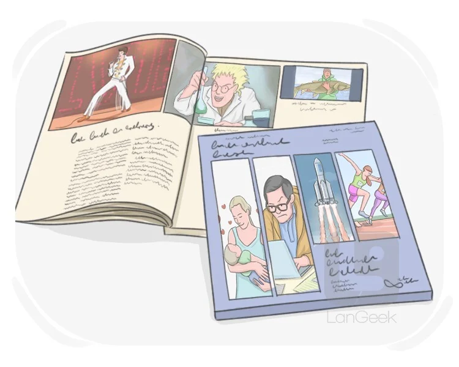 - مجله
- `illustration`  /ˌɪl.əˈstreɪ.ʃən/   a picture in a book
- `figure`  /ˈfɪɡjər/   1. one of the symbols (0-9) that we use to show numbers: Shall I write the numbers in words or figures?   2. an amount or price: What are our sales figures for Spain this year?   3. the shape of a person's body: She's got a good figure   4. a shape of a person that you cannot see clearly: I saw a tall figure outside the window
- `shall`  /ʃæl/   should, must
- `dress`  /dres/   clothing - لباس
- `costume`  /ˈkɑː.stuːm/   لباس محلی
- `finely`  /ˈfaɪn.li/   با ظرافت، دقیق
- `drawn`  /drɔːn/   past participle of draw - کشیده شده (نقاشی شده)
- `vividly`  /ˈvɪv.ɪd.li/   clearly, brightly - in a way that produces strong, clear images in the mind
- `town`  /taʊn/   city (smaller)
- `region`  /ˈriː.dʒən/   a specific geographical area
- `geographical`  /ˌdʒiː.əˈɡræf.ɪ.kəl/   جغرافیایی
- `isolated`  /ˈaɪ.sə.leɪ.t̬ɪd/   far from other people or things: an Isolated house in the mountains
- `spoke`  /spoʊk/   past of speak
- `dialect`  /ˈdaɪ.ə.lekt/   a form of a language spoken in a particular area: a local dialect
- `form (noun)`    1. a type of something: Cars, trains and buses are all forms of transport   2. a piece of paper with spaces for you to answer questions: You need to fill in this form to get a new passport   3. the shape of a person or thing: a cake in the form of a car   4. one of the ways you write or say a word: 'Forgot' is a form of 'forget'
- `transport`    حمل و نقل
- `countryside`    land outside towns and cities, with fields, forests, etc.
- `field`    1. a piece of land used for animals or for growing crops, usually surrounded by a fence, trees, etc   2. an area of study or knowledge: Dr Smith is an expert in her field   3. a piece of land used for something special: a sports field - an airfield (= a place where planes land and take off)
- `crop`  /krɑːp/   all the plants of one kind that a farmer grows at one time: There was a good crop of potatoes last year - Rain is good for the crops
- `trade (noun)`    1. the buying and selling of things: trade between Britain and the US   2. a particular type of business: the building trade   3. a job for which you need special skills, especially with your hands: Dave is a plumber by trade - to learn a trade
- `station`    1. a place where trains stop so that people can get on and off   2. a place where buses or coaches start and end their journeys: the bus station   3. a building for some special work: the police station - the fire station - a petrol station   4. a television or radio company   5. a person's social rank or position: a person of high station
- `diversity`  /daɪˈvɜːrsəti/   variety
- `fade`  /feɪd/   to lose brightness, color, or strength gradually
- `gradually`  /ˈɡrædʒ.u.ə.li/   به تدریج، آرام آرام
- `away`    1. to or in another place: She ran away from him - He put his book away   2. from a place: The sea is two miles away   3. not here (SAME MEANING: absent): Tim is away from school today because he is ill   4. in the future: Our holiday is only three weeks away
- `fade away`    به تدریج محو شدن و ناپدید شدن
- `tell apart`    to see the difference between two people or things: I can't tell the twins apart
- `set apart`    to make someone or something different from others: His kindness sets him apart from others
- `inhabitants`  /ɪnˈhæbɪtənts/   people or animals that live in a particular place
- `continents`  /ˈkɑːntɪnənts/   the large landmasses on Earth (e.g., Asia, Africa, Europe, etc.)
- `landmass`  /ˈlænd.mæs/   خشکی بزرگ
- `let alone`  /let əˈloʊn/   چه برسد به
- `perhaps`  /pərˈhæps/   maybe
- `varied`  /ˈverid/   diverse, consisting of many different kinds
- `certainly`  /ˈsɜːrtnli/   1. without any doubt: She is certainly the best swimmer in the team   2. used when answering questions to mean 'of course': 'Will you open the door for me, please?' 'Certainly' - 'Are you going to apologize?' 'Certainly not!'
- `doubt (noun)`  /daʊt/   a feeling that you are not sure about something: She says the story is true but I have my doubts about it   `in doubt` not sure: if you are in doubt, ask your teacher   `no doubt` I am sure: Paul isn't here yet, but no doubt he will come later
- `fast-paced`  /fæst peɪst/   happening very quickly - سریع، با سرعت بالا (زندگی یا تکنولوژی)
- `celebrate`  /ˈsel.ə.breɪt/   to do something to show that you are happy for a special reason or because it is a special day: If you pass your exams, we'll have a party to celebrate - Grandma celebrated her 90th birthday last week
- `inventiveness`  /ɪnˈven.t̬ɪv.nəs/   the ability to create new things or think of new ideas
- `initiative`  /ɪˈnɪʃ.ə.t̬ɪv/   the ability to take action independently, without being told what to do
- `brought`  /brɔːt/   past of bring
- `brought back`    دوباره زنده کردن، احیا کردن
---

### Part 1: Core PyTorch (190 words)
- `gain`  /ɡeɪn/   1. to get something that you want or need: I gained useful experience from that job   2. to get more of something: I have gained weight recently
- `work out`    to find a solution to a problem or understand how something works
- `relate`  /rɪˈleɪt/   1. to show or to make a connection between two or more things: I found it difficult to relate the two ideas in my mind   2. relate to somebody or something to be connected to somebody or something: We don't need to listen to this, as it doesn't relate to our situation
- `give`  /ɡɪv/   1. to let somebody have something: She gave me a watch for my birthday - I gave my ticket to the man at the door - Give the letter to your mother when you've read it   2. to make a sound or movement: Jo have me an angry look - He gave a shout - She gave him a kiss   3. to make somebody have or feel something: That noise is giving me a headache - whatever gave you that idea?   `give up` to stop trying to do something: I give up _ what's the answer?
- `chance`  /tʃæns/   1. a possibility that something may happen: There's no chance that she'll come now - She has a good chance of becoming team captain - He doesn't stand (= have) a chance of passing the exam   2. a time when you can do something (SAME MEANING: opportunity): it was their last chance to escape - Be quiet and give her a chance to explain   3. when something happens that you cannot control or that you have not planned (SAME MEANING: luck): We must plan this carefully. I don't want to leave anything to chance - We met by chance at the station
- `serious`  /ˈsɪriəs/   1. very bad: That was a serious mistake   2. important: a serious decision   3. not funny: a serious film   4. if you are serious, you are not joking or playing: Are you serious about going to live in Spain? - You look very serious. Is something wrong?
- `across`  /əˈkrɔːs/   over, 1. from one side to the other side of something: We walked across the field - A smile spread across her face - The river was about twenty metres across   2. on the other side of something: There is a bank just across the road
- `way`    1. a method or style of doing something: What is the best way to learn a language?   2. a road or path that you must follow to go to a place: Can you tell me the way to the station please? - I lost my way and I had to look at the map   3. a direction; where somebody or something is going or looking: Come this way - She was looking the other way - is this picture the right way up? - Those two words are the wrong way round   4. distance: It's a long way from Glasgow to London   `no way` a way of saying 'no' more strongly: 'Can I borrow your bike?' 'No way!'
- `domain`  /doʊˈmeɪn/   a particular area of activity, knowledge, or data
- `unveil`  /ʌnˈveɪl/   to show or make known something that was hidden or unknown
- `crack`  /kræk/   شکافتن، ترک خوردن؛ در معنای مجازی: حل کردن (مسئله دشوار)، رمزگشایی کردن
- `much (adverb)`  /mʌtʃ/   a lot: I don't like him very much - Your flat is much bigger than mine - 'Do you like it?' 'No, not much'
- `by`    1. very near (SAME MEANING: beside): The telephone is by the door - They live by the sea   2. a word that shows who or what did something: a painting by Matisse - She was caught by the police   3. using or doing something: I go to work by train - He paid by cheque - You turn the computer on by pressing this button   4. as a result of something: I got on the wrong bus by mistake - We met by chance   5. not later than: I must finish this work by six o'clock   6. from one side of somebody or something to the other (SAME MEANING: past): He walked by me without speaking   7. used for showing the measurements of an area: The table is six feet by three feet (= six feet long and three feet wide)

#### Chapter 1: Introducing deep learning and the PyTorch Library (177 words)
- `poor`  /pʊr/   not good enough; of low quality
- `term`  /tɜːrm/   a word or group of words used to describe something
- `set`    a group of similar things that belong together
- `discipline`  /ˈdɪsəplɪn/   a specific area of academic study or professional practice
- `tremendous`  /trəˈmendəs/   huge, very great in amount, size, or intensity
- `scrutiny`  /ˈskruːtəni/   بررسی موشکافانه، وارسی دقیق
- `confuse`  /kənˈfjuːz/   1. to mix somebody's ideas, so that they cannot think clearly or understand: They confused me by asking so many questions   2. to think that one thing or person is another thing or person: I often confuse Lee with his brother. They look so similar
- `fantastical`  /fænˈtæstɪkəl/   خارق‌العاده، افسانه‌ای
- `hype`  /haɪp/   هیاهوی تبلیغاتی، بزرگنمایی
- `sci-fi`  /ˈsaɪ faɪ/   science fiction - علمی-تخیلی
- `fearmongering`  /ˈfɪrˌmʌŋɡərɪŋ/   ترس‌افکنی، وحشت پراکنی
- `fear`  /fɪr/   ترس
- `sanguine`  /ˈsæŋɡwɪn/   hopeful - خوش‌بین، امیدوار
- `disingenuous`  /ˌdɪsɪnˈdʒenjuəs/   دورو، غیرصادقانه
- `assert`  /əˈsɜːrt/   ادعا کردن، به طور قاطع گفتن
- `sense (noun)`  /sens/   1. the power to see, hear, smell, taste or touch: Dogs have a very good sense of smell   2. the ability to feel or understand something: The boy had no sense of right and wrong - I like him he's got a great sense of humour   3. the ability to think carefully about something and to do the right thing: Did anybody have the sense to call the police?   4. a meaning: This word has four senses   `make sense` to be possible to understand: What does this sentence mean? It doesn't make sense to me
- `approximate (verb)`  /əˈprɑːksɪmeɪt/   to be close to a particular number or state without being exact
- `close (adjective)`  /kloʊs/   1. near: We live close to the station   2. if people are close, they know each other well and like each other very much: I'm very close to my sister - John and I are close friends   3. (used about a competition or race) only won by a small amount: a close match   4. careful: Take a close look at this picture
- `coherent`  /koʊˈhɪrənt/   logical and well-organized; easy to understand and follow
- `fed`    past tense of feed
- `feed`    to give food to a person or animal; to put data or information into a machine or system: The baby's crying _ I'll go and feed her
- `phrase`  /freɪz/   a group of words that you use together as part of a sentence: 'First of all' and 'a bar of chocolate' are phrases
- `corpus`  /ˈkɔːrpəs/   a large collection of written or spoken texts used for language research
- `parse`  /pɑːrs/   to analyze a sentence or code into its parts and describe their grammatical or logical roles
- `far (adverb)`  /fɑːr/   1. a long way from somewhere: My house isn't far from the station - It's too far to drive in one day - I walked much further than you   2. You use far to ask about the distance from one place to another place: How far is it to the coast from here?   3. very much: He's far taller than his brother - That's far too expensive   `as far as...` to place: We walked as far as the vilage and then came back - I read as far as the second chapter   `as far as I know` used when you think something is true, but you are not certain: As far as I know, she's coming, but I may be wrong   `by far` you use by far to show that a person or thing is much better, bigger, etc. than anybody or anything else: She's by far the best player in the team   `far from it` (informal) certainly not; just the opposite: 'Are you upset?' 'Far from it _ I'm delighted'   `far from something` almost the opposite of something; not at all: I'm far from certain   `so far` until now: So far the work has been easy
- `construct`  /kənˈstrʌkt/   (formal) build
- `remarkable`  /rɪˈmɑːrkəbəl/   unusual and surprising in a good way: a remarkable discovery
- `discovery`  /dɪˈskʌvəri/   finding or learning something for the first time: Scientists have made an important new discovery 
- `thesis`  /ˈθiːsɪs/   theory
- `ramble`  /ˈræmbəl/   to talk or write in a confused way, often for a long time: Sorry, I'm rambling (on) - let me get back to the point
- `perform`  /pərˈfɔːrm/   to do an action or complete a task
- `acquire`  /əˈkwaɪər/   to get or develop something such as a skill or quality
- `intelligence`  /ɪnˈtelɪdʒəns/   the ability to learn, understand, and think logically
- `notion`  /ˈnoʊʃən/   an idea, belief, or understanding of something
- `conflate`  /kənˈfleɪt/   to combine two or more separate things into one, often confusing them
- `definite`  /ˈdefɪnɪt/   Something that is definite is clear, fixed and unlikely to change (SAME MEANING: certain): I want a definite answer, 'yes' or 'no'
- `carry`  /ˈkæri/   1. to hold something and take it to another place or keep it with you: He carried the suitcase to my room - I can't carry this box _ it's too heavy - Do the police carry guns in your country?   2. to move people or things: Special fast trains carry people to the city centre   `carry on` to continue: Carry on with your work - If you carry on to the end of this road, you'll see the post office on the right   `carry out something` to do or finish what you have planned: The bridge was closed while they carried out the repairs
- `whether`  /ˈweðər/   1. a word that we use to talk about choosing between two things: I don't know whether to go or not   2. if: she asked me whether I was Spanish
- `submarine`  /ˌsʌbməˈriːn/   a ship that can travel underwater
- `fall (verb)`  /fɔːl/   1. to go down quickly towards the ground: The book fell off the table - She fell down the stairs and broke her arm   2. (also fall over) to suddenly stop standing: He slipped on the ice and fell - I fell over and hurt my leg   3. to become lower or less: In the desert the temperature falls quickly at night - Price have fallen again (OPPOSITE: rise)   `fall apart` to break into pieces: The chair fell apart when I sat on it   `fall asleep` to start sleeping: She fell asleep in the armchair   `fall behind` to become slower than others, or not do something when you should do it: She's falling behind with her school work   `fall for somebody` to begin to love somebody: He has fallen for someone he met on holiday   `fall in love with somebody` to begin to love somebody: He fell in love with Anna the first time they met   `fall out with somebody` to argue with somebody so that you stop being friends: Jane has fallen out with her best friend (OPPOSITE: make up)   `fall through` if a plan falls through, it does not happen
- `fall under`    to be classified or included in a category, group, or heading
- `entity`  /ˈentəti/   something that exists independently as a separate unit - موجودیت، نهاد، چیزی مستقل
- `present (verb)`  /prɪˈzent/   to give something to somebody, especially in a formal ceremony: The prizes were presented to the winners -They presented their teacher with some flowers
- `instructive`  /ɪnˈstrʌktɪv/   providing useful knowledge or information
- `instruct`  /ɪnˈstrʌkt/   1. to tell somebody what they must do: He instructed the driver to wait   2. (formal) to teach somebody something: Children must be instructed in road safety
- `far apart`    separated by a large distance or difference
- `recite`  /rɪˈsaɪt/   to say a piece of writing or a poem aloud from memory or by reading
- `associate`  /əˈsoʊʃieɪt/   to make a connection between things or people in your mind: Most people associate Austria with snow and skiing - These illnesses are associated with smoking
- `golden retriever`  /ˈɡoʊldən rɪˈtriːvər/   breed of dog
- `breed (noun)`  /briːd/   a kind of animal: There are many different breeds of dog
- `until`  /ənˈtɪl/   (also informal till) up to a certain time or event: The shop is open until 6.30 - Stay in bed until you feel better - I can't come until tomorrow
- `exclusive`  /ɪkˈskluːsɪv/   limited to only one person or group; not shared
- `paradigm`  /ˈpærədaɪm/   model, framework, pattern
- `shift (noun)`  /ʃɪft/   1. a change in what people think about something: There has been a shift in public opinion away from the war   2. a group of workers who begin work when another group finishes: the night shift
- `paradigm shift`    a major change in how people think about something
- `usher`  /ˈʌʃər/   to show someone where they should go, or to make someone go where you want them to go: She ushered us into her office and offered us coffee
- `perspective`  /pərˈspektɪv/   a particular way of thinking about something - دیدگاه، چشم‌انداز، نگرش
- `broad`  /brɔːd/   large from one side to the other (SAME MEANING: wide): a broad river (noun: breadth) (OPPOSITE: narrow)
- `rely`  /rɪˈlaɪ/   1. to need somebody or something (SAME MEANING: depend on somebody or something): I rely on my parents for money   2. to feel sure that somebody or something will do what they say they will do: You can rely on him to help you (adjective: reliable)
- `transform`  /trænsˈfɔːrm/   to change a person or thing completely: Electricity has transformed people's lives
- `facilitate`  /fəˈsɪlɪteɪt/   to make an action or process easier or possible
- `downstream`  /ˌdaʊnˈstriːm/   later in a process or pipeline. It refers to steps that come after some initial processing: First we extract features from the image. Then a downstream classifier uses those features to recognize the digit
- `outcome`    result
- `consist`  /kənˈsɪst/   consist of something to be made from two or more things; to have things as parts: Jam consists of fruit and sugar
- `Jam (noun)`  /dʒæm/   1. sweet food made from fruit and suga. You eat jam on bread: a jar of strawberry jam   2. a situation in which you cannot move because there are too many people or vehicles - مربا
- `for instance`  /fɔːr ˈɪnstəns/   for example
- `come`  /kʌm/   1. to move towards the person who is speaking or the place that you are talking about: Come here, please - The dog came when I called him - Here comes Colin (= Colin is coming) - I'm sorry, but I can't come to your party   2. to arrive at or reach a place: if you go along that road, you will come to the river - A letter came for you this morning   3. to go somewhere with the person who is speaking: I'm going to a party tonight. Do you want to come with me?   4. to be in a particular position: June comes after May   `come about` to happen: How did this situation come about?   `come across something` to find something when you are not looking for it: I came across these old photos yesterday   `come apart` to break into pieces: This old coat is coming apart   `come back` to return: What time will you be coming back?   `come down` to fall or become lower: The price of oil is coming down   `come from somewhere or something` 1. The place that you come from is where you were born or where you live: I come from Japan - Where do you come from?   2. to be made from something or produced somewhere: Wool comes from sheep   `come in` to enter a place: Come in and sit down   `come off something` to become removed from something: The handle has come off this cup   `come on!; come along` words that you use for telling somebody to hurry or to try harder: Come on! We'll be late!   `come out` to appear: The rain stopped and the sun came out - His first novel came out in 2004   `come round` to visit a person at their house not very far away: Come round for lunch on Saturday   `how come ...?` (informal) why or how ...?: How come you're here so early?   `to come` in the future: You'll regret it in years to come   `come up with something` to suggest or think of an idea or plan: She's come up with some amazing scheme to double her income
- `estimate (verb)`  /ˈestɪmeɪt/   to say how much you think something will cost, how big something is, or how long it will take to do something: The builders estimated that it would take a week to repair the roof
- `edge`  /edʒ/   1. the part along the end or side of something: She stood at the water's edge - the edge of the table   2. the sharp part of a knife or tool   `on edge` nervous or worried
- `enclose`  /ɪnˈkloʊz/   1. to put something inside a letter or package: I enclose a cheque for $100   2. to put something, for example a wall or fence, around a place on all sides: The prison is enclosed by a high wall
- `hole`  /hoʊl/   an empty space or opening in something: I'm going to dig a hole in the garden - My socks are full of holes
- `representation`  /ˌrep.rɪ.zenˈteɪ.ʃən/   the way that someone or something is shown or described
- `versus`  /ˈvɜːrsəs/   vs; used to compare two different things or choices: private education versus state education
- `refine`  /rɪˈfaɪn/   to make something better by removing mistakes or making it more exact
- `iterative`  /ˈɪtəreɪtɪv/   doing something again and again, usually to improve it or to get closer to a goal: iterative processes
- `pair`  /per/   1. two things of the same kind that you use together: a pair of shoes   2. a thing with two parts that are joined together: a pair of glasses   3. two people or animals together: a pair of ducks   `in pairs` with two things or people together: Shoes are only sold in pairs - The students are working in pairs
- `often`  /ˈɑːfən/   many times; happening a lot
- `inject`  /ɪnˈdʒekt/   1. to insert a substance or material into the body, often through a needle   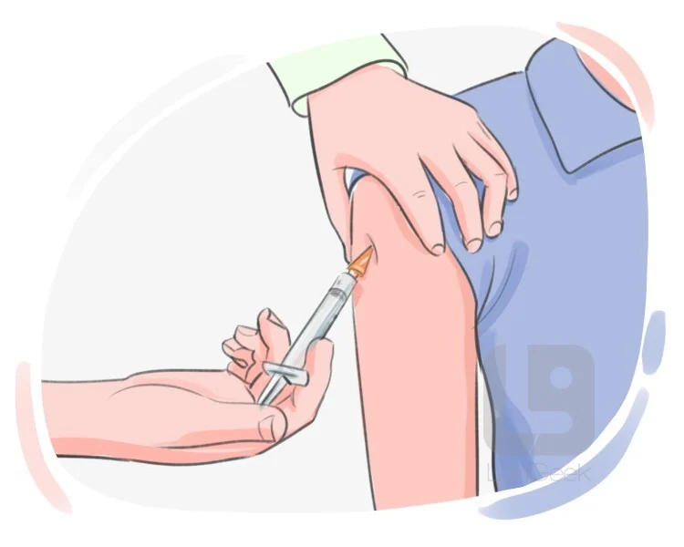   2. to add or insert something new or different into a situation, system, or activity: inject data into a system
- `however`  /haʊˈevər/   1. it does not matter how: I never win, however hard I try   2. but: She's very intelligent. However, she's quite lazy   3. a way of saying 'how' more strongly
- `ingest`  /ɪnˈdʒest/   to take something (e.g., data or food) into a system
- `basis`  /ˈbeɪsɪs/   1. the most important part or idea, from which something grows: Her notes formed the basis of a book   2. the way something is done or organized: We meet on a regular basis (= often)
- `handcraft`  /ˈhændkræft/   to make something by hand; in ML, features/rules created by humans rather than learned
- `discover`  /dɪˈskʌvər/   to find or learn something for the first time: Who discovered Australia? - I was in the shop when I discovered that I did not have any money
- `disruptive`  /dɪsˈrʌptɪv/   causing major change that replaces old ways of doing things
- `cause (verb)`  /kɔːz/   to be the reason why something happens: What caused the accident? - The fire was caused by a cigarette
- `lead (verb)`  /liːd/   1. to take a person or an animal somewhere by going with them or in front of them: He led me to the classroom   2. to go to a place: This path leads to the river   3. to make something happen: Smoking can lead to heart disease   4. to have a particular type of life: They lead a very busy life   5. to be the first or the best, for example in a race or game: Who's leading in the race?   6. to control a group of people: The team was led by Gwen Hollis
- `hierarchical (adjective)`  /ˌhaɪˈrɑːr.kɪ.kəl/   relating to a system that is organized based on social ranking or levels of authority   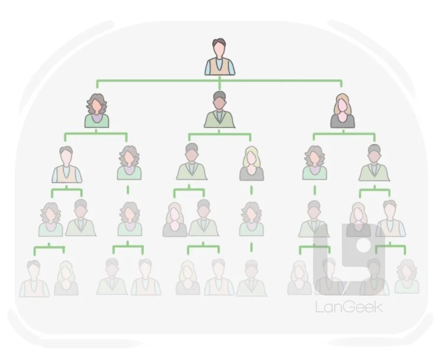
- `own (adjective)`  /oʊn/   used for showing that someone or something belongs to or is connected with a particular person or thing: Is that your own camera or did you borrow it? - I have my own room now that my sister has left home - I want a home of my own   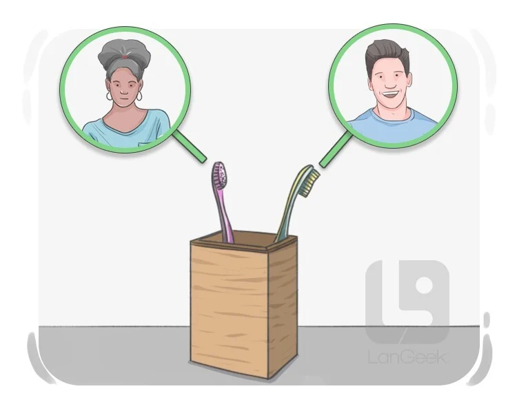
- `glimpse (noun)`  /ɡlɪmps/   a view of somebody or something that is quick and not clear: I caught a glimpse of myself in the mirror
- `whatever`  /wʌt.ɛ.vər/   1. any or every; anything or everything: These animals eat whatever food they can find - I'll do whatever I can to help you   2. it does not matter what: Whatever you do, don't be late   3. a word that you say to show that you do not mind what you do or have: 'What shall we do tomorrow?' 'Whatever'
- `mind (verb)`  /maɪnd/   1. to feel unhappy or angry about something: Do you mind if I smoke? - I don't mind the heat at all   2. to be careful of somebody or something (SAME MEANING: watch): Mind the step   `do you mind ...?; would you mind ...?` please could you ...?: It's cold _ would you mind closing the window?   `I don't mind` it is not important to me which thing: 'Do you want tea or coffee?' 'I don't mind'   `mind out` used to tell somebody to get out of the way or to be careful: Mind out! There's a dog in the road   `never mind` don't worry; it doesn't matter: 'I forgot your book' 'Never mind, I don't need it today'
- `somehow`  /ˈsʌm.haʊ/   in a way or by some method that is not known or certain - به‌نوعی
- `obtain`  /əbˈteɪn/   to get something, often with difficulty: Where can I obtain tickets for the play
- `desire`  /dɪ.ˈzaɪər/   a feeling of wanting something very much: a desire for peace
- `criterion`  /kraɪˈtɪr.i.ən/   a standard by which you judge, decide about, or deal with something
- `judge (verb)`  /dʒʌdʒ/   1. to have or to form an opinion about somebody or something: It's difficult to judge how long the project will take   2. to decide who or what wins a competition: The headmaster judged the painting competition
- `provide`  /prəˈvaɪd/   to give something to somebody who needs it: I'll provide the food for the party - The company have provided me with a car
- `discrepancy`  /dɪˈskrep.ən.si/   a difference between two things that should be the same: There is some discrepancy between the two accounts
- `convention`  /kənˈven.ʃən/   1. a formal agreement between two or more people, groups, organizations, or countries   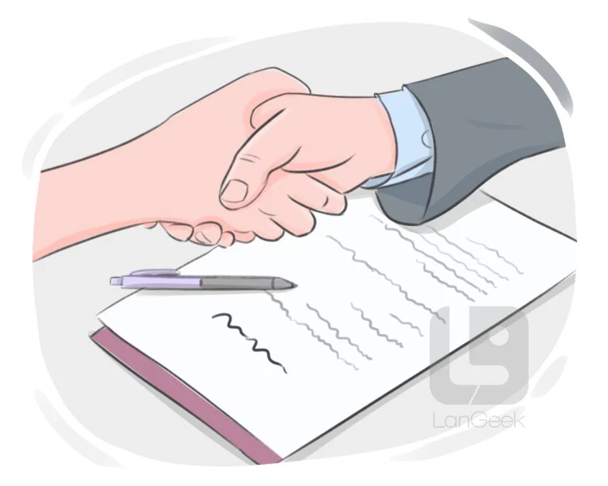   2. behavior and actions that most members of a society expect and consider appropriate
- `incremental`  /ˌɪnk.rə.ˈmen.təl/   changing or progressing in small, steady steps rather than in sudden leaps or bounds   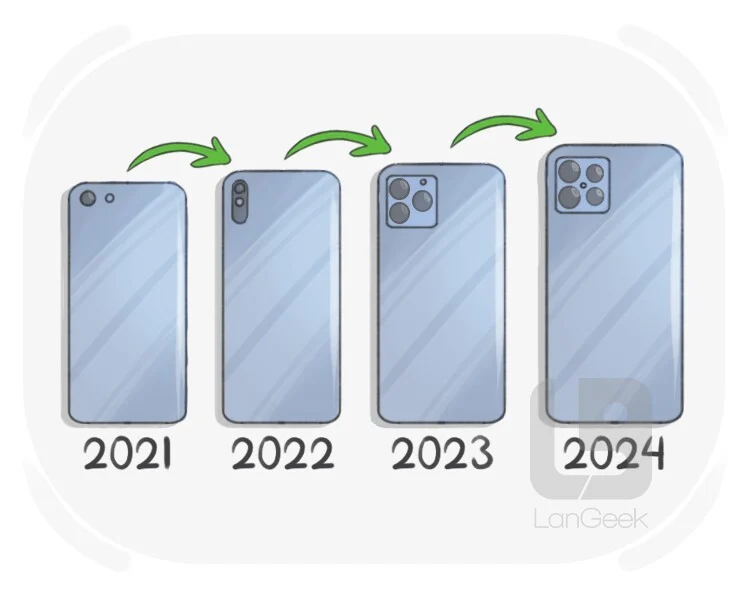
- `modify`  /ˈmɑːdɪfaɪ/   to make partial or small changes to something, especially to improve it
- `achieve`  /əˈtʃiːv/   to successfully reach a goal or obtain something through effort
- `emphasize`  /ˈem.fə.saɪz/   to say something strongly to show that it is important (SAME MEANING: stress): She emphasized the importance of hard work
- `ease (noun)`  /iːz/   سادگی; آسانی
- `prominent`  /ˈprɑːmənənt/   1. easy to see, for example because it is bigger than usual: prominent teeth   2. important and famous: a prominent writer
- `proven`  /ˈpruː.vən/   shown to be true (SAME MEANING: sure) - اثبات شده
- `qualified`  /ˈkwɑː.lə.faɪd/   having passed the exams or done the training necessary to do a particular job: Tim is now a qualified architect
- `context`  /ˈkɑːn.tekst/   the situation within which something exists or happens, and that can help explain it - زمینه
- `streamline`  /ˈstriːmlaɪn/   to make a system or process simpler and more efficient
- `ought to`  /ɔ:t tu:/   1. words that you use to tell or ask somebody what is the right thing to do (SAME MEANING: should): It's late _ you ought to go home   2. words that you use to say what you think will happen or what you think is true (SAME MEANING: should): Tim has worked very hard, so he ought to pass the exam
- `map (verb)`    to connect or convert one thing (like an input) into another (like an output): f(x) = x², so f maps x to x² - The neural network maps an image to a label
- `multidimensional`  /ˌmʌl.ti.dɪˈmen.ʃən.əl/   having more than two dimensions (for example, a 3D or 4D array)
- `feature`  /ˈfiːtʃər/   1. an important part of something: Pictures are a feature of this dictionary   2. one of the parts of your face, for example your eyes, nose or mouth: Her eyes are her best feature   3. a newspaper or magazine article or programme about something: The magazine has a special feature on education
- `accelerate`  /ə.ˈksɛ.lə.reɪt/   to make something happen faster or more quickly
- `dedicate`  /ˈded.ə.keɪt/   to give all or most of one's time, effort, or resources to a particular activity, cause, or person - اختصاص دادن
- `convenient`  /kənˈviːniənt/   1. useful, easy or quick to do; not causing problems: Let's meet on Friday. What's the most convenient time for you? (OPPOSITE: inconvenient)   2. near to a place or easy to get to: The house is very convenient for the station (OPPOSITE: inconvenient)
- `parallel`  /ˈper.ə.lel/   1. Parallel lines have the same distance from each other at every point   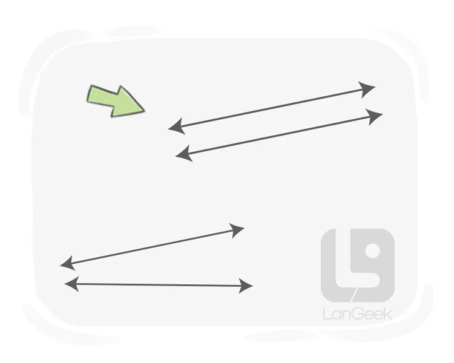   2. happening at the same time; in computing, doing many calculations at once
- `motivate`  /ˈmoʊtɪveɪt/   to make somebody want to do something: The best teachers know how to motivate children to learn
- `fluent`  /ˈfluːənt/   1. able to speak easily and correctly: Ramon is fluent in English and French   2. spoken easily and correctly: She speaks fluent Arabic
- `accessible`  /əkˈses.ə.bəl/   able to be reached or easily obtained
- `reach (verb)`  /riːtʃ/   1. to arrive somewhere: It was dark when we reached Paris - Have you reached the end of the book yet?   2. to put out your hand to do or get something: I reached for the telephone   3. to be able to touch something: Can you get that book from the top shelf for me? I can't reach
- `hands-on`  /hændz-ɑ:n/   عملی، تجربی، مبتنی بر انجام کار با دست
- `stress`  /stres/   1. to say something strongly to show that it is important: I must stress how important this meeting is   2. to say one word or part of a word more strongly than another: You should stress the first part of the word 'happy' - تأکید کردن
- `acquisition`  /ˌækwɪˈzɪʃən/   the process of getting or learning something, such as skills, knowledge, or assets
- `equip`  /ɪˈkwɪp/   to get all the things that are needed for doing something: Before setting out, they equipped themselves with a map - The kitchen is well equipped
- `backbone`  /ˈbæk.ˌboʊn/   a line of connected bones going down from your neck to tail bone in the middle of the back   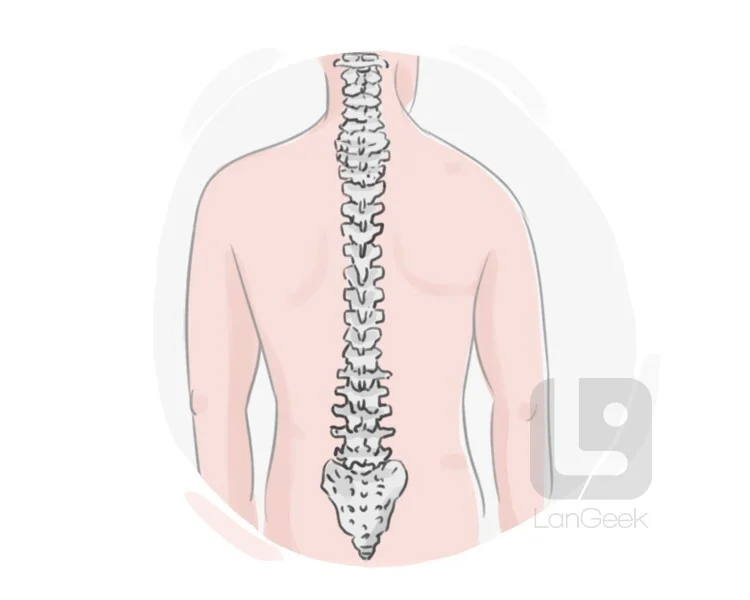
- `not pull any/your punches`    to speak in an honest way without trying to be kind: My boss didn't pull any punches during my review; she told me I was doing a terrible job - I'm going to not pull any punches here: you need to study much harder if you want to pass
- `willing`  /ˈwɪl.ɪŋ/   ready and happy to do something: I'm willing to work at weekends (OPPOSITE: unwilling)
- `dive`  /daɪv/   to jump into water, especially with your head and arms going in first, or to move down under the water: They ran to the pool, dived in, and swam to the other side
- `sketch (noun)`  sketʃ   A sketch is a drawing that is done quickly without a lot of details. Artists often use sketches as a preparation for a more detailed painting or drawing
- `involve`  /ɪnˈvɑːlv/   1. to have something as a part: The job involves using a computer   2. if you involve somebody in something, you make them take part in it: I want to involve more people in the concert
- `round off`  /raʊnd/   to finish or complete something in a good or satisfying way; to bring something to a pleasant conclusion
- `pop up`    to appear or happen, especially suddenly or unexpectedly
- `literature`  /ˈlɪtərətʃər/   1. books, plays and poetry; written works that are valued as works of art, such as novels, plays and poems: He is studying English literature   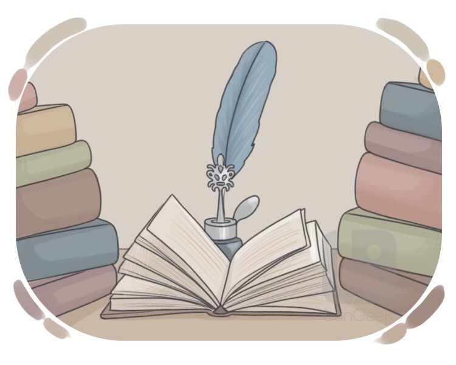   2. (in scientific context) all the published research and writing on a particular subject
- `clutter (noun)`  /ˈklʌt.ər/   (a lot of objects in) a state of being untidy: Sorry about the clutter in the kitchen
- `expose`  /ɪkˈspoʊz/   to show something that is usually covered or hidden: A baby's skin should not be exposed to the sun for too long - The newspaper exposed his terrible secret
- `illustrate`  /ˈɪləstreɪt/   to show or explain something using examples or pictures
- `adapt`  /əˈdæpt/   1. to change the way that you do things because you are in a new situation: He has adapted very well to being at a new school   2. to change something so that you can use it in a different way: The car was adapted for use as a taxi
- `efficient`  /ɪˈfɪʃənt/   working well without making mistakes or wasting energy: Our secretary is very efficient - an efficient way of working (OPPOSITE: inefficient)
- `occur`  /əˈkɜːr/   to happen: The accident occurred this morning
- `presence`  /ˈprez.əns/   the fact of being in a particular place; the existence of something: an experiment to test for the presence of oxygen
- `variable`  /ˈveriəbəl/   able to be changed; likely to change; not consistent
- `caveat`  /ˈkæv.i.æt/   warning
- `familiar`  /fə.ˈmɪl.jər/   that you know well: I heard a familiar voice in the next room - I'm not familiar with this computer (OPPOSITE: unfamiliar)
- `similar`  /ˈsɪ.mɪ.lər/   the same in some ways but not completely the same: Rats are similar to mice, but they are bigger - Jane and her sister look very similar
- `unit`  /ˈjuː.nɪt/   1. one complete thing or group that may be part of something larger: The book has twelve units   2. a measurement: A metre is a unit of length and a kilogram is a unit of weight
- `yield`  /jiːld/   to produce or provide something, such as a result, profit, or benefit: pytorch provides accelerated computation using graphical processing units (GPUs), often yielding speedup
- `speedup`    an increase in speed
- `driver`  /ˈdraɪ.vər/   1. someone who drives a vehicle   2. a type of golf club used by players to hit the ball long distances from the tee   3. a software that controls the interaction between a computer and another equipment, such as a printer or scanner   4. a golfer who uses a driver club, typically for long-distance shots from the tee   5. someone who drives animals that pull a vehicle   6. a factor, force, or influence that initiates or causes a particular action, process, or change
- `expressivity`  /ˌekspreˈsɪvəti/   the quality of being able to express ideas effectively and clearly
- `quality`  /ˈkwɑː.lə.t̬i/   how good or bad something is: The quality of her work is excellent - This furniture isn't very good quality
- `undue`  /ʌnˈduː/   more than is reasonable, suitable, or necessary; too much
- `impose`  /ɪmˈpoʊz/   force on someone
- `arguably`  /ˈɑːrɡ.ju.ə.bli/   used to state an opinion that you believe is true and can be supported by reasons or evidence: He is arguably the world's best football player
- `opinion`  /əˈpɪn.jən/   what you think about something (SAME MEANING: view): In my opinion, she's wrong - What's your opinion of his work? - He had strong opinions on everything
- `seamless (adjective)`  /ˈsiːmləs/   You use seamless to describe something that has no breaks or gaps in it or which continues without stopping: It was a seamless procession of wonderful electronic music - ...the seamless blue sky
- `landscape`  /ˈlænd.skeɪp/   everything you can see in an area of land: The Scottish landscape is very beautiful   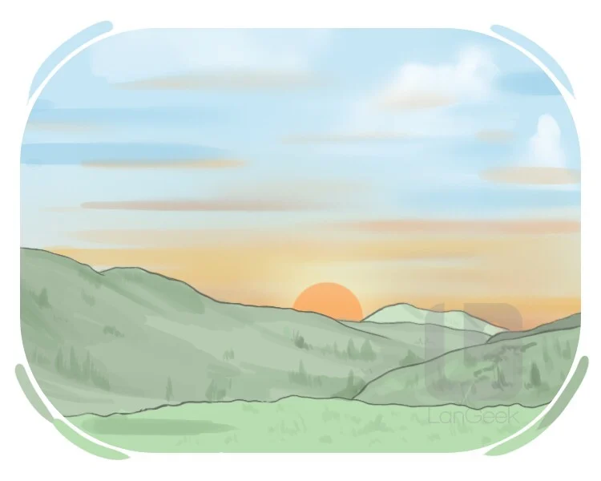
- `widespread`  /ˈwaɪdspred/   happening or existing in many places or among many people; very common
- `witness (noun)`  /ˈwɪt.nəs/   1. a person who sees something happen and can tell other people about it later: There were two witnesses to the accident   2. a person who goes to a court of law to tell people what they saw: a witness for the defence
- `witness (verb)`  /ˈwɪt.nəs/   to see something happen
- `citation`  /saɪˈteɪʃən/   a reference to a source of information, especially in an academic paper
- `international`  /ˌɪntərˈnæʃənəl/   global; worldwide
- `conference`  /ˈkɑːnfərəns/   a large formal meeting of people with a shared interest, often held to discuss research or business
- `compelling`  /kəmˈpelɪŋ/   making you feel sure that something is true or right: a compelling story
- `contented`  /kənˈtentɪd/   happy or satisfied, especially because your life or situation is good: a contented smile
- `transition`  /træn.ˈzɪ.ʃən/   the process or period of changing from one state, place, or condition to another; change: pytorch story for the transition from research and development into production
- `initial`  /ɪˈnɪʃ.əl/   first: initial commit
- `initially`  /ɪˈnɪʃ.əl.i/   at first: Initially, the system worked well
- `workflow`  /ˈwɜːrkfloʊ/   the way that a particular type of work is organized; the sequence of steps or tasks that are part of a work process: research workflows
- `sequence`  /ˈsiː.kwəns/   a set of related things that follow each other in a particular order; a continuous or connected series
- `runtime`  /ˈrʌntaɪm/   1. the period during which a program is executing   2. the software environment that supports the execution of a program: a high-performance C++ runtime
- `inference`  /ˈɪn.fɜ.rəns/   a guess that you make or an opinion that you form based on the information that you have; in ML, using a trained model to predict results from new data
- `binding`  /ˈbaɪndɪŋ/   A layer of code that lets one programming language (like Python) directly use a library written in another language (like C++), without needing a network or HTTP requests.
- `interface`  /ˈɪn.tər.ˌfeɪs/   (in computing) The connection, or link where two separate systems, programs, or devices to communicate and exchange information
- `advantage`  /ədˈvæntɪdʒ/   something that helps you or that is useful: One advantage of camping is that it's cheap (OPPOSITE: disadvantage)
- `expensive`  /ɪkˈspensɪv/   costing a lot of money or requiring a lot of resources
- `overhead`  /ˈoʊvərhed/   extra
---

---

## Duolingo - Vocabulary (272 words)

### SECTION 1 (272 words)

#### Solo trip (36 words)
- `fare`  /fer/   the money that you pay to travel by bus, train, plane, etc.: My bus fare has gone up
- `stomach`  /ˈstʌm.ək/   1. the part inside your body where food goes after you eat it   2. the front part of your body below your chest and above your legs
- `arrive`  /əˈraɪv/   1. to come to a place: What time did you arrive home? - What time does the train arrive in Paris? - They arrive at the station ten minute late (OPPOSITE: leave, depart)   2. to come or happen: Summer has arrived
- `laundry`  /ˈlɔːndri/   clothes and sheets that you must wash or that you have washed (SAME MEANING: washing): a pile of dirty laundry
- `shuttle (noun)`  /ˈʃʌtl/   a plane, bus or train that travels regularly between two places
- `continent`  /ˈkɑːntənənt/   one of the seven main areas of land in the world, for example Africa, Asia or Europe
- `much (adjective, pronoun)`    (more, most) a big amount of something; a lot of something: I haven't got much money - There was so much food that we couldn't eat it all - Eat as much as you can - How much paper do you want? - How much is this shirt?
- `many (adjective, pronoun)`    1. a large number of people or things: Many people in this country are very poor - There aren't many students in my class - Many of these books are very old - There are too many mistakes in your homework   2. a word that you use to ask or talk about the number of people or things: How many brothers and sisters have you got? - Take as many cakes as you want
- `than`    You use 'than' when you compare people or things: I'm older than him - You speak Spanish much better than she does - We live less than a kilometre from the beach
- `luggage`  /ˈlʌɡɪdʒ/   bags and suitcases that you take with you when you travel (SAME MEANING: baggage): 'How much luggage have you got?' 'Only one suitcase'
- `seat`  /siːt/   something that you sit on: the book seat of a car - We had seats at the front of the theatre - Please take a seat (= sit down)
- `twice`  /twaɪs/   two times: I have been to Japan twice - He ate twice as much as I did
- `once (adverb)`  /wʌns/   1. one time: I've only been to Spain once - He phones us once a week (= once every week)   2. at some time in the past: This house was once a school   `at once` 1. immediately (SAME MEANING: now): Come here at once   2. at the same time: I can't do two things at once   `for once` this time only: For once I agree with you   `once again; once more` again; one more time: Can you explain it to me once more?   `once or twice` a few times; not often: I've only met them once or twice   `once upon a time` (used at the beginning of a children's story) a long time ago: Once upon a time there was a beautiful princess ...
- `once (conjunction)`  /wʌns/   as soon as; when: Once you've finished your homework you can go out
- `probably`  /ˈprɑːbəbli/   almost certainly; likely to happen: I will probably see you on Thursday
- `sleepover`  /ˈsliːpoʊvər/   a type of party when a young person or a group of young people stay for the night at the house of a friend
- `nightmare`  /ˈnaɪtmer/   1. a very bad or frightening dream: I shouldn't have watched that movie - it'll give me nightmares   2. something that is very bad or frightening: Travelling through the snow was a nightmare
- `deal (noun)`  /diːl/   an agreement, usually about buying, selling or working: Let's make a deal _ I'll help you today if you help me tomorrow   `a good deal` or `a great deal` a lot: I've spent a great deal of time on this report
- `desk`  /desk/   1. a type of table, often with drawers, that you sit at to write or work: The pupils took their books out of their desks   2. a table or place in a building where somebody gives information, etc.: Ask at the information desk
- `patio`  /ˈpætioʊ/   an area outside a house with a solid floor but no roof, used in good weather for relaxing, eating, etc
- `sauce`  /sɔːs/   a thick liquid that you eat on or with other food: pasta with tomato sauce   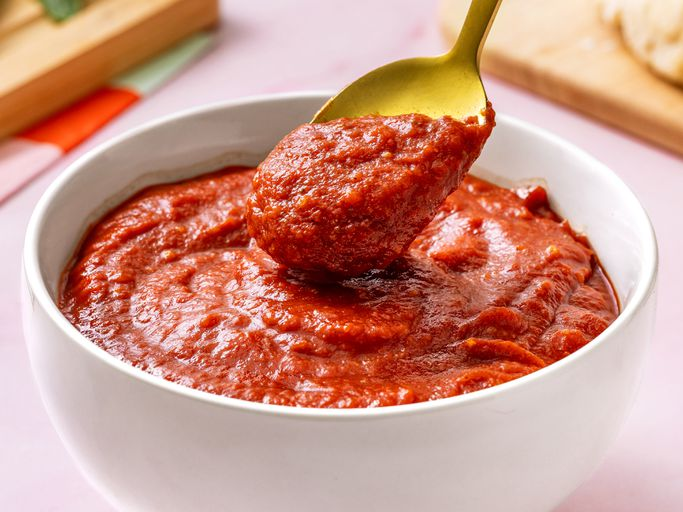
- `hang`  /hæŋ/   1. to fix something, or to be fixed at the top so that the lower part is free: Hang your coat up in the hall - I hung the washing on the line to dry   2. to kill yourself or another person by putting a rope around the neck and allowing the body to drop downwards: She was hanged for murder   `hang about; hang around` (informal) to stay somewhere with nothing special to do: My plane was late so I had to hang about in the airport all morning   `hang on` (informal) to wait for a short time: Hang on _ I'm not ready   `hang on to somebody or something` to hold somebody or something firmly: Hang on to your purse   `hang up` to end a telephone call by putting the telephone down   `hang out` to spend a lot of time in a place or with someone
- `plate`  /pleɪt/   a round dish that you put food on   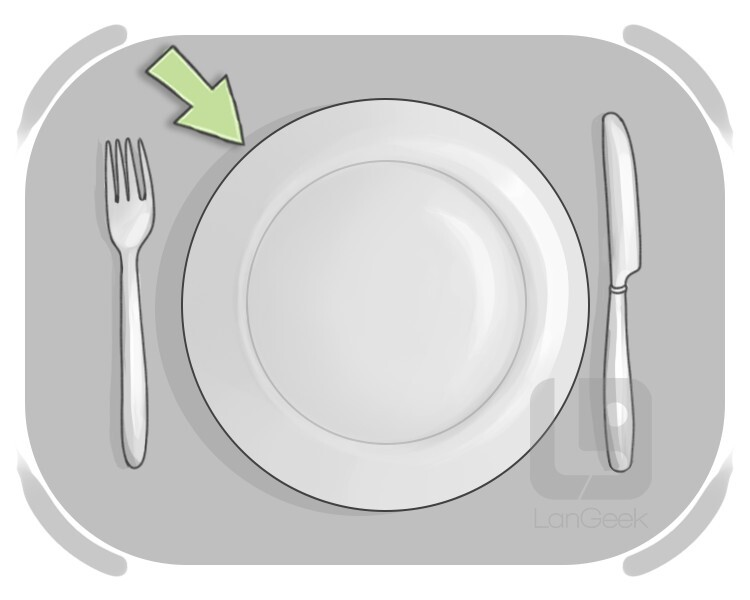
- `sense (verb)`  /sens/   to understand or feel something: I sensed that he was worried
- `meal`  /miːl/   food that you eat at a certain time of the day: What's your favourite meal of the day? - We had a nice meal in that restaurant
- `dish`  /dɪʃ/   1. a container for food. You can use a dish to cook food in an oven, or to put food on the table   2. `the dishes` (plural) all the plates, bowls, cups, etc. that you must wash after a meal: I'll wash the dishes   3. a part of a meal: We had a fish dish and a vegetarian dish
- `quest`  /kwest/   a long search for something that is difficult to find, or an attempt to achieve something difficult
- `in (preposition)`    1. a word that shows where somebody or something is: a country in Africa - He put his hand in the water - She was lying in bed   2. making all or part of something: There are 100 centimetres in a metre   3. a word that shows when something happens: My birthday is in May - He started school in 1987   4. a word that shows how long something takes: I'll be ready in ten minutes   5. a word that shows what clothes somebody is wearing: He was dressed in a suit   6. a word that shows how somebody or something is: This room is in a mess - Jenny was in tears (= she was crying) - Sit in a circle   7. a word that shows somebody's job: He's in the army   8. a word that shows in what way or in what language: Write your name in capital letters - They were speaking in French
- `in (adverb)`    1. to a place, from outside: I opened the door and went in (OPPOSITE: out)   2. at home or at work: Nobody was in when we called (OPPOSITE: out)
- `on (preposition, adverb)`    1. used for showing where something is: Your book is on the table - The number is on the door - There is a good film on TV tonight - I've got a cut on my hand   2. used for showing when: My birthday is on 6 May - I'll see you on Monday   3. used with ways of travelling and types of travel: He got on the train - I came here on foot (= walking)   4. used for showing that somebody or something continues: You can't stop here _ drive on   5. working; being used: All the lights were on (OPPOSITE: off)   6. using something: I bought it on the Internet - I was on the phone to Jania - He saw it on TV   7. about: a book on cars   8. covering your body: Put your hat on   9. happening: What's on at the cinema?   10. When somethings happens: She telephoned me on her return from New York   `on and on` without stopping: He went (= talked) on and on about his girlfriend
- `couch`    a sofa   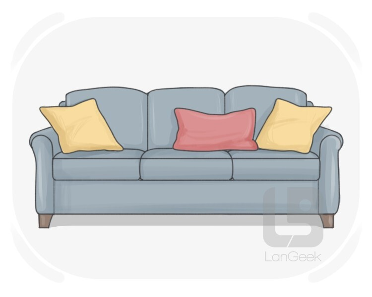
- `snack`  /snæk/   a small quick meal: We had a snack on the train
- `stuff`  /ˈstʌf/   the people who work in a place: The hotel staff were very friendly
- `homesick`  /ˈhoʊmsɪk/   sad because you are away from home
- `exact`  /ɪɡˈzækt/   completely correct: We need to know the exact time the incident occurred
- `adventure`  /ədˈventʃər/   something exciting that you do or that happens to you: She wrote a book about her adventures in Africa

#### Delivery (29 words)
- `tuna`  /ˈtuːnə/   1. a type of large fish that is found in warm seas   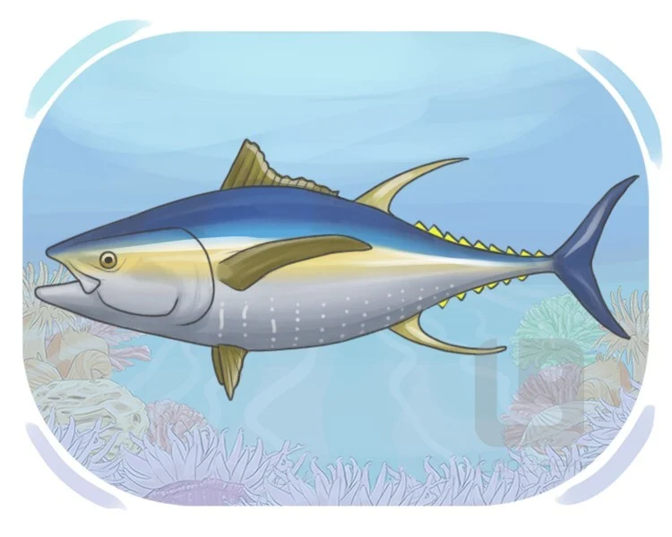   2. the meat of a large fish named tuna that lives in warm waters   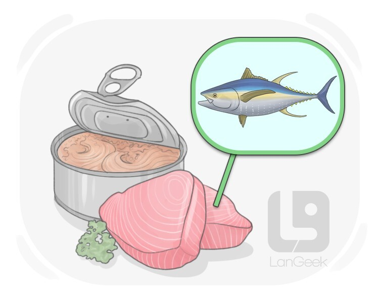
- `strawberry`  /ˈstrɔːberi/     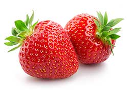
- `soda`  /ˈsoʊdə/   1. water with bubbles in it that is used for mixing with other drinks: whisky and soda   2. (American) a sweet drink with bubbles in it that is made from soda water and a fruit flavour
- `ingredient`  /ɪnˈɡriːdiənt/   one of the things that you put in when you make something to eat: The ingredients for this cake are flour, butter, sugar and eggs
- `taste (noun)`  /teɪst/   the feeling that a certain food or drink gives in your mouth: Sugar has a sweet taste and lemons have a sour taste - I don't like the taste of this cheese   2. the power to know about food and drink with your mouth: When you have a cold, you often lose your sense of taste   3. a little bit of food or drink: Have a taste of the fish to see if you like it   4. being able to choose nice things: She has good taste in clothes
- `taste (verb)`  /teɪst/   1. to have a certain flavour: This tastes of oranges - Honey tastes sweet   2. to feel or know a certain food or drink in your mouth: Can you taste onions in this soup?   3. to eat or drink a little of something, to test its flavour: Taste this cheese to see if you like it
- `actually`  /ˈæktʃuəli/   1. really; in fact: You don't actually believe her, do you? - I can't believe I'm actually going to Australia   2. a word that you use to disagree politely or when you say something new: I don't agree. I thought the film was very good, actually - 'Let's go out tonight' 'Actually, I'd like to stay in and watch a film'
- `different`  /ˈdɪfərənt/   is an adjective. It often goes before a noun (I have a different coat than her) or after the verb 'to be' (This test is different than last week's)
- `difference`  /ˈdɪfərəns/   is a noun. It can be a subject (The difference is noticeable in their results) or object (I can't find a difference in the photographs)
- `delicious`  /dɪˈlɪʃəs/   tasting very good; very good to eat: This soup is delicious
- `sweet (adjective)`  /swiːt/   1. containing or tasting of sugar: Honey is sweet   2. with a good smell: the sweet smell of roses   3. attractive; pretty (SAME MEANING: cute): What a sweet little girl   4. having or showing a kind character: It was sweet of you to help me
- `sausage`  /ˈsɔːsɪdʒ/     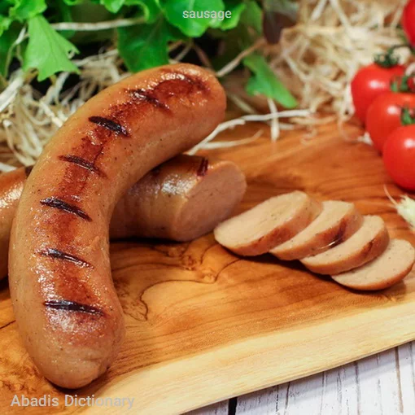
- `downtown`  /ˌdaʊnˈtaʊn/   in or towards the centre of a city, especially its main business area: She works downtown
- `pull`  /pʊl/   1. to move somebody or something strangly towards you: She pulled the drawer open   2. to go forward, moving something behind you: The cart was pulled by two horses   3. to move something somewhere: He pulled up his trousers   `pull down` to destroy a building: The old school has been pulled down   `pull in` to drive a car to the side of the road and stop: I pulled in to look at the map   `pull somebody's leg` (informal) to try to make somebody believe something that is not true, for fun: I didn't really see on elephant _ I was only pulling your leg   `pull yourself together` to control your feelings after being upset: Pull yourself together and stop crying   `pull up` to stop a car: The driver pulled up at the traffic lights   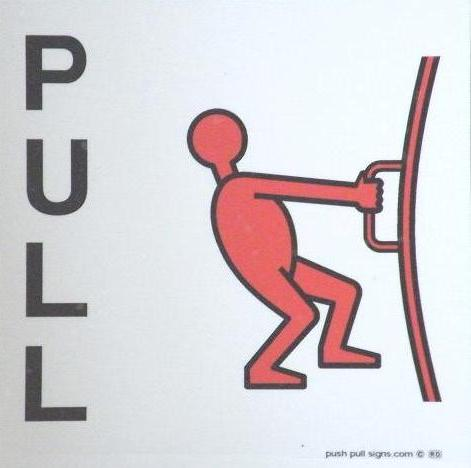
- `push`  /pʊʃ/   1. to use force to move somebody or something forward or away from you: The car broke down so we had to push it to a garage - He pushed me over   2. to press something with your finger: Push the red button to stop the bus   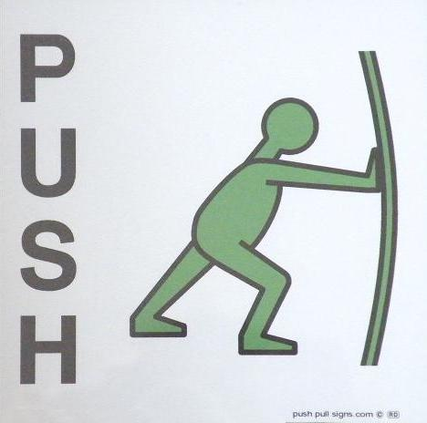
- `dessert`  /dɪˈzɜːrt/   sweet food eaten at the end of a meal: We had ice cream for dessert - dessert spoon
- `sour`  /ˈsaʊər/   1. with a sharp taste like a lemon: If it's too sour, put some sugar in it   2. Sour milk tastes bad because it is not fresh: This milk has gone sour
- `flavor`  /ˈfleɪvər/   (American) (British flavour) the taste of food: They sell 20 different flavors of ice cream   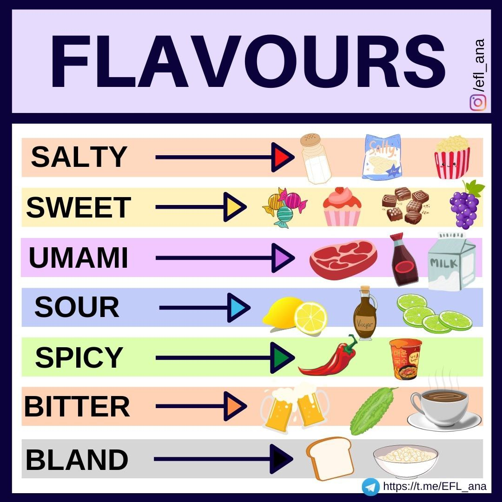
- `coconut`  /ˈkoʊkənʌt/     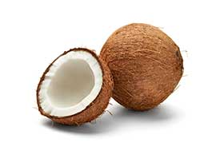
- `yogurt`  /ˈjoʊɡərt/   (also yoghurt) a thick liquid food made from milk: strawberry yogurt - Do you want a yogurt?
- `beverage`  /ˈbevərɪdʒ/   a drink, especially one that is not water (like tea, coffee, juice, or soda): Hot beverages are served in the café
- `paradise`  /ˈperədaɪs/   the place where some people think good people go after they die (SAME MEANING: heaven)
- `the tropics`  /ðə ˈtrɑːpɪks/   the part of the world where it is very hot and wet   `tropical` tropical fruit
- `boba`  /ˈboʊbə/   are small, chewy balls made from tapioca. They are usually added to bubble tea (a sweet tea drink)   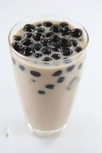
- `definitely`  /ˈdefənɪtli/   without any doubt / certainly / for sure: I'll definitely consider your advice - It's definitely the best restaurant in the town
- `grab`  /ɡræb/   to take or hold something quickly or suddenly: The thief grabbed her bag and ran away
- `already`  /ɔːlˈredi/   1. before now or before a particular time: 'Would you like some lunch?' 'No, thank you—I’ve already eaten.' - We ran to the station but the train had already left   2. now; sooner than expected: It's already 10 PM. - We've already finished the work   3. even at this point; as early as now: We can already see the results. - Starting from the right side, we already get a glimpse of what we need - قبلاً، از قبل، تا الان، تاکنون، همین حالا، از همین مرحله
- `mango`  /ˈmæŋɡoʊ/     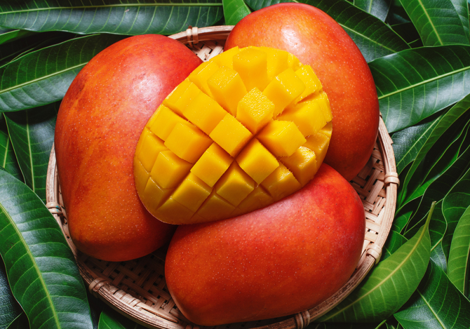
- `utensil`  /juˈtensl/   a tool or object used for a particular purpose, especially in cooking or eating like fork, spoon, and knives

#### At School (37 words)
- `dorm:a home for college students  president:leader of a country`    
- `essay`  /ˈes.eɪ/   a short piece of writing about a particular subject: Our teacher asked us to write an essay on our favourite outhor
- `dorm`  /dɔːrm/   a home for college students   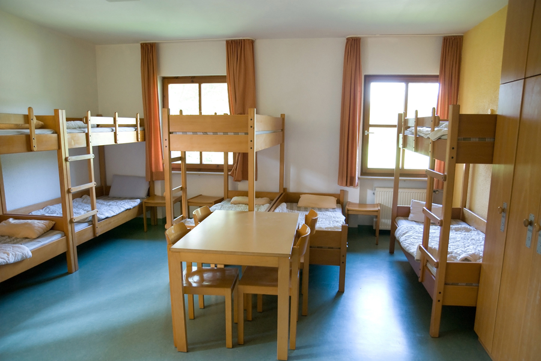
- `president`  /ˈprez.ɪ.dənt/   leader of a country
- `knock (verb)`  /nɑːk/   1. to hit something and make noise: I knocked on the door, but nobody answered   2. to hit something hard, usually by accident: I knocked my head on the door - She knocked a glass off the table   `knock somebody down; knock somebody` over to hit somebody so that they fall onto the ground: The boy was knocked down by a car   `knock something down` to break a building so that it falls down (SAME MEANING: demolish): They're knocking down old house   `knock somebody out` to make somebody fall, asleep or become unconscious: The blow knocked him out   `knock something over` to hit something so that it falls over: I knocked over a vase of flowers
- `have-to`    used for saying that somebody must do something or that something must happen: I have to go to school on Saturday mornings - We don't have to get up early tomorrow - Have we go to for this now? - We had to do lots of boring exercises
- `due`  /duː/   1. due to because of something; caused by something: The accident was due to bad driving   2. if something is due at a certain time, you expect it to happen or come then: When's the baby due? - The new road is due to open in April   3. if an amount of money is due, you must pay it: My rent is due at the beginning of the month   4. ready for something: My car is due for a service
- `conclusion`  /kənˈkluː.ʒən/   the final part of something: Be careful not to introduce new ideas in the conclusion of your essay
- `contest (noun)`  /ˈkɑːntest/   a game or competition that people try to win: a boxing contest
- `competition`  /ˌkɑːmpəˈtɪʃən/   a situation where people try to win or be better than others, or an event where people compete: She won first place in the competition
- `masterpiece`  /ˈmæstərpiːs/   a great work of art:This painting is masterpiece
- `loneliness`  /ˈloʊnlinəs/   feeling of being alone
- `talent`  /ˈtæl.ənt/   a natural ability to do something very well: She has a talent for drawing
- `principal (noun)`  /ˈprɪnsəpəl/   the head of a school:The principal spoke to the students
- `judge (noun)`  /dʒʌdʒ/   1. the person in a court of law who decides how to punish somebody: The judge sent him to prison for 20 years   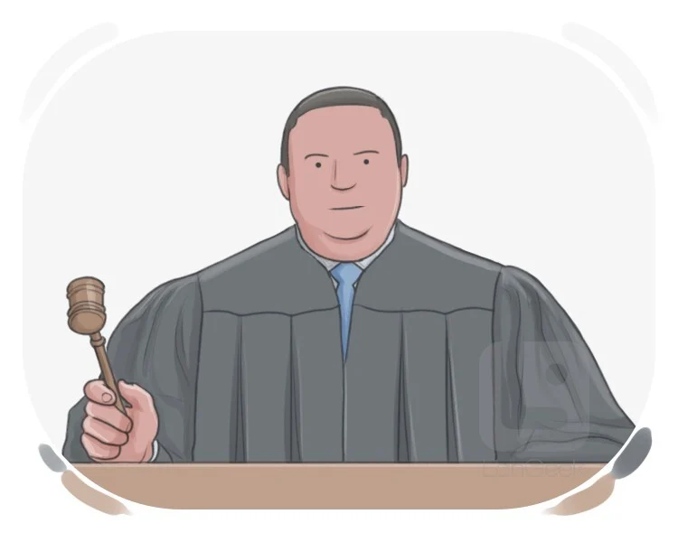   2. a person who chooses the winner of a competition
- `campus`  /ˈkæm.pəs/   the buildings of a college or university and the land that surrounds them
- `borrow (verb)`  /ˈbɑːr.oʊ/   to get or receive something from someone with the intention of giving it back after a period of time: borrow a book from the library
- `floor`  /flɔːr/   1. the part of a room that you walk on: There wasn't any chairs so we sat on the floor   2. all the rooms at the same height in a building: I live on the top floor - Our hotel room was on the sixth floor
- `assignment`    a job or piece of work that somebody is given to do: You have to complete three written assignments each term
- `die`  /daɪ/   to stop living: People, animals and plants die if they don't have water - She died of cancer
- `shrug`  /ʃrʌɡ/   to move your shoulders to show that you do not know or do not care about something: I asked her where Same was but she just shrugged
- `pretend`  /prɪˈtend/   to try to make somebody believe something that is not true: He didn't want to talk, so he pretended to be asleep - I pretended that I was enjoying myself
- `sketchbook`  /ˈsketʃbʊk/   book of plain paper for drawing on
- `horror`  /ˈhɔːrər/   a feeling of fear or shock: They watched in horror as the child ran in front of the bus   `horrer film` a film which tries to frighten or shock you for entertainment   `horrer story` a story which tries to frighten or shock you for entertainment
- `figure something/someone out`  /ˈfɪɡ.ər/   to finally understand something or someone, or find the solution to a problem after a lot of thought: Can you figure out the answer to question 5?
- `find out about something`    to get information about something because you want to know more about it, or to learn a fact or piece of information for the first time: How did you find out about the party?
- `ridiculous`  /rɪˈdɪk.jə.ləs/   so silly that it makes people laugh: I look ridiculous in this hat
- `schedule`   /ˈskedʒ.uːl/   a plan or list of times when things will happen or be done: I've got a busy schedule next week - We're behind schedule (= late) with the project - Filming began on schedule (= at the planned time)
- `yell`  /jel/   to shout loudly: Stop yelling at me
- `loud`  /laʊd/   making a lot of noise: I couldn't hear what he said because the music was too loud - loud voices - Please speak a bit louder _ I can't hear you (OPPOSITE: quiet)   `out loud` so that other people can hear it: I read the story out loud
- `loudly`  /ˈlaʊdli/   in a way that makes a lot of noise: She laughed loudly
- `lecture (noun)`  /ˈlektʃər/   a talk to a group of people to teach them about something: She gave a fascinating lecture on Islamic history
- `dining room`  /ˈdaɪnɪŋ ruːm/   a room where people eat
- `hate (verb)`  /heɪt/   to have a very strong feeling of not liking somebody or something: Most cats hate water - I hate waiting for buses (OPPOSITE: love)
- `attend`  /əˈtend/   to go to or be present at a place where something is happening: Did you attend the meeting?
- `tasty`  /ˈteɪsti/   good to eat: The soup was very tasty
- `blender`  /ˈblen.dər/   an electric machine used in the kitchen for breaking down foods or making smooth liquid substances from soft foods and liquids   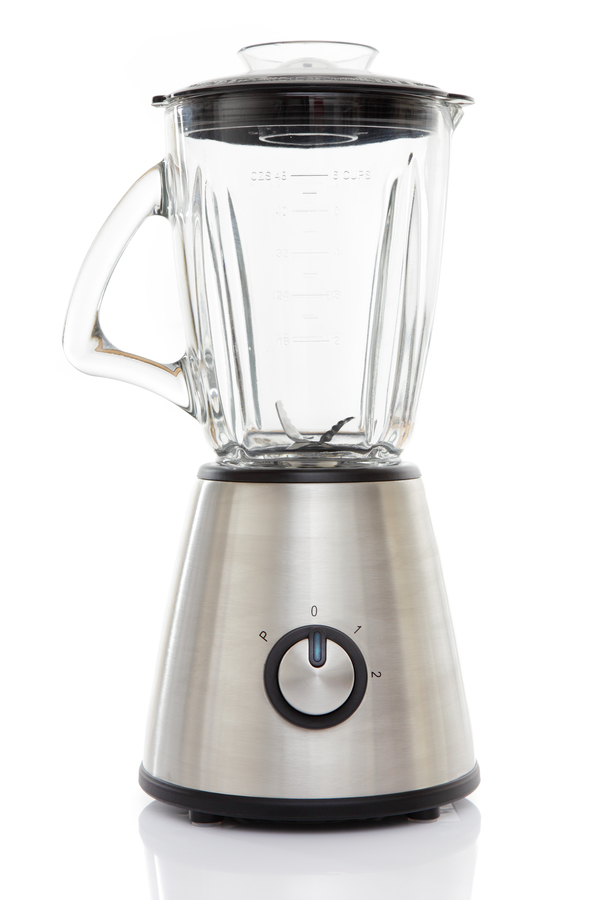

#### Interview (26 words)
- `interview`  /ˈɪntərvjuː/   a meeting in which someone asks you questions to see if you are suitable for a job or course: a job interview
- `dispute`  /ˈdɪspjuːt/   an argument or disagreement between people with different ideas: There was a dispute about which driver caused the accident - اختلاف نظر
- `crowd`  /kraʊd/   a large group of people who have come together: A crowd of about 15,000 attended the concert
- `care(verb)`  /ker/   to think that somebody or something is important: The only thing he cares about is money - I don't care who wins _ I'm not interested in football   `care for somebody` to do the things for somebody that they need: After the accident, her parents cared for her until she was better
- `approach (verb)`  /əˈproʊtʃ/   to come near to somebody or something in distance or time: As you approach the village, you'll see a church on your right - The exams were approaching
- `church`  /tʃɜːrtʃ/   a building for Christian religious activities   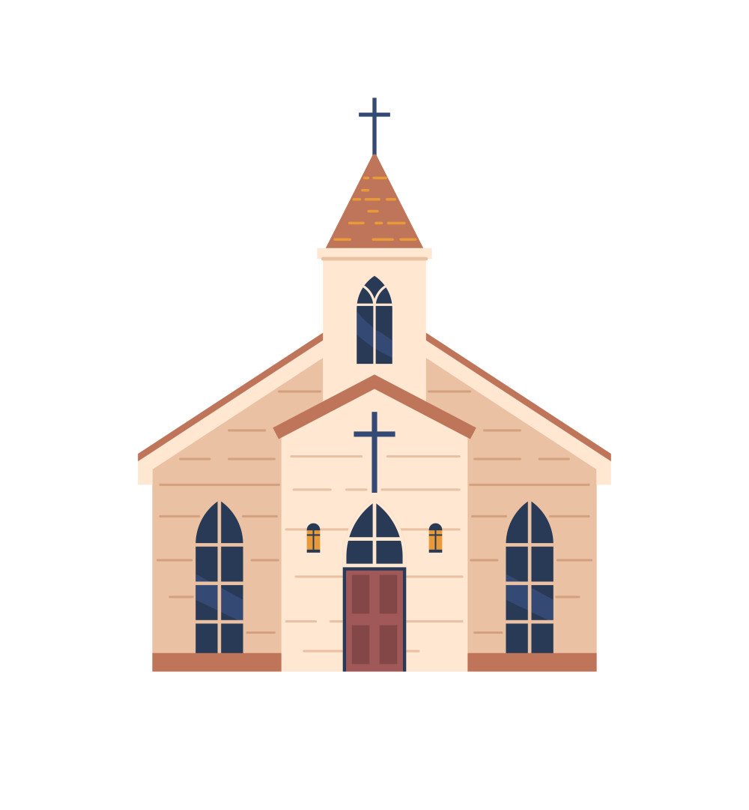
- `boring`    not interesting or exciting: The movie was so boring I fell asleep - It's boring to sit on the plane with nothing to read
- `wet`  /wet/   1. covered in water or another liquid: a wet umbrella - wet hair   2. with a lot of rain: a wet day (OPPOSITE: dry)
- `receptionist`  /rɪˈsep.ʃən.ɪst/   a person who works in a place such as a hotel, office, or hospital, who welcomes and helps visitors and answers the phone
- `hospital`  /ˈhɑ:s.pɪtl/     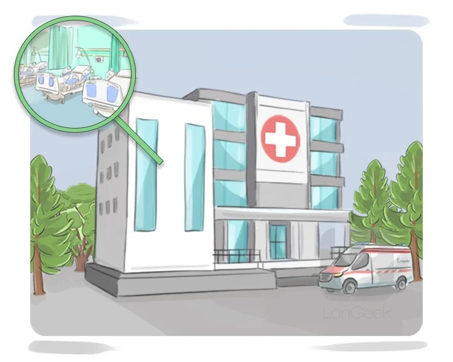
- `jog`  /dʒɑːɡ/   1. to run slowly for exercise: I jogged round the park - I go jogging every morning   2. to push or touch something a little, so that it moves: She jogged my arm and I spilled my drink
- `coach`    someone whose job is to teach people to improve at a sport, skill, or school subject: a tennis/maths coach   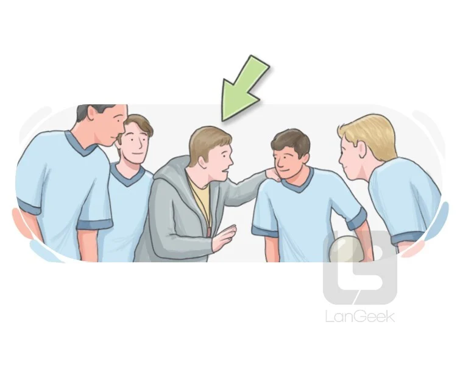
- `positive`  /ˈpɑː.zə.t̬ɪv/   1. thinking or talking about the good parts of a situation: It's important to stay positive - The teacher was very positive about my work (OPPOSITE: negative)   2. completely certain (SAME MEANING: sure): Are you positive that you closed the door?
- `actor`  /ˈæktər/   a man or woman who acts in plays, films or television programmes - بازیگر
- `act (verb)`  /ækt/   1. to do something, or to behave in a certain way: Doctors acted quickly to save the boy's life after the accident - Stop acting like a child   2. to pretend to be somebody else in a play film or television programme (SAME MEANING: perform)   `act as something` to do the job of another person, usually for a short time: He acted as a manager while his boss was ill
- `adult`  /ˈædʌlt/   a person or an animal that has grown to the full size; not a child: Adults as well as children will enjoy this film
- `as`    1. while something else is happening: just as I was leaving the house, the phone rang   2. `as ... as` words that you use to compare people or things; the same amount: Paul is as tall as his father - I haven't got as many clothes as you have - I'd like it done as soon as possible   3. used to say that somebody or something has a particular job or purpose: She works as a secretary for a big company - I used my shoe as a hammer   4. in the same way: Please do as I tell you   5. because: As she was ill, she didn't go to school
- `airline`    a company that takes people or things to different places by plane: Which airline are you flying with?
- `lie (verb)`  /laɪ/   to say something that you know is not true: He lied about his age. He said he was 16 but really he's 14 - Don't ever lie to me again (A person who lies is a liar)
- `salary`  /ˈsæləri/   money that you receive every month for the work that you do
- `confident`  /ˈkɑːnfɪdənt/   sure that you can do something well, or that something will happen: I'm confident that our team will win
- `airport`    a place where people get on and off planes, with buildings where passengers can wait: I'll meet you at the airport
- `sign (verb)`  /saɪn/   to write your name in your own way on something: Sign here, please - I signed the cheque (The noun is signature)
- `strange`  /streɪndʒ/   1. unusual or surprising: Did you hear that strange noise?   2. that you do not know: We were lost in a strange town
- `mystery`  /ˈmɪstəri/   something strange that you cannot understand or explain: The police say that the man's death is still a mystery
- `keep`    1. to stay in a particular state or condition: Keep still (= don't move) _ while I take your photo - We tried to keep warm   2. to make somebody or something stay in a particular state or condition: Keep this door closed - I'm sorry to keep you waiting   3. to continue to have something: You can keep that book _ I don't need it   4. to put or store something in a particular place Where do you keep the caffee?   5. to continue doing something; to do something many times: Keep driving until you see the cinema, then turn left - She keeps forgetting my name   6. to look after and buy food and other things for a person or an animal: It costs a lot to keep a family of four - They keep sheep and pigs on their farm   7. to stay fresh: Will this fish keep until tomorrow?   `keep away from somebody or something` to not go near somebody or something: Keep away from the river, children   `keep somebody from doing something` to stop somebody from doing something: You can't keep me from going out   `keep going` to continue: I was very tierd but I kept going to the end of the race   `keep off something` to not go on something: Keep off the grass   `keep on doing something` to continue doing something; to do something many times: We kept on driving all night - That man keeps on looking at me   `keep out` to stay outside: The sign on the door said 'Danger, Keep out!'   `keep somebody or something out` to stop somebody or something from going in: We put a fence round the garden to keep the sheep out   `keep up with somebody or something` to go as fast as another person or thing so that you are together: Don't walk so quickly _ I can't keep up with you

#### Chores (39 words)
- `chore`  /tʃɔːr/   a routine task, especially a household one
- `regular`  /ˈrɛ.gjʊ.lər/   1. happening again and again with the same amount of space or time between: a regular heartbeat - A light flashed at regular intervals (OPPOSITE: irregular)   2. going somewhere or doing something often: I've never seen him before _ he's not one of my regular customers   3. usual: Who is your regular doctor?
- `garbage`  /ˈɡɑːr.bɪdʒ/   (Brithis: rubbish) - زباله
- `messy`  /ˈmes.i/   1. untidy or dirty: a messy kitchen   2. Painting is a messy job
- `untidy`  /ʌnˈtaɪ.di/   not tidy; not with everything in the right place (SAME MEANING: messy): Your room is always so untidy
- `dirty`  /dɜr:ti/   not clean: Your hands are dirty _ go and wash them (OPPOSITE: clean)
- `dust`  /dʌst/   dry dirt that is like powder: The old table was covered in dust
- `shelf`  /ʃelf/   a long flat piece of wood on a wall or in a cupboard, where things can stand: Put the plates on the shelf - bookshelves   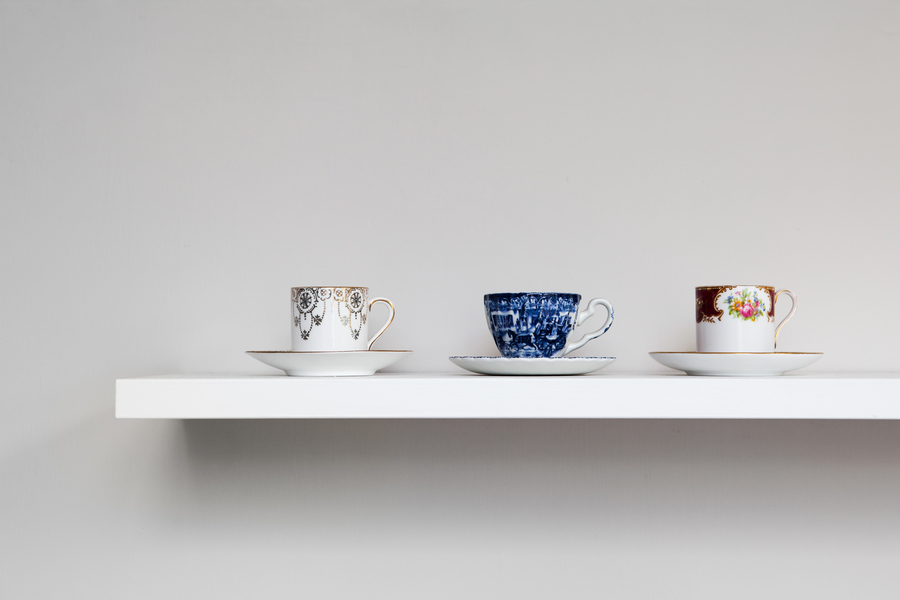
- `piece`  /piːs/   1. a part of something: Would you like another piece of cake? - a piece of broken glass   2. one single thing: Have you got a piece of paper - That's an interesting piece of news   3. a coin: a 50p piece   `fall to pieces` to become very old and in bad condition; to break: The chair fell to pieces when I sat on it   `in pieces` broken: The teapot lay in pieces on the floor   `take something to pieces` to divide something into its parts: I took the bed to pieces because it was too big to go through the door   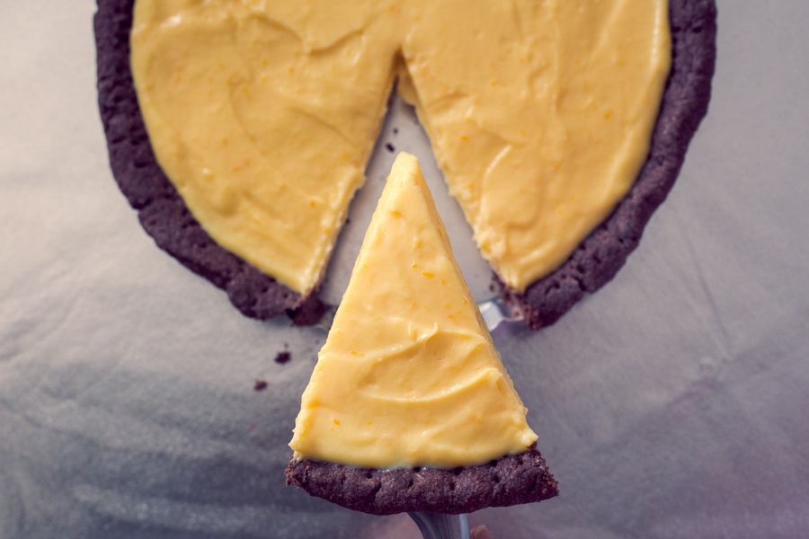
- `divide`  /dɪˈvaɪd/   1. to share or cut something into smaller parts: The teacher divided the class into groups of three - The book is divided into ten chapters   2. to go into parts: When the road divides, go left   3. to find out how many times one number goes into a bigger number: 36 divided by 4 is 9 (36 ÷ 4 = 9)
- `bookshelf`      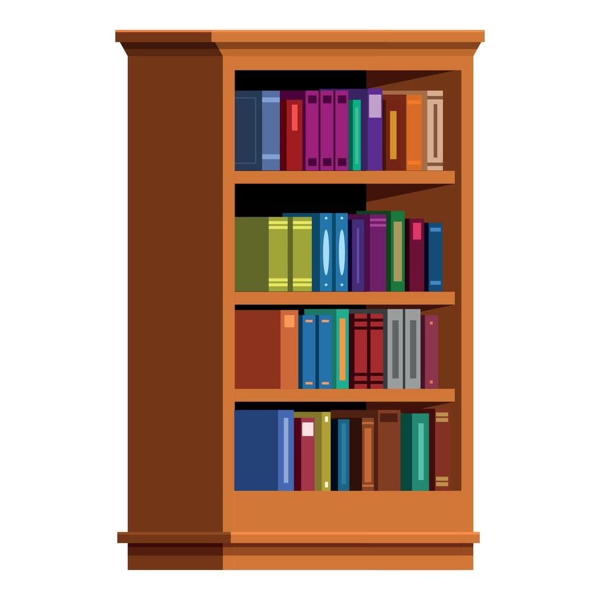
- `inspection`  /ɪnˈspek.ʃən/   the act of looking at something carefully, or an official visit to a building or organization to check that everything is correct and legal
- `inspector`  /ˌɪns.pɛk.tɜr/   1. a person whose job is to see that things are done correctly: a factory inspector   2. a police officer
- `bored`  /bɔːrd/   not interested; unhappy because you have nothing interesting to do: I'm bored with this book - The children were bored stiff
- `dumpster`  /ˈdʌmp.stər/   a very large container for rubbish (= garbage)   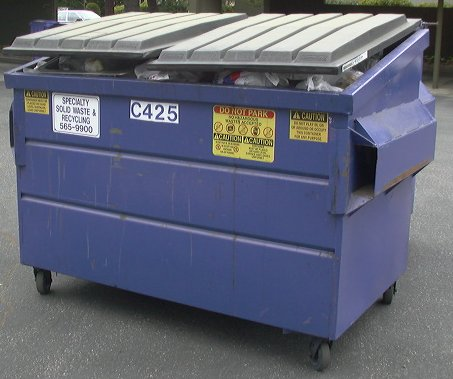
- `closet`  /ˈklɑː.zət/   a space in a wall with a door that reaches the ground, used for storing clothes, shoes, etc.: a walk-in closet   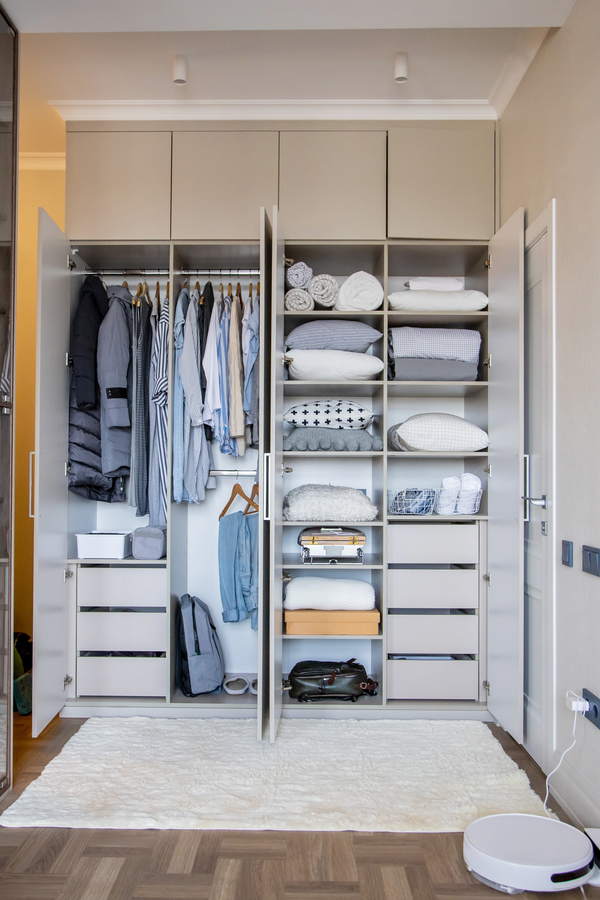
- `mop`  /mɑːp/   a thing with a long handle that you use for washing floors   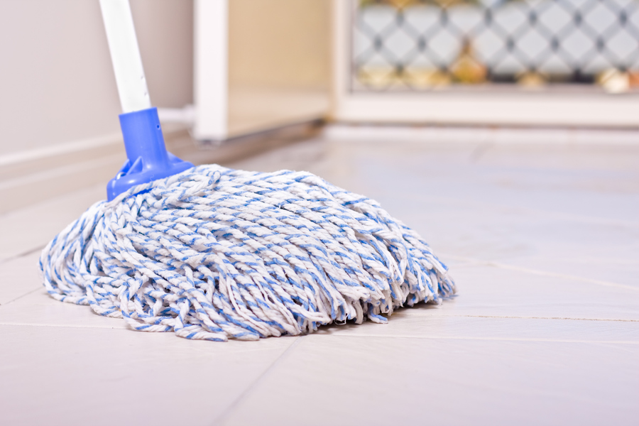
- `either (adverb)`  /ˈi.ðər/   (used in sentences with 'not') also: Lydia can't swim and I can't either   `either ... or` used to show two different things or people that you can choose (examples: You can have either tea or coffee. / I will either write or telephone.)
- `audition`  /ɑ.ˈdɪ.ʃən/   a test to show your talent
- `household`    related to the home
- `scrub`  /skrʌb/   to rub something hard to clean it, usually with a brush and soap and water: He scrubbed the floor   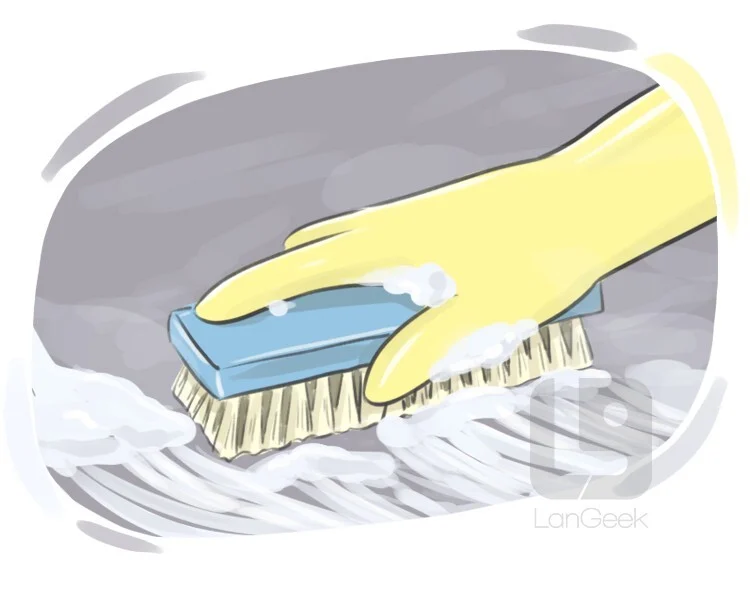
- `rub`  /rʌb/   to move something backwards and forwards on another thing: I rubbed my hands together to keep them warm - The cat rubbed its head against my leg   `rub something out` to take writing or marks off something by using a rubber or a cloth: I rubbed the word out and wrote it again
- `towel`  /taʊəl/   a piece of cloth or paper that you use for drying your body or things such as dishes   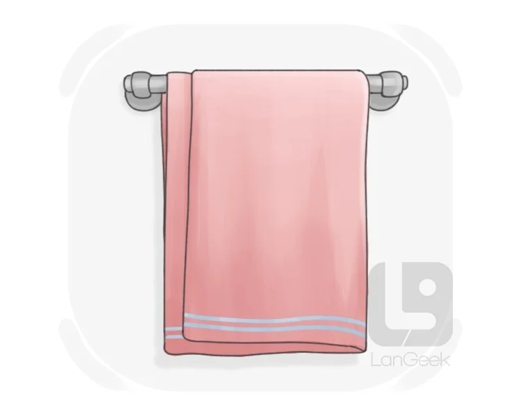
- `rug`  /rʌɡ/   something we use to cover or decorate a part of the floor that is usually made of thick materials or animal skin   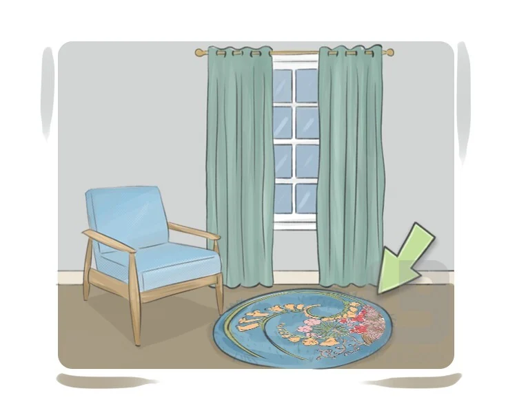
- `thick`  /θɪk/   1. far from one side to the other: The walls are very thick - It's cold outside, so wear a thick coat (OPPOSITE: thin)   2. You use thick to say or ask how far something is from one side to the other: The ice is six centimetres thick   3. with a lot of people or things close together: thick dark hair   4. if a liquid is thick, it does not flow easily: This paint is too thick (OPPOSITE: thin)   5. difficult to see through: thick smoke
- `vacuum`  /ˈvæk.juːm/   a machine for cleaning   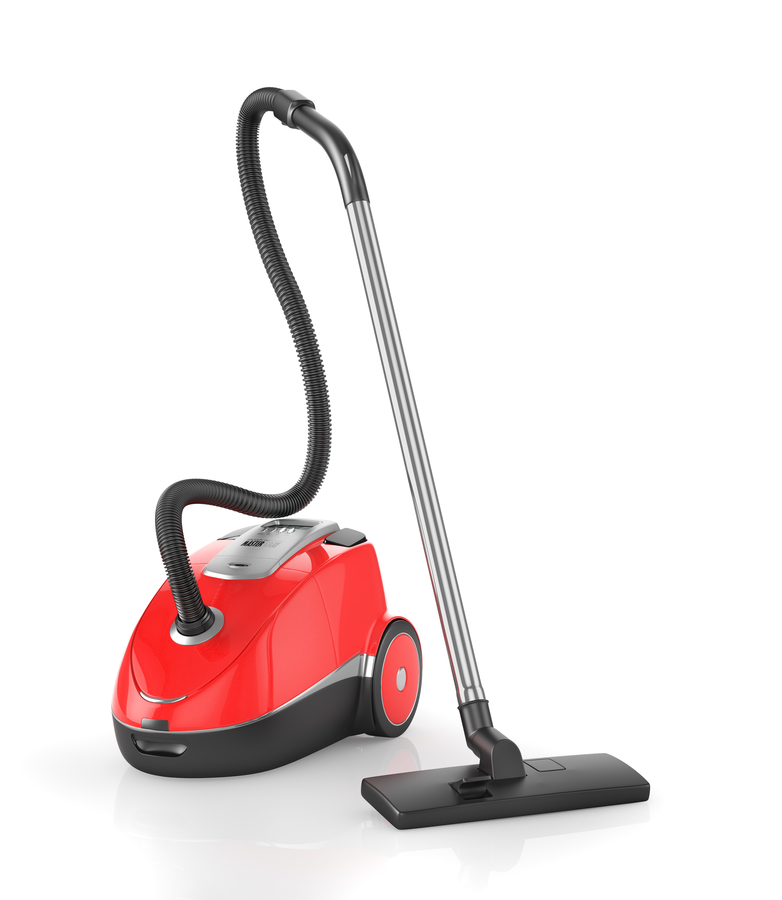
- `vase`  /veɪs/   a container for flowers   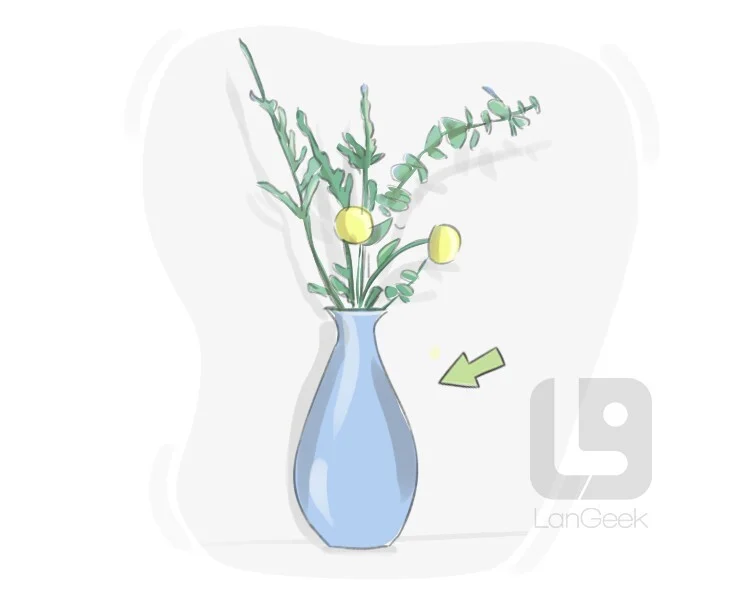
- `spill`  /spɪl/   drop; if you spill a liquid, it flows out of something by accident: I've spilt my coffee   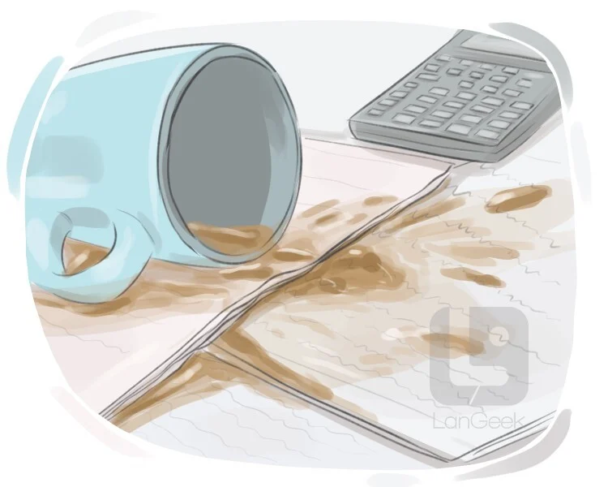
- `disaster`  /dɪ.zæs.tər/   a very bad event
- `stain`  /steɪn/   a colored patch or dirty mark that is difficult to remove   
- `pot`  /pɒt/   a container for cooking   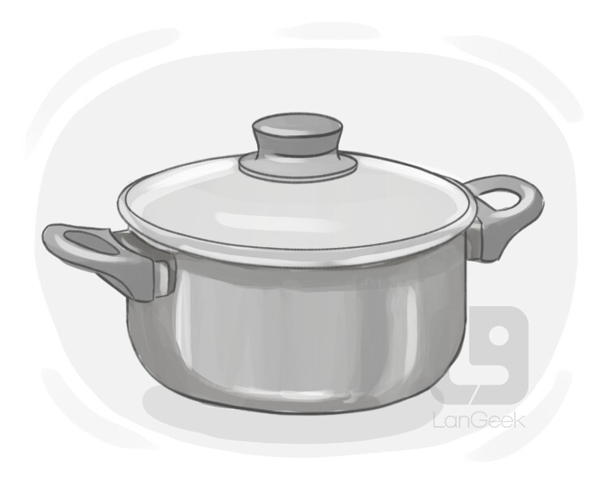
- `make`    1. to produce or create something: They make cars in that factory - He made a box out of some pieces of wood - This shirt is made of cotton   2. to cause something to be or to happen; to produce something: The plane made a loud noise when it landed - Chocolate makes you fat - That film made me cry - I made a mistake   3. to force somebody to do something: My father made me stay at home   4. to choose somebody to do a job: They made him President   5. a word that you use with money, numbers and time: She makes (= earns) a lot of money - Five and seven make twelve - 'What's the time?' 'I make it six o'clock'   6. to be able to go somewhere: I'm afraid I can't make the meeting on Friday   `make do with something` to use something that is not very good, because there is nothing better: We didn't have a table, but we made do with some boxes   `make something into something` to change something so that it becomes a different thing: They made the bedroom into an office   `make something or somebody out` to be able to see, hear or understand something or somebody: It was dark and I couldn't make out the words on the sign   `make something up` to tell somebody something that is not true (SAME MEANING: invent): Nobody believes that story _ he made it up   `make up` to become friends again after an argument: Jane and Tom had an argument last week, but they've made up now - Has she made up with him yet? (OPPOSITE: fall out with somebody)
- `blanket`  /ˈblæŋ.kɪt/   covers for keeping warm   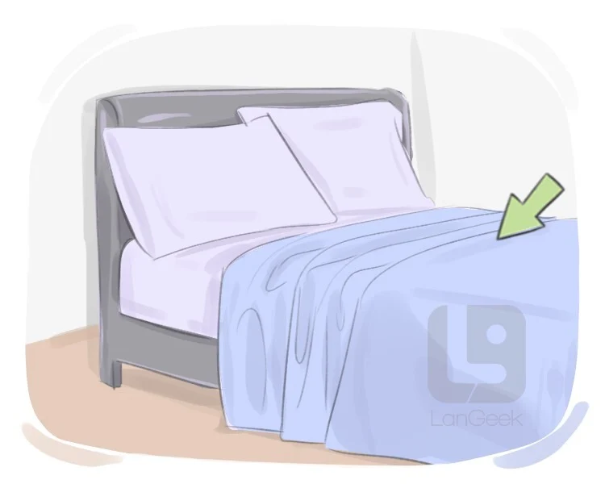
- `stove`  /stoʊv/   a device for cooking food   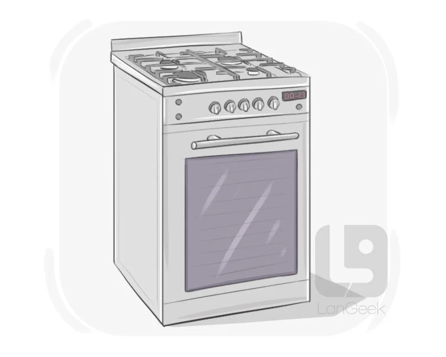
- `corner`  /ˈkɔr.nɜr/   where two walls meet   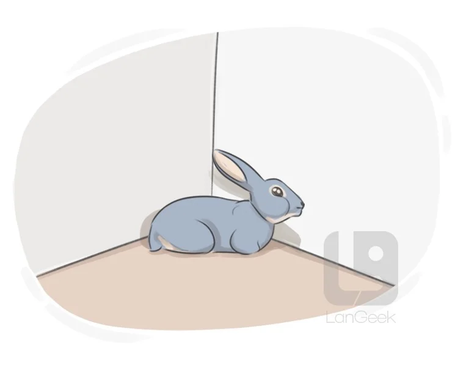
- `trouble`  /ˈtrʌb.əl/   problems or difficulties
- `glove`  /ɡlʌv/   a thing that you wear to keep your hand warm or safe   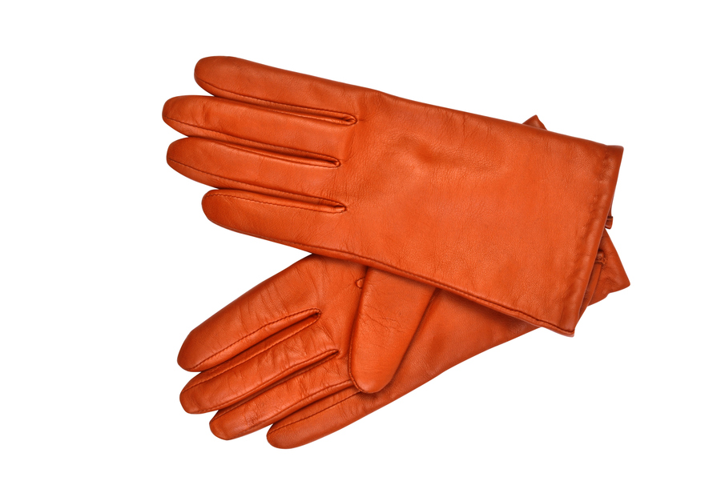
- `genius`  /ˈdʒiː.ni.əs/   a very smart person
- `roommate`  /ˈruːm.meɪt/   a person who you share a room with for a period of time: Jean was my roommate during our first year at college

#### Meeting (37 words)
- `cushion`  /ˈkʊʃ.ən/     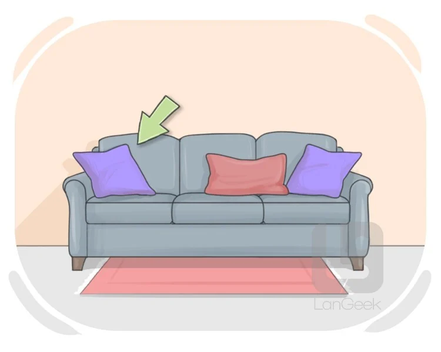
- `furniture`  /fɜr:nɪʧər/   مبلمان   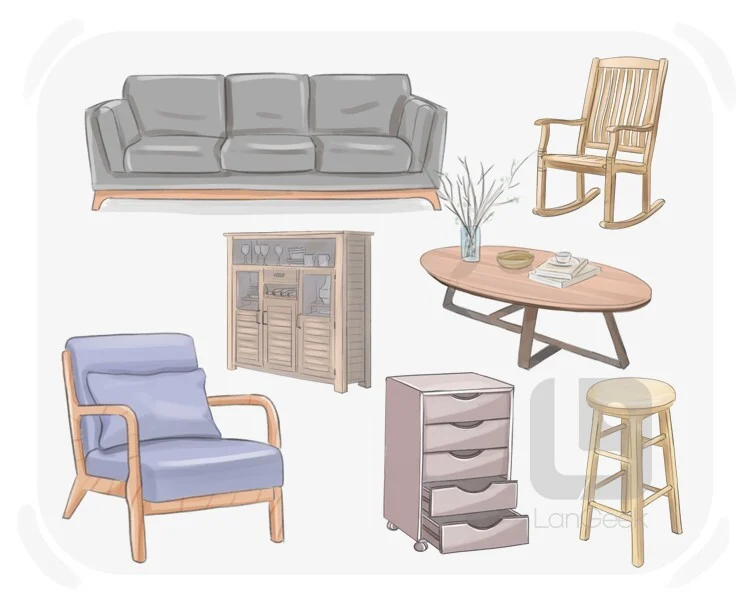
- `date`  /deɪt/   a meeting with someone special
- `coworker`  /koʊ.wɜ:r.kər/   someone who works with someone else, having the same job
- `sick`  /sɪk/   not well (SAME MEANING: ill)
- `colleague`  /ˈkɑː.liːɡ/   work friend
- `compete`  /kəmˈpiːt/   to try to win a race or a competition
- `outfit`  /ˈaʊt.fɪt/   a set of clothes
- `disbelief`  /ˌdɪs.bɪˈliːf/   the feeling of not being able to believe that something is true or real
- `greatness`  /ˈɡreɪt.nəs/   being very good or important
- `curtain`  /ˈkɜr.tən/   a piece of cloth that you can move to cover a window: Could you draw the curtains (= open or close the curtains), please?   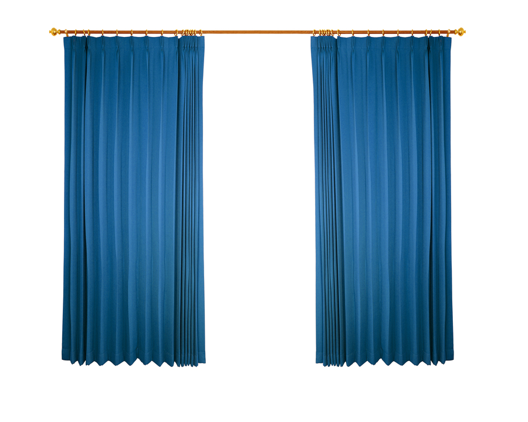
- `bark (verb)`  /bɑːrk/   if a dog barks, it makes short loud sounds: The dog always barks at people it doesn't know
- `pajamas`  /pəˈdʒɑː.məz/   clothes worn in bed   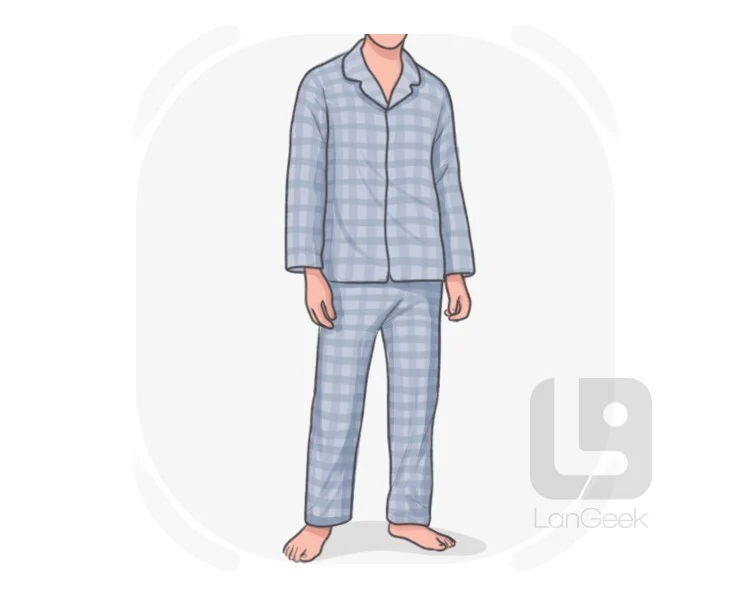
- `few`  /fjuː/   not many: Few people live to the age of 100 - There are fewer buses in the evenings - Few of the players played well   `a few` some, but not many: Only a few people came to the meeting - I have read a few of her books   `quite a few` quite a lot: It's been quite a few years since I saw him last
- `remind`  /rɪˈmaɪnd/   1. to help somebody remember something that they must do: Please remind me to buy some bread on the way home   2. to make somebody remember somebody or something: She reminds me of her mother
- `spot (noun)`    1. a small round mark: a blue dress with green spots   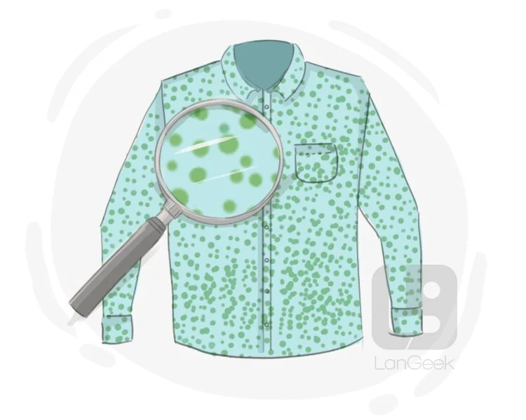   2. (British) a small red mark on your skin: A lot of teenagers get spots on their faces   3. a place: This is a good spot for a picnic
- `reliable`  /ri:.laɪə.bəl/   that you can trust: My car is very reliable - He is a reliable person (OPPOSITE: unreliable)
- `admit`  /əd.ˈmɪt/   1. to say that you have done something wrong or that something bad is true: He admitted stealing the money - I admit that I made a mistake (OPPOSITE: deny)   2. to allow somebody or something to go into a place: This ticket admits one person to the museum - اعتراف کردن
- `suppose`  /səˈpoʊz/   1. to think that something is probably true or will probably happen: 'Where's Jenny?' 'I don't know _ suppose she's still at work   2. a word that you use when you agree with something but are not happy about it: 'Can I borrow your pen?' 'Yes, I suppose so _ but don't lose it   `be supposed to` if you are supposed to do something, you should do it: They were supposed to meet us here - You're not supposed to smoke in this room   2. (informal) if something is supposed to be true, people say it is true: This is supposed to be a good restaurant
- `storm`  /stɔːrm/   bad weather with rain and wind
- `scary`  /ˈsker.i/   makes you feel afraid
- `hike`  /haɪk/   long walks in nature
- `sweater`  /ˈswɛ.tər/   heavy shirt for cold weather
- `dry`  /draɪ/   1. with no water or liquid in it or on it: The washing isn't dry yet (OPPOSITE: wet)   2. with no rain: dry weather (OPPOSITE: wet)   3. not sweet: dry white wine
- `cool (adjective)`  /kuːl/   1. a little cold; not hot or warm: cool weather - I'd like a cool drink   2. not excited or angry (SAME MEANING: calm)   3. (informal) very good or fashionable: Those are cool shoes you're wearing   4. (informal) People say Cool! to show that they think something is a good idea: 'We're planning to go out for lunch tomorrow' 'Cool! (verb)'
- `thunder`  /ˈθʌn.dər/   a loud sound in a storm   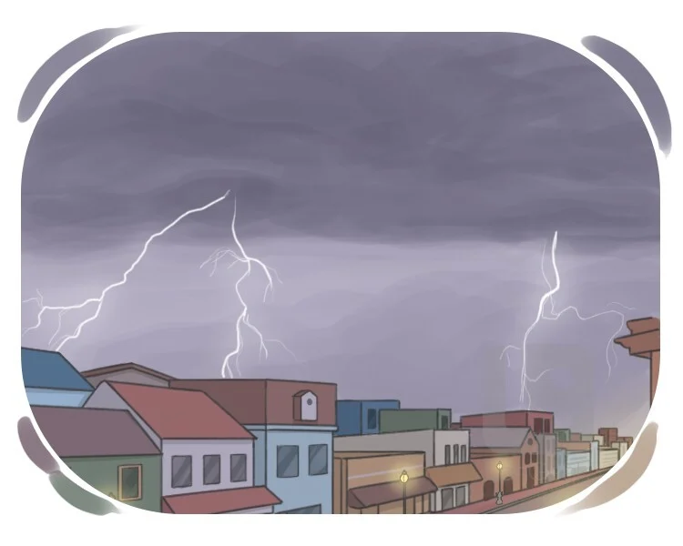
- `hard`    1. a lot: She works very hard - You must try harder   2. strongly: It's raining hard - She hit him hard
- `practice`  /ˈpræk.tɪs/   doing something many times so that you will do it well
- `glacier`  /ˈgleɪ.ʃɜr/   a large river of ice that moves slowly down a mountain   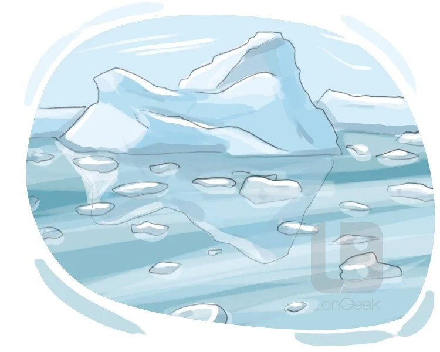
- `cave`  /keɪv/   a large hole in the side of a mountain or under the ground: Thousands of years ago, people lived in caves   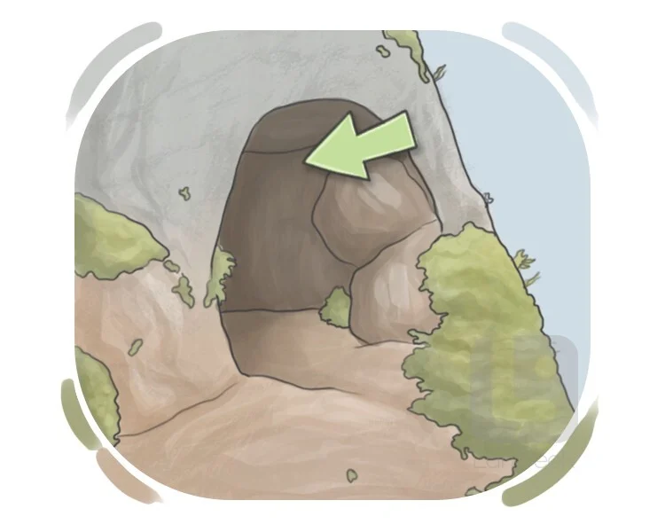
- `agenda`  /əˈdʒen.də/   a list of all the things to be talked about in a meeting
- `counter`  /ˈkaʊn.tər/   1. a long high table in a shop, bank or bar, that is between the people who work there and the customers: The man behind the counter in the bank was very helpful      2. a small round thing that you use when you play some games
- `sigh (verb)`  /saɪ/   to let out a deep breath, for example because you are sad, tired or pleased
- `proud`  /praʊd/   feeling good about someone or something
- `annoyed`  /ə.ˈnɔɪd/   feeling a little angry
- `ruin`  /ˈruːɪn/   to damage something badly so that it is no longer good; to destroy something completely: I spilled coffee on my jacket and ruined it - The rain ruined our picnic
- `awful`  /ˈɑː.fəl/   very bad: The pain was awful - What awful weather

#### Reunion (34 words)
- `reunion`  /ˌriːˈjuː.njən/   a social event for a group of people who have not seen each other for a long time: We're having a family reunion next week - The college has an annual reunion for former students
- `annual`  /ˈæn.ju.əl/   happening once every year: an annual event/visit/holiday
- `contact (noun)`  /ˈkɑːn.tækt/   meeting, talking to or writing to somebody: Until Jane went to school, she had little contact with other children - Are you still in contact with the people you met on holiday? - Doctors come into contact with (= meet) a lot of people
- `spotless`  /ˈspɑːt.ləs/   absolutely clean or pure
- `exhausted`  /ɪɡˈzɑː.stɪd/   very tired
- `festival`  /ˈfes.tə.vəl/   1. a series of public events, for example concerts and shows, in one place: the Cannes Film Festival   2. a time when people celebrate something, especially a religious event: Christmas is an important Christian festival
- `graduation`  /ˌɡrædʒ.uˈeɪ.ʃən/   finishing a degree or other course of study at a university or school
- `hair`  /her/     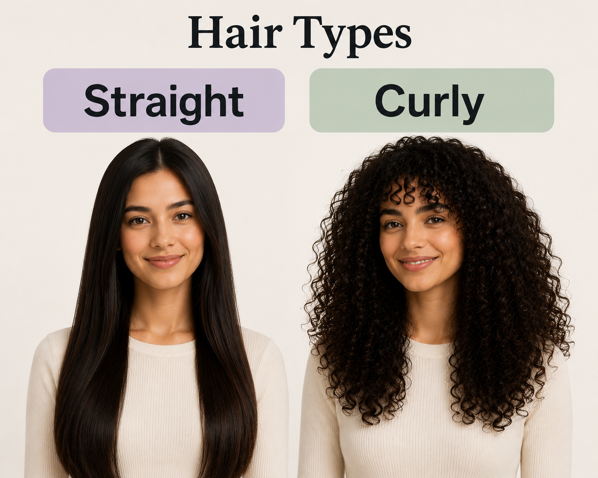
- `tie (noun)`  /taɪ/   a piece of cloth worn around the neck   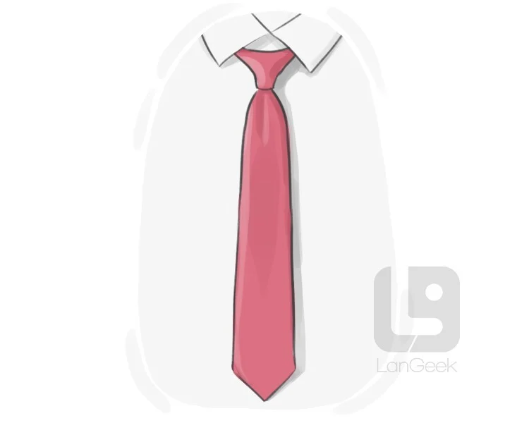
- `impress`  /ɪmˈpres/   to make somebody admire and respect you: We were very impressed by your work
- `admire`  /ədˈmaɪr/   to think or say that somebody or something is very good: I really admire you for doing such a difficult job - They were admiring the view from the top of the tower
- `cartwheel`  /ˈkɑːrt.wiːl/   a fast, skilful movement like a wheel turning, in which you throw yourself sideways onto one hand, then onto both hands with your legs and arms straight and your legs pointing up, before landing on your feet again   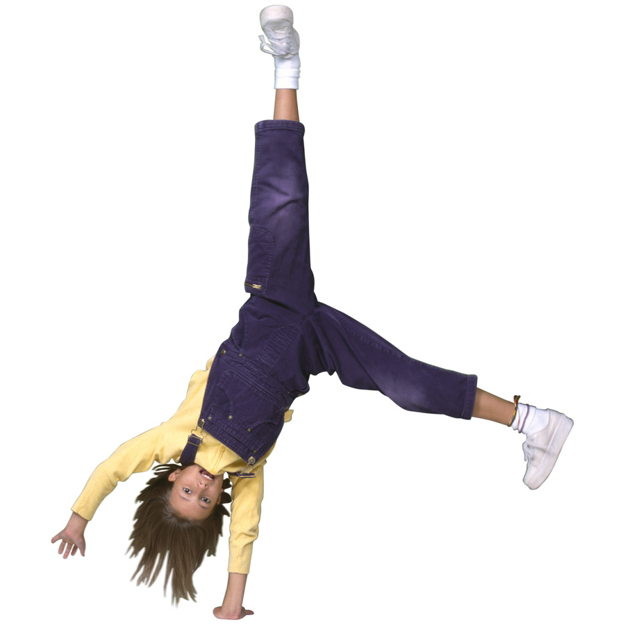
- `polite`  /pəˈlaɪt/   showing good manners and respectful behavior towards others; speaking or behaving in a way that shows respect: it is polite to say 'please' when you ask for something (OPPOSITE: impolite, rude)
- `memorable`    easy to remember because it is special in some way: Their wedding was a very memorable day
- `wedding`  /ˈwed.ɪŋ/   the time when a man and a woman get married: Billy and Elena invited me to their wedding - She wore a long white wedding dress
- `outgoing`  /ˈaʊt.ɡoʊ.ɪŋ/   (of a person) friendly and energetic and finding it easy and enjoyable to be with others; enjoys making new friends
- `bald`  /bɑːld/   with little or no hair on the head   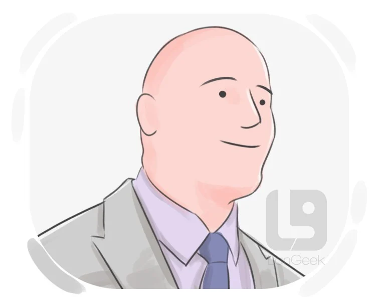
- `handsome`  /ˈhæn.səm/   (of a man) having an attractive face and body   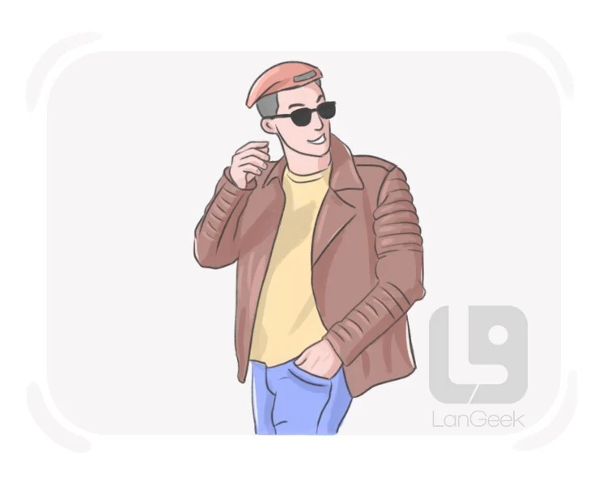
- `bean`  /bi:n/   small seed you can eat   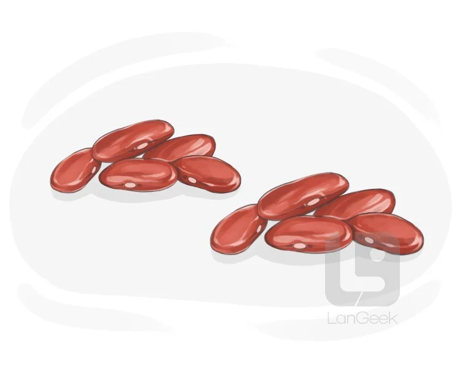
- `chew`  /tʃuː/   to use your teeth to break up food in your mouth when you are eating: This meat is difficult to chew
- `obviously`  /ˈɑːb.vi.əs.li/   clearly or without a doubt
- `entirely`  /ɪnˈtaɪr.li/   completely: I entirely agree with you
- `cheers`  /tʃɪrz/   expressing good wishes before drinking   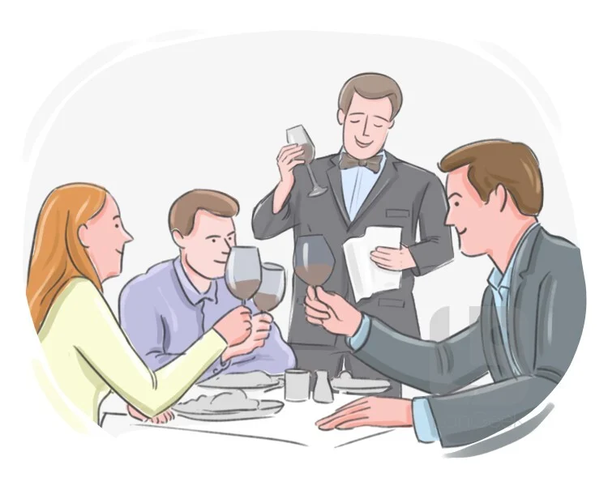
- `champagne`  /ʃæm.ˈpeɪn/   a type of fizzy wine made originally in France, often drunk to celebrate an event   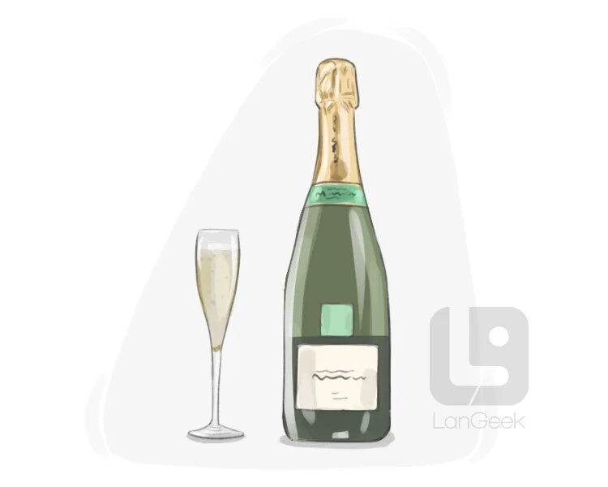
- `equipment`  /ɪˈkwɪp.mənt/   tools or machines for a purpose
- `gig`    a live performance by a musician or group playing popular or jazz music   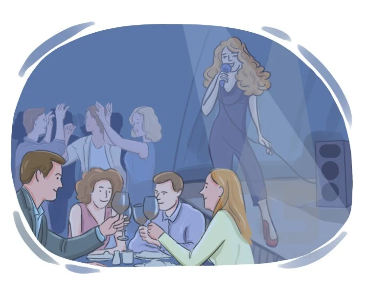
- `bar`  /bɑːr/   a place to drink alcohol
- `turntable`  /ˈtɜrn.ˌteɪ.bəl/   a circular surface on a record player on which the record is played   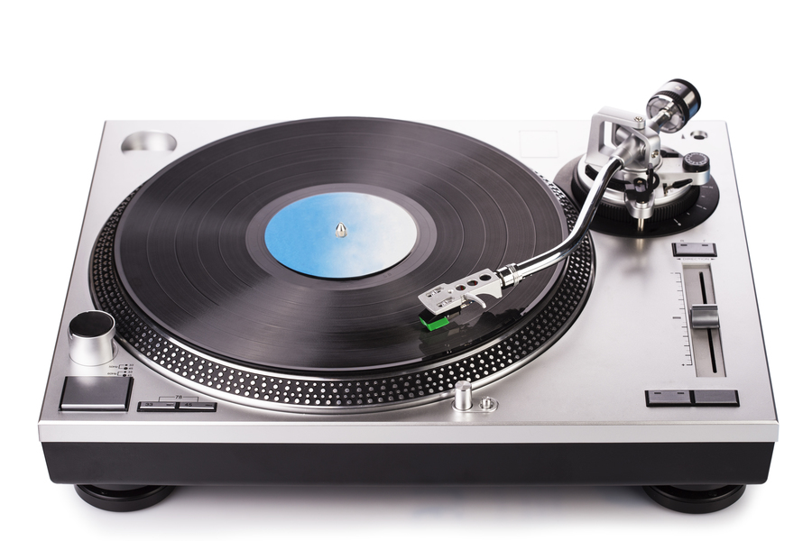
- `exclusively`  /ɪksˈkluː.sɪv.li/   only
- `shame`  /ʃeɪm/   an uneasy feeling that we get because of our own or someone else's mistake or bad manner   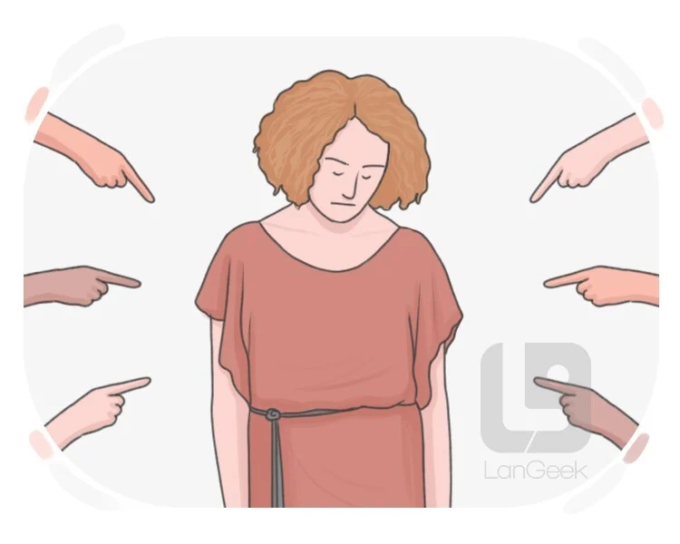
- `critic`  /ˈkrɪ.tɪk/   someone who evaluates and provides opinions or judgments about various forms of art, literature, performances, or other creative works   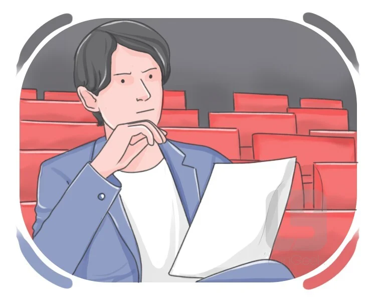
- `hallway`  /hɑ:l.weɪ/   a space inside a building entrance, which connects to the other rooms   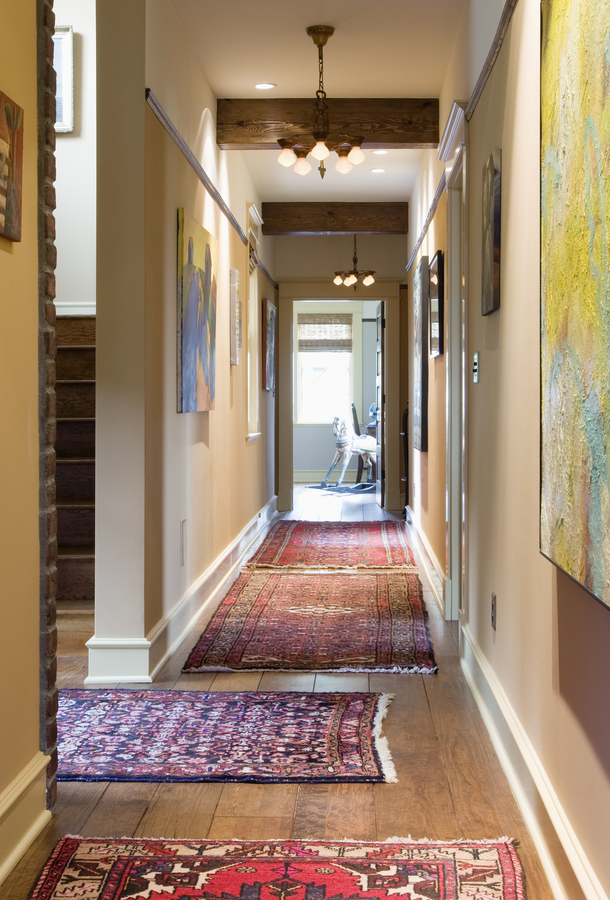
- `turn (verb)`  /tɜrn/   1. to rotate something so that it is facing a different direction or is in a different position: The wheels are turning - Turn the key   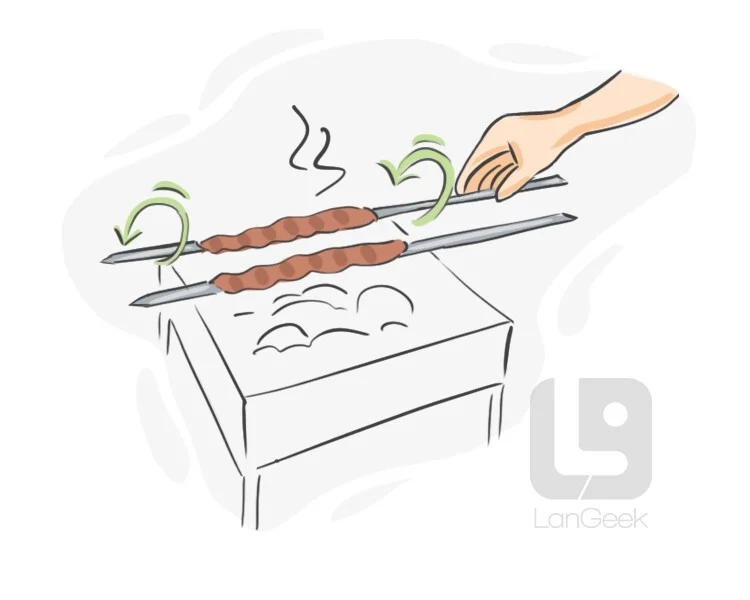   2. to move in a different direction: Turn left at the traffic lights   3. to become different: The weather has turned cold   4. to make somebody or something change: The sun turned her hair blond   5. to find a certain page in a book: Turn to page 97   `turn something down` 1. to say no to what somebody wants to do or to give you: They offered me the job but I turned it down   2. to make something produce less sound or heat by moving a switch: I'm too hot _ can you turn the heating down?   `turn into something` to become different; to change somebody or something into something different: Water turns into ice when it gets very cold   `turn something off` to move the handle or switch that controls something, so that it stops: Turn the tap off - She turned off the television   `turn something on` to move the handle or switch that controls something, so that it starts: Could you turn the light on?   `turn out` to be something in the end: It has turned out to be a lovely day   `turn something out` to switch off a light: can you turn the lights out before you leave?   `turn over` to move so that the other side is on top: She turned over and went back to sleep   `turn something over` to move something so that the other side is on top: If you turn over the page you'll find the answers on the other side   `turn up` (used about a person) to arrive: Has David turned up yet?   `turn something up` to make something produce more sound or heat by moving a switch: Turn up the TV _ I can't hear it properly
- `properly`  /ˈprɑ.pər.li/   well or correctly: Close the door properly - I can't see properly without my glasses

#### Health (28 words)
- `throat`  /θroʊt/   the front of the neck, or the space inside the neck down which food and air can go   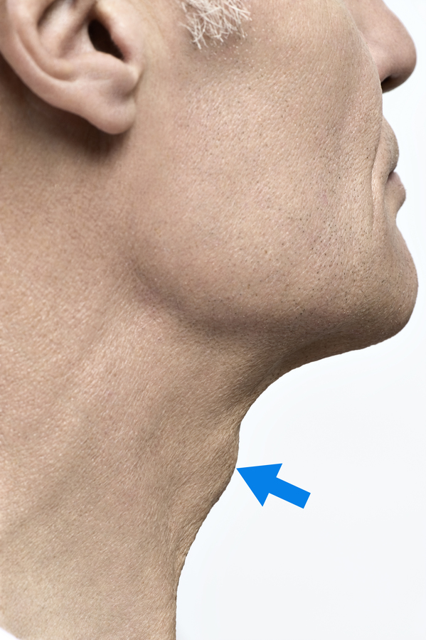
- `stare`  /ster/   look for a long time
- `medicine`  /ˈmed.ɪ.sən/   1. the science of understanding illnesses and making sick people well again: He's studying medicine   2. special liquids or pills that help you to get better when you are ill: Take this medicine every morning
- `sore throat`  /ˌsɔːr ˈθroʊt/   pain in the throat
- `cough (verb)`  /kɑːf/   to send air out of your throat with a sudden loud noise: The smoke made me cough
- `have got`    Have got and have mean the same. Have got is more informal
- `headache`  /ˈhed.eɪk/   a pain you feel inside your head: He had a headache so he went to bed - That noise is giving me a headache
- `recovery`    the process of getting better
- `dramatically`  /drəˈmatɪkli/   in a big or showy way
- `forehead`  /ˈfɔr.hɛd/   the part of the face above the eyes   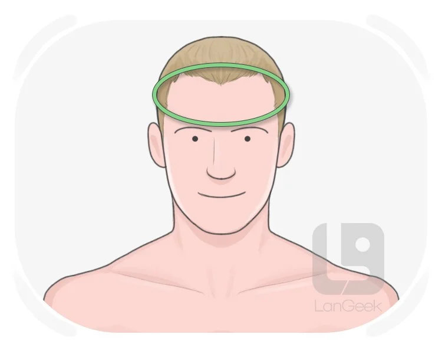
- `fever`  /ˈfi:.vər/   a high body temperature   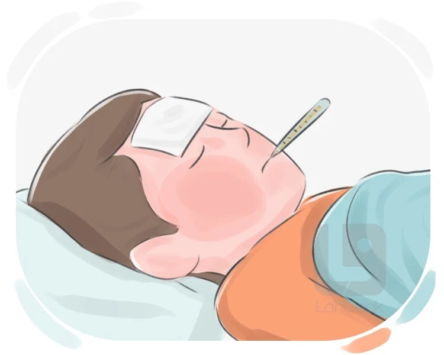
- `miracle`  /ˈmɪ.rə.kəl/   a wonderful and surprising thing that happens and that you cannot explain: It's a miracle that he wasn't killed
- `aspirin`  /ˈæs.prɪn/   a medicine that stops pain: I took an aspirin for my headache
- `clinic`  /ˈklɪn.ɪk/   somewhere doctors work
- `greet`  /ɡriːt/   to say hello when you meet somebody: He greeted me with a smile
- `alright`    (informal) = all right
- `all right`    1. good, or good enough: Is every thing all right?   2. well; not hurt: I was ill, but I'm all right now   3. used to say 'yes, I agree' when somebody asks you to do something: 'Can you get me some stamps?' 'All right'
- `tense (adjective)`    nervous or stressed
- `pharmacy`  /ˈfɑːr.mə.si/   a shop where medicines are sold   
- `fortunately`  /ˈfɔːr.tʃən.ət.li/   happening because of good luck: Fortunately, we got home before it started to rain
- `score (verb)`  /skɔːr/   to win or get a point, goal, etc. in a competition, sport, or game: She scored 18 out of 20 in the spelling test
- `bleed`  /bli:d/   to lose blood: I've cut my hand and it's bleeding   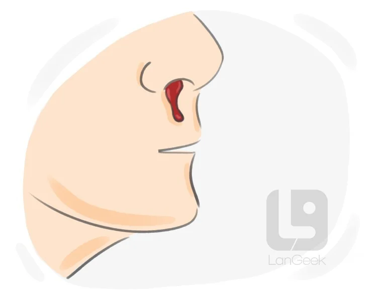
- `elbow`  /ˈel.boʊ/   the part in the middle of your arm where it bends: She fell and broke her elbow   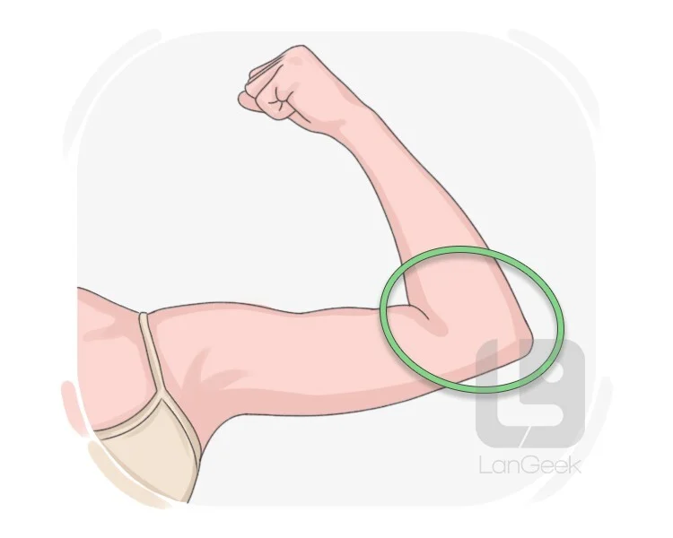
- `scratch`  /skrætʃ/   a cut or mark that a sharp thing makes: Her hands were covered in scratches from the cat   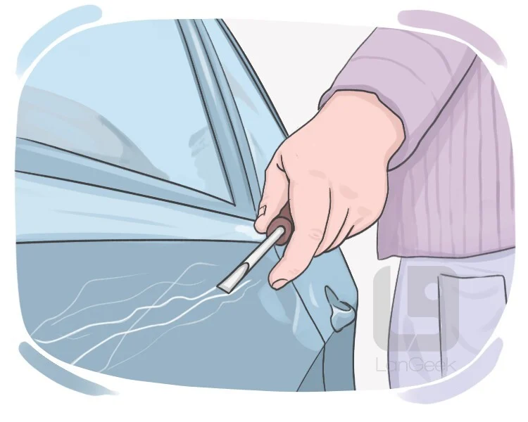
- `paramedic`  /ˌpɛ.rə.ˈmɛ.dɪk/   a person who helps in emergencies   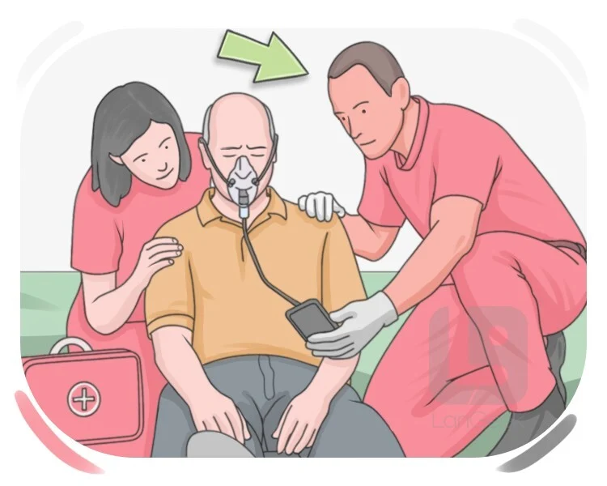
- `ma'am`  /mæm/   a polite way of talking to a woman: How can I help you, ma'am?
- `prescription`  /prɪˈskrɪp.ʃən/   a piece of paper that a doctor gives to you with the name of your medicine on it
- `tissue`  /ˈtɪ.ʃu/   1. a thin piece of soft paper that you use to clean your nose: a box of tissues   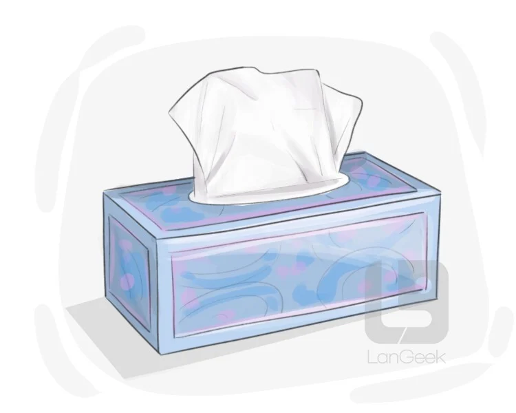   2. all the cells that from the bodies of humans, animals and plants   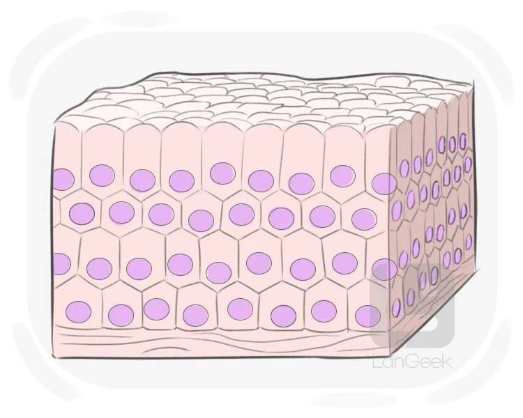

#### Innovation (6 words)
- `innovation`  /ˌɪn.əˈveɪ.ʃən/   a new idea or method: The company is known for its innovation in computer technology
- `issue`  /ˈɪʃ.uː/   1. an important problem that people talk about: Pollution is a serious issue   2. a magazine or newspaper of particular day, week or month: Have you read this week's issue?
- `diary`  /ˈdaɪ.ə.ri/   1. a book where you write what you are going to do: I'll look in my diary to see if I'm free tomorrow   2. a book where you write what you have done each day: Do you keep a diary (= write in a diary)?
- `wisdom`  /ˈwɪz.dəm/   knowing and understanding a lot about many things: Some people think that old age brings wisdom
- `granddaughter`  /ˈɡræn.dɔː.tər/   the daughter of your son or daughter
- `inspire`  /ɪnˈspaɪər/   1. to make somebody want to do something: His wife inspired him to write this poem   2. to make somebody feel or think something: Her words inspired us all with hope
---

---

## Example - Vocabulary (15 words)

### foreword (2 words)
- `deep learning`  /diːp ˈlɜː.nɪŋ/   a subset of machine learning
- `audience`    target readers
---

### Part 1: Fundamentals (7 words)

#### Chapter 1: Introduction (3 words)
- `tensor`  /ˈten.sər/   a multi-dimensional array - آرایه چندبعدی – پایه داده‌ها در PyTorch
- `scalar`  /ˈskeɪ.lər/   a single number - عدد مفرد – تانسور با بعد صفر
- `vector`  /ˈvek.tər/   1D tensor - تانسور یک‌بعدی – لیستی از اعداد

#### Chapter 2: PyTorch Basics (2 words)
- `gradient`  /ˈɡreɪ.di.ənt/   derivative of function - مشتق تابع – میزان تغییر خروجی نسبت به ورودی
- `parameter`  /pəˈræm.ɪ.tər/   trainable variable - متغیر قابل آموزش – مقداری که مدل یاد می‌گیرد

#### Chapter 3: Gradients (2 words)
- `backpropagation`  /ˌbæk.prɒp.əˈɡeɪ.ʃən/   algorithm for computing gradients - الگوریتم محاسبه گرادیان – قلب یادگیری عمیق
- `optimizer`  /ˈɒp.tɪ.maɪ.zər/   algorithm that updates parameters - الگوریتم به‌روزرسانی پارامترها – مثل SGD یا Adam
---

### Part 2: Deep Learning (6 words)

#### Chapter 4: Neural Networks (3 words)
- `neuron`  /ˈnjʊə.rɒn/   basic unit of neural network - نورون – واحد پایه شبکه عصبی
- `layer`  /ˈleɪ.ər/   collection of neurons - لایه – مجموعه‌ای از نورون‌ها
- `activation function`  /ˌæk.tɪˈveɪ.ʃən ˈfʌŋk.ʃən/   non-linear transformation - تابع فعال‌سازی – تبدیل غیرخطی برای معرفی پیچیدگی

#### Chapter 5: Training (3 words)
- `epoch`  /ˈiː.pɒk/   one complete pass through training data - دوره – یک بار کامل دیدن کل داده‌های آموزش
- `batch`  /bætʃ/   subset of training data - دسته – زیرمجموعه‌ای از داده‌ها که با هم پردازش می‌شوند
- `loss function`  /lɒs ˈfʌŋk.ʃən/   measures model error - تابع ضرر – خطای مدل را اندازه می‌گیرد
---

---

## General - Vocabulary (54 words)

### game (5 words)
- `swipe`  /swaɪp/   1. to hit or try to hit something by swinging your arm: he swiped at the ball and missed   2. to steal something
- `hit (verb)`  /hɪt/   to touch somebody or something hard: He hit me on the head with a book - The car a wall wall - I hit my knee on the door
- `swing (verb)`  /swɪŋ/   1. to move backwards and forwards or from side to side through the air; to make somebody or something do this: Monkeys were swinging from the trees - He swung his arms as he walked   2. to move in a curve: The door swung open
- `chief (noun)`  /tʃiːf/   the leader or ruler of a group of people: the chief of an African tribe - police chief
- `chef`  /ʃef/   a professional cook, especially the head cook in a hotel or restaurant
---

### news (6 words)
- `attention`  /əˈtenʃn/   looking or listening carefully and with interest: Can I have your attention, please? (= please listen to me)
- `pay attention`    to look or listen carefully: Please pay attention to what I'm saying
- `matter (noun)`  /ˈmætər/   something that you must talk about or do: There is a matter I would like to discuss with you
- `vote (noun)`  /vəʊt/   when you choose somebody or something by writing on a piece of paper or by putting up your hand: There were 96 votes for the plan, and 25 against
- `vote (verb)`  /vəʊt/   to choose somebody or something by writing on a piece of paper or by putting up your hand: The people voted for the new president   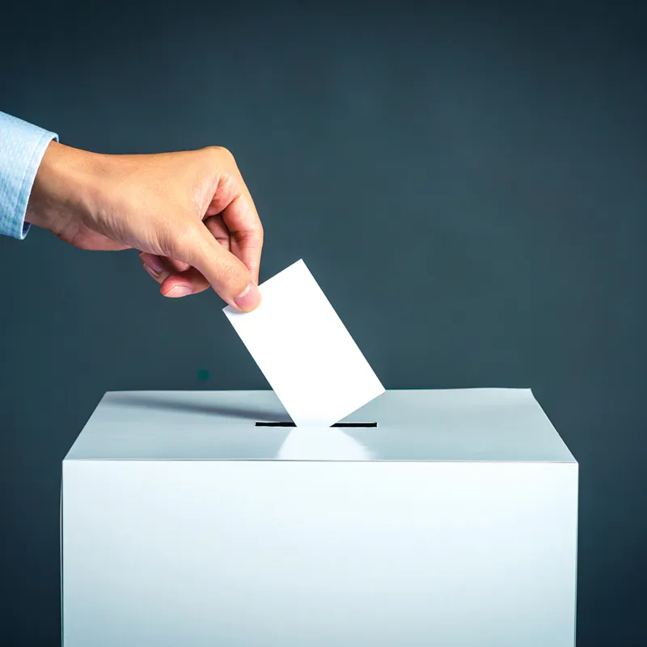
- `lonely`  /ˈloʊnli/   1. unhappy because you are not with other people: She felt very lonely when she first went to live in the city   2. far from other places: a lonely house in the hills
---

### social media (25 words)
- `teenager`  /ˈtiːneɪdʒər/   a person who is between 13 and 19 years old
- `genuinely`  /ˈdʒɛnjuɪnli/   realy: Do you think he's genuinely sorry?
- `deserve`  /dɪˈzɜːrv/   to be good or bad enough to have somethong: You have worked very hard and you deserve a rest - They stole money from old people, so they deserve to go to prison
- `wear (verb)`  /wer/   to have clothes, jewellery, etc. on your body: She was wearing a red dress - I wear glasses
- `even (adverb)`  /ˈiːvən/   1. a word that you use to say that something is surprising: The game is so easy that even a child can play it - He didn't laugh _ he didn't even smile   2. a word that you use to make another word stronger: Their house is even smaller than ours
- `pretty (adverb)`  /ˈprɪti/   quite; fairly: It's pretty cold today
- `quite`  /kwaɪt/   1. not very; rather (SAME MEANING: fairly): it's quite warm today, but it's not hot - He plays the guitor quite well - We waited quite a long time   2. completely: Dinner is not quite ready
- `fairly`  /ˈferli/   1. quite; not very : She speaks French fairly well - I'm fairly certain it was him   2. in a way that is right and honest: This company treats its workers fairly (OPPOSITE: unfairly)
- `worried`  /ˈwɜːrid/   unhappy because you think that something bad will happen or has happened: Fiana is worried that she's going to fail the exam - I'm worried about my brother _ he looks ill
- `stupid`  /ˈstuːpɪd/   not intelligent; silly: Don't be so stupid! - What a stupid question!
- `silly`  /ˈsɪli/   not sensible or clever; stupid: Don't be so silly - It was silly of you to leave the door open when you went out
- `sensible`  /ˈsensəbl/   able to think carefully about something and to do the right thing: It wasn't very sensible of you to run away - a sensible answer (OPPOSITE: silly)
- `clever`  /ˈklevər/   quick at learning and understanding things (SAME MEANING: intelligent): a clever student (OPPOSITE: stupid)
- `crazy`  /ˈkreɪzi/   1. stupid; not sensible: You must be crazy to ride a bike at night with no lights   2. very angry: My mum will go crazy if I get home late   3. if you are crazy about something or somebody, you like them very much: She's crazy about football - He's crazy about her (SAME MEANING: mad)
- `comfortable`  /ˈkʌm.fɚ.t̬ə.bəl/   1. nice to sit in, to be in, or to wear: This is a very comfortable bed - comfortable shoes   2. physically relaxed; with no pain or worry: Sit down and make yourself comfortable (OPPOSITE: uncomfortable) - راحت
- `whistle (verb)`  /ˈwɪsl/   to make a long high sound by blowing air out between your lips or through a whistle: He whistled a tune to himself   
- `literally`  /ˈlɪtərəli/   'really' or 'truly'; It means something is a fact, not a joke: I'm literally the wrong colour (= I am really the wrong colour)
- `attract`  /əˈtrækt/   1. to make somebody like somebody or something: He was attracted her - I had always been attracted by the idea of working abroad   2. to make somebody or something come somewhere: Moths are attracted to light - The new film has attracted a lot of publicity
- `moth`  /mɑːθ/   an insect with big wings that flies at night and is attracted to light   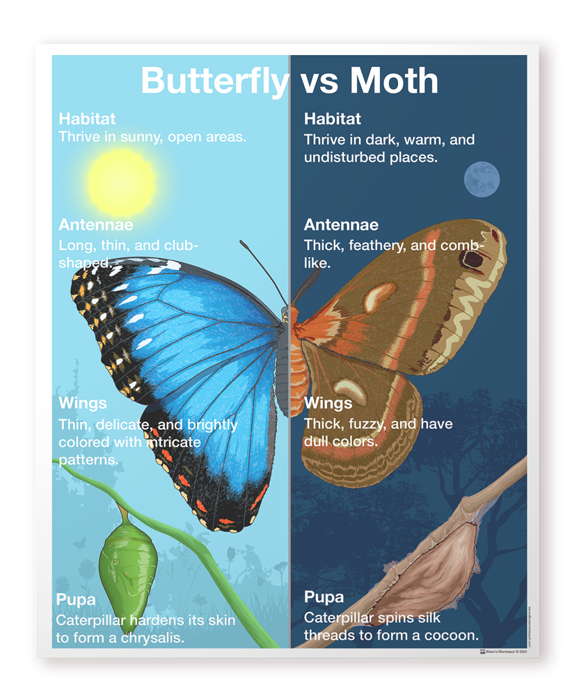 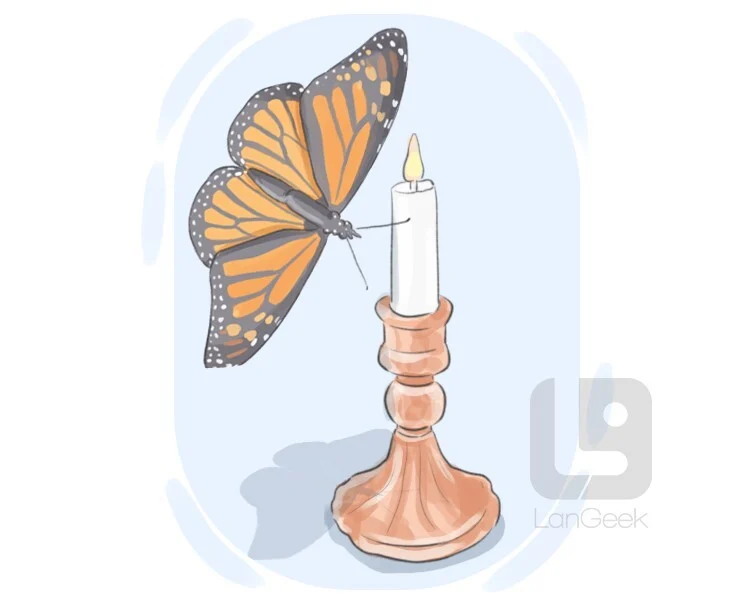
- `worse`  /wɜːrs/   bad
- `adopt`  /əˈdɑːpt/   to take the child of another person into your family and treat them as your own child by law: They adopted Micky after his parents died
- `rarely`  /ˈrerli/   not very often: We rarely agree with each other
- `stranger`  /ˈstreɪndʒər/   someone you do not know
- `tradition`  /trəˈdɪʃ.ən/   a belief, principle, or way of acting that people in a particular society or group have continued to follow for a long time, or all of these beliefs, etc. in a particular society or group
- `mustard`  /ˈmʌstərd/   a thick yellow or brown sauce that tastes spicy and is eaten cold in small amounts, especially with meat   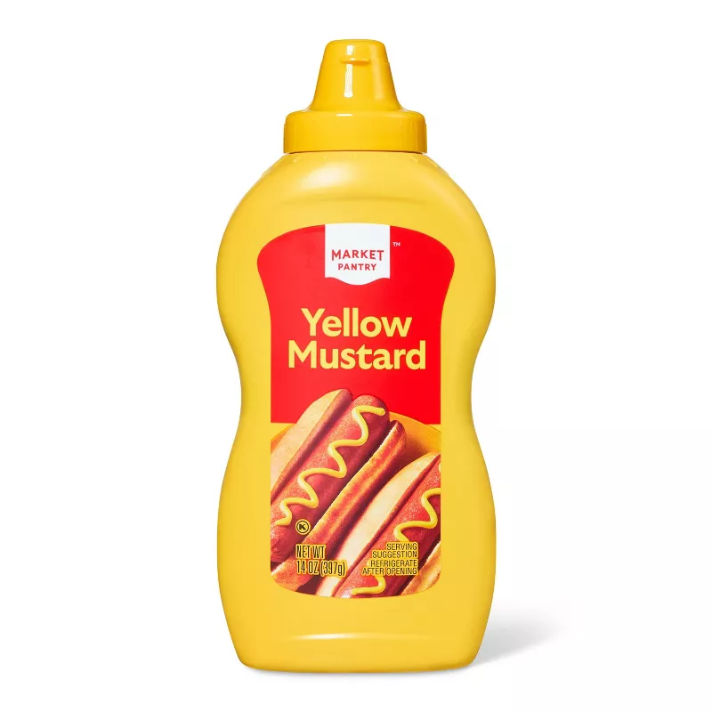
---

### other (13 words)
- `benefit (verb)`  /ˈbenɪfɪt/   to be good or helpful for somebody: The new law will benefit families with children   `benefit from something` to get something good or useful from something: She will benefit from a holiday
- `purpose`  /ˈpɜːrpəs/   the reason for doing something: What is the purpose of your visit?
- `reason`  /ˈriːzn/   a cause or an explanation for why you do something or why something happens: The reason I didn't come to the party was that I was ill - Is there any reason why you were late? - She gave no reasons for her decision
- `cause (noun)`  /kɔːz/   1. a thing or person that makes something happen: Bad driving is the cause of most road accidents   2. something that people care about and want to help: They gave the money to a good cause _ it was used to build a new hospital
- `against`  /əˈɡenst/   1. on the other side in a game, fight, etc.: They played against a football team from another vilage   2. if you are against something, you do not agree with it: Many people are against the plan   3. touching somebody or something for support: I put the ladder against the wall   4. to stop something: Have you had an injection against the disease?
- `vehicle`  /ˈviːəkl/   a car, bus, lorry, bicycle, etc.; a thing that takes people or things from place to place: Are you the owner of this vehicle?
- `vacation`  /veɪˈkeɪʃən/   (British holiday) a period of time when you are not working or studying: They're on vacation in Hawaii
- `to`    1. a word that shows direction: She went to Italy - James has gone to school - this bus goes to the city center   2. a word that shows the person or thing that receives something: I gave the book to Paula - He sent a letter to his parents - Be kind to animals   3. a word that shows the end or limit of something: The museum is open from 9:30 to 5:30 - Jeans cost from $20 to $45   4. on or against something: He put his hands to his ears - They were sitting back to back   5. a word that shows how something changes: The sky changed from blue to grey   6. a word that shows why: I came to help   7. a word that you use for comparing things: I prefer football to tennis   8. a word that shows how many minutes it is before the hour: It's two minutes to six   9. a word that you use before verbs to make the infinitive (= the simple from of a verb): I want to go home - Don't forget to write - She asked me to go but I didn't want to (= to go)
- `for (preposition)`    1. a word that shows who will get or have something: These flowers are for you   2. a word that shows how something is used or why something is done: We had fish and chips for dinner - Take this medicine for your cold - He was sent to prison for murder   3. a word that shows how long something has been happening: She has lived here for 20 years   4. a word that shows how far somebody or something goes: We walked for miles (= a very long way)   5. a word that shows where a person or thing is going: Is this the train for Glasgow?   6. a word that shows the person or thing you are talking about: It's time for us to go   7. a word that shows how much something is: I bought this book for $9   8. a word that shows that you like an idea: Some people were for the strike and others were against it (OPPOSITE: against)   9. on the side of somebody or something: He plays football for Italy   10. with the meaning of: What is the word for 'table' in Persian?
- `abbreviation`  /əˌbriːviˈeɪʃən/   a short form of a word or phrase
- `autumn`  /ˈɑːtəm/   the season of the year between summer and winter, when leaves fall from trees   
- `ahead`  /əˈhed/   1. in front of somebody or something: We could see a light ahead of us   2. before or more advanced than somebody or something: Inga and Nils arrived a few minutes ahead of us - London is about five hours ahead of New york   3. into the future: He's got a difficult time ahead of him - We must think ahead and make a plan   4. winning in a game, competition, etc.: Italy were one goal ahead at half time   `go ahead` used to give somebody permission to do something: 'Can I borrow your bike?' 'Sure, go ahead'
- `likely`    if something is likely, it will probably happen: It's likely that she will agree - They are likely to be late (OPPOSITE: unlikely)
---

### Wow! Words (5 words)
- `interesting`  /ˈɪn.trəs.tɪng/   A person or thing that is interesting makes you want to know more about them: This book is very interesting - That's an interesting idea (OPPOSITE: boring)
- `exciting`  /ˈɪks.aɪ.tɪng/   making us feel interested, happy, and energetic
- `wonderful`  /ˈwʌndərfl/   very good (SAME MEANING: fantastic): What a wonderful present! - This food is wonderful
- `fantastic`  /fænˈtæstɪk/   very good; wonderful (SAME MEANING: great) or brilliant: We had a fantastic holiday
- `amazing`  /əˈmeɪzɪŋ/   if something is amazing, it surprises you very much and is difficult to believe (SAME MEANING: incredible): he has shown amazing courage - I've got an amazing story to tell you
---

---
