# Duolingo - Vocabulary

**Total words: 613**

## 📑 Table of Contents

- [SECTION 1 (613 words)](#section-1-613-words)
  - [Solo trip (36 words)](#solo-trip-36-words)
  - [Delivery (30 words)](#delivery-30-words)
  - [At School (37 words)](#at-school-37-words)
  - [Interview (26 words)](#interview-26-words)
  - [Chores (39 words)](#chores-39-words)
  - [Meeting (41 words)](#meeting-41-words)
  - [Reunion (34 words)](#reunion-34-words)
  - [Health (28 words)](#health-28-words)
  - [Innovation (15 words)](#innovation-15-words)
  - [Routines (26 words)](#routines-26-words)
  - [Stories (27 words)](#stories-27-words)
  - [Wedding (15 words)](#wedding-15-words)
  - [Memories (20 words)](#memories-20-words)
  - [Relations (26 words)](#relations-26-words)
  - [Clothing (32 words)](#clothing-32-words)
  - [Airport (23 words)](#airport-23-words)
  - [News (28 words)](#news-28-words)
  - [Wildlife (37 words)](#wildlife-37-words)
  - [Old Times (38 words)](#old-times-38-words)
  - [Romance (34 words)](#romance-34-words)
  - [Party (21 words)](#party-21-words)

---

## SECTION 1 (613 words)

### Solo trip (36 words)
- `fare`  /fer/   the money that you pay to travel by bus, train, plane, etc.: My bus fare has gone up
- `stomach`  /ˈstʌm.ək/   1. the part inside your body where food goes after you eat it   2. the front part of your body below your chest and above your legs
- `arrive`  /əˈraɪv/   1. to come to a place: What time did you arrive home? - What time does the train arrive in Paris? - They arrive at the station ten minute late (OPPOSITE: leave, depart)   2. to come or happen: Summer has arrived
- `laundry`  /ˈlɔːndri/   clothes and sheets that you must wash or that you have washed (SAME MEANING: washing): a pile of dirty laundry
- `shuttle (noun)`  /ˈʃʌtl/   a plane, bus or train that travels regularly between two places
- `continent`  /ˈkɑːntənənt/   one of the seven main areas of land in the world, for example Africa, Asia or Europe
- `much (adjective, pronoun)`    (more, most) a big amount of something; a lot of something: I haven't got much money - There was so much food that we couldn't eat it all - Eat as much as you can - How much paper do you want? - How much is this shirt?
- `many (adjective, pronoun)`    1. a large number of people or things: Many people in this country are very poor - There aren't many students in my class - Many of these books are very old - There are too many mistakes in your homework   2. a word that you use to ask or talk about the number of people or things: How many brothers and sisters have you got? - Take as many cakes as you want
- `than`    You use 'than' when you compare people or things: I'm older than him - You speak Spanish much better than she does - We live less than a kilometre from the beach
- `luggage`  /ˈlʌɡɪdʒ/   bags and suitcases that you take with you when you travel (SAME MEANING: baggage): 'How much luggage have you got?' 'Only one suitcase'
- `seat`  /siːt/   something that you sit on: the book seat of a car - We had seats at the front of the theatre - Please take a seat (= sit down)
- `twice`  /twaɪs/   two times: I have been to Japan twice - He ate twice as much as I did
- `once (adverb)`  /wʌns/   1. one time: I've only been to Spain once - He phones us once a week (= once every week)   2. at some time in the past: This house was once a school   `at once` 1. immediately (SAME MEANING: now): Come here at once   2. at the same time: I can't do two things at once   `for once` this time only: For once I agree with you   `once again; once more` again; one more time: Can you explain it to me once more?   `once or twice` a few times; not often: I've only met them once or twice   `once upon a time` (used at the beginning of a children's story) a long time ago: Once upon a time there was a beautiful princess ...
- `once (conjunction)`  /wʌns/   as soon as; when: Once you've finished your homework you can go out
- `probably`  /ˈprɑːbəbli/   almost certainly; likely to happen: I will probably see you on Thursday
- `sleepover`  /ˈsliːpoʊvər/   a type of party when a young person or a group of young people stay for the night at the house of a friend
- `nightmare`  /ˈnaɪtmer/   1. a very bad or frightening dream: I shouldn't have watched that movie - it'll give me nightmares   2. something that is very bad or frightening: Travelling through the snow was a nightmare
- `deal (noun)`  /diːl/   an agreement, usually about buying, selling or working: Let's make a deal _ I'll help you today if you help me tomorrow   `a good deal` or `a great deal` a lot: I've spent a great deal of time on this report
- `desk`  /desk/   1. a type of table, often with drawers, that you sit at to write or work: The pupils took their books out of their desks   2. a table or place in a building where somebody gives information, etc.: Ask at the information desk
- `patio`  /ˈpætioʊ/   an area outside a house with a solid floor but no roof, used in good weather for relaxing, eating, etc
- `sauce`  /sɔːs/   a thick liquid that you eat on or with other food: pasta with tomato sauce   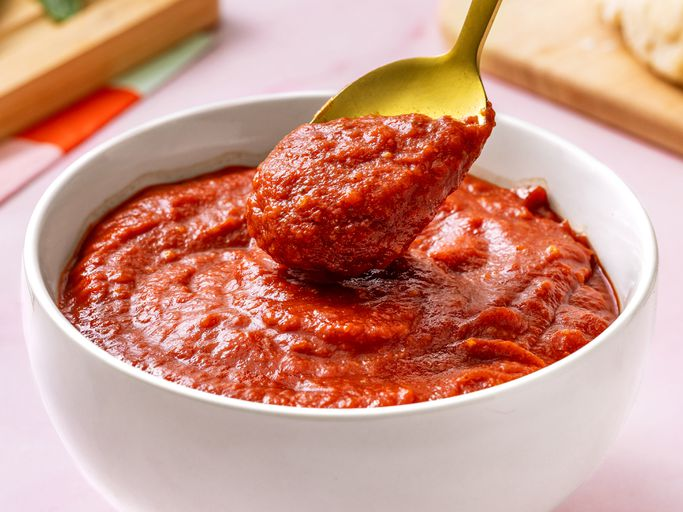
- `hang`  /hæŋ/   1. to fix something, or to be fixed at the top so that the lower part is free: Hang your coat up in the hall - I hung the washing on the line to dry   2. to kill yourself or another person by putting a rope around the neck and allowing the body to drop downwards: She was hanged for murder   `hang about; hang around` (informal) to stay somewhere with nothing special to do: My plane was late so I had to hang about in the airport all morning   `hang on` (informal) to wait for a short time: Hang on _ I'm not ready   `hang on to somebody or something` to hold somebody or something firmly: Hang on to your purse   `hang up` to end a telephone call by putting the telephone down   `hang out` to spend a lot of time in a place or with someone
- `plate`  /pleɪt/   a round dish that you put food on   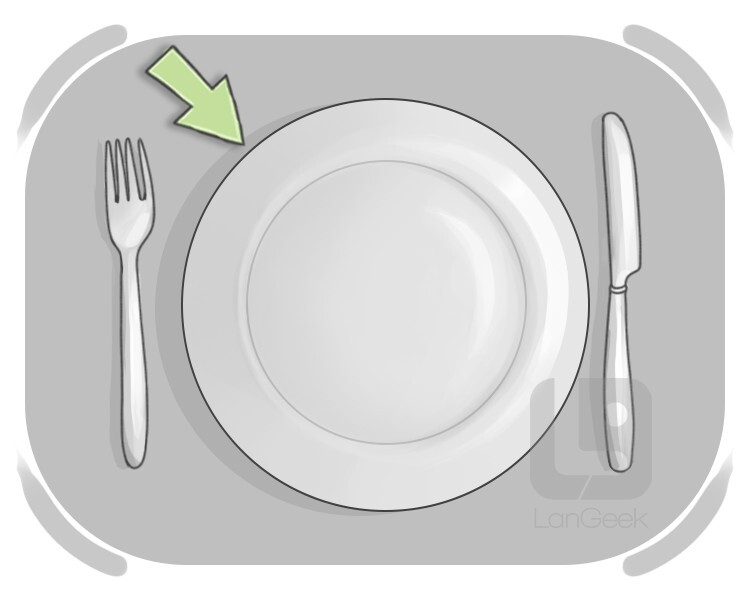
- `sense (verb)`  /sens/   to understand or feel something: I sensed that he was worried
- `meal`  /miːl/   food that you eat at a certain time of the day: What's your favourite meal of the day? - We had a nice meal in that restaurant
- `dish`  /dɪʃ/   1. a container for food. You can use a dish to cook food in an oven, or to put food on the table   2. `the dishes` (plural) all the plates, bowls, cups, etc. that you must wash after a meal: I'll wash the dishes   3. a part of a meal: We had a fish dish and a vegetarian dish
- `quest`  /kwest/   a long search for something that is difficult to find, or an attempt to achieve something difficult
- `in (preposition)`    1. a word that shows where somebody or something is: a country in Africa - He put his hand in the water - She was lying in bed   2. making all or part of something: There are 100 centimetres in a metre   3. a word that shows when something happens: My birthday is in May - He started school in 1987   4. a word that shows how long something takes: I'll be ready in ten minutes   5. a word that shows what clothes somebody is wearing: He was dressed in a suit   6. a word that shows how somebody or something is: This room is in a mess - Jenny was in tears (= she was crying) - Sit in a circle   7. a word that shows somebody's job: He's in the army   8. a word that shows in what way or in what language: Write your name in capital letters - They were speaking in French
- `in (adverb)`    1. to a place, from outside: I opened the door and went in (OPPOSITE: out)   2. at home or at work: Nobody was in when we called (OPPOSITE: out)
- `on (preposition, adverb)`    1. used for showing where something is: Your book is on the table - The number is on the door - There is a good film on TV tonight - I've got a cut on my hand   2. used for showing when: My birthday is on 6 May - I'll see you on Monday   3. used with ways of travelling and types of travel: He got on the train - I came here on foot (= walking)   4. used for showing that somebody or something continues: You can't stop here _ drive on   5. working; being used: All the lights were on (OPPOSITE: off)   6. using something: I bought it on the Internet - I was on the phone to Jania - He saw it on TV   7. about: a book on cars   8. covering your body: Put your hat on   9. happening: What's on at the cinema?   10. When somethings happens: She telephoned me on her return from New York   `on and on` without stopping: He went (= talked) on and on about his girlfriend
- `couch`    a sofa   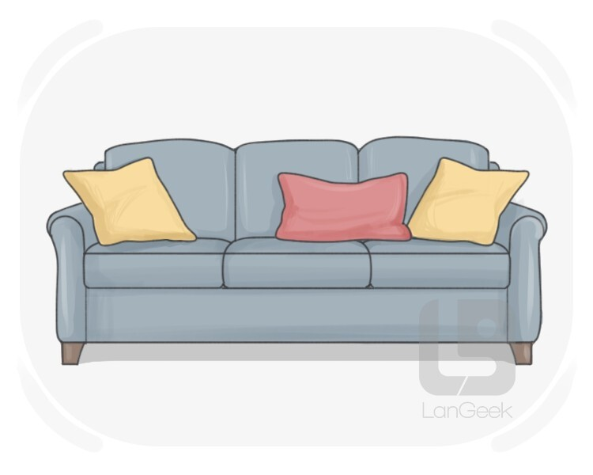
- `snack`  /snæk/   a small quick meal: We had a snack on the train
- `staff`  /stæf/   the people who work in a place: The hotel staff were very friendly
- `homesick`  /ˈhoʊmsɪk/   sad because you are away from home
- `exact`  /ɪɡˈzækt/   completely correct: We need to know the exact time the incident occurred
- `adventure`  /ədˈventʃər/   something exciting that you do or that happens to you: She wrote a book about her adventures in Africa

### Delivery (30 words)
- `tuna`  /ˈtuːnə/   1. a type of large fish that is found in warm seas   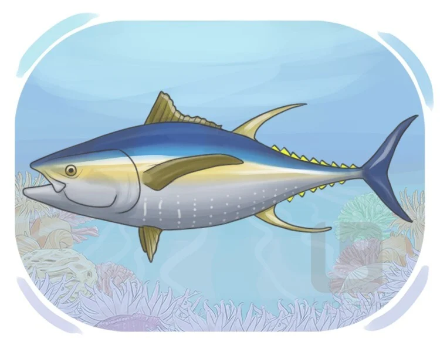   2. the meat of a large fish named tuna that lives in warm waters   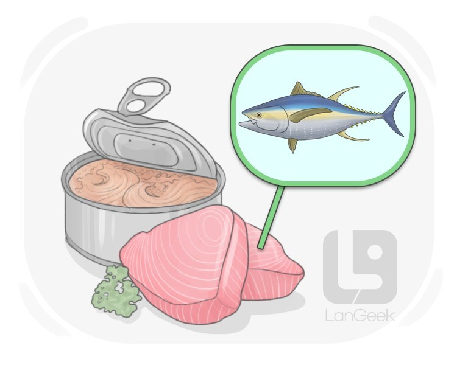
- `strawberry`  /ˈstrɔːberi/     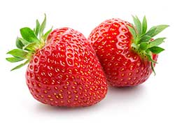
- `soda`  /ˈsoʊdə/   1. water with bubbles in it that is used for mixing with other drinks: whisky and soda   2. (American) a sweet drink with bubbles in it that is made from soda water and a fruit flavour
- `ingredient`  /ɪnˈɡriːdiənt/   one of the things that you put in when you make something to eat: The ingredients for this cake are flour, butter, sugar and eggs
- `taste (noun)`  /teɪst/   1. the feeling that a certain food or drink gives in your mouth: Sugar has a sweet taste and lemons have a sour taste - I don't like the taste of this cheese   2. the power to know about food and drink with your mouth: When you have a cold, you often lose your sense of taste   3. a little bit of food or drink: Have a taste of the fish to see if you like it   4. being able to choose nice things: She has good taste in clothes
- `taste (verb)`  /teɪst/   1. to have a certain flavour: This tastes of oranges - Honey tastes sweet   2. to feel or know a certain food or drink in your mouth: Can you taste onions in this soup?   3. to eat or drink a little of something, to test its flavour: Taste this cheese to see if you like it
- `actually`  /ˈæktʃuəli/   1. really; in fact: You don't actually believe her, do you? - I can't believe I'm actually going to Australia   2. a word that you use to disagree politely or when you say something new: I don't agree. I thought the film was very good, actually - 'Let's go out tonight' 'Actually, I'd like to stay in and watch a film'
- `different`  /ˈdɪfərənt/   is an adjective. It often goes before a noun (I have a different coat than her) or after the verb 'to be' (This test is different than last week's)
- `difference`  /ˈdɪfərəns/   is a noun. It can be a subject (The difference is noticeable in their results) or object (I can't find a difference in the photographs)
- `delicious`  /dɪˈlɪʃəs/   tasting very good; very good to eat: This soup is delicious
- `sweet (adjective)`  /swiːt/   1. containing or tasting of sugar: Honey is sweet   2. with a good smell: the sweet smell of roses   3. attractive; pretty (SAME MEANING: cute): What a sweet little girl   4. having or showing a kind character: It was sweet of you to help me
- `sausage`  /ˈsɔːsɪdʒ/     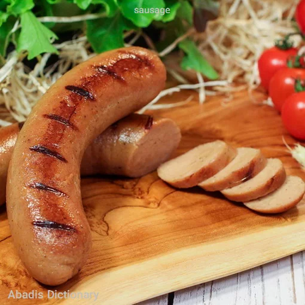
- `downtown`  /ˌdaʊnˈtaʊn/   in or towards the centre of a city, especially its main business area: She works downtown
- `pull`  /pʊl/   1. to move somebody or something strangly towards you: She pulled the drawer open   2. to go forward, moving something behind you: The cart was pulled by two horses   3. to move something somewhere: He pulled up his trousers   `pull down` to destroy a building: The old school has been pulled down   `pull in` to drive a car to the side of the road and stop: I pulled in to look at the map   `pull somebody's leg` (informal) to try to make somebody believe something that is not true, for fun: I didn't really see on elephant _ I was only pulling your leg   `pull yourself together` to control your feelings after being upset: Pull yourself together and stop crying   `pull up` to stop a car: The driver pulled up at the traffic lights   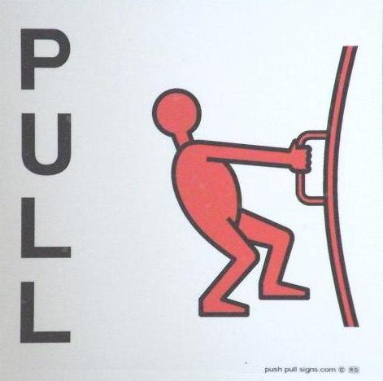
- `push`  /pʊʃ/   1. to use force to move somebody or something forward or away from you: The car broke down so we had to push it to a garage - He pushed me over   2. to press something with your finger: Push the red button to stop the bus   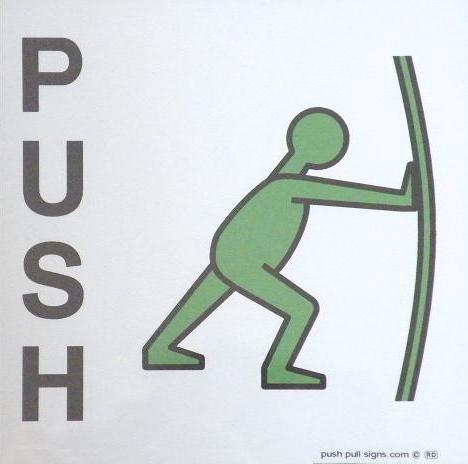
- `dessert`  /dɪˈzɜːrt/   sweet food eaten at the end of a meal: We had ice cream for dessert - dessert spoon
- `sour`  /ˈsaʊər/   1. with a sharp taste like a lemon: If it's too sour, put some sugar in it   2. Sour milk tastes bad because it is not fresh: This milk has gone sour
- `flavor`  /ˈfleɪvər/   (American) (British flavour) the taste of food: They sell 20 different flavors of ice cream   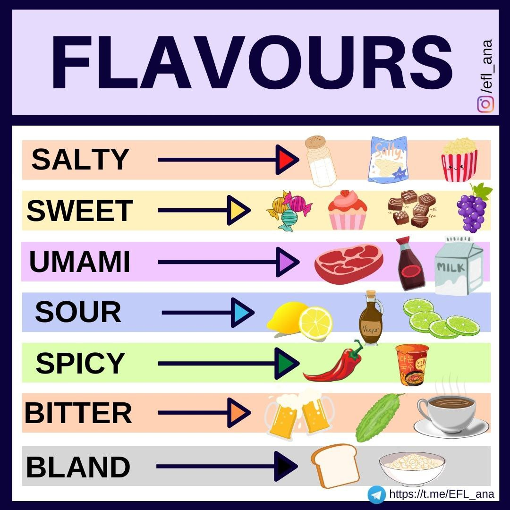
- `coconut`  /ˈkoʊkənʌt/     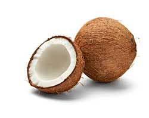
- `yogurt`  /ˈjoʊɡərt/   (also yoghurt) a thick liquid food made from milk: strawberry yogurt - Do you want a yogurt?
- `beverage`  /ˈbevərɪdʒ/   a drink, especially one that is not water (like tea, coffee, juice, or soda): Hot beverages are served in the café
- `paradise`  /ˈperədaɪs/   the place where some people think good people go after they die (SAME MEANING: heaven)
- `the tropics`  /ðə ˈtrɑːpɪks/   the part of the world where it is very hot and wet   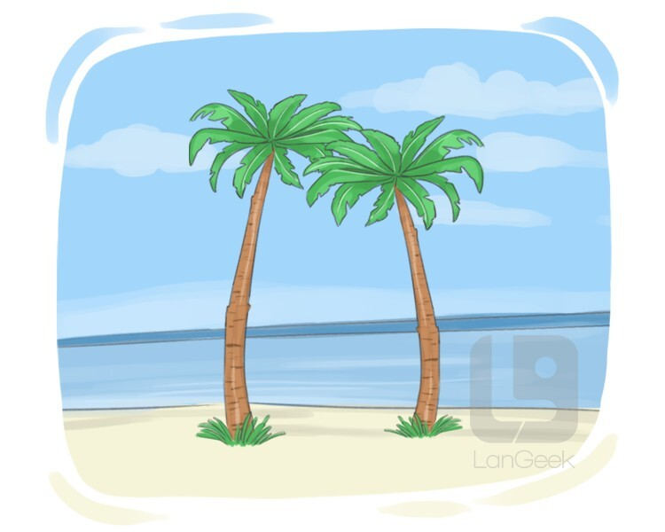
- `tropical (adjective)`  /ˈtrɑː.pɪ.kəl/   relating to or characteristic of the tropics: tropical fruit - گرمسیری
- `boba`  /ˈboʊbə/   are small, chewy balls made from tapioca. They are usually added to bubble tea (a sweet tea drink)   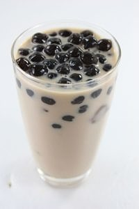
- `definitely`  /ˈdefənɪtli/   without any doubt / certainly / for sure: I'll definitely consider your advice - It's definitely the best restaurant in the town
- `grab`  /ɡræb/   to take or hold something quickly or suddenly: The thief grabbed her bag and ran away
- `already`  /ɔːlˈredi/   1. before now or before a particular time: 'Would you like some lunch?' 'No, thank you—I’ve already eaten.' - We ran to the station but the train had already left   2. now; sooner than expected: It's already 10 PM. - We've already finished the work   3. even at this point; as early as now: We can already see the results. - Starting from the right side, we already get a glimpse of what we need - قبلاً، از قبل، تا الان، تاکنون، همین حالا، از همین مرحله
- `mango`  /ˈmæŋɡoʊ/     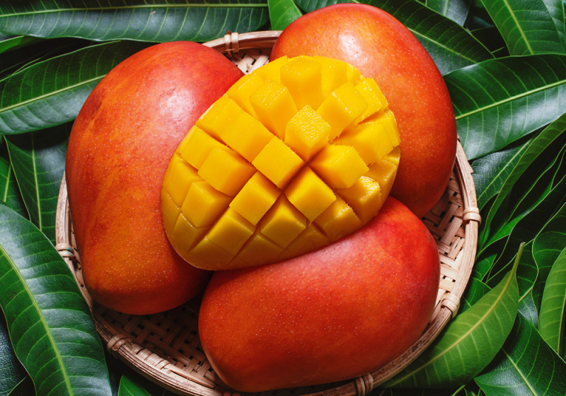
- `utensil`  /juˈtensl/   a tool or object used for a particular purpose, especially in cooking or eating like fork, spoon, and knives

### At School (37 words)
- `dorm:a home for college students  president:leader of a country`    
- `essay`  /ˈes.eɪ/   a short piece of writing about a particular subject: Our teacher asked us to write an essay on our favourite outhor
- `dorm`  /dɔːrm/   a home for college students   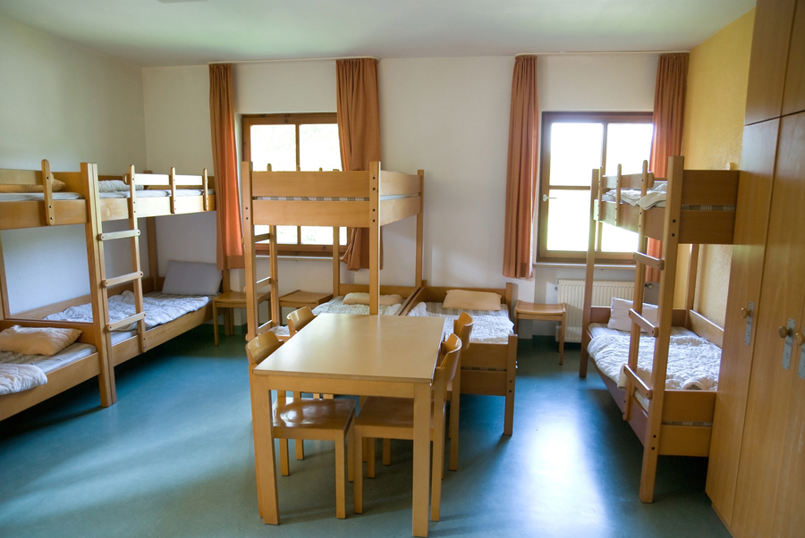
- `president`  /ˈprez.ɪ.dənt/   leader of a country
- `knock (verb)`  /nɑːk/   1. to hit something and make noise: I knocked on the door, but nobody answered   2. to hit something hard, usually by accident: I knocked my head on the door - She knocked a glass off the table   `knock somebody down; knock somebody` over to hit somebody so that they fall onto the ground: The boy was knocked down by a car   `knock something down` to break a building so that it falls down (SAME MEANING: demolish): They're knocking down old house   `knock somebody out` to make somebody fall, asleep or become unconscious: The blow knocked him out   `knock something over` to hit something so that it falls over: I knocked over a vase of flowers
- `have-to`    used for saying that somebody must do something or that something must happen: I have to go to school on Saturday mornings - We don't have to get up early tomorrow - Have we go to for this now? - We had to do lots of boring exercises
- `due`  /duː/   1. `due to` because of something; caused by something: The accident was due to bad driving   2. if something is due at a certain time, you expect it to happen or come then: When's the baby due? - The new road is due to open in April   3. if an amount of money is due, you must pay it: My rent is due at the beginning of the month   4. ready for something: My car is due for a service
- `conclusion`  /kənˈkluː.ʒən/   the final part of something: Be careful not to introduce new ideas in the conclusion of your essay
- `contest (noun)`  /ˈkɑːntest/   a game or competition that people try to win: a boxing contest
- `competition`  /ˌkɑːmpəˈtɪʃən/   a situation where people try to win or be better than others, or an event where people compete: She won first place in the competition
- `masterpiece`  /ˈmæstərpiːs/   a great work of art:This painting is masterpiece
- `loneliness`  /ˈloʊnlinəs/   feeling of being alone
- `talent`  /ˈtæl.ənt/   a natural ability to do something very well: She has a talent for drawing
- `principal (noun)`  /ˈprɪnsəpəl/   the head of a school:The principal spoke to the students
- `judge (noun)`  /dʒʌdʒ/   1. the person in a court of law who decides how to punish somebody: The judge sent him to prison for 20 years   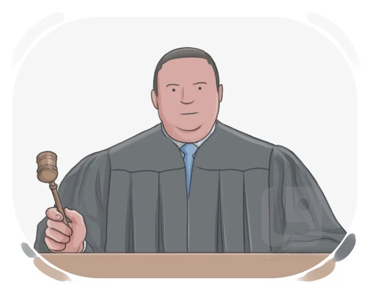   2. a person who chooses the winner of a competition
- `campus`  /ˈkæm.pəs/   the buildings of a college or university and the land that surrounds them
- `borrow (verb)`  /ˈbɑːr.oʊ/   to get or receive something from someone with the intention of giving it back after a period of time: borrow a book from the library
- `floor`  /flɔːr/   1. the part of a room that you walk on: There wasn't any chairs so we sat on the floor   2. all the rooms at the same height in a building: I live on the top floor - Our hotel room was on the sixth floor
- `assignment`    a job or piece of work that somebody is given to do: You have to complete three written assignments each term
- `die`  /daɪ/   to stop living: People, animals and plants die if they don't have water - She died of cancer
- `shrug`  /ʃrʌɡ/   to move your shoulders to show that you do not know or do not care about something: I asked her where Same was but she just shrugged
- `pretend`  /prɪˈtend/   to try to make somebody believe something that is not true: He didn't want to talk, so he pretended to be asleep - I pretended that I was enjoying myself
- `sketchbook`  /ˈsketʃbʊk/   book of plain paper for drawing on
- `horror`  /ˈhɔːrər/   a feeling of fear or shock: They watched in horror as the child ran in front of the bus   `horrer film` a film which tries to frighten or shock you for entertainment   `horrer story` a story which tries to frighten or shock you for entertainment
- `figure something/someone out`  /ˈfɪɡ.ər/   to finally understand something or someone, or find the solution to a problem after a lot of thought: Can you figure out the answer to question 5?
- `find out about something`    to get information about something because you want to know more about it, or to learn a fact or piece of information for the first time: How did you find out about the party?
- `ridiculous`  /rɪˈdɪk.jə.ləs/   so silly that it makes people laugh: I look ridiculous in this hat
- `schedule`   /ˈskedʒ.uːl/   a plan or list of times when things will happen or be done: I've got a busy schedule next week - We're behind schedule (= late) with the project - Filming began on schedule (= at the planned time)
- `yell`  /jel/   to shout loudly: Stop yelling at me
- `loud`  /laʊd/   making a lot of noise: I couldn't hear what he said because the music was too loud - loud voices - Please speak a bit louder _ I can't hear you (OPPOSITE: quiet)   `out loud` so that other people can hear it: I read the story out loud
- `loudly`  /ˈlaʊdli/   in a way that makes a lot of noise: She laughed loudly
- `lecture (noun)`  /ˈlektʃər/   a talk to a group of people to teach them about something: She gave a fascinating lecture on Islamic history
- `dining room`  /ˈdaɪnɪŋ ruːm/   a room where people eat
- `hate (verb)`  /heɪt/   to have a very strong feeling of not liking somebody or something: Most cats hate water - I hate waiting for buses (OPPOSITE: love)
- `attend`  /əˈtend/   to go to or be present at a place where something is happening: Did you attend the meeting?
- `tasty`  /ˈteɪsti/   good to eat: The soup was very tasty
- `blender`  /ˈblen.dər/   an electric machine used in the kitchen for breaking down foods or making smooth liquid substances from soft foods and liquids   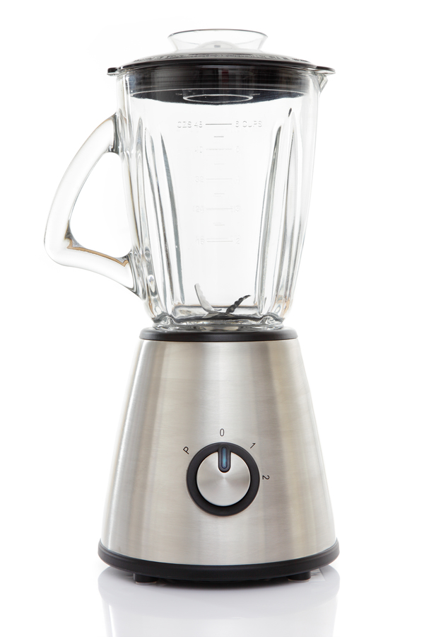

### Interview (26 words)
- `interview`  /ˈɪntərvjuː/   a meeting in which someone asks you questions to see if you are suitable for a job or course: a job interview
- `dispute`  /ˈdɪspjuːt/   an argument or disagreement between people with different ideas: There was a dispute about which driver caused the accident - اختلاف نظر
- `crowd`  /kraʊd/   a large group of people who have come together: A crowd of about 15,000 attended the concert
- `care (verb)`  /ker/   to think that somebody or something is important: The only thing he cares about is money - I don't care who wins _ I'm not interested in football   `care about someone/something` to think that something or someone is important and to feel interested in it or them: Clearly this generation is a group that cares about the environment - Your parents are only doing this because they care about you - He genuinely cares about his employees   `care to do something` to make the effort to do something: I've done this job more times than I care to remember   `care for somebody` to do the things for somebody that they need: After the accident, her parents cared for her until she was better
- `approach (verb)`  /əˈproʊtʃ/   to come near to somebody or something in distance or time: As you approach the village, you'll see a church on your right - The exams were approaching
- `church`  /tʃɜːrtʃ/   a building for Christian religious activities   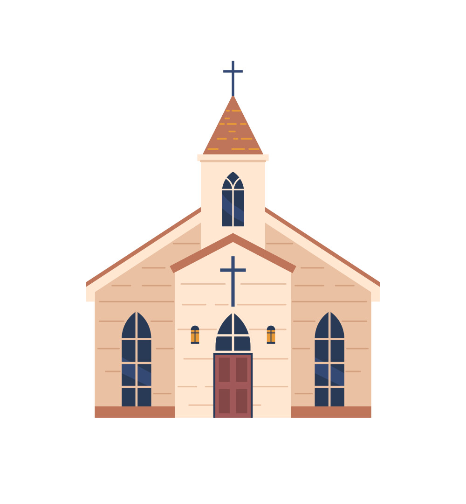
- `boring`    not interesting or exciting: The movie was so boring I fell asleep - It's boring to sit on the plane with nothing to read
- `wet`  /wet/   1. covered in water or another liquid: a wet umbrella - wet hair   2. with a lot of rain: a wet day (OPPOSITE: dry)
- `receptionist`  /rɪˈsep.ʃən.ɪst/   a person who works in a place such as a hotel, office, or hospital, who welcomes and helps visitors and answers the phone
- `hospital`  /ˈhɑ:s.pɪtl/     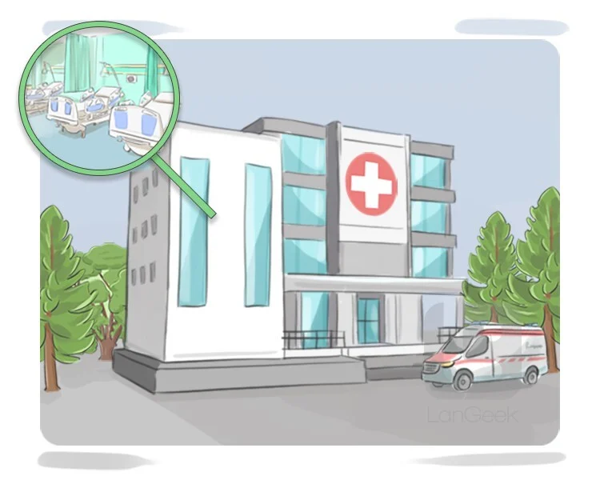
- `jog`  /dʒɑːɡ/   1. to run slowly for exercise: I jogged round the park - I go jogging every morning   2. to push or touch something a little, so that it moves: She jogged my arm and I spilled my drink
- `coach`    someone whose job is to teach people to improve at a sport, skill, or school subject: a tennis/maths coach   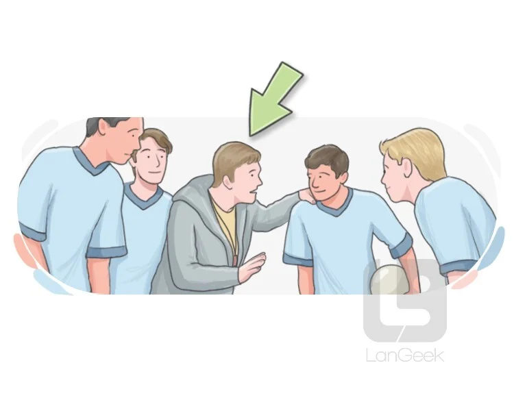
- `positive`  /ˈpɑː.zə.t̬ɪv/   1. thinking or talking about the good parts of a situation: It's important to stay positive - The teacher was very positive about my work (OPPOSITE: negative)   2. completely certain (SAME MEANING: sure): Are you positive that you closed the door?
- `actor`  /ˈæktər/   a man or woman who acts in plays, films or television programmes - بازیگر
- `act (verb)`  /ækt/   1. to do something, or to behave in a certain way: Doctors acted quickly to save the boy's life after the accident - Stop acting like a child   2. to pretend to be somebody else in a play film or television programme (SAME MEANING: perform)   `act as something` to do the job of another person, usually for a short time: He acted as a manager while his boss was ill
- `adult`  /ˈædʌlt/   a person or an animal that has grown to the full size; not a child: Adults as well as children will enjoy this film
- `as`    1. while something else is happening: just as I was leaving the house, the phone rang   2. `as ... as` words that you use to compare people or things; the same amount: Paul is as tall as his father - I haven't got as many clothes as you have - I'd like it done as soon as possible   3. used to say that somebody or something has a particular job or purpose: She works as a secretary for a big company - I used my shoe as a hammer   4. in the same way: Please do as I tell you   5. because: As she was ill, she didn't go to school
- `airline`    a company that takes people or things to different places by plane: Which airline are you flying with?
- `lie (verb)`  /laɪ/   1. to say something that you know is not true: He lied about his age. He said he was 16 but really he's 14 - Don't ever lie to me again (A person who lies is a liar)   2. (of a person or animal) to be in a resting position on a flat surface, not standing or sitting: Lin is lying on Bea's couch
- `salary`  /ˈsæləri/   money that you receive every month for the work that you do
- `confident`  /ˈkɑːnfɪdənt/   sure that you can do something well, or that something will happen: I'm confident that our team will win
- `airport`    a place where people get on and off planes, with buildings where passengers can wait: I'll meet you at the airport
- `sign (verb)`  /saɪn/   to write your name in your own way on something: Sign here, please - I signed the cheque (The noun is signature)
- `strange`  /streɪndʒ/   1. unusual or surprising: Did you hear that strange noise?   2. that you do not know: We were lost in a strange town
- `mystery`  /ˈmɪstəri/   something strange that you cannot understand or explain: The police say that the man's death is still a mystery
- `keep`    1. to stay in a particular state or condition: Keep still (= don't move) _ while I take your photo - We tried to keep warm   2. to make somebody or something stay in a particular state or condition: Keep this door closed - I'm sorry to keep you waiting   3. to continue to have something: You can keep that book _ I don't need it   4. to put or store something in a particular place Where do you keep the caffee?   5. to continue doing something; to do something many times: Keep driving until you see the cinema, then turn left - She keeps forgetting my name   6. to look after and buy food and other things for a person or an animal: It costs a lot to keep a family of four - They keep sheep and pigs on their farm   7. to stay fresh: Will this fish keep until tomorrow?   `keep away from somebody or something` to not go near somebody or something: Keep away from the river, children   `keep somebody from doing something` to stop somebody from doing something: You can't keep me from going out   `keep going` to continue: I was very tierd but I kept going to the end of the race   `keep off something` to not go on something: Keep off the grass   `keep on doing something` to continue doing something; to do something many times: We kept on driving all night - That man keeps on looking at me   `keep out` to stay outside: The sign on the door said 'Danger, Keep out!'   `keep somebody or something out` to stop somebody or something from going in: We put a fence round the garden to keep the sheep out   `keep up with somebody or something` to go as fast as another person or thing so that you are together: Don't walk so quickly _ I can't keep up with you

### Chores (39 words)
- `chore`  /tʃɔːr/   a routine task, especially a household one
- `regular`  /ˈrɛ.gjʊ.lər/   1. happening again and again with the same amount of space or time between: a regular heartbeat - A light flashed at regular intervals (OPPOSITE: irregular)   2. going somewhere or doing something often: I've never seen him before _ he's not one of my regular customers   3. usual: Who is your regular doctor?
- `garbage`  /ˈɡɑːr.bɪdʒ/   (Brithis: rubbish) - زباله
- `messy`  /ˈmes.i/   1. untidy or dirty: a messy kitchen   2. Painting is a messy job
- `untidy`  /ʌnˈtaɪ.di/   not tidy; not with everything in the right place (SAME MEANING: messy): Your room is always so untidy
- `dirty`  /dɜr:ti/   not clean: Your hands are dirty _ go and wash them (OPPOSITE: clean)
- `dust`  /dʌst/   dry dirt that is like powder: The old table was covered in dust
- `shelf`  /ʃelf/   a long flat piece of wood on a wall or in a cupboard, where things can stand: Put the plates on the shelf - bookshelves   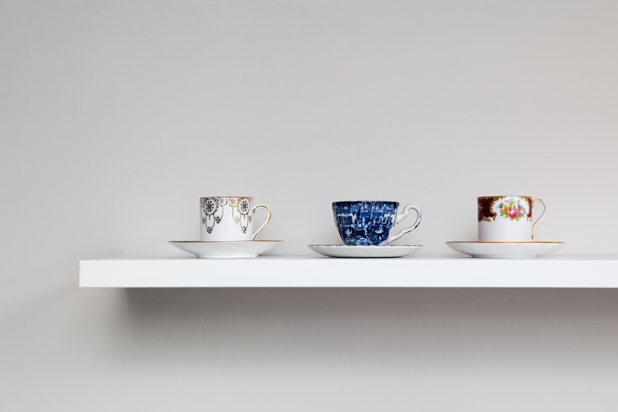
- `piece`  /piːs/   1. a part of something: Would you like another piece of cake? - a piece of broken glass   2. one single thing: Have you got a piece of paper - That's an interesting piece of news   3. a coin: a 50p piece   `fall to pieces` to become very old and in bad condition; to break: The chair fell to pieces when I sat on it   `in pieces` broken: The teapot lay in pieces on the floor   `take something to pieces` to divide something into its parts: I took the bed to pieces because it was too big to go through the door   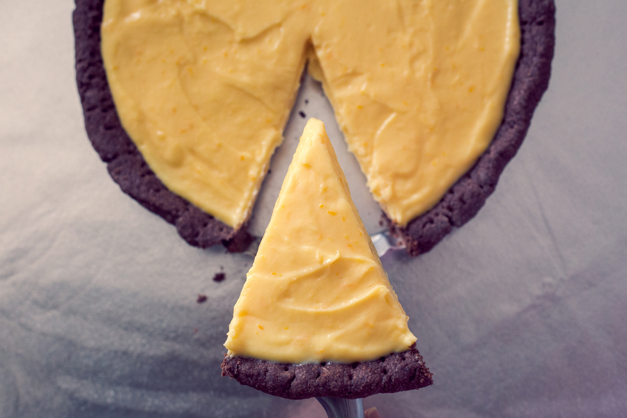
- `divide`  /dɪˈvaɪd/   1. to share or cut something into smaller parts: The teacher divided the class into groups of three - The book is divided into ten chapters   2. to go into parts: When the road divides, go left   3. to find out how many times one number goes into a bigger number: 36 divided by 4 is 9 (36 ÷ 4 = 9)
- `bookshelf`      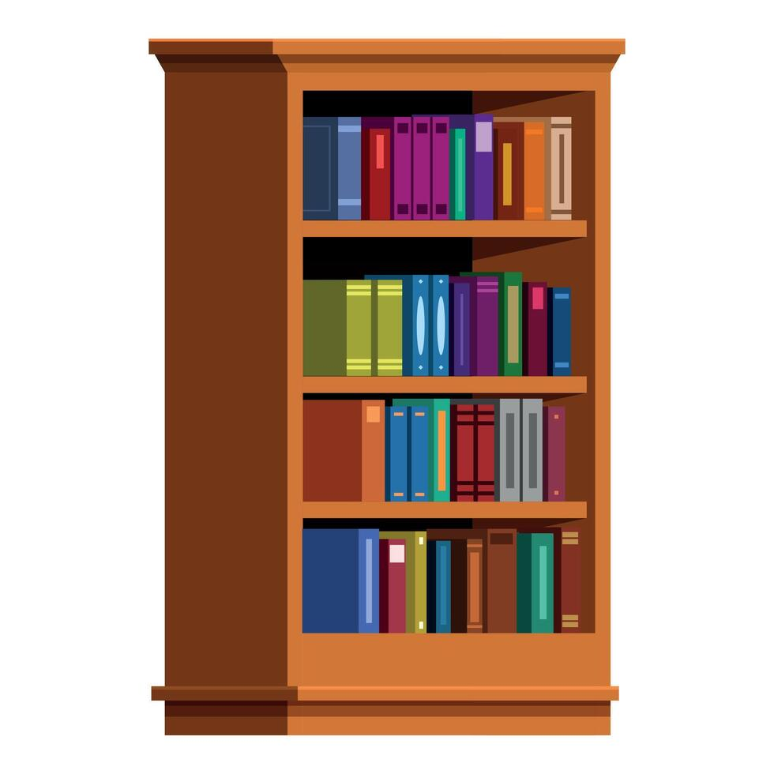
- `inspection`  /ɪnˈspek.ʃən/   the act of looking at something carefully, or an official visit to a building or organization to check that everything is correct and legal
- `inspector`  /ˌɪns.pɛk.tɜr/   1. a person whose job is to see that things are done correctly: a factory inspector   2. a police officer
- `bored`  /bɔːrd/   not interested; unhappy because you have nothing interesting to do: I'm bored with this book - The children were bored stiff
- `dumpster`  /ˈdʌmp.stər/   a very large container for rubbish (= garbage)   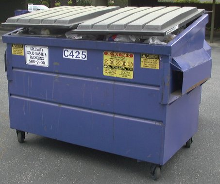
- `closet`  /ˈklɑː.zət/   a space in a wall with a door that reaches the ground, used for storing clothes, shoes, etc.: a walk-in closet   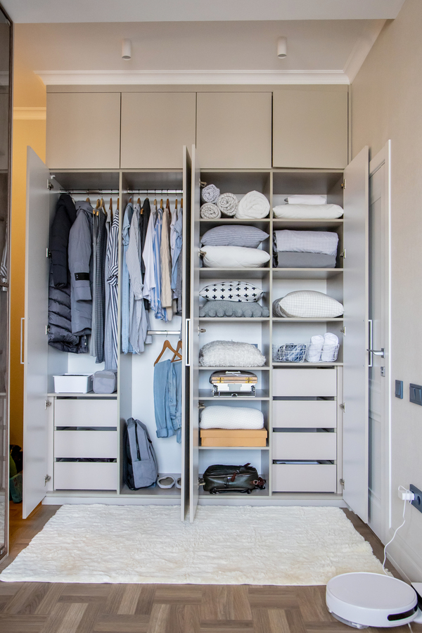
- `mop`  /mɑːp/   a thing with a long handle that you use for washing floors   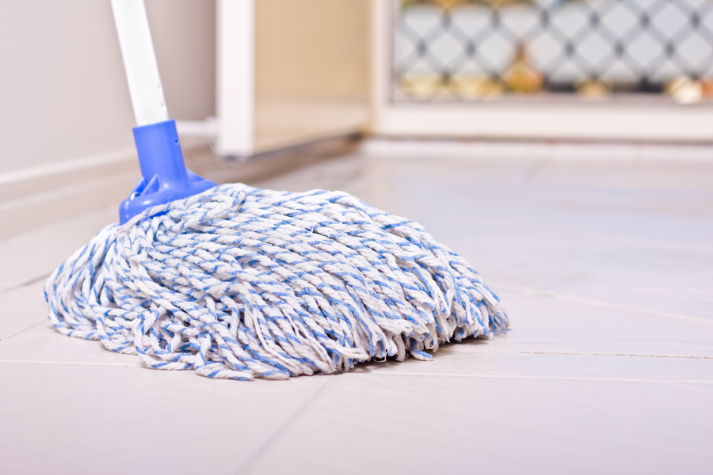
- `either (adverb)`  /ˈi.ðər/   (used in sentences with 'not') also: Lydia can't swim and I can't either   `either ... or` used to show two different things or people that you can choose (examples: You can have either tea or coffee. / I will either write or telephone.)
- `audition`  /ɑ.ˈdɪ.ʃən/   a test to show your talent
- `household`    related to the home
- `scrub`  /skrʌb/   to rub something hard to clean it, usually with a brush and soap and water: He scrubbed the floor   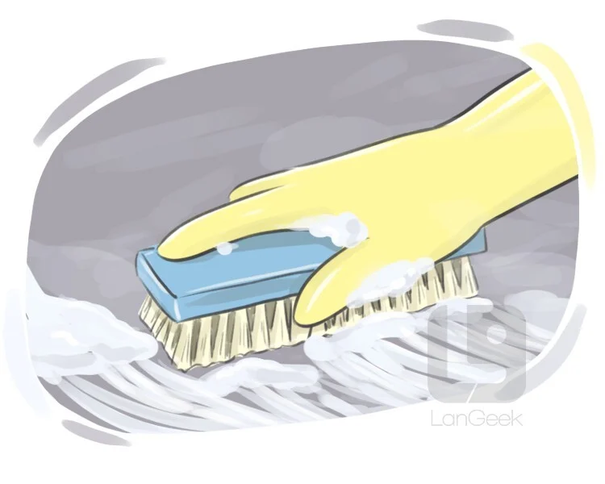
- `rub`  /rʌb/   to move something backwards and forwards on another thing: I rubbed my hands together to keep them warm - The cat rubbed its head against my leg   `rub something out` to take writing or marks off something by using a rubber or a cloth: I rubbed the word out and wrote it again
- `towel`  /taʊəl/   a piece of cloth or paper that you use for drying your body or things such as dishes   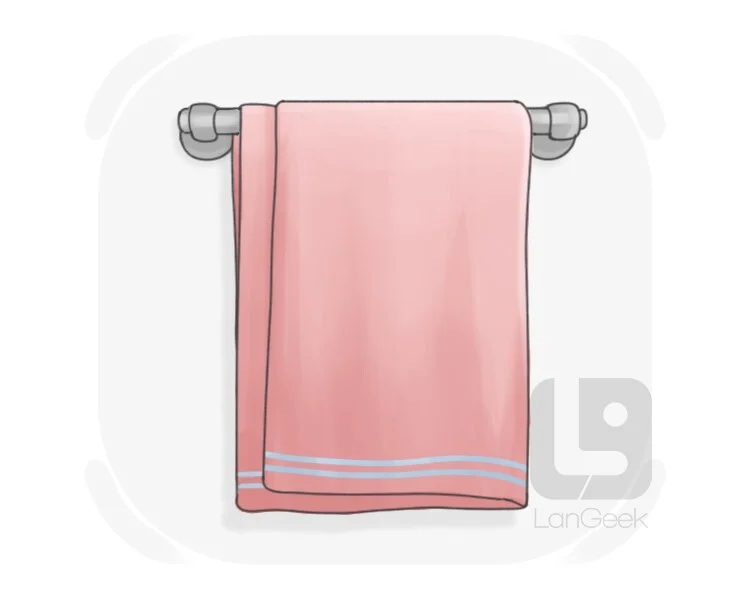
- `rug`  /rʌɡ/   something we use to cover or decorate a part of the floor that is usually made of thick materials or animal skin   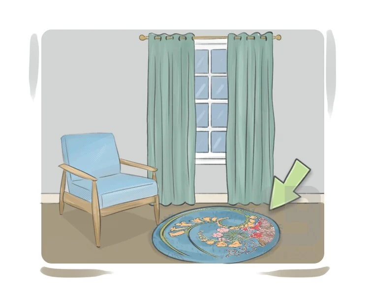
- `thick`  /θɪk/   1. far from one side to the other: The walls are very thick - It's cold outside, so wear a thick coat (OPPOSITE: thin)   2. You use thick to say or ask how far something is from one side to the other: The ice is six centimetres thick   3. with a lot of people or things close together: thick dark hair   4. if a liquid is thick, it does not flow easily: This paint is too thick (OPPOSITE: thin)   5. difficult to see through: thick smoke
- `vacuum`  /ˈvæk.juːm/   a machine for cleaning   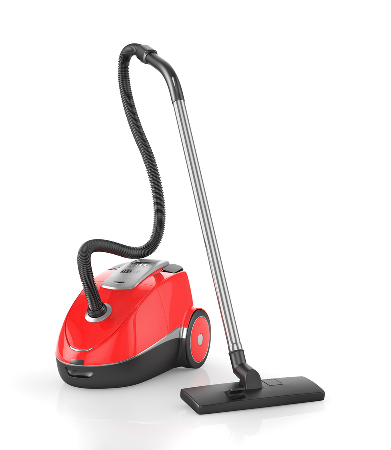
- `vase`  /veɪs/   a container for flowers   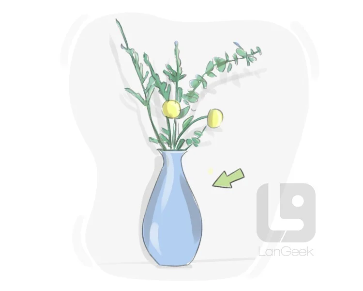
- `spill`  /spɪl/   drop; if you spill a liquid, it flows out of something by accident: I've spilt my coffee   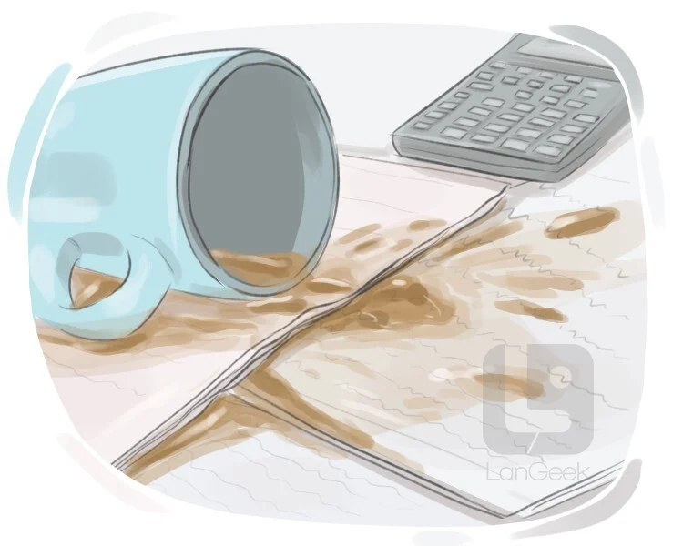
- `disaster`  /dɪ.zæs.tər/   a very bad event
- `stain`  /steɪn/   a colored patch or dirty mark that is difficult to remove   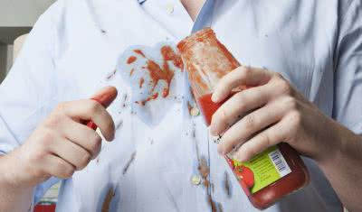
- `pot`  /pɒt/   1. a container for cooking   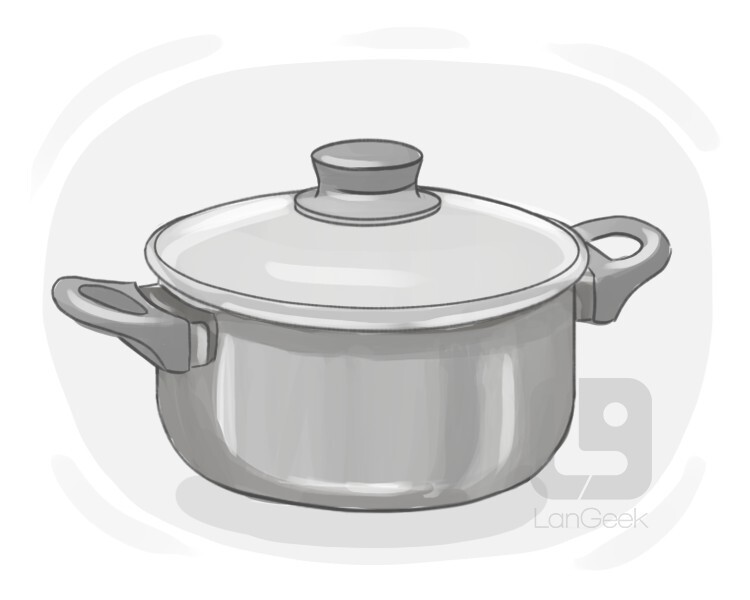   2. a container that you use for a special thing: a teapot - a pot of paint - a plant pot
- `make`    1. to produce or create something: They make cars in that factory - He made a box out of some pieces of wood - This shirt is made of cotton   2. to cause something to be or to happen; to produce something: The plane made a loud noise when it landed - Chocolate makes you fat - That film made me cry - I made a mistake   3. to force somebody to do something: My father made me stay at home   4. to choose somebody to do a job: They made him President   5. a word that you use with money, numbers and time: She makes (= earns) a lot of money - Five and seven make twelve - 'What's the time?' 'I make it six o'clock'   6. to be able to go somewhere: I'm afraid I can't make the meeting on Friday   `make do with something` to use something that is not very good, because there is nothing better: We didn't have a table, but we made do with some boxes   `make something into something` to change something so that it becomes a different thing: They made the bedroom into an office   `make something or somebody out` to be able to see, hear or understand something or somebody: It was dark and I couldn't make out the words on the sign   `make something up` to tell somebody something that is not true (SAME MEANING: invent): Nobody believes that story _ he made it up   `make up` to become friends again after an argument: Jane and Tom had an argument last week, but they've made up now - Has she made up with him yet? (OPPOSITE: fall out with somebody)   `make a friend` to start to have someone as a friend: I've made a lot of friends in this job
- `blanket`  /ˈblæŋ.kɪt/   covers for keeping warm   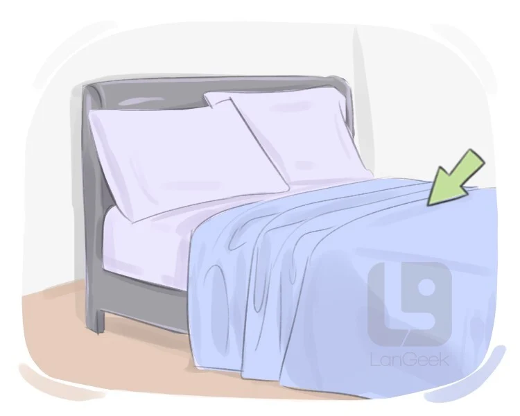
- `stove`  /stoʊv/   a device for cooking food   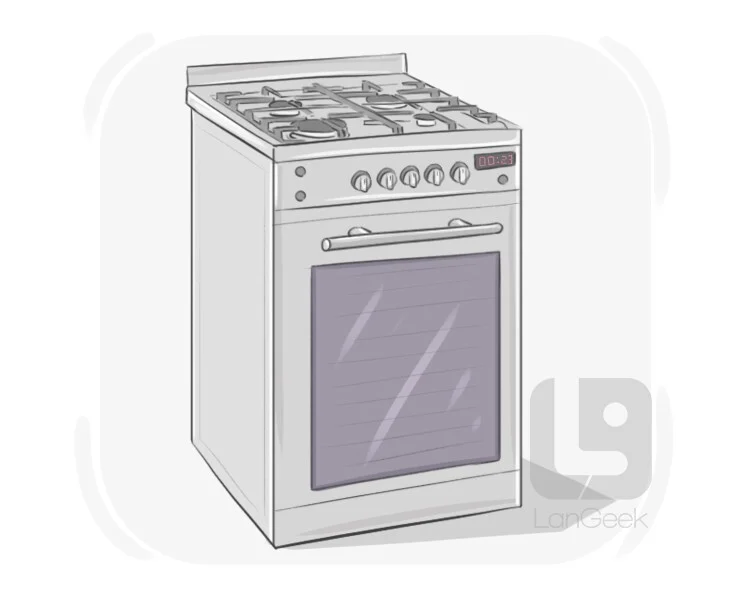
- `corner`  /ˈkɔr.nɜr/   where two walls meet   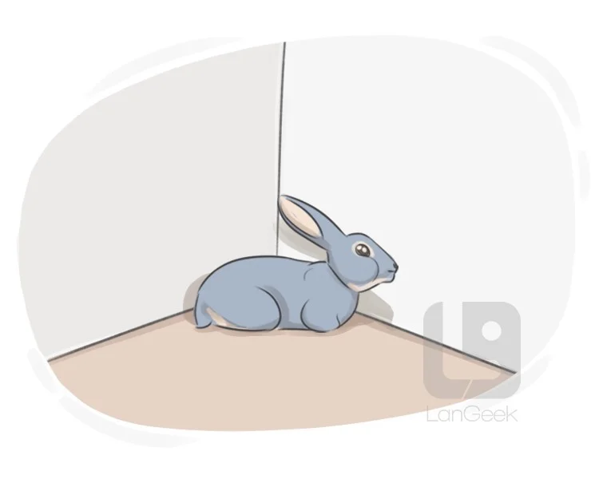
- `trouble`  /ˈtrʌb.əl/   problems or difficulties
- `glove`  /ɡlʌv/   a thing that you wear to keep your hand warm or safe   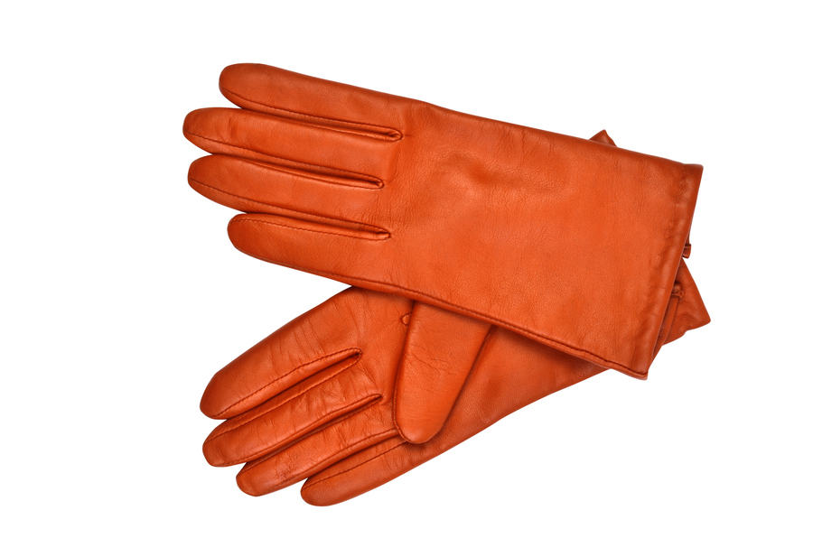
- `genius`  /ˈdʒiː.ni.əs/   a very smart person
- `roommate`  /ˈruːm.meɪt/   a person who you share a room with for a period of time: Jean was my roommate during our first year at college

### Meeting (41 words)
- `cushion`  /ˈkʊʃ.ən/     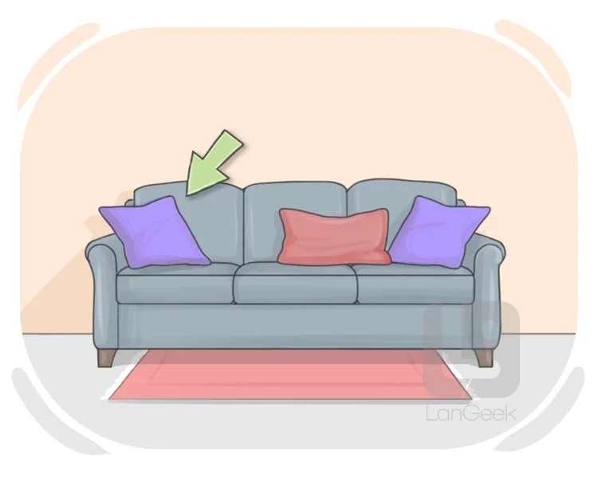
- `furniture`  /fɜr:nɪʧər/   مبلمان   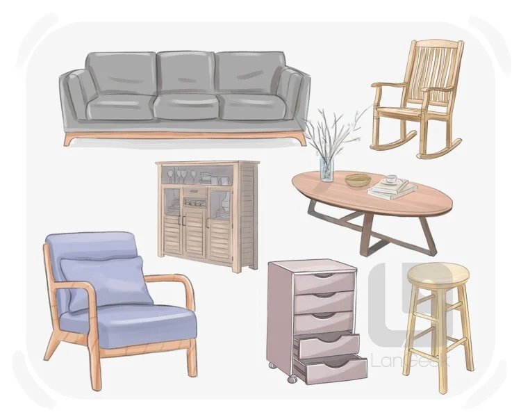
- `date (noun)`  /deɪt/   1. the number of the day, the month and sometimes the year: 'What's the date today?' 'The first of February' - Today's date is 11 December 2004 - What is your date of birth?   2. a romantic meeting when two people go out somewhere: He's asked her out on a date   3. a small sweet brown fruit that comes from a tree which grows in hot countries   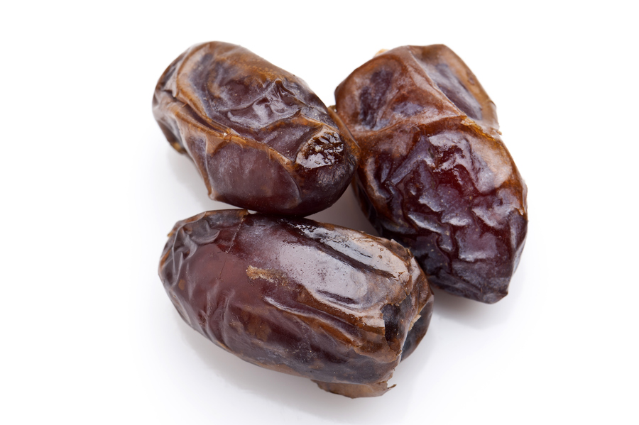   `out of date` 1. not modern: The machinery they use is completely out of date   2. too old, so that you cannot use it: This ticket is out of date   `up to date` 1. modern: The new kitchen will be right up to date, with all the latest gadgets   2. with the newest information: Is this list of names up to date?
- `coworker`  /koʊ.wɜ:r.kər/   someone who works with someone else, having the same job
- `sick`  /sɪk/   not well (SAME MEANING: ill)
- `colleague`  /ˈkɑː.liːɡ/   work friend
- `compete`  /kəmˈpiːt/   to try to win a race or a competition
- `outfit`  /ˈaʊt.fɪt/   a set of clothes
- `disbelief`  /ˌdɪs.bɪˈliːf/   the feeling of not being able to believe that something is true or real
- `greatness`  /ˈɡreɪt.nəs/   being very good or important
- `curtain`  /ˈkɜr.tən/   a piece of cloth that you can move to cover a window: Could you draw the curtains (= open or close the curtains), please?   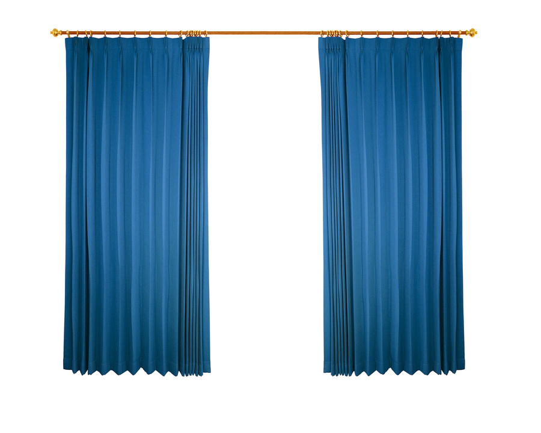
- `bark (verb)`  /bɑːrk/   if a dog barks, it makes short loud sounds: The dog always barks at people it doesn't know
- `pajamas`  /pəˈdʒɑː.məz/   clothes worn in bed   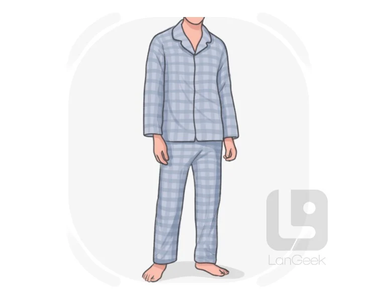
- `few`  /fjuː/   not many: Few people live to the age of 100 - There are fewer buses in the evenings - Few of the players played well   `a few` some, but not many: Only a few people came to the meeting - I have read a few of her books   `quite a few` quite a lot: It's been quite a few years since I saw him last
- `remind`  /rɪˈmaɪnd/   1. to help somebody remember something that they must do: Please remind me to buy some bread on the way home   2. to make somebody remember somebody or something: She reminds me of her mother
- `spot (noun)`    1. a small round mark: a blue dress with green spots   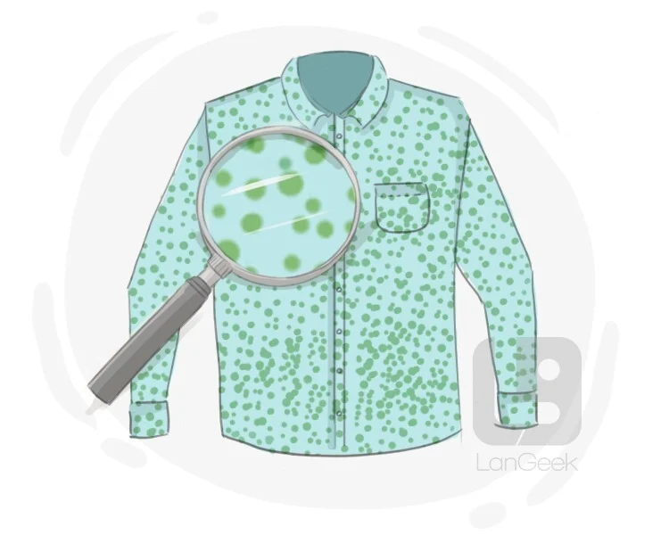   2. (British) a small red mark on your skin: A lot of teenagers get spots on their faces   3. a place: This is a good spot for a picnic
- `reliable`  /ri:.laɪə.bəl/   that you can trust: My car is very reliable - He is a reliable person (OPPOSITE: unreliable)
- `admit`  /əd.ˈmɪt/   1. to say that you have done something wrong or that something bad is true: He admitted stealing the money - I admit that I made a mistake (OPPOSITE: deny)   2. to allow somebody or something to go into a place: This ticket admits one person to the museum - اعتراف کردن
- `suppose`  /səˈpoʊz/   1. to think that something is probably true or will probably happen: 'Where's Jenny?' 'I don't know _ suppose she's still at work   2. a word that you use when you agree with something but are not happy about it: 'Can I borrow your pen?' 'Yes, I suppose so _ but don't lose it   `be supposed to` if you are supposed to do something, you should do it: They were supposed to meet us here - You're not supposed to smoke in this room   2. (informal) if something is supposed to be true, people say it is true: This is supposed to be a good restaurant
- `storm`  /stɔːrm/   bad weather with rain and wind
- `scary`  /ˈsker.i/   makes you feel afraid
- `hike`  /haɪk/   long walks in nature
- `sweater`  /ˈswɛ.tər/   heavy shirt for cold weather
- `dry`  /draɪ/   1. with no water or liquid in it or on it: The washing isn't dry yet (OPPOSITE: wet)   2. with no rain: dry weather (OPPOSITE: wet)   3. not sweet: dry white wine
- `cool (adjective)`  /kuːl/   1. a little cold; not hot or warm: cool weather - I'd like a cool drink   2. not excited or angry (SAME MEANING: calm)   3. (informal) very good or fashionable: Those are cool shoes you're wearing   4. (informal) People say Cool! to show that they think something is a good idea: 'We're planning to go out for lunch tomorrow' 'Cool! (verb)'
- `thunder`  /ˈθʌn.dər/   a loud sound in a storm   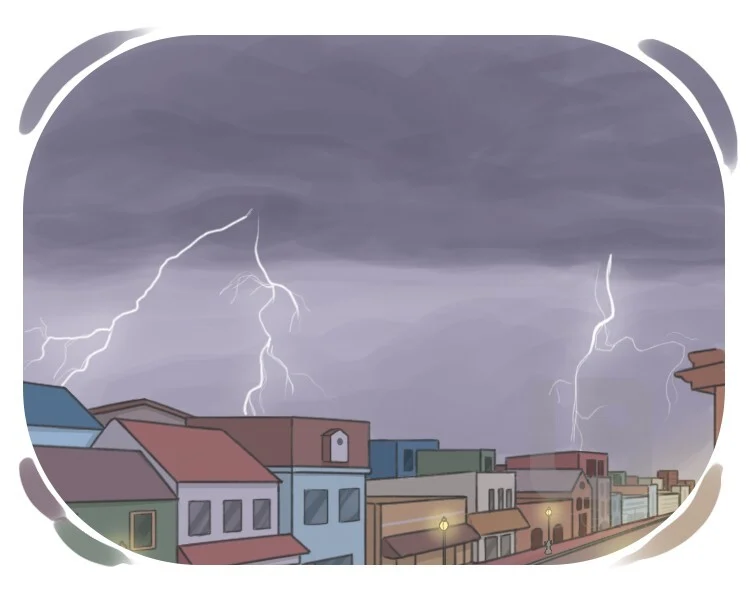
- `hard`    1. a lot: She works very hard - You must try harder   2. strongly: It's raining hard - She hit him hard
- `practice`  /ˈpræk.tɪs/   doing something many times so that you will do it well
- `glacier`  /ˈgleɪ.ʃɜr/   a large river of ice that moves slowly down a mountain   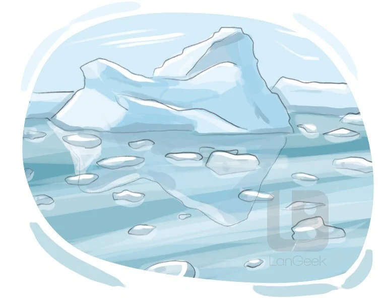
- `cave`  /keɪv/   a large hole in the side of a mountain or under the ground: Thousands of years ago, people lived in caves   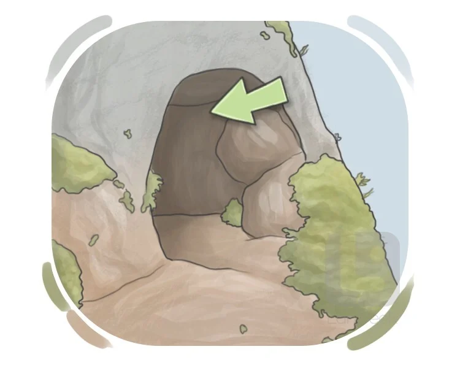
- `agenda`  /əˈdʒen.də/   a list of all the things to be talked about in a meeting
- `counter`  /ˈkaʊn.tər/   1. a long high table in a shop, bank or bar, that is between the people who work there and the customers: The man behind the counter in the bank was very helpful   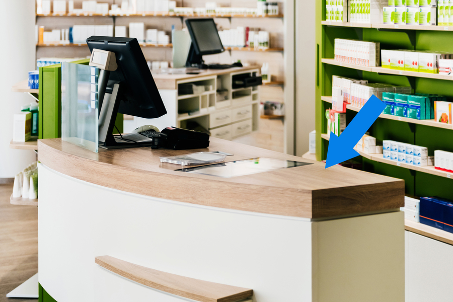   2. a small round thing that you use when you play some games
- `sigh (verb)`  /saɪ/   to let out a deep breath, for example because you are sad, tired or pleased
- `proud`  /praʊd/   very happy about someone's success: You must be very proud of your son - I'm very proud to have been involved in this project   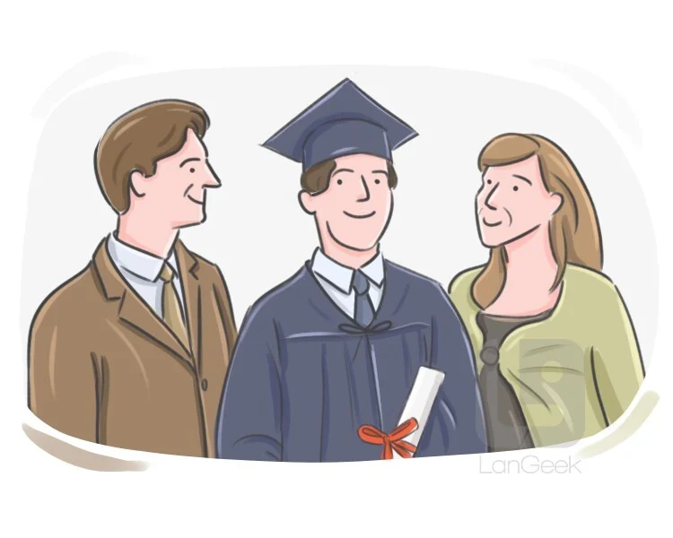
- `pleasure`  /ˈplɛ.ʒər/   1. the feeling of being happy or enjoying something: She gets a lot of pleasure from her music   2. something that makes you happy: It was a pleasure to meet you   `it's a pleasure` You say 'it's a pleasure' as a polite way of answering somebody who thanks you: 'Thank you for your help' 'It's a pleasure'   `with pleasure` You say 'with pleasure' to show in a polite way that you are happy to do something: 'Can you help me move these boxes?' 'Yes, with pleasure'
- `satisfaction`  /ˌsæ.tɪs.ˈfæk.ʃən/   being pleased with what you or other people have done: She looked at the finished painting with satisfaction
- `pleased`  /pliːzd/   happy or satisfied: He wasn't very pleased to see me - Are you pleased with your new watch?
- `satisfied`  /ˈsæt̬.ɪs.faɪd/   pleased because you have had or done what you wanted: The teacher was not satisfied with my work
- `annoyed`  /ə.ˈnɔɪd/   feeling a little angry
- `ruin`  /ˈruːɪn/   to damage something badly so that it is no longer good; to destroy something completely: I spilled coffee on my jacket and ruined it - The rain ruined our picnic
- `awful`  /ˈɑː.fəl/   very bad: The pain was awful - What awful weather

### Reunion (34 words)
- `reunion`  /ˌriːˈjuː.njən/   a social event for a group of people who have not seen each other for a long time: We're having a family reunion next week - The college has an annual reunion for former students
- `annual`  /ˈæn.ju.əl/   happening once every year: an annual event/visit/holiday
- `contact (noun)`  /ˈkɑːn.tækt/   meeting, talking to or writing to somebody: Until Jane went to school, she had little contact with other children - Are you still in contact with the people you met on holiday? - Doctors come into contact with (= meet) a lot of people
- `spotless`  /ˈspɑːt.ləs/   absolutely clean or pure
- `exhausted`  /ɪɡˈzɑː.stɪd/   very tired
- `festival`  /ˈfes.tə.vəl/   1. a series of public events, for example concerts and shows, in one place: the Cannes Film Festival   2. a time when people celebrate something, especially a religious event: Christmas is an important Christian festival
- `graduation`  /ˌɡrædʒ.uˈeɪ.ʃən/   finishing a degree or other course of study at a university or school
- `hair`  /her/     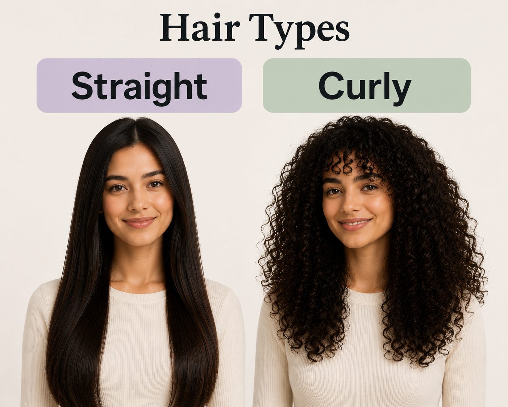
- `tie (noun)`  /taɪ/   a piece of cloth worn around the neck   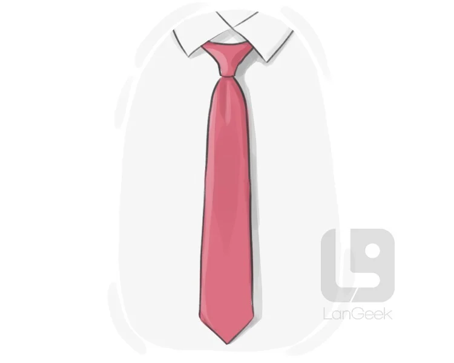
- `impress`  /ɪmˈpres/   to make somebody admire and respect you: We were very impressed by your work
- `admire`  /ədˈmaɪr/   to think or say that somebody or something is very good: I really admire you for doing such a difficult job - They were admiring the view from the top of the tower
- `cartwheel`  /ˈkɑːrt.wiːl/   a fast, skilful movement like a wheel turning, in which you throw yourself sideways onto one hand, then onto both hands with your legs and arms straight and your legs pointing up, before landing on your feet again   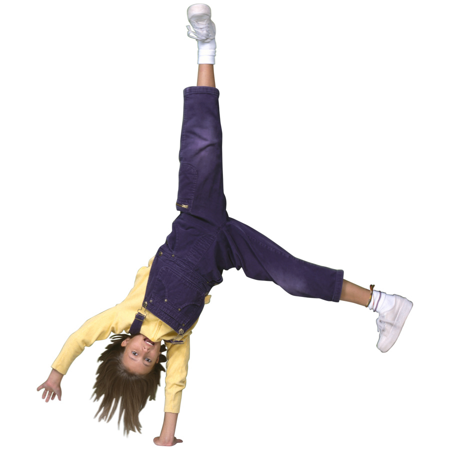
- `polite`  /pəˈlaɪt/   showing good manners and respectful behavior towards others; speaking or behaving in a way that shows respect: it is polite to say 'please' when you ask for something (OPPOSITE: impolite, rude)
- `memorable`    easy to remember because it is special in some way: Their wedding was a very memorable day
- `wedding`  /ˈwed.ɪŋ/   the time when a man and a woman get married: Billy and Elena invited me to their wedding - She wore a long white wedding dress
- `outgoing`  /ˈaʊt.ɡoʊ.ɪŋ/   (of a person) friendly and energetic and finding it easy and enjoyable to be with others; enjoys making new friends
- `bald`  /bɑːld/   with little or no hair on the head   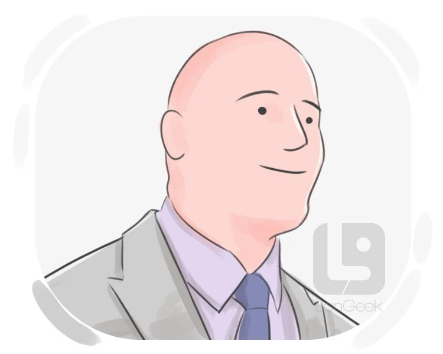
- `handsome`  /ˈhæn.səm/   (of a man) having an attractive face and body   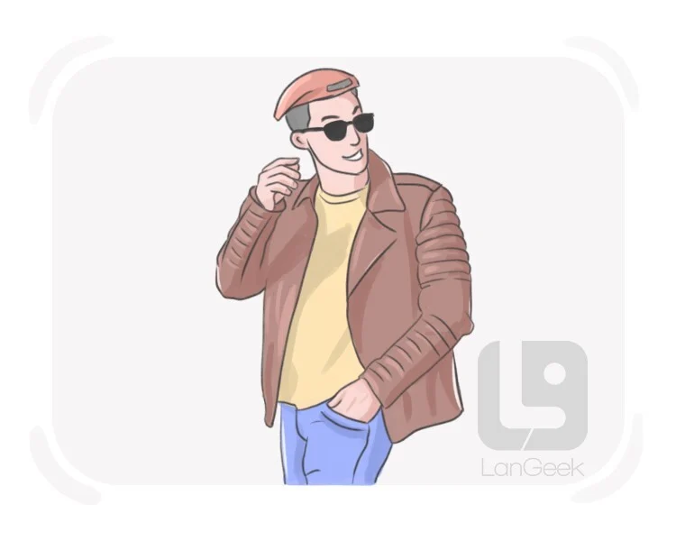
- `bean`  /bi:n/   small seed you can eat   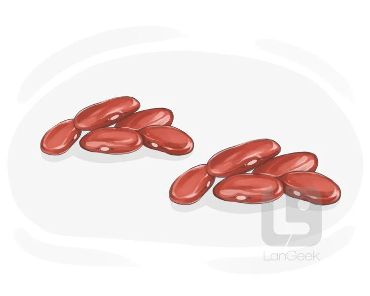
- `chew`  /tʃuː/   to use your teeth to break up food in your mouth when you are eating: This meat is difficult to chew
- `obviously`  /ˈɑːb.vi.əs.li/   clearly or without a doubt
- `entirely`  /ɪnˈtaɪr.li/   completely: I entirely agree with you
- `cheers`  /tʃɪrz/   expressing good wishes before drinking   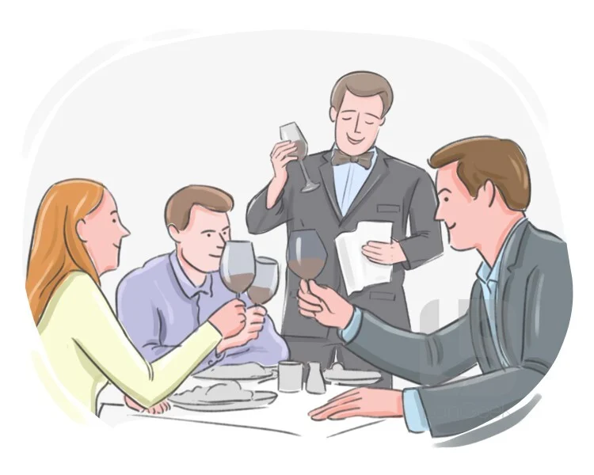
- `champagne`  /ʃæm.ˈpeɪn/   a type of fizzy wine made originally in France, often drunk to celebrate an event   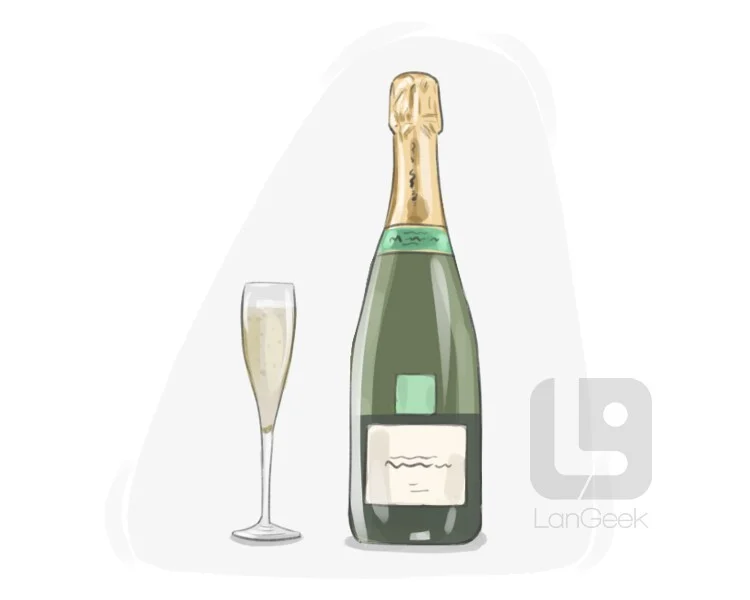
- `equipment`  /ɪˈkwɪp.mənt/   tools or machines for a purpose
- `gig`    a live performance by a musician or group playing popular or jazz music   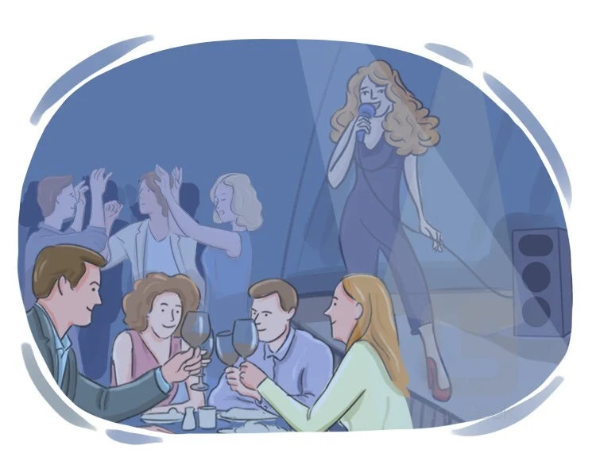
- `bar`  /bɑːr/   a place to drink alcohol
- `turntable`  /ˈtɜrn.ˌteɪ.bəl/   a circular surface on a record player on which the record is played   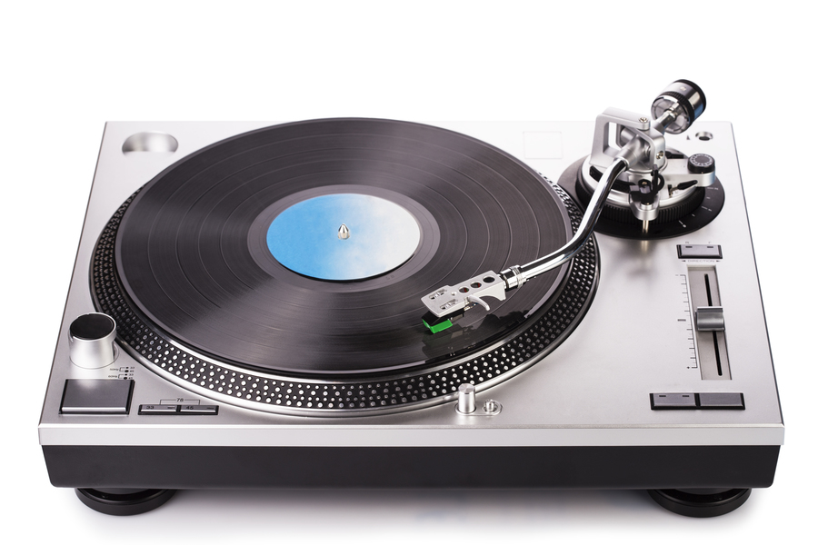
- `exclusively`  /ɪksˈkluː.sɪv.li/   only
- `shame`  /ʃeɪm/   an uneasy feeling that we get because of our own or someone else's mistake or bad manner   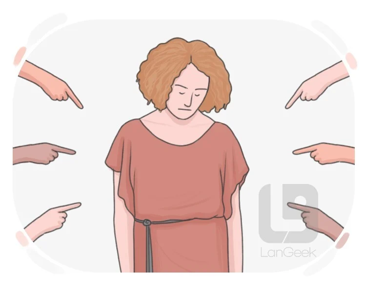
- `critic`  /ˈkrɪ.tɪk/   someone who evaluates and provides opinions or judgments about various forms of art, literature, performances, or other creative works   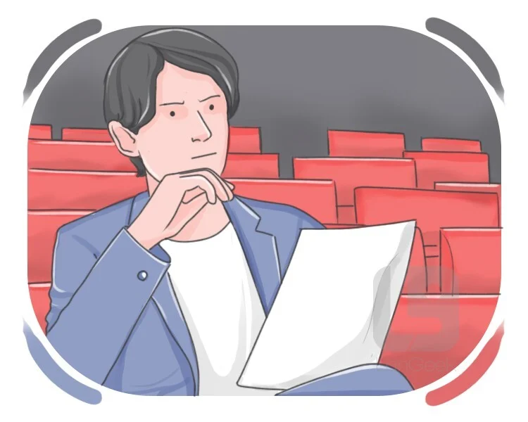
- `hallway`  /hɑ:l.weɪ/   a space inside a building entrance, which connects to the other rooms   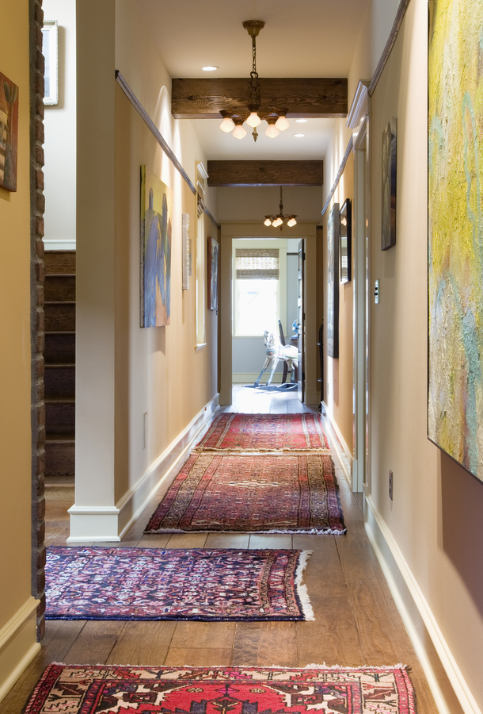
- `turn (verb)`  /tɜrn/   1. to rotate something so that it is facing a different direction or is in a different position: The wheels are turning - Turn the key   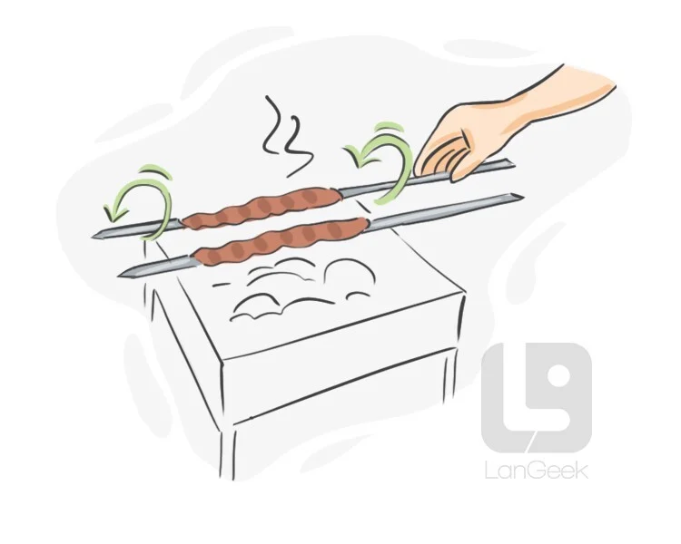   2. to move in a different direction: Turn left at the traffic lights   3. to become different: The weather has turned cold   4. to make somebody or something change: The sun turned her hair blond   5. to find a certain page in a book: Turn to page 97   `turn something down` 1. to say no to what somebody wants to do or to give you: They offered me the job but I turned it down   2. to make something produce less sound or heat by moving a switch: I'm too hot _ can you turn the heating down?   `turn into something` to become different; to change somebody or something into something different: Water turns into ice when it gets very cold   `turn something off` to move the handle or switch that controls something, so that it stops: Turn the tap off - She turned off the television   `turn something on` to move the handle or switch that controls something, so that it starts: Could you turn the light on?   `turn out` to be something in the end: It has turned out to be a lovely day   `turn something out` to switch off a light: can you turn the lights out before you leave?   `turn over` to move so that the other side is on top: She turned over and went back to sleep   `turn something over` to move something so that the other side is on top: If you turn over the page you'll find the answers on the other side   `turn up` (used about a person) to arrive: Has David turned up yet?   `turn something up` to make something produce more sound or heat by moving a switch: Turn up the TV _ I can't hear it properly
- `properly`  /ˈprɑ.pər.li/   well or correctly: Close the door properly - I can't see properly without my glasses

### Health (28 words)
- `throat`  /θroʊt/   the front of the neck, or the space inside the neck down which food and air can go   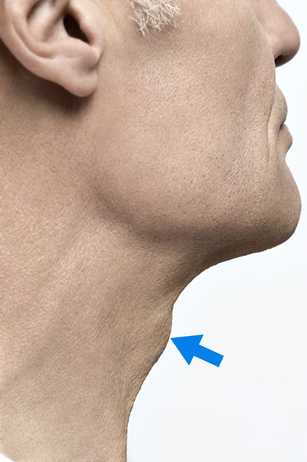
- `stare`  /ster/   to look at somebody or something for a long time
- `medicine`  /ˈmed.ɪ.sən/   1. the science of understanding illnesses and making sick people well again: He's studying medicine   2. special liquids or pills that help you to get better when you are ill: Take this medicine every morning
- `sore throat`  /ˌsɔːr ˈθroʊt/   pain in the throat
- `cough (verb)`  /kɑːf/   to send air out of your throat with a sudden loud noise: The smoke made me cough
- `have got`    Have got and have mean the same. Have got is more informal
- `headache`  /ˈhed.eɪk/   a pain you feel inside your head: He had a headache so he went to bed - That noise is giving me a headache
- `recovery`    the process of getting better
- `dramatically`  /drəˈmatɪkli/   in a big or showy way
- `forehead`  /ˈfɔr.hɛd/   the part of the face above the eyes   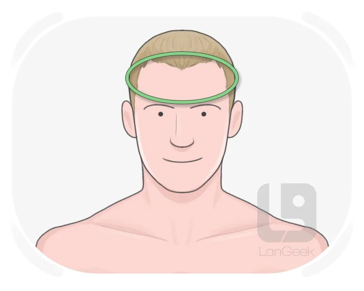
- `fever`  /ˈfi:.vər/   a high body temperature   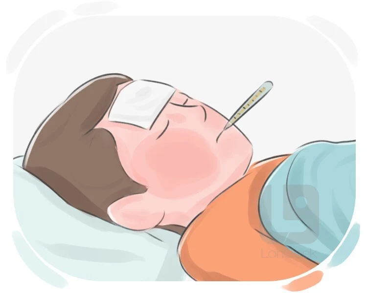
- `miracle`  /ˈmɪ.rə.kəl/   a wonderful and surprising thing that happens and that you cannot explain: It's a miracle that he wasn't killed
- `aspirin`  /ˈæs.prɪn/   a medicine that stops pain: I took an aspirin for my headache
- `clinic`  /ˈklɪn.ɪk/   somewhere doctors work
- `greet`  /ɡriːt/   to say hello when you meet somebody: He greeted me with a smile
- `alright`    (informal) = all right
- `all right`    1. good, or good enough: Is every thing all right?   2. well; not hurt: I was ill, but I'm all right now   3. used to say 'yes, I agree' when somebody asks you to do something: 'Can you get me some stamps?' 'All right'
- `tense (adjective)`    nervous or stressed
- `pharmacy`  /ˈfɑːr.mə.si/   a shop where medicines are sold   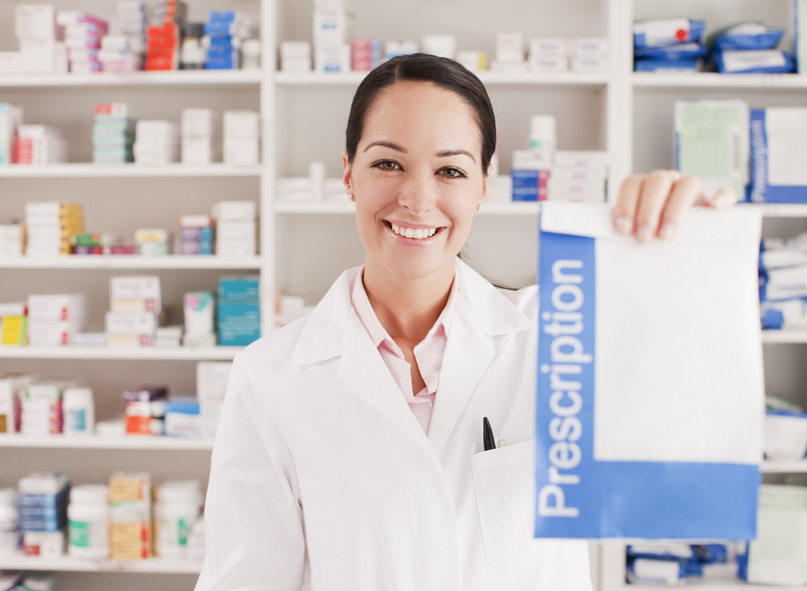
- `fortunately`  /ˈfɔːr.tʃən.ət.li/   happening because of good luck: Fortunately, we got home before it started to rain
- `score (verb)`  /skɔːr/   to win or get a point, goal, etc. in a competition, sport, or game: She scored 18 out of 20 in the spelling test
- `bleed`  /bli:d/   to lose blood: I've cut my hand and it's bleeding   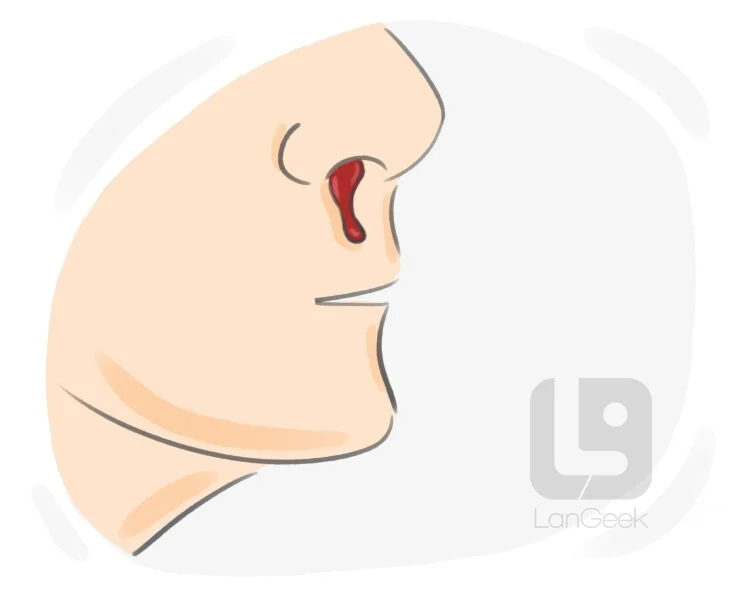
- `elbow`  /ˈel.boʊ/   the part in the middle of your arm where it bends: She fell and broke her elbow   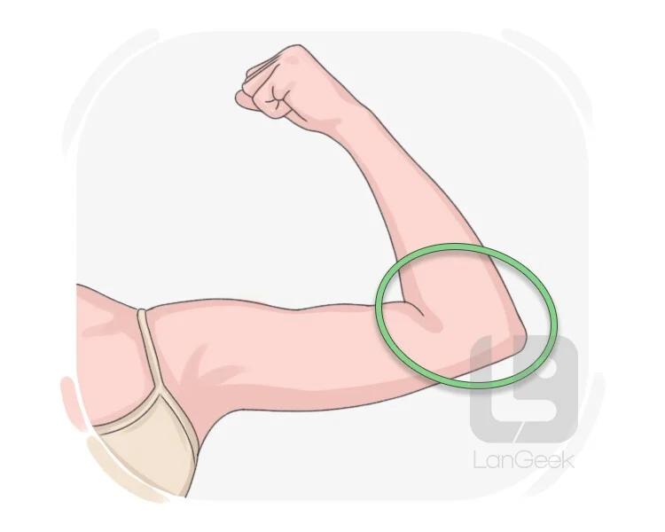
- `scratch`  /skrætʃ/   a cut or mark that a sharp thing makes: Her hands were covered in scratches from the cat   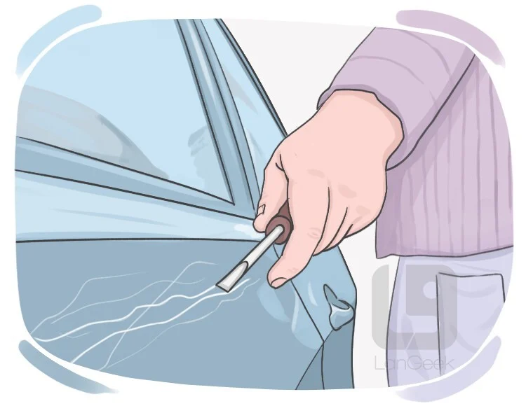
- `paramedic`  /ˌpɛ.rə.ˈmɛ.dɪk/   a person who helps in emergencies   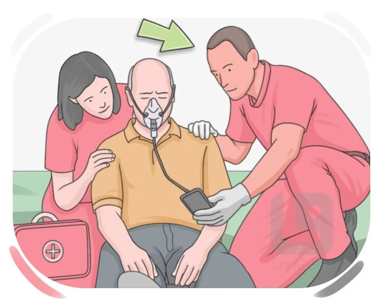
- `ma'am`  /mæm/   a polite way of talking to a woman: How can I help you, ma'am?
- `prescription`  /prɪˈskrɪp.ʃən/   a piece of paper that a doctor gives to you with the name of your medicine on it
- `tissue`  /ˈtɪ.ʃu/   1. a thin piece of soft paper that you use to clean your nose: a box of tissues   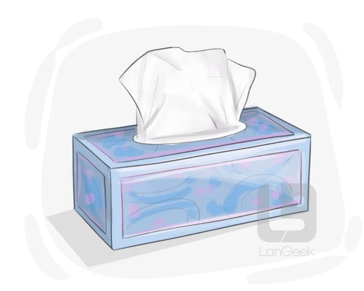   2. all the cells that from the bodies of humans, animals and plants   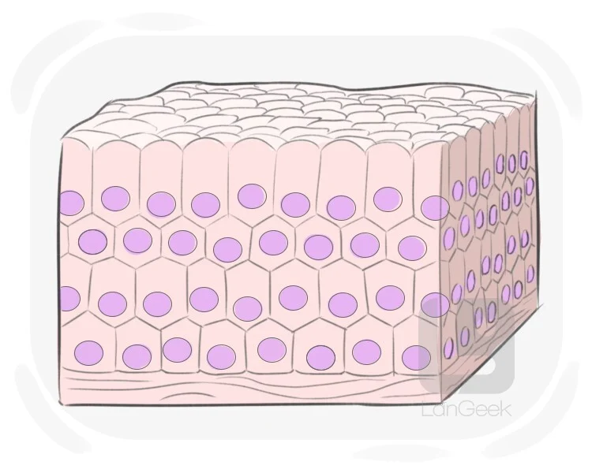

### Innovation (15 words)
- `innovation`  /ˌɪn.əˈveɪ.ʃən/   a new idea or method: The company is known for its innovation in computer technology
- `issue`  /ˈɪʃ.uː/   1. an important problem that people talk about: Pollution is a serious issue   2. a magazine or newspaper of particular day, week or month: Have you read this week's issue?
- `diary`  /ˈdaɪ.ə.ri/   1. a book where you write what you are going to do: I'll look in my diary to see if I'm free tomorrow   2. a book where you write what you have done each day: Do you keep a diary (= write in a diary)?
- `wisdom`  /ˈwɪz.dəm/   knowing and understanding a lot about many things: Some people think that old age brings wisdom
- `granddaughter`  /ˈɡræn.dɔː.tər/   the daughter of your son or daughter
- `inspire`  /ɪnˈspaɪər/   1. to make somebody want to do something: His wife inspired him to write this poem   2. to make somebody feel or think something: Her words inspired us all with hope
- `reputation`  /ˌrepjəˈteɪʃən/   the opinion that people in general have about someone or something, or how much respect or admiration someone or something receives, based on past behaviour or character: The company has a worldwide reputation for quality - She has the reputation of being a good doctor
- `here you go`    this is the object you asked me to give you: 'Would you please pass the sugar?' 'Here you go.'
- `accident`  /ˈæk.sə.dənt/   something bad that happens by chance: I had an accident when I was driving to work _ my car hit a tree - I'm sorry I broke your watch _ it was an accident   `by accident` by chance; not because you planned it; as a mistake: I took Jane's book by accident. I thought it was mine
- `though`  /ðoʊ/   but; however
- `glow`  /ɡloʊ/   to produce a continuous light and sometimes heat: glowstone - His cigarette glowed in the dark
- `attachment`  /əˈtætʃ.mənt/   1. a strong feeling of love or liking for somebody or something : a child's strong attachment to its parents   2. (computers) a file or document that you send to somebody using email
- `surfer`  /ˈsɜr.fɜr/   a person who rides on a wave on a special board   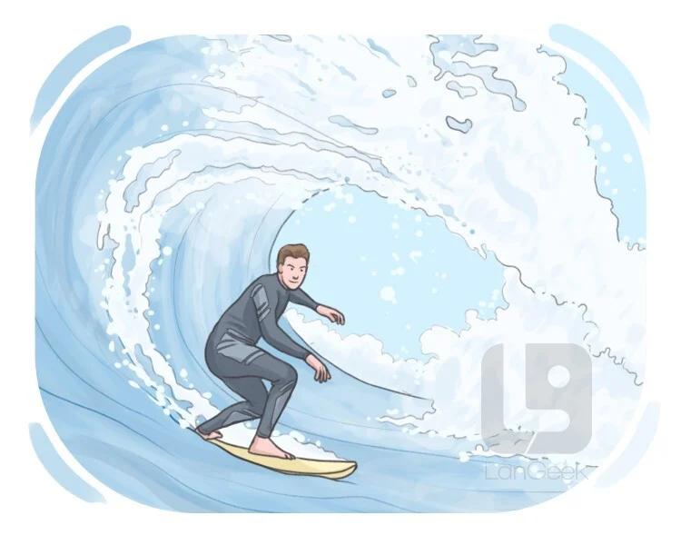   2. a person who spends a lot of time looking at websites on the internet
- `wave (noun)`  /weɪv/   1. one of the lines of water that moves across the top of the sea: the sound of the waves breaking on the shore   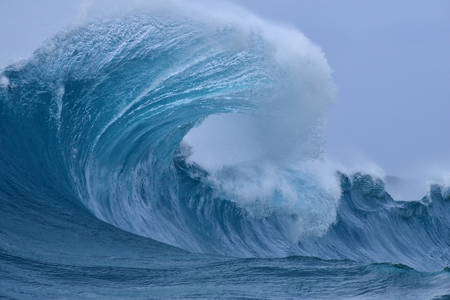   2. a movement of your hand from side to side in the air, to say hello or goodbye, or to make a sign to somebody: As she turned the corner, she gave me a wave   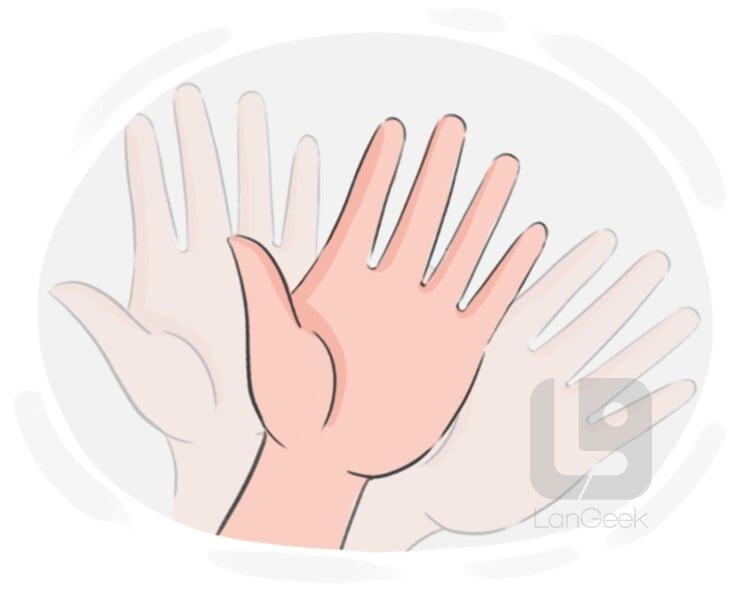   3. a gentle curve in hair   4. the form that some types of energy such as heat, light and sound take: radio waves
- `plug (noun)`  /plʌɡ/   1. a thing with metal pins that joins a lamp, machine, etc. to a place in the wall (called a socket) where there is electricity   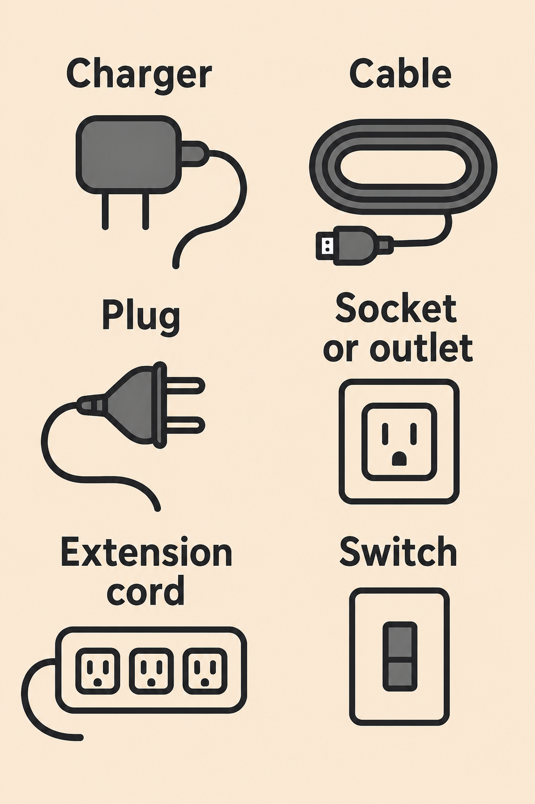   2. a round thing that you put in the hole in a bath, to keep the water in   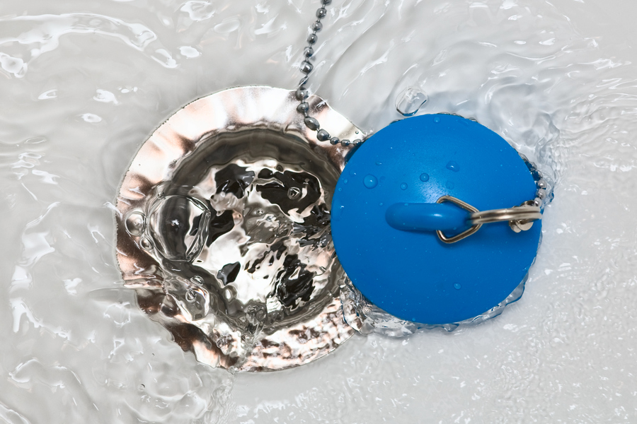

### Routines (26 words)
- `routine`  /ruːˈtiːn/   a usual or fixed way of doing things: Try to incorporate walking into your daily routine
- `incorporate`  /ˌɪn.ˈkɔr.pɜ.reɪt/   to include something as part of something larger: Try to incorporate walking into your daily routine
- `comb`  /koʊm/   a flat piece of plastic, wood, or metal with a thin row of long, narrow parts along one side, used to tidy and arrange your hair   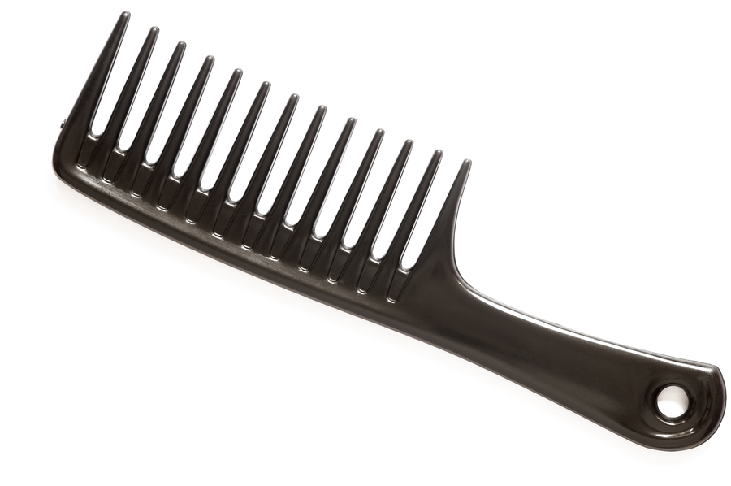
- `toothpaste`  /ˈtuːθ.peɪst/   a soft and thick substance we put on a toothbrush to clean our teeth   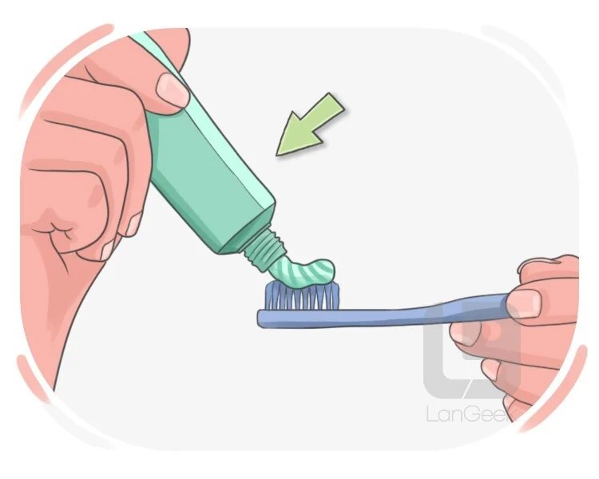
- `toothbrush`  /ˈtuːθ.brʌʃ/   a small brush with a long handle that you use to clean your teeth   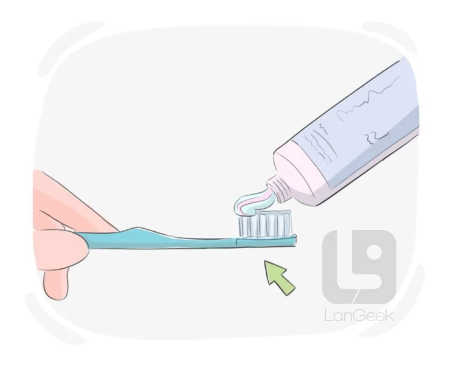
- `asleep`  /əˈsliːp/   sleeping: The baby is asleep in the bedroom - He fell asleep (= started sleeping) in front of the fire (OPPOSITE: awake)
- `write down`    to write something on a piece of paper so that you do not forget it: Alice wrote down the address - Did you write down Jo's phone number?
- `beside`  /bɪˈsaɪd/   at the side of; next to: Come and sit here beside me - Our school was built right beside a river
- `off (preposition, adverb)`  /ɑːf/   1. away from a place; at a distance in space or time: My birthday is not far off - I most be off soon (= leave)   2. down or away from something: He fell off the roof - We got off the bus - The thief ran off   3. used for talking about removing something: If you're hot, take your coat off - Can you clean that paint off the carpet? (OPPOSITE: on)   4. not connected; not working: Make sure the lights are off before you go (OPPOSITE: on)   5. not at work or school: I had the day off yesterday   6. joined to something and leading from it: The bathroom is off the bedroom
- `beard`  /bɪrd/   the hair that grow on the chin and sides of a man’s face   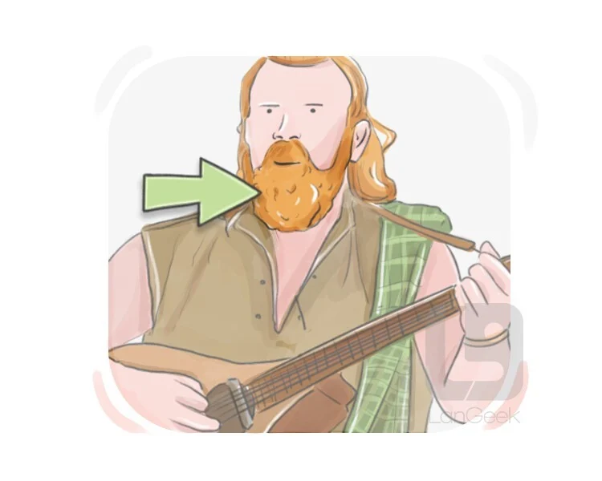
- `chin`  /ʧɪn/   the lowest part of our face that is below our mouth   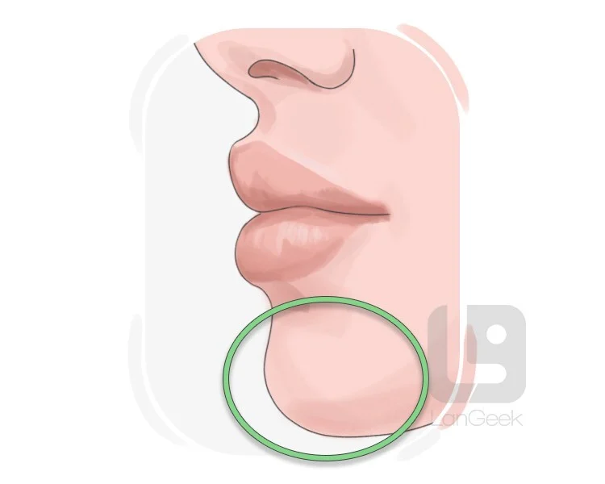
- `debate`  /dɪˈbeɪt/   a public meeting where people talk about something important
- `reflection`  /rɪˈflek.ʃən/   1. the image of something in a mirror or water or on any shiny surface   2. sending back light, heat or sound   3. a thing that shows what somebody or something is like: Your clothes are a reflection of your personality
- `letter`  /ˈlɛ.tər/   1. a piece of writing that one person sends to another person: He got a letter from his cousin this morning - I'm writing a thank-you letter for the flowers she sent me   2. a sign in writing that represents a sound in a language: Z is the last letter in the English alphabet
- `men`    plural of man
- `dress (verb)`  /dres/   1. to put clothes on yourself or someone else, especially a child   2. to wear or make someone wear a particular style, type of clothes
- `omelet`  /ˈɑː.mə.lət/   a dish made by mixing eggs together and frying them, often with small pieces of other food such as cheese or vegetables
- `ring (noun)`  /rɪŋ/   1. a circle of metal that you wear on your finger: a wedding ring   2. a circle: The coffee cup left a ring on the table top   3. a space with seats around it, used for a competition or a performance: a boxing ring   4. the sound that a bell makes: There was a ring at the door
- `ring (verb)`  /rɪŋ/   1. (British) to telephone somebody (SAME MEANING: call and phone): I'll ring you on Sunday - She rang up yesterday and cancelled the order   2. to make a sound like a bell: The telephone is ringing   3. to press or move a bell so that it makes a sound: We rang the doorbell again but nobody answered
- `waste (verb)`  /weɪst/   to use too much of something or not use something in a good way: She wastes a lot of money on sweets - He wasted his time at university _ he didn't do any work
- `shower`  /ʃaʊər/     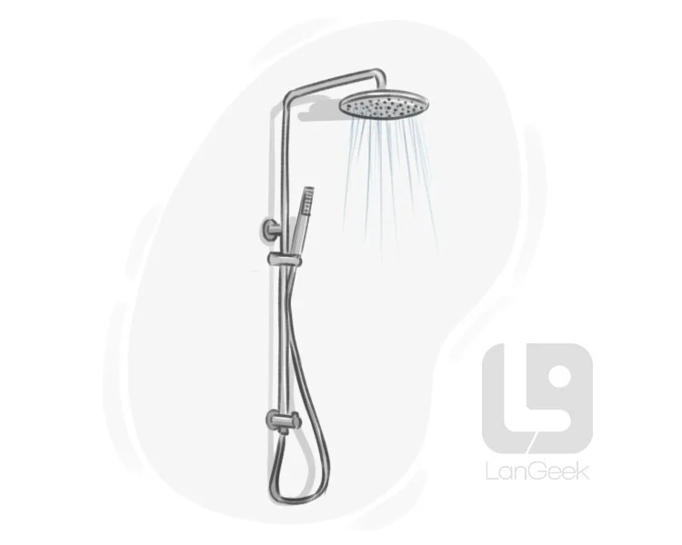
- `creepy`  /ˈkriː.pi/   making you feel nervous or afraid (SAME MEANING: scary): a creepy ghost story
- `recall`  /rɪˈkɑːl/   remember; to bring the memory of a past event into your mind, and often to give a description of what you remember: Can you recall what happened last night?
- `laughter`    the sound of laughing: I could hear laughter in the next room
- `horrible`  /ˈhɔːr.ə.bəl/   very bad or unpleasant: What horrible weather! - I had a horrible dream
- `worst`  /wɜrst/   superlative of bad (OPPOSITE: best)

### Stories (27 words)
- `pillow`  /ˈpɪl.oʊ/   a soft thing that you put your head on when you are in bed   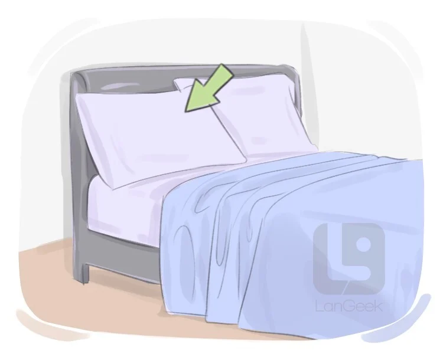
- `palace`  /ˈpæl.ɪs/   a very large house where a king or queen lives
- `princess`  /prɪnˈses/   a daughter of a king and queen
- `prince`  /prɪns/   a son of a king and queen
- `servant`  /ˈsɜr.vənt/   a person who works in another person's house, doing work like cooking and cleaning
- `monster`  /ˈmɑns.tɜr/   an animal in stories that is big, ugly and frightening
- `frightening`  /ˈfraɪ.tən.ɪŋ/   making you feel afraid: a frightening film
- `cashier`  /kæʃˈɪr/   person who takes money in a store
- `necklace`  /ˈnek.ləs/   a piece of jewellery worn around the neck   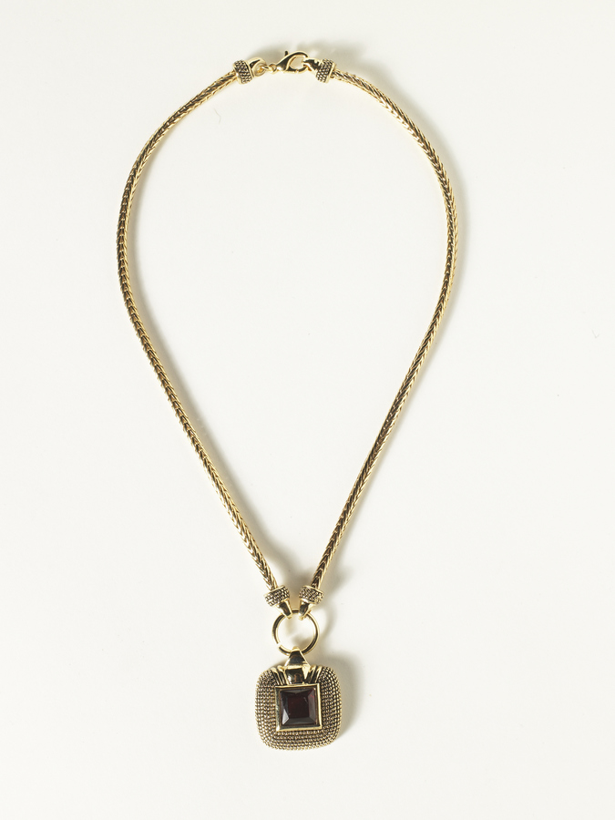
- `neck`  /nek/   the body part that is connecting the head to the shoulders   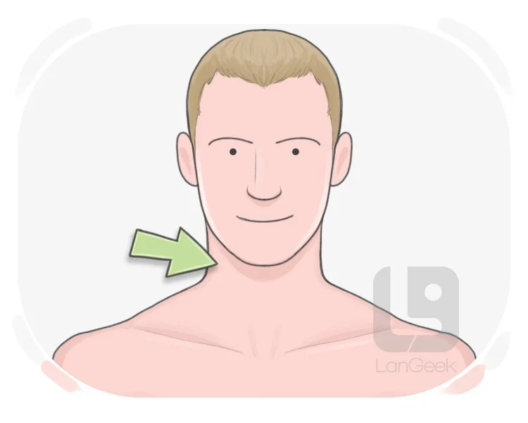
- `footstep`  /ˈfʊt.step/   the sound or mark made by a person walking as their foot touches the ground
- `look (verb)`  /lʊk/   1. to turn your eyes towards somebody or something and try to see them: Look at this picture - You should look both ways before you cross the road   2. to seem to be; to appear: You look tired - It looks as if it's going to rain   3. you say to make somebody listen to you: Look, I know you're busy, but I need your help   `look after somebody or something` to take care of somebody or something: Can you look after my cat when I'm on holiday?   `look for somebody or something` to try to find somebody or something: I'm looking for my keys   `look forward to something` to wait for something with pleasure: I'm looking forward to seeing you again   `look into something` to study or try to find out something: We will look into the problem   `look like somebody or something` 1. to seem to be something: That looks like a good film   2. words that you use to ask about somebody's appearance: 'What does he look like?' 'He's tall with dark hair'   3. to have the same appearance as somebody or something: She looks like her mother   `look out` be careful: Look out! There's a car coming!   `look out for somebody or something` to pay attention and try to see or find somebody or something: Look out for thieves!   `look round something` to visit a place: We looked round the museum   `look something up` to try to find information in a book: I looked the word up in my dictionary
- `tight (adjective)`  /taɪt/   1. fixed firmly so that you cannot move it easily: a tight knot - I can't open this jar of jam _ the lid is too tight (OPPOSITE: loose)   2. Tight clothes fit very closely in a way that is often uncomfortable: These shoes are too tight - tight trousers
- `firm (adjective)`  /fɜr:m/   1. Something that is firm is quite hard or does not move easily: Wait until the glue is firm - The shelf isn't very firm, so don't put too many books on it   2. showing that you will not change your ideas: She's very firm with her children (= she makes them do what she wants) - a firm promise
- `shout`  /ʃaʊt/   to speak very loudly: Don't shout at me - 'Go back!' she shouted
- `wood`  /wʊd/   1. (no plural) the hard substance that trees are made of: Put some more wood on the fire - The table is made of wood   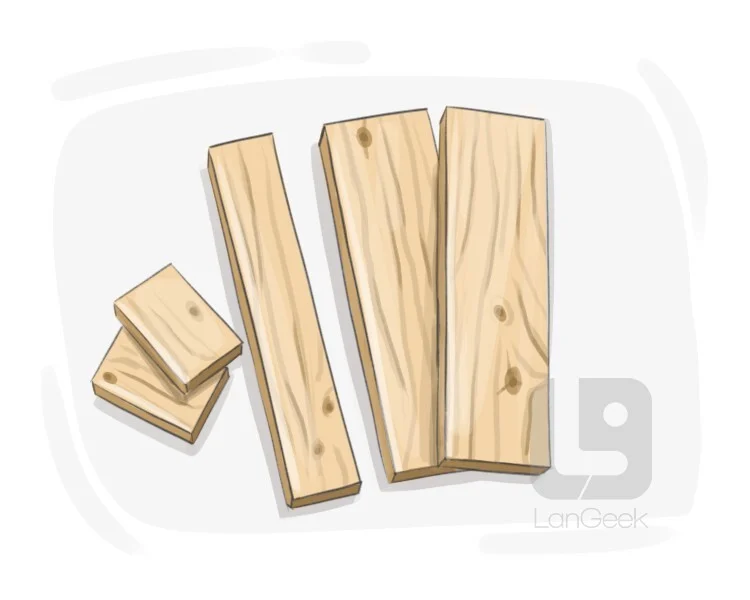   2. (also woods) a big group of trees, smaller than a forest: a large wood - a walk in the woods   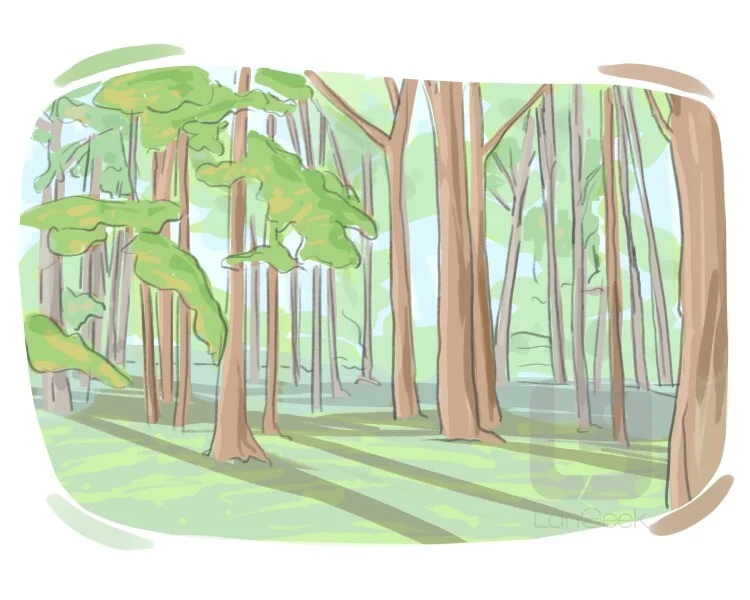
- `stunt performer`  /stʌnt per·​form·​er/   بدلکار   
- `basement`  /ˈbeɪs.mənt/   an area or room in a house or building that is partially or completely below the ground level   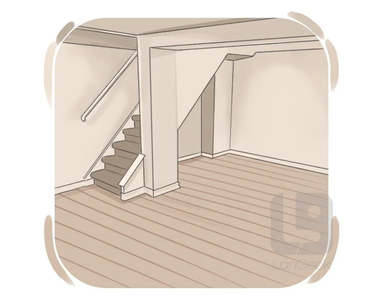
- `mad`  /mæd/   1. ill in your mind (SAME MEANING: crazy)   2. (British, informal) very stupid (SAME MEANING: crazy): I think you're mad to go out in this snow   3. (American, informal) very angry: He was mad at me for losing his watch   `mad about somebody or something` (informal) liking somebody or something very much: Mina is mad about computer games - He's mad about her   `drive somebody mad` to make somebody very angry: This noise is driving me mad   `go mad` (British, informal) 1. to become ill in your mind: He went mad and killed himself   2. to become very angry: He went mad and killed himself - Mum will go mad when she finds out what you did at school   `like mad` (informal) very hard, fast, much, etc.: I had to run like mad to catch the bus
- `bakery`  /ˈbeɪ.kɜ.ri/   a place where bread and cakes are made and often sold   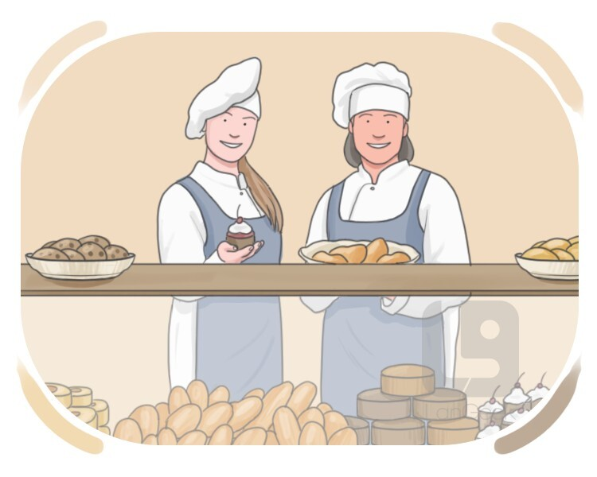
- `burn (verb)`  /bɜrn/   1. to make flames and heat; to be on fire: Paper burns easily - She escaped from the burning building   2. to harm or destroy somebody or something with fire or heat: I burnt my fingers on a match - We burned the wood on the fire   `burn down; burn something down` to burn, or to make a building burn, until there is nothing left: Their house burnt down
- `garden`  /ˈɡɑːr.dən/   1. (British) (American yard) a piece of land by your house where you can grow flowers, fruit, and vegetables: Let's have lunch in the garden   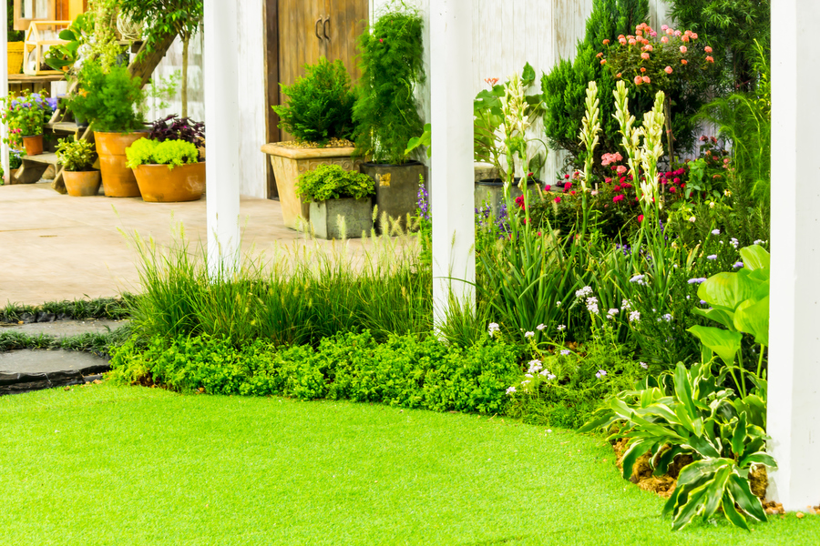   2. gardens (plural) a public park: Kensington Gardens
- `fountain`  /ˈfaʊn.tən/   a structure, often placed in gardens and parks, that shoots up water into the air and then it falls down again   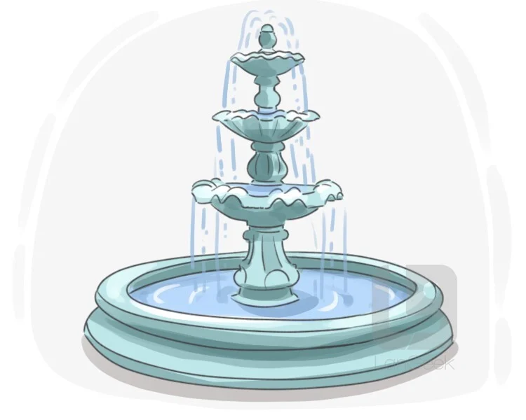
- `shiny`  /ˈʃaɪ.ni/   bright and smooth in a way that reflects light   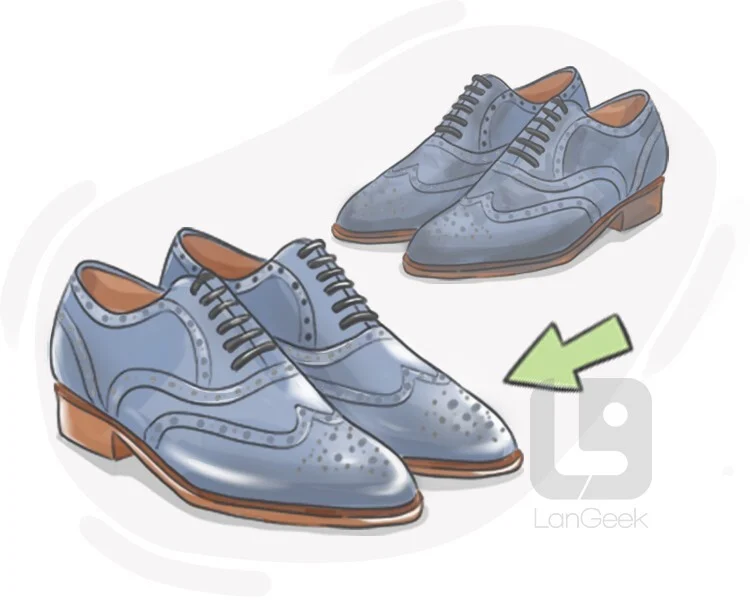
- `jewelry`  /ˈdʒuːl.ri/   objects such as necklaces, bracelets or rings, typically made from valuable metals such as gold and silver, that we wear as decoration   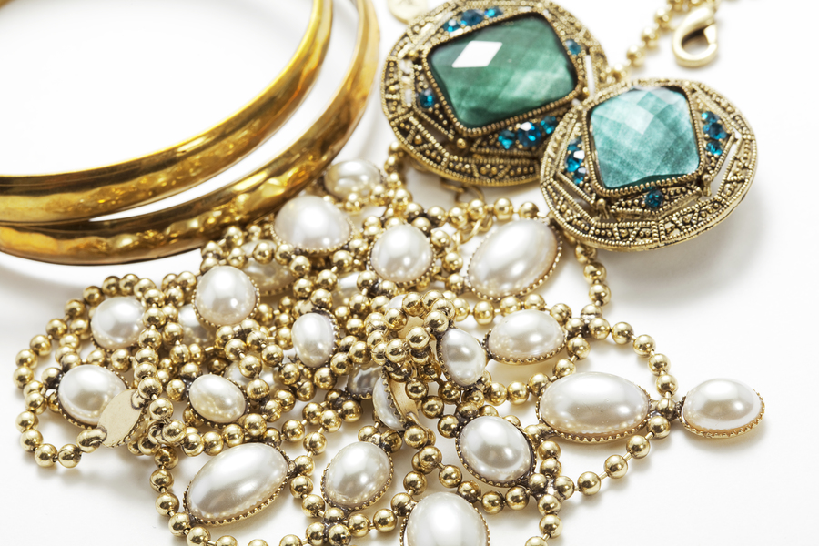
- `bracelet`  /ˈbreɪ.slət/   a decorative item, worn around the arm   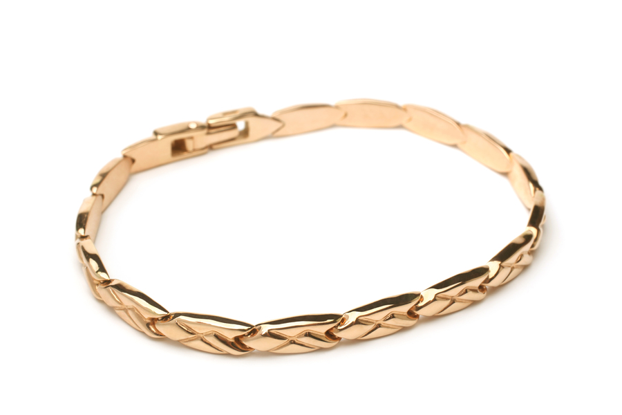
- `decoration`  /ˌdek.ərˈeɪ.ʃən/   a beautiful thing that you add to something to make it look nicer: Christmas decorations   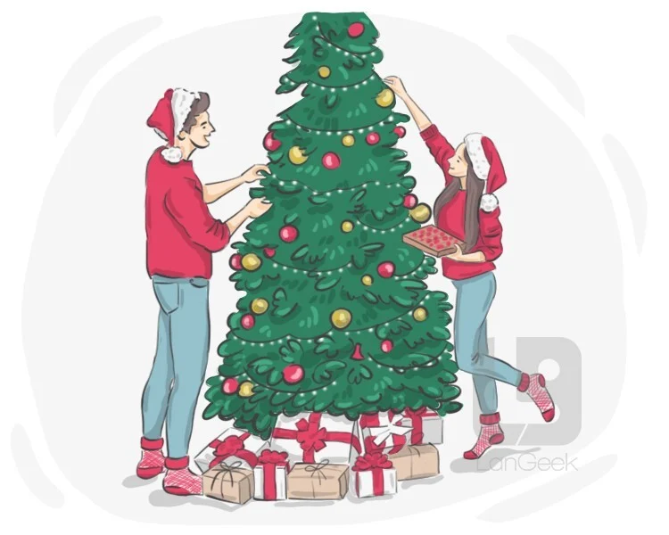

### Wedding (15 words)
- `engaged`  /ɪnˈɡeɪdʒd/   if two people are engaged, they have agreed to get married: Louise is engaged to Michael - They got engaged last year
- `relative`  /ˈrel.ə.t̬ɪv/   a member of your family (SAME MEANING: relation)
- `musician`  /mjuːˈzɪʃ.ən/   someone who is skilled in playing music, usually as a job
- `bride`  /braɪd/   a woman on the day of her wedding   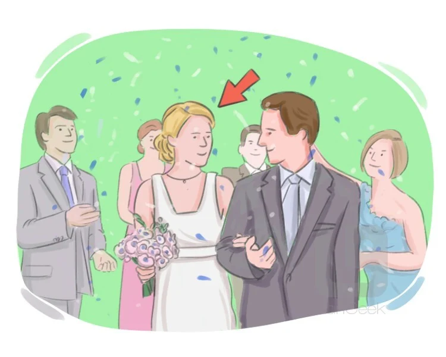
- `groom`  /gru:m/   a man who is getting married   
- `universe`  /ˈju.nə.ˌvɜrs/   the earth and all the stars, planets and everything else in space   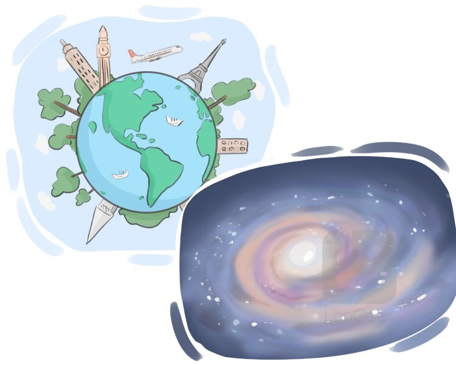
- `purse`  /pɜr:s/   1. (British) a small bag for money, usually used by a woman   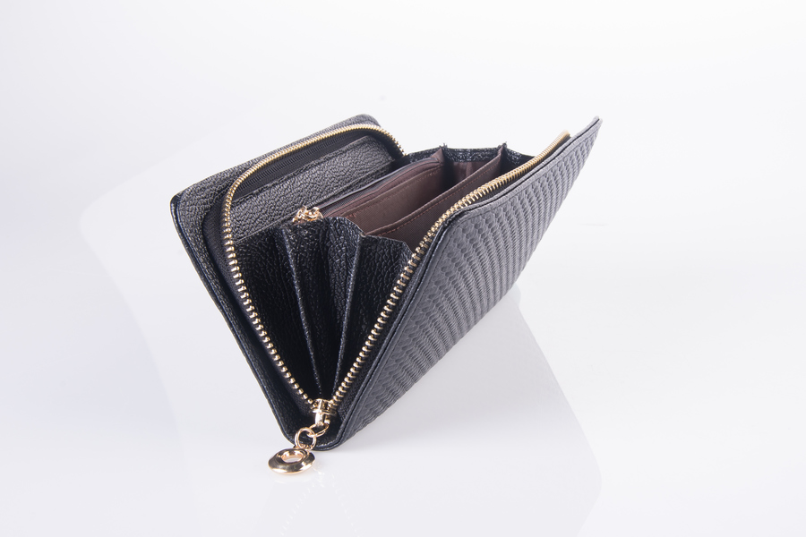   2. (American) a handbag   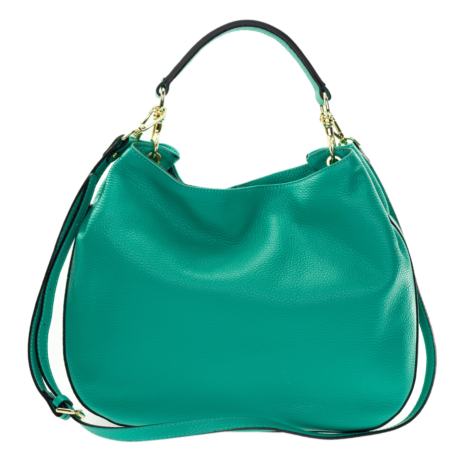
- `ceremony`  /ˈser.ə.moʊ.ni/   a formal public or religious event: the opening ceremony of the Olympic Games - a wedding ceremony
- `colorful`  /ˈkʌ.lər.ˌfʊl/   having many colors
- `trophy`  /ˈtroʊ.fi/   an object that is awarded to the winner of a competition   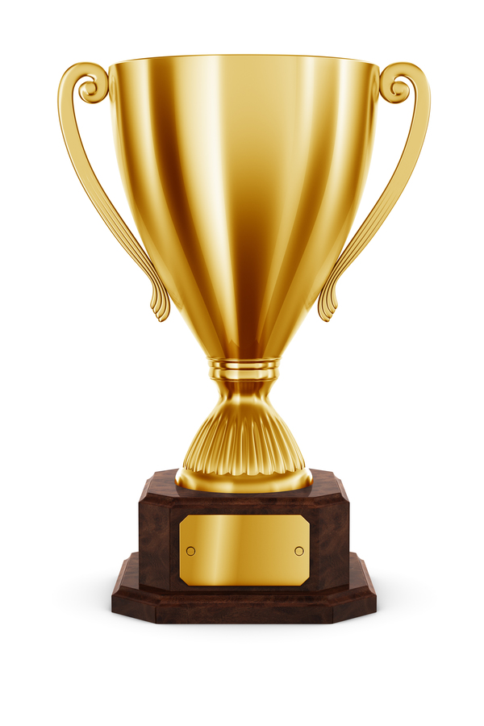
- `cheek`  /ʧi:k/   any of the two soft sides of our face that are bellow our eyes   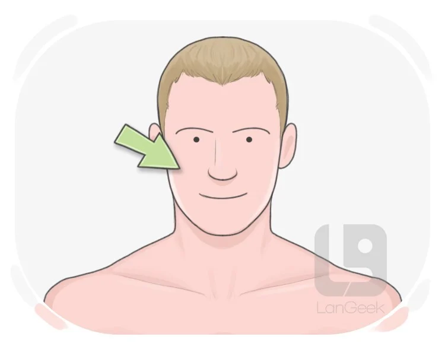
- `shake`  /ʃeɪk/   to move quickly from side to side or up and down; to make something do this: The house shakes when trains go past - He was shaking with fear - Shake the bottle before opening it   `shake hands` to hold somebody's hand and move it up and down when you meet them   `shake your head` to move your head from side to side to say 'no'
- `pottery`  /ˈpɑ:.tə.ri/   the skill or activity of making dishes, pots, etc. using clay   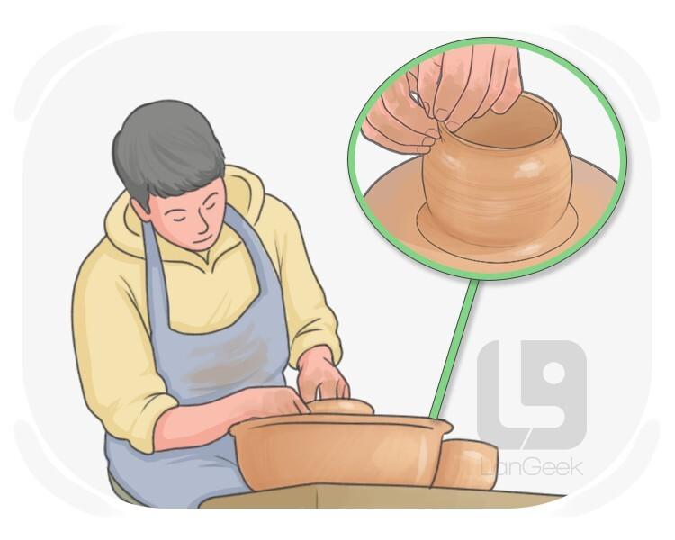
- `besides`  /bɪˈsaɪdz/   in addition to; also: Do you play any other sports besides basketball?
- `last (verb)`  /læst/   to continue for a period of time, or to continue to exist: The meeting lasted two hours - They say the snow will last until the end of next week

### Memories (20 words)
- `strict`  /strɪkt/   If you are strict, you make people do what you want and do not allow them to behave badly: Her parents are very strict _ she always has to be home before ten o'clock - strict rules
- `lean (verb)`  /liːn/   1. to not be straight; to bend forwards, backwards or to the side: She leaned out of the window and waved   2. to put your body or a thing against another thing: Lean your bike against the wall   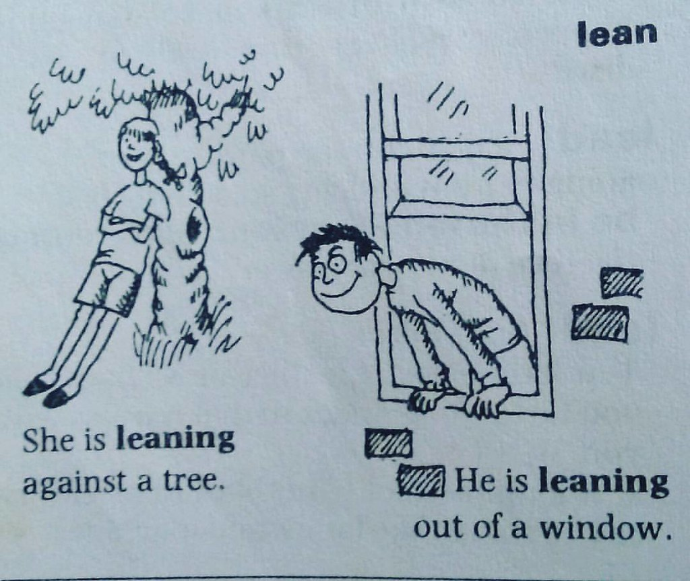
- `missing`  /ˈmɪs.ɪŋ/   lost, or not in the usual place: The police are looking for the missing child - My purse is missing. Have you seen it?
- `shy`  /ʃaɪ/   not outgoing
- `used to`    words that tell us about something that happened often or that was true in the past: She used to smoke when she was young - I used to be afraid of dogs but now like them
- `trumpet`  /ˈtrʌm.pət/     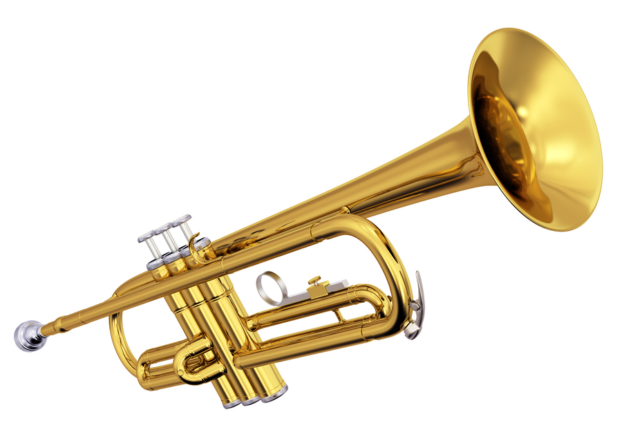
- `pack (verb)`  /pæk/   1. to put things into a bag or suitcase before you go somewhere: Have you packed your suitcase? - Don't forget to pack your toothbrush   2. to put things into a box, bag, etc.: Pack all these books into boxes (OPPOSITE: unpack)   `pack up` 1. to stop doing something: At two o'clock we packed up and went home   2. (British, informal) If a machine packs up, it stops working
- `neighborhood`  /ˈneɪbərhʊd/   a part of a town or city; the people who live there: They live in a friendly neighborhood
- `glad`  /ɡlæd/   happy about something (SAME MEANING: pleased): He was glad to see us
- `hurt (adjective)`  /hɜrt/   1. physically harmed (SAME MEANING: injured): Was anyone hurt in the accident?   2. upset: I was very hurt by what you said
- `anymore`  /ˌeniˈmɔːr/   used at the end of negative sentences and questions to mean 'now': She doesn't live here anymore - Why doesn't he speak to me anymore?
- `knee`  /ni:/   the body part that is in the middle of the leg and helps it bend   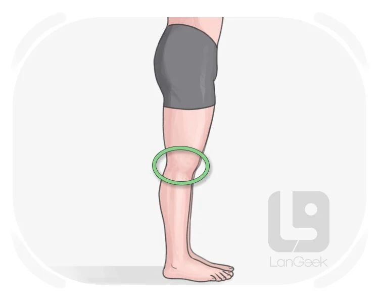
- `prize`  /praɪz/   something valuable, such as an amount of money, that is given to someone who succeeds in a competition or game or that is given to someone as a reward for doing very good work   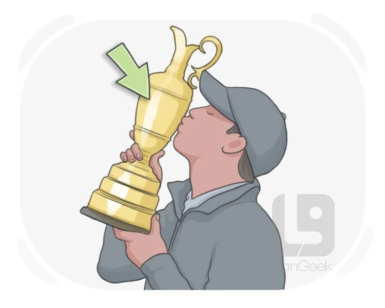
- `broom`  /bruːm/   a brush with a long handle and bristles (= short, stiff hairs or pieces of plastic), used for cleaning the floor or the ground   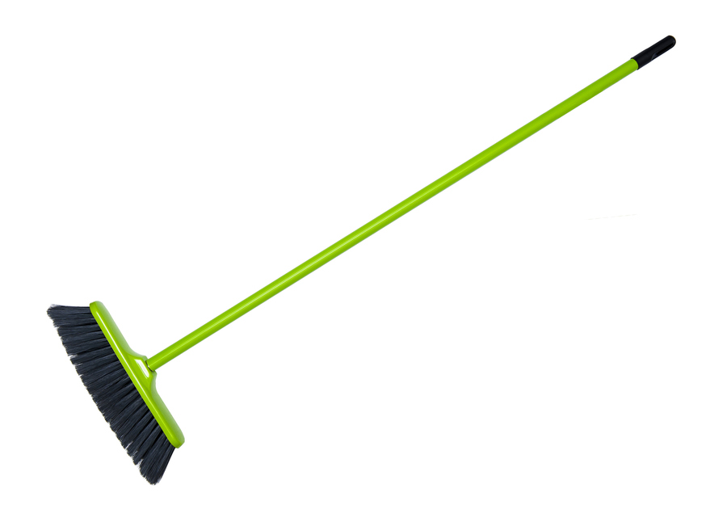
- `pie`  /paɪ/   a type of food made with meat, vegetables, or fruit covered in pastry and baked: an apple pie   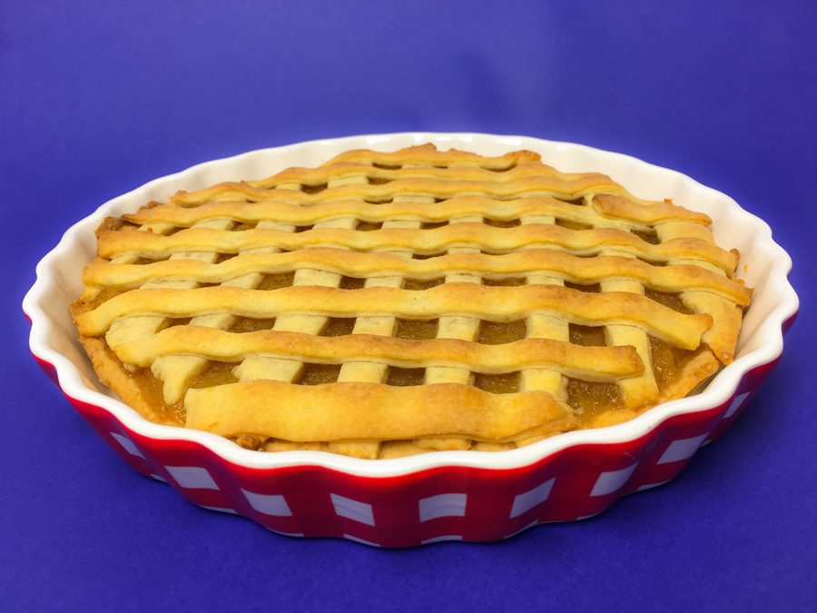
- `frying pan`  /ˈfraɪ.ɪŋ ˌpæn /     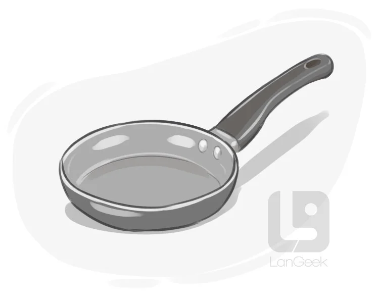
- `spinach`  /ˈspɪn.ɪtʃ/   a vegetable with wide, dark green leaves that are eaten cooked or uncooked - اسفناج   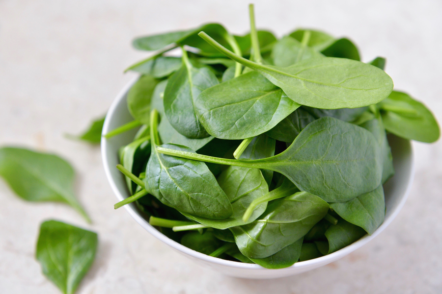
- `recipe`  /ˈres.ə.pi/   the instructions on how to cook a certain food, including a list of the ingredients required
- `oven`  /ˈʌv.ən/   the part of a cooker shaped like a box with a door on the front. You put food in the oven to cook or heat it: Take the bread out of the oven   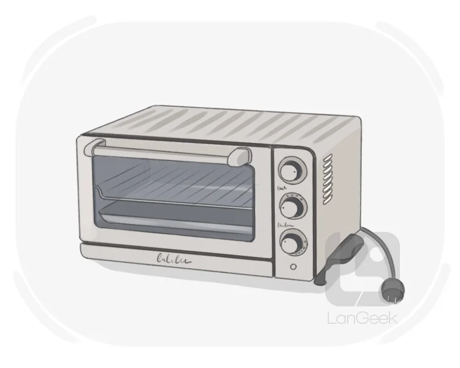
- `bake`  /beɪk/   to cook food, for example bread or cakes, in an oven: My brother baked a cake for my birthday

### Relations (26 words)
- `nephew`  /ˈnef.juː/   a son of your sister or brother
- `niece`  /niːs/   a daughter of your sister or brother
- `blind`  /blaɪnd/   not able to see
- `retire`  /rɪˈtaɪr/   to leave your job or stop working because of old age or ill health
- `strike (verb)`  /straɪk/   1. (formal) to hit somebody or something: A stone struck me on the back of the head   2. to stop working because you want more money or are angry about something: The nurses striking for better pay   3. to come suddenly into your mind: It suddenly struck me that she looked like my sister   4. If a clock strikes, it rings a bell a certain number of times so that people know what time it is: The clock struck nine   `strike a match` to make fire with a match
- `cafeteria`  /ˌkæf.əˈtɪr.i.ə/   a restaurant where you choose and pay for your meal and then carry it to a table. Places like factories, colleges and hospitals often have cafeterias   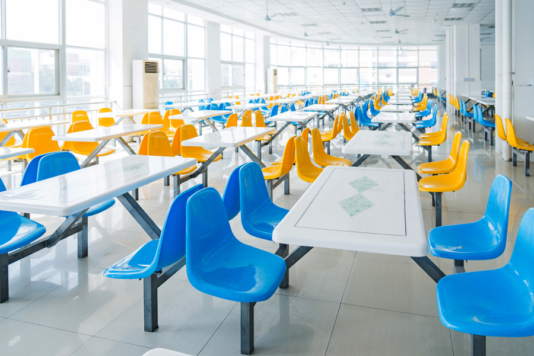
- `spouse`  /spaʊs/   husband or wife
- `haircut`  /ˈher.kʌt/   the way in which someone's hair is cut: He has a really awful haircut - The photo showed a muscular young man with a short haircut and dark features - I love your new haircut
- `divorced`  /dɪˈvɔːrst/   not married anymore
- `appointment`  /əˈpɔɪnt.mənt/   1. a formal arrangement to meet or visit someone at a particular time and place: I've got an appointment with the doctor at ten o'clock - You can telephone to make an appointment   2. (formal) a job
- `accent`  /ˈæk.sənt/   1. the way a person from a certain place or country speaks a language: She speaks English with an American accent   2. saying one word or part of a word more strongly than another: In the word 'because', the accent is on the second part of the word   3. (in writing) a mark, usually above a letter that changes the sound of the letter: Fiancé has an accent on the 'e'
- `approved`  /əˈpruːvd/   officially accepted or allowed
- `novel`  /ˈnɑː.vəl/   a long story in a book
- `neither (adverb)`  /ˈniːðər/   also not: Lydia can't swim and neither can I - 'I don't like rice' 'Neither do I' - 'I can't believe this worked' 'Me neither'   `neither ... nor` not ... and not: Neither Paul nor I went to the party
- `barber`  /ˈbɑr.bər/   a person who cuts hair
- `marriage`  /ˈmer.ɪdʒ/   the formal and legal relationship between two people who are married
- `lawyer`  /ˈlɔ.ɪɜr/   someone whose job is to give advice to people about the law and speak for them in court: I want to see my lawyer before I say anything   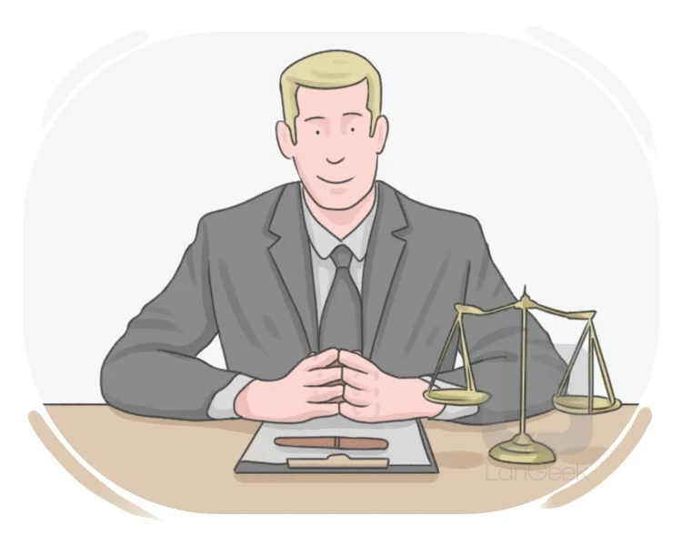
- `frosting`  /ˈfrɑː.stɪŋ/   a sweet food used to cover or fill cakes, made from sugar and water or sugar and butter   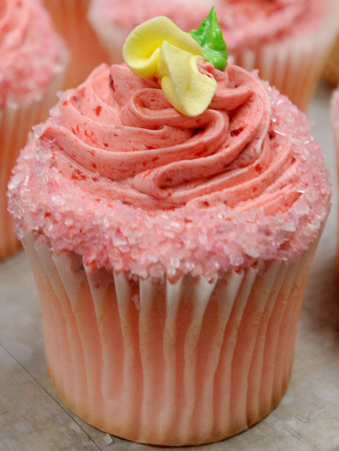
- `anniversary`  /ˌæ.nə.ˈvɜr.sɜ.ri/   the day on which an important event happened in a previous year: We always celebrate our wedding anniversary with dinner in an expensive restaurant
- `sore (adjective)`  /sɔːr/   If a part of your body is sore, it gives you pain: My feet were sore after the long walk - I've got a sore throat
- `bother (verb)`  /ˈbɑ.ðər/   1. to spend extra time or energy doing something: Don't bother about the washing-up _ I'll do it later - He didn't even bother to say goodbye   2. to annoy or worry somebody, especially when they are doing something else: Don't bother me now _ I'm busy - Is this music bothering you? - I'm sorry to bother you, but there's someone on the phone for you   `can't be bothered` If you can't be bothered to do something, you do not want to do it because it is too much work: I can't be bothered to do my homework now
- `aunt`  /ænt/   the sister of your father or mother, or the wife of your uncle or aunt: Aunt Mary
- `uncle`  /ˈʌŋkəl/   the brother of your father or mother, or the husband of your aunt or uncle: Uncle John
- `sweatpants`  /ˈswet.pænts/   warm, comfortable pants made of thick cotton, often worn for exercise, or casual wear: I put on my sweatpants to relax on the couch   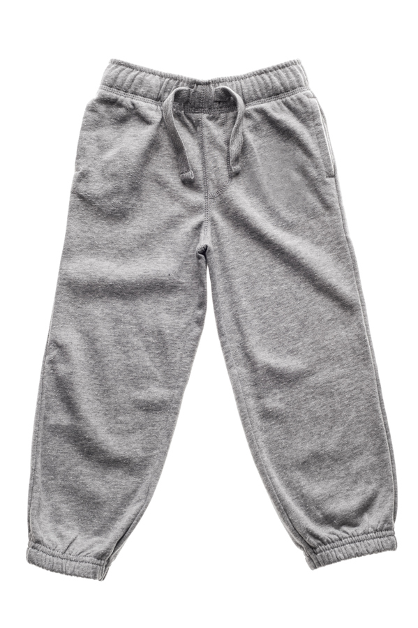
- `palm`  /pɑːm/   1. the flat part of the front of your hand   2. (also `palm tree`) a tree that grows in hot countries, with no branches and a lot of big leaves at the top: a coconut palm
- `nutritious (adjective)`  /nuːˈtrɪʃ.əs/   (used about food) good for you; efficient as food: tasty and nutritious meals

### Clothing (32 words)
- `sweatshirt`  /ˈswetʃɜːrt/   a warm piece of clothing with long sleeves made of thick cotton, which you wear on the top part of your body   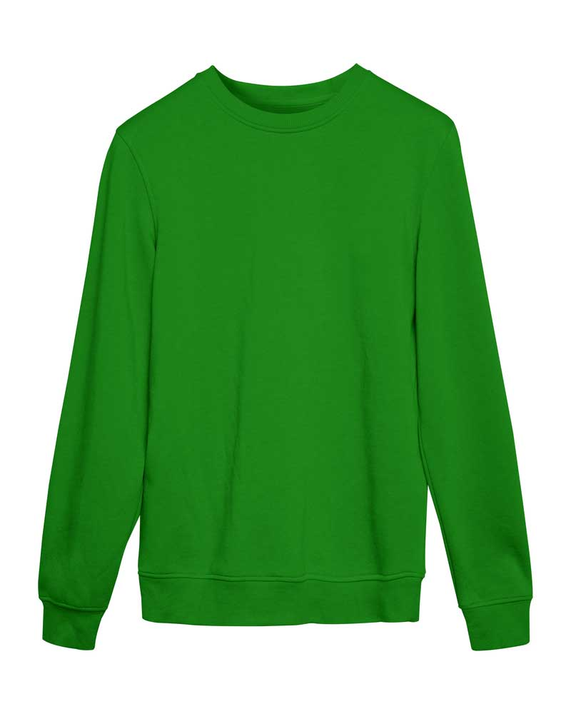
- `sleeve`  /sliːv/   the part of a piece of clothing that covers some or all of the arm: short/long sleeves   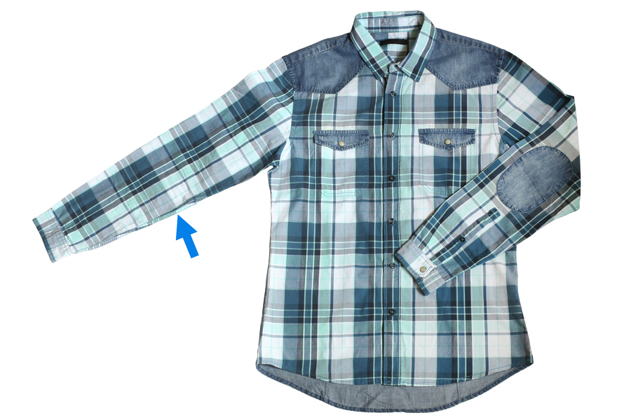
- `cotton`  /ˈkɑː.tən/   a natural cloth or thread that is made from the soft white hairs around the seeds of a plant that grows in hot countries: a cotton shirt - a reel of cotton   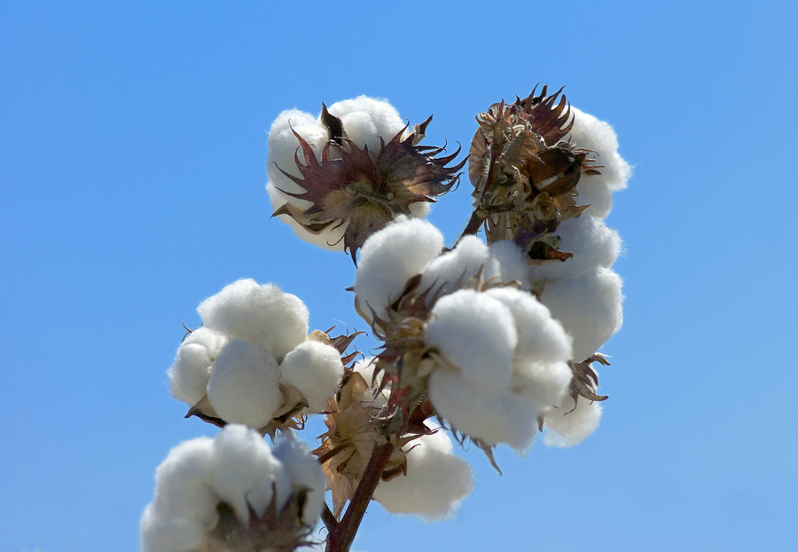
- `scarves`  /skɑːrvz/   plural of scarf
- `scarf`  /skɑːrf/   a piece of material that you wear around your neck or head   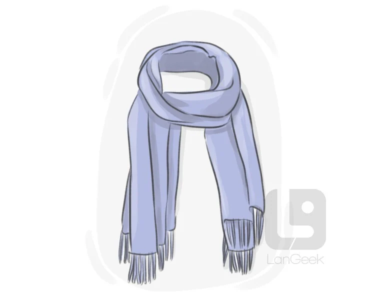
- `underwear`  /ˈʌndərwer/   clothes worn next to the skin, under other clothes
- `sale (noun)`  /seɪl/   1. (no plural) selling something   2. (plural sales) a time when a shop sells things for less money than usual: In the sale, everything is half-price   `for sale` If something is for sale, its owner wants to sell it: Is this house for sale?   `on sale` If something is on sale, you can buy it in shops: The magazine is on sale at most newsagents
- `leather`  /ˈleðər/   the skin of an animal that is used to make things like shoes, jackets or bags: a leather jacket   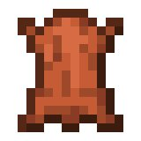
- `stuff (noun)`  /stʌf/   any material, substance or group of things: What's this blue stuff on the carpet? - Put your stuff in this bag
- `alike (adjective)`  /əˈlaɪk/   similar
- `checkout`  /ˈtʃek.aʊt/   a place in a shop to pay   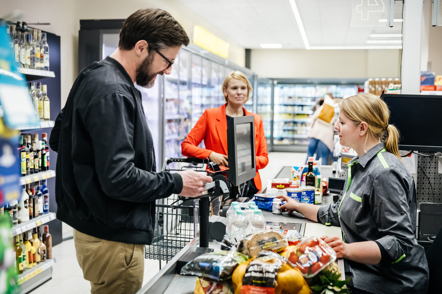
- `receipt`  /rɪˈsiːt/   a written or printed document that shows the payment for a set of goods or services has been made   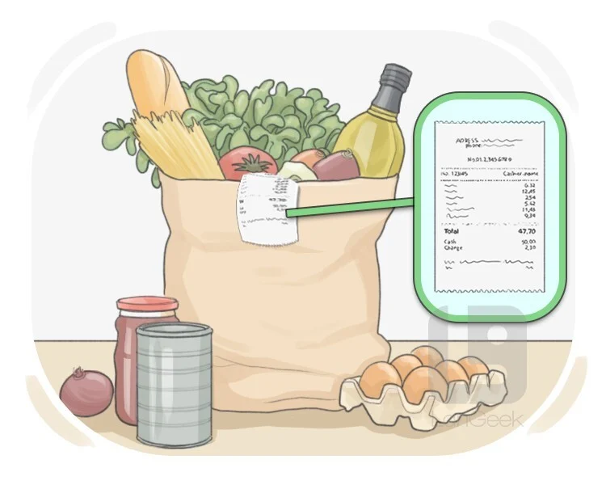
- `change (noun)`    1. (plural changes) when something becomes different: The new government has made a lot of changes - There has been a change in the weather   2. (no plural) the money that you get back if you pay more than the amount something costs: If a newspaper costs 60$ and you pay 100$, you will get 40$ change   3. (no plural) small pieces of money; coins: I haven't got any change   `for a change` because you want something different: Today we had lunch in a restaurant for a change
- `belt`  /belt/     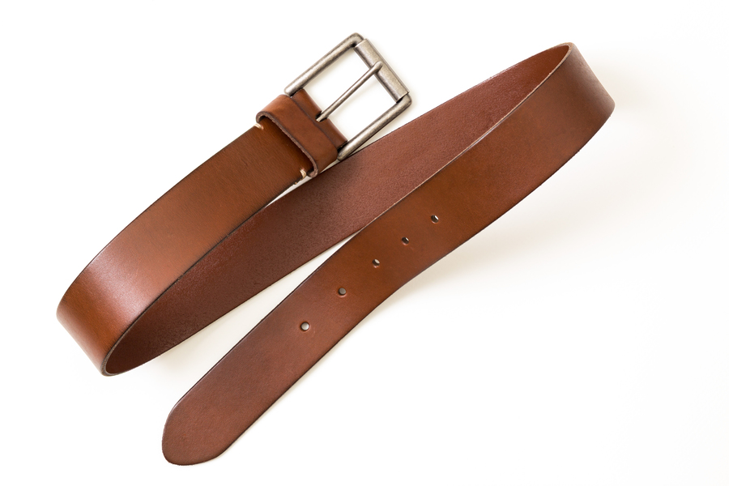
- `silk`  /sɪlk/   a soft type of cloth made from a thread produced by an insect (called a silkworm): This scarf is made of silk - a silk shirt
- `silkworm`  /ˈsɪlkwɜːrm/     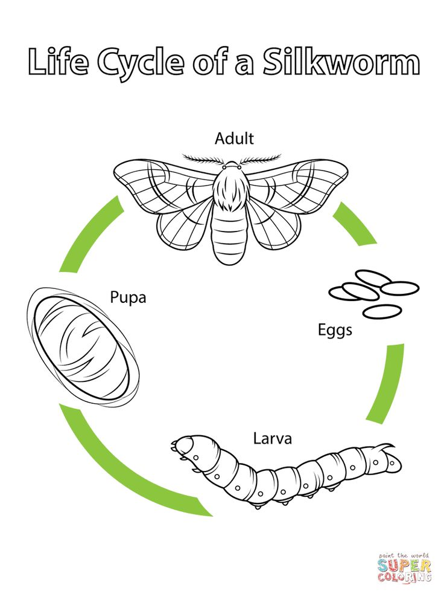
- `vest`  /vest/   1. (British) (American undershirt) a piece of clothing that you wear under your other clothes on the top part of your body   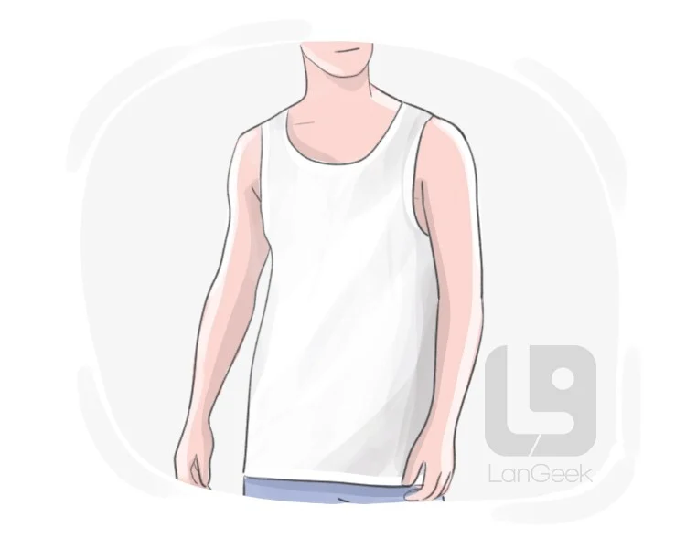   2. American English for waistcoat   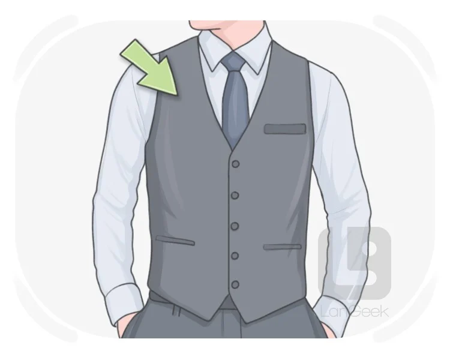
- `backpack`  /ˈbæk.ˌpæk/   a bag designed for carrying on the back   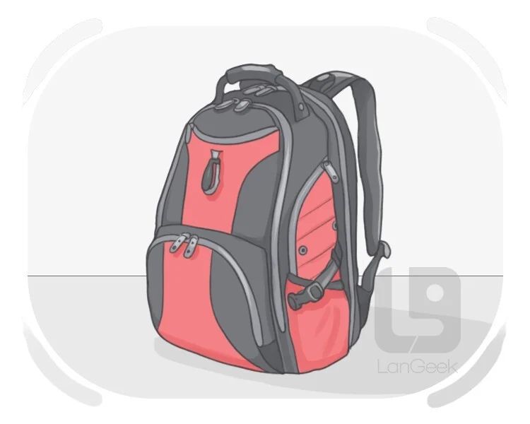
- `zip`  /zɪp/     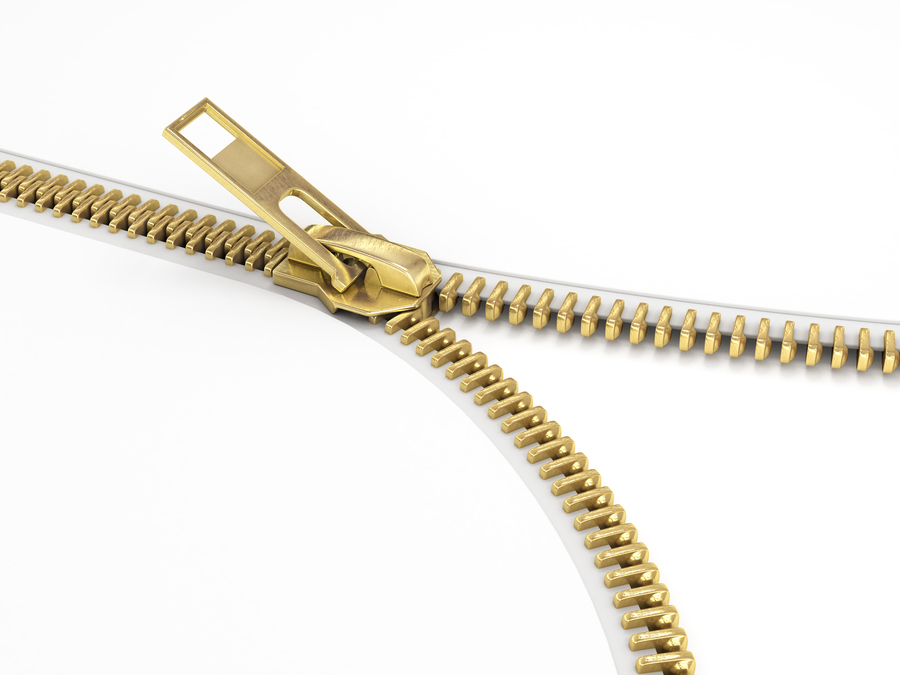
- `pocket`  /ˈpɑ:.kɪt/   a type of small bag in or on clothing, used for carrying small things such as money, keys, etc   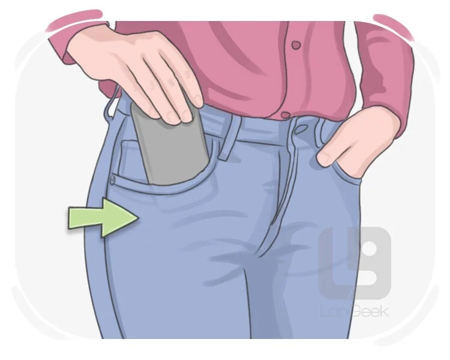
- `grocery`  /ˈɡroʊsəri/   a store that sells food and small things for the home
- `afterward`  /ˈæftərwərd/   after the time mentioned; later; after another thing has happened: We had tea, and afterward we sat in the garden for a while
- `upside down`    To describe something that has the upside part at the bottom, we use the expression upside down: Jane is hanging from the tree upside down. She will probably hurt herself   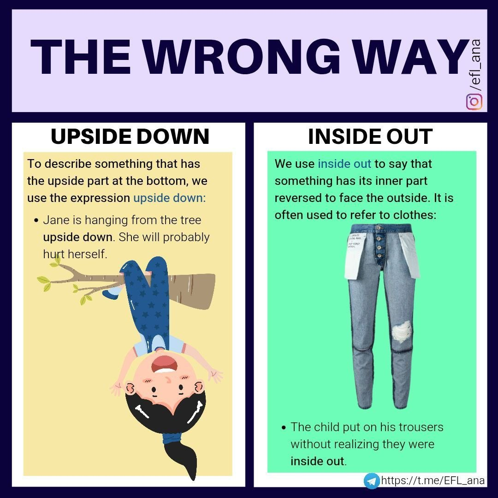
- `inside out`    We use inside out to say that something has its inner part reversed to face the outside. It is often used to refer to clothes: The child put on his trousers without realizing they were inside out   
- `photographer`  /fəˈtɑːɡrəfər/   person who takes photos
- `grinning (adjective)`  /ˈɡrɪn.ɪŋ/   having a wide smile: We looked from one grinning face to another
- `crowded (adjective)`  /ˈkraʊ.dɪd/   If a place is crowded, it is full of people
- `skirt`  /skɜr:t/   a piece of clothing for a woman or girl that hangs from the waist and covers part of the legs   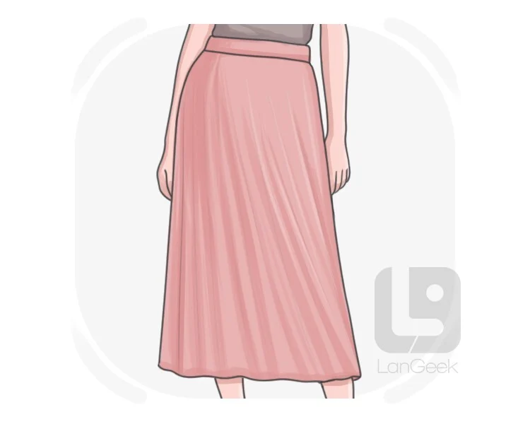
- `lizard`  /ˈlɪzərd/     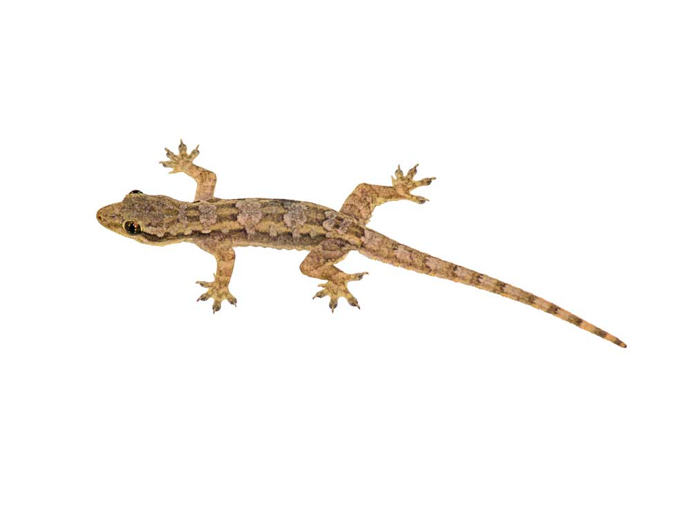
- `kitten`  /ˈkɪt̬.ən/   young cat
- `pan`  /pæn/   a metal pot that you use for cooking: a frying pan - a saucepan   
- `cash register`  /ˈkæʃ ˌredʒɪstər/   a machine used in shops that has a drawer for money and totals, displays, and records the amount of each sale   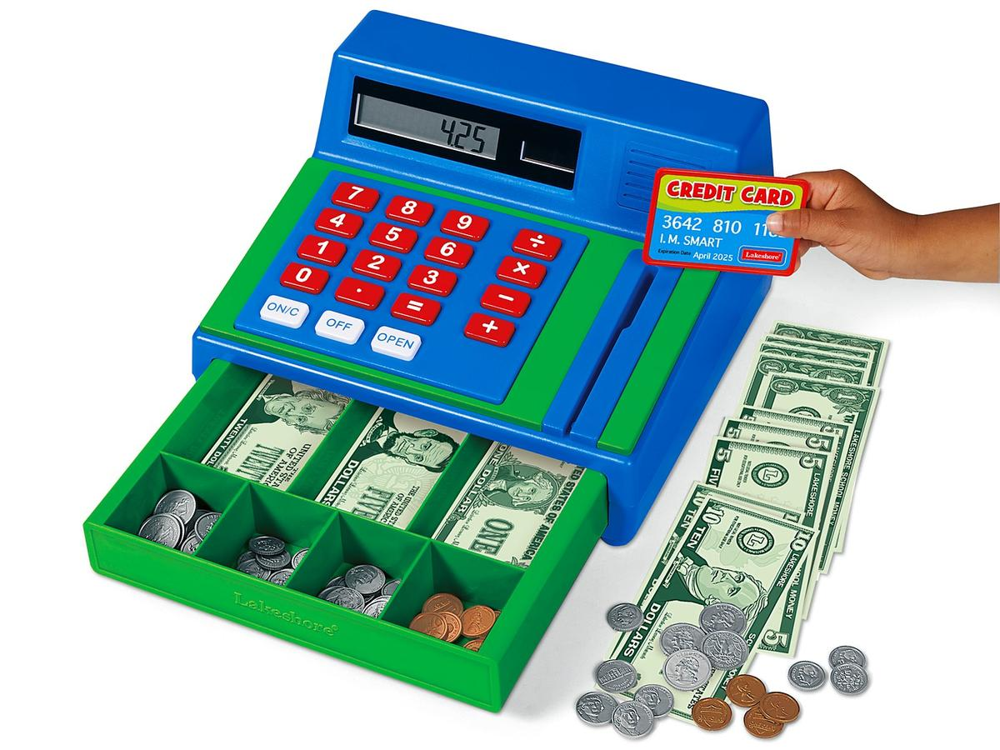

### Airport (23 words)
- `check (verb)`    1. to look at something to see that it is right, good or safe: Do the sums and then use a calculator to check your answers - Before driving off, I checked the oil and water - Check that all the windows are closed before you leave   2. American English for tick   `check in` to tell the person at the desk in a hotel or an airport that you have arrived: I have to check in an hour before my flight   `check out` to pay your bill and leave a hotel
- `all by myself`    I did it alone: He picked up a book all by himself
- `by myself`    alone: She couldn't read book by herself
- `tip (noun)`  /tɪp/   1. the pointed  or thin end of something: the tips of your fingers   2. a small, extra amount of money that you give to somebody who has done a job for you: I left a tip on the table   3. a small piece of advice: She gave me some useful tips on how to pass the exam
- `fee (noun)`  /fiː/   1. the money you pay for professional advice or service from private doctors, lawyers, schools, universities, etc: We can't afford private school fees - Most ticket agencies will charge a small fee   2. the money that you pay to do something, for example to join a club or visit a museum: There is no entrance fee to the gallery
- `citizen`  /ˈsɪt̬.ə.zən/   a person who has the legal right to belong to a particular country: She's Italian by birth but is now an Australian citizen - a British citizen
- `board (verb)`  /bɔːrd/   to get on a ship, bus, train, or plane: We boarded the plane at Gatwick - Flight BA 193 to Riyadh is now boarding (= is ready for passengers to get on)
- `abroad (adverb)`  /əˈbrɑːd/   in or to a foreign country: to go/travel/live/study abroad - She worked abroad for a year
- `surprised (adjective)`    If you are surprised, you feel or show surprise: I was surprised to see Tim yesterday _ I thought he was in Canada
- `surprising (adjective)`  /sərˈpraɪzɪŋ/   If something is surprising, it makes you feel surprise: The news was surprising
- `embassy`  /ˈem.bə.si/   a group of people whose job is to speak and act for their government in another country, or the building where they work: To get a visa, you should apply to the American embassy
- `goodness (noun)`  /ˈɡʊd.nəs/   1. the part of something, especially of food, that is good for health: Don't cook vegetables for too long - they'll lose all their goodness   2. the personal quality of being morally good: Mother Teresa's goodness is an example to us all
- `goodness (exclamation)`  /ˈɡʊd.nəs/   used to express any strong emotion, especially surprise: Goodness! How did you manage to get here so quickly?
- `raffle`  /ˈræf.əl/   an activity in which people buy tickets with different numbers, some of which are later chosen to win prizes, that is organized in order to make money for a good social purpose: I have never won anything in a raffle
- `spare (adjective)`  /sper/   1. extra; if something is spare, you do not use or need it all the time: a spare key/tyre - Do you have a spare pen? - You can stay with us tonight. We've got a spare room   2. Spare time is time when you are not working: What do you do in your spare time?
- `literally`  /ˈlɪtərəli/   1. in a literal way (SAME MEANING: exactly): The word ‘planet’ literally means ‘wandering body’   2. used to emphasize the truth of something that may seem surprising: There are literally hundreds of prizes to win   3. (informal) used to emphasize a word or phrase, even if it is not actually true in a literal sense: I literally jumped out of my skin
- `literal (adjective)`  /ˈlɪtərəl/   The literal meaning of a word is its original, basic meaning: The literal meaning of 'television' is 'seeing from a distance'
- `truth`  /truːθ/   being true; what is true: We need to find out the truth about what happened - Are you telling me the truth?
- `crime`  /kraɪm/   something that somebody does that is against the law: Murder and robbery are serious crimes - They had committed a crime
- `sneeze (verb)`  /sniːz/   to make air come out of your nose and mouth with a sudden loud noise, for example because you have a cold: Pepper makes you sneeze
- `pass (noun)`  /pæs/   1. doing well enough in an exam: How many passes did you get in your exams? (OPPOSITE: fail)   2. a special piece of paper or card that says you can go somewhere or do something: You need a pass to get into the factory   3. kicking, throwing or hitting a ball to somebody in a game   4. a road or way through mountains: the Brenner Pass
- `hall`  /hɑːl/   1. (American entryway, hallway) the room in a house that is near the front door and has doors to other rooms: You can leave your coat in the hall      2. a big room or building where a lot of people meet: a concert hall - We did our exams in the school hall
- `seem`  /siːm/   to give the effect of being; to be judged to be: He's 16, but he often seems (to be) younger - The children seemed (as if/as though/like they were) tired - It seems to me (that) (= I think that) he isn't the right person for the job

### News (28 words)
- `front page`    the first page of a newspaper, containing the most important or remarkable news of the day
- `headline (noun)`  /ˈhɛdlʌɪn/   1. the title of a news article printed in large letters, especially at the top of the front page on a newspaper or the home page on a news website   2. `the headlines` (plural) a short summary of the most important items of news, read at the beginning of a news programme on the radio or television
- `elevator`  /ˈelɪveɪtər/   a device like a box that moves up and down, carrying people or goods from one floor of a building to another or taking people up and down underground in a mine   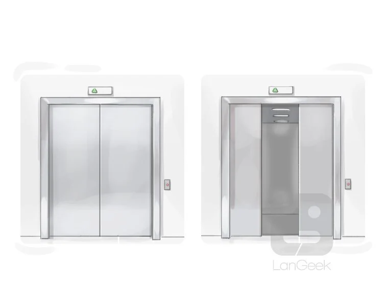
- `campaign`  /kæmˈpeɪn/   a planned set of actions to achieve a goal
- `charity`  /ˈtʃer.ə.t̬i/   an organization whose purpose is to give money, food, or help to those who need it, or to carry out activities such as medical research that will help people in need, and not to make a profit: UNICEF is an international charity
- `cousin`  /ˈkʌz.ən/   the child of your aunt or uncle
- `fog`  /fɑːɡ/   thick cloud which forms close to the ground, and whichis difficult to see through: The fog will clear by late morning   
- `prevention punishment (prevention is better than punishment) `    
- `border`    a line between countries: You need a passport to cross the border
- `yay`  /jeɪ/   used to show that you are very pleased about something: 'We won.' 'Yay!' - هورا
- `accuse (verb)`  /əˈkjuːz/   to say that somebody has done something wrong or broken the law: His classmates accused him of cheating in the exam - She was accused of murder
- `secretary`  /ˈsek.rə.ter.i/   1. a person who types letters, answers the telephone and does other things in an office   2. one of the most important people in a government: the Secretary of State (= head of the department) for Education
- `rob (verb)`  /rɑːb/   steal from: They robbed a bank
- `jail`  /dʒeɪl/   a prison: He was sent to jail for two years   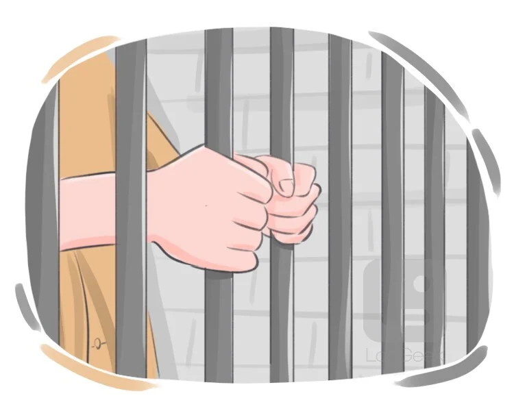
- `court`  /kɔːrt/   1. the place where a judge or a group of people (called  a jury) decide if a person has done something wrong, and what the punishment will be: The man will appear in court tomorrow   2. a piece of ground where you can play certain sports: a tennis court - a basketball court
- `billion`  /ˈbɪl.jən/   one thousand million; 1,000,000,000
- `crumb`  /krʌm/   small piece of food   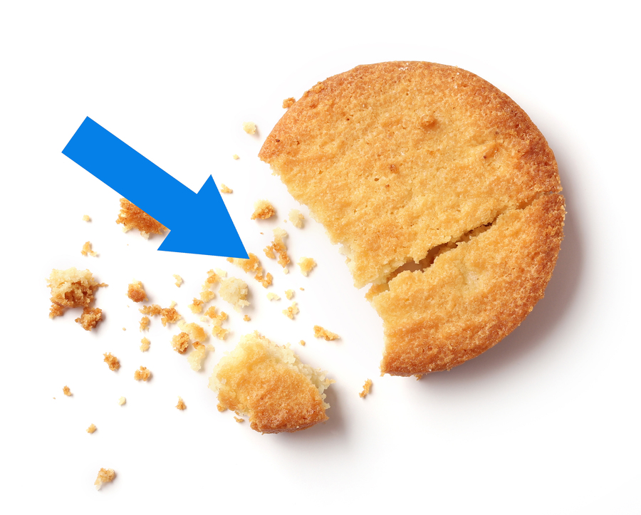
- `detective`  /dɪˈtek.tɪv/   a person whose job is to find out who did a crime. Detectives are usually police officers: Sherlock Holmes is a famous detective in stories
- `leave (verb)`  /liːv/   1. to go away from a place or a person: The train leaves at 8.40 - At what age do must people leave school in your country? - We are leaving for France tomorrow   2. to let somebody or something stay in the same place or in the same way: Leave the door open, please   3. to forget to bring something with you: I left my books at home - I can't find my glasses. Maybe I left them behind at work   4. to make something stay; to not use something: Leave some cake for me   5. to give something to somebody when you die: She left all her money to her two sons   6. to give the responsibility for something to another person: I'll leave it to you to organize the food   `be left` to still be there after everything else has gone: There is only one piece of cake left   `leave somebody or something alone` to not touch, annoy or speak to somebody or something: Leave me alone _ I'm busy - Leave that bag alone _ it's mine   `leave somebody or something out` to not put in or do something; to not include somebody or something: The other children left him out of the game - I left out question 3 in the exam because it was too difficult
- `prevention`  /prɪˈven.ʃən/   stopping somebody form doing something or stopping something from happening: crime prevention - Exercise and diet play a role in the prevention of heart disease
- `punishment (noun)`  /ˈpʌn.ɪʃ.mənt/   an act or a way of punishing somebody: What is the punishment for murder in your country? - The child was sent to bed as a punishment for being naughty
- `punish (verb)`  /ˈpʌn.ɪʃ/   to make somebody suffer because they have done something wrong: The children were punished for telling lies
- `suffer (verb)`  /ˈsʌfər/   to feel pain, sadness or another unpleasant feeling: She suffers from bad headaches - It's not right for children to suffer
- `murder`  /ˈmɜːrdər/   the unlawful killing of another human
- `unlawful (adjective)`  /ʌnˈlɑː.fəl/   not allowed by law
- `crash (noun)`  /kraʃ/   1. an accident when something that is moving hits another things: He was killed in a car crash - a plane crash   2. a loud noise when something falls or hits another thing: I heard a crash as the tree fell
- `crash (verb)`  /kraʃ/   1. to have an accident in a car or other vehicle and hit something: The bus crashed into a tree - I crashed my father's car   2. to fall or hit something with a loud noise: The tree crashed to the ground   3. If a computer crashes, it suddenly stops working
- `landlord`  /ˈlænd.lɔːrd/   a man who rents a house or room to people for money

### Wildlife (37 words)
- `jungle`  /ˈdʒʌŋ.ɡəl/   a thick forest in a hot part of the world (the tropics): the jungles of South America and Africa
- `bench`  /bentʃ/   a long, usually hard seat for two or more people, often found in public places: They sat on a park bench   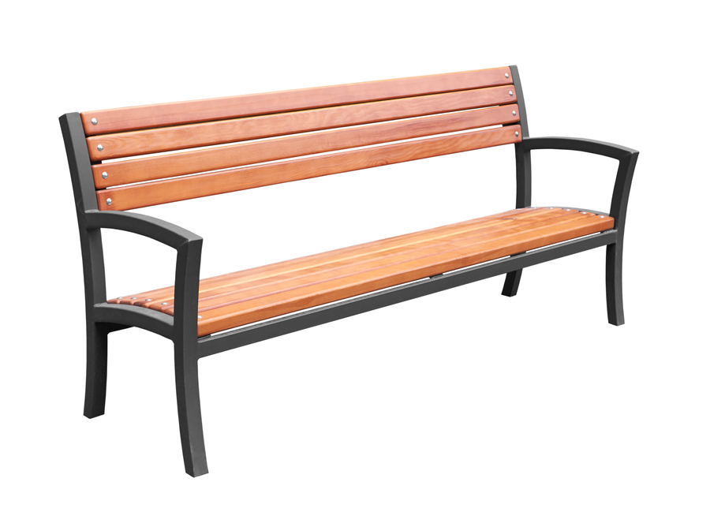
- `temple`  /ˈtem.pəl/   a building where people go to say prayers to a god or gods
- `prayer`  /prer/   the words that someone says or thinks when they are praying
- `pray (verb)`  /preɪ/   to speak to God or a god: They prayed to God for help
- `parrot`  /ˈper.ət/   a bird that can talk   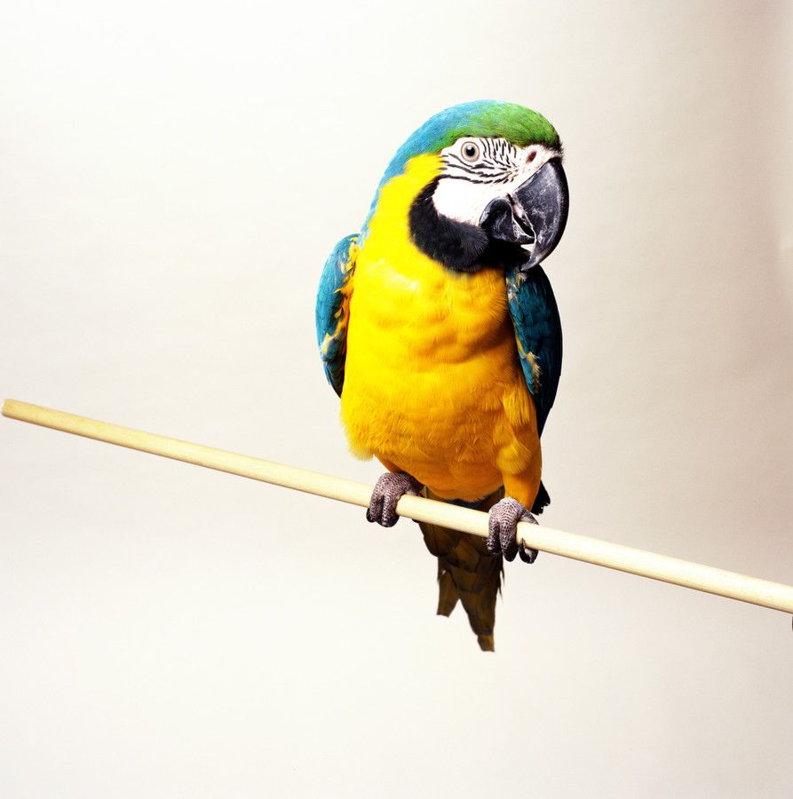
- `cage`  /keɪdʒ/   a box for keeping animals   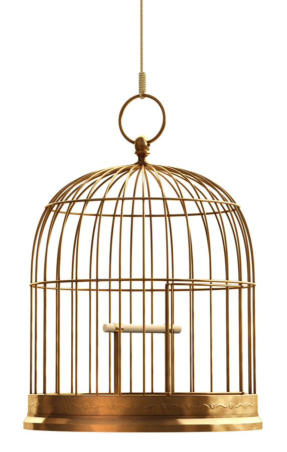
- `recognize`  /ˈrek.əɡ.naɪz/   1. to know again somebody or something that you have seen or heard before: I didn't recognize you without your glasses   2. to know that something is true: They recognize that there is a problem
- `predator`  /ˈpredətər/   an animal that hunts, kills, and eats other animals: lions, wolves, and other predators
- `caught`  /kɑːt/   past simple and past participle of catch
- `humid (adjective)`  /ˈhjuː.mɪd/   (used about the weather or climate) warm and wet (SAME MEANING: damp): The island is hot and humid
- `mildew`  /ˈmɪl.duː/   a type of fungus that grows in damp places
- `fungus`  /ˈfʌŋ.ɡəs/   any plant without leaves, flowers or green coloring, that grows on other plants or on other surfaces. Mushrooms are fungi
- `fungi`  /ˈfʌŋ.ɡaɪ/   plural of fungus
- `expression`  /ɪkˈspreʃ.ən/   1. the look on your face that shows how you feel: an expression of surprise   2. a word or group of words; a way of saying something: The expression 'to drop off' means 'to fall asleep'
- `ventilation`  /ˌventəˈleɪʃən/   airflow system; the movement of fresh air around a closed space, or the system that does this
- `heat (noun)`  /hiːt/   high temperature (OPPOSITE: cold)
- `vent`  /vent/   a small opening that allows air, smoke, or gas to enter or leave a closed space   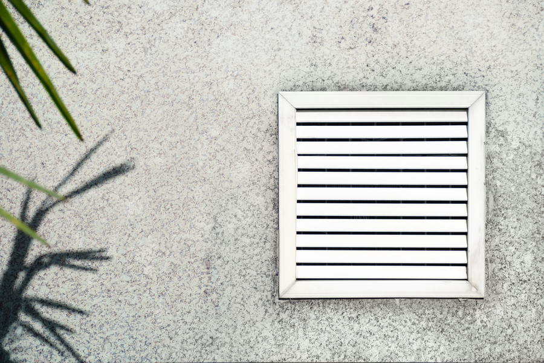
- `basket`  /ˈbæs.kət/   a container made of thin sticks or thin pieces of plastic or metal, that you use for holding or carrying things: a shopping basket - a laundry/clothes basket   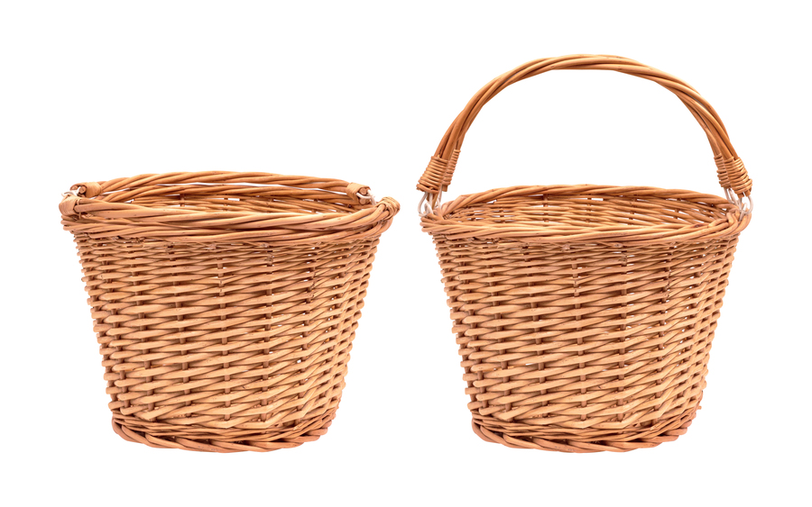
- `beer`  /bɪr/   1. (no plural) an alcoholic drink made from grain: a pint of beer   2. (plural beers) a glass, bottle or can of beer: Three beers, please
- `leaves`  /liːvz/   plural of leaf
- `leaf`  /liːf/   one of the flat green parts that grow on a plant or tree: Leaves fall from the trees in autumn   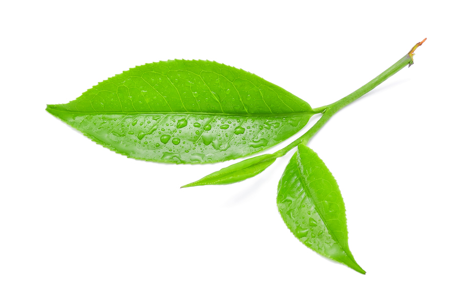
- `bright`  /braɪt/   1. with a lot of light: It was a bright sunny day - That lamp is very bright   2. with a strong color: a bright yellow shirt   3. clever: She is the brightest child in the class
- `go back`    to return
- `plant (verb)`  /plænt/   to put plants or seeds in the ground: We planted some roses in the garden
- `recycle`  /ˌriːˈsaɪ.kəl/   to sort and collect rubbish in order to treat it and produce useful materials that can be used again: Shall I just throw this bottle away, or do you recycle?   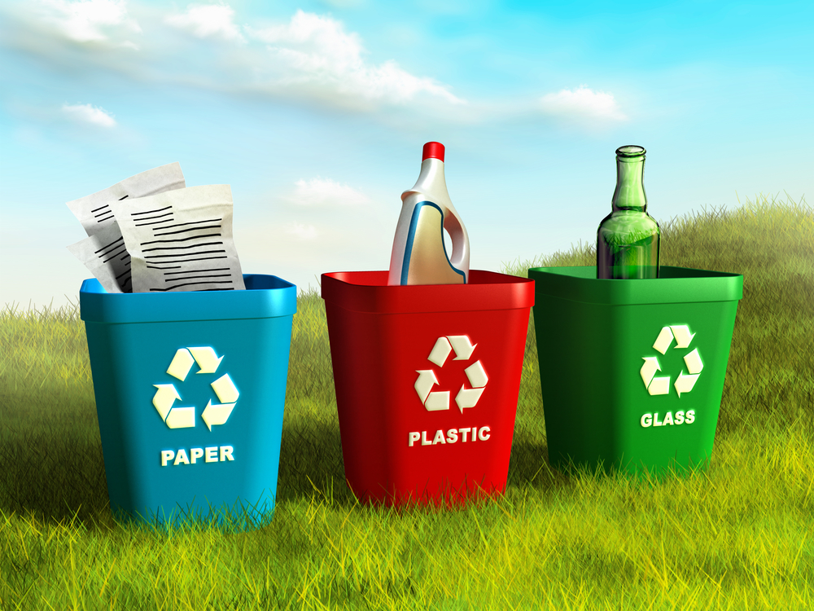
- `secondhand (adjective, adverb)`  /ˈsek·əndˈhænd/   not new; used by another person before: second-hand books - I bought this car second-hand
- `nature`  /ˈneɪtʃər/   1. (no plural) all the plants, animals, etc. in the world and all the things that happen in it that are not made or caused by people: the beauty of nature   2. (plural natures) the way a person or thing is: Our cat has a very friendly nature
- `potted plant`  /ˈpɑːtɪd ˈplænt/   a plant that is grown in a pot   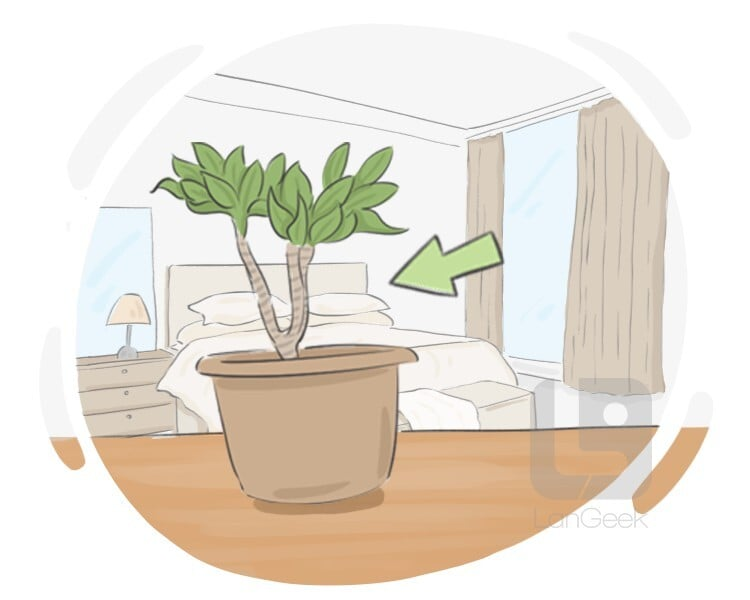
- `shovel`  /ˈʃʌv.əl/   a tool for digging   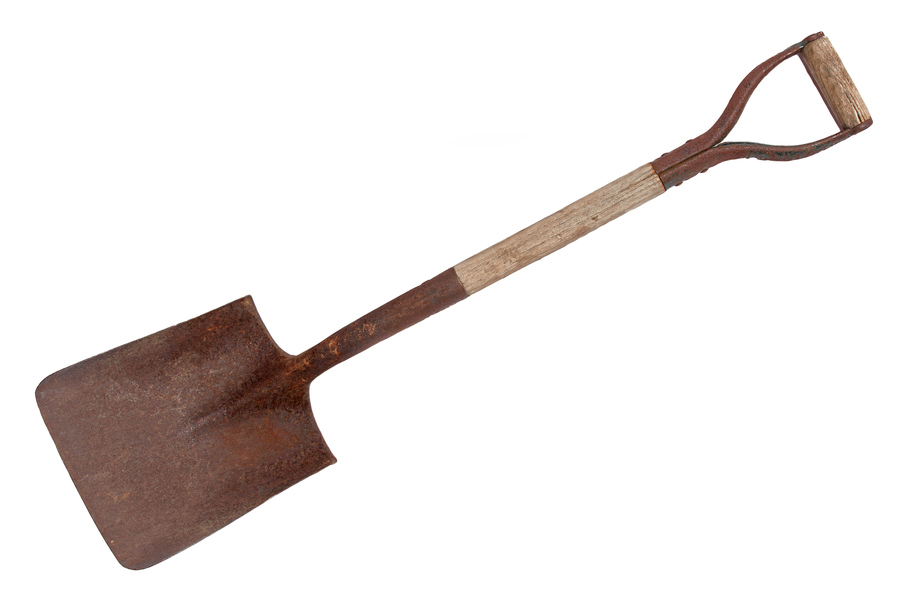
- `obvious (adjective)`  /ˈɑːb.vi.əs/   easy to see or understand (SAME MEANING: clear): it's obvious that she's not happy
- `thoughtful`  /ˈθɑːt.fəl/   1. thinking carefully: She listened with a thoughtful look on her face   2. thinking about other people (SAME MEANING: kind, considerate): It was very thoughtful of you to cook us dinner
- `tent`  /tent/   a kind of small house made of cloth. You sleep in a tent when you go camping: We put up our tent   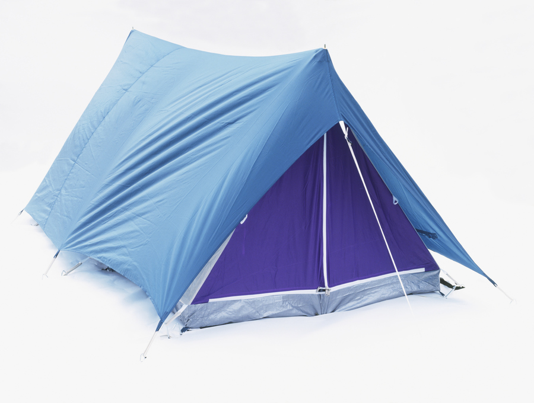
- `lake`  /leɪk/   a large area of water surrounded by land and not connected to the sea except by rivers or streams   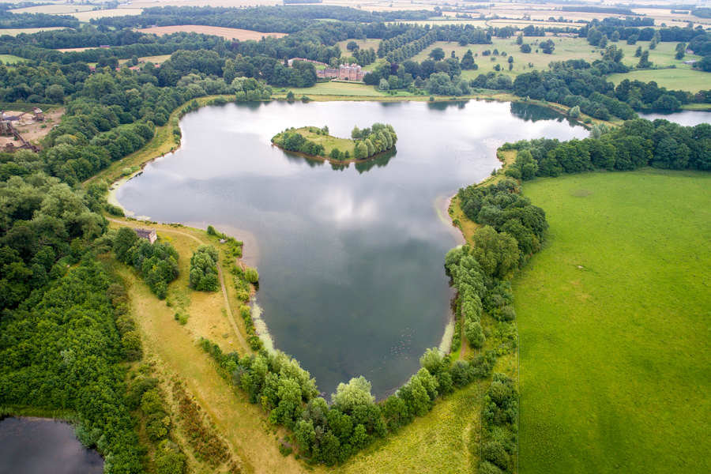
- `soap`  /soʊp/   a substance that you use with water for washing and cleaning: a bar of soap   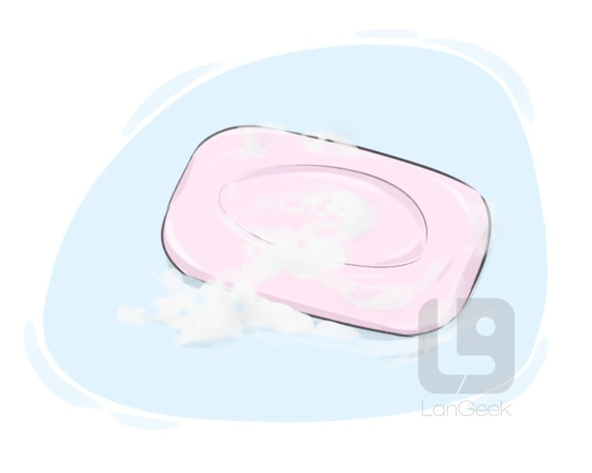
- `allergic`  /əˈlɜːrdʒɪk/   having an allergy: He's allergic to cow's milk
- `allergy`  /əˈlɜːrdʒi/   a medical condition that makes you ill when you eat, touch or breathe something that does not normally make other people ill: She has an allergy to cats

### Old Times (38 words)
- `stream (noun)`  /striːm/   1. a small river: a mountain stream   2. moving liquid, or moving things or people: a stream of blood - I've had a steady stream of visitors
- `sunrise`  /ˈsʌnrʌɪz/   the time in the morning when the sun comes up: They were up before sunrise
- `sunset`  /ˈsʌnsɛt/   the time in the evening when the sun goes down: The park closes at sunset
- `trail (noun)`  /treɪl/   1. a line of marks that show which way a person or thing has gone: There was a trail of blood across the floor   2. a path in the country: We followed the trail through the forest
- `horrify (verb)`  /ˈhɔːr.ə.faɪ/   to shock and frighten somebody: Everyone was horrified by the murders
- `cross (verb)`  /krɑːs/   1. to go from one side of something to the other: Be careful when you cross the road   2. to put one thing over another thing: She sat down and crossed her legs   `cross something out` to draw a line through a word or words, for example because you have made a mistake: I crossed the word out and wrote it again
- `violet`  /ˈvaɪə.lət/   a purple color
- `sweat (verb)`  /swet/   to lose water from the body; to produce liquid through your skin because you are hot, ill or afraid: I am sweating after running   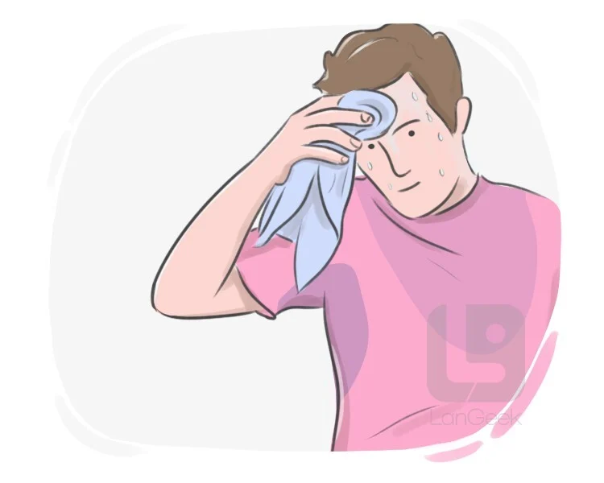
- `corn`  /kɔrn/   a tall plant with large yellow seeds that grow together on a cob, which is cooked and eaten as a vegetable or animal food   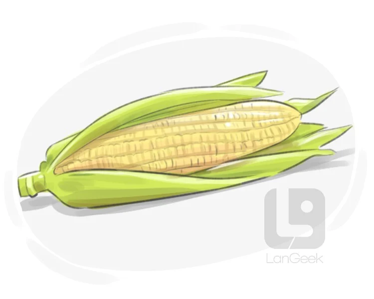
- `channel`  /ˈtʃæn.əl/   1. a TV station: Which channel is the film on?   2. a long narrow place where water can go: the English Channel (= the sea between England and France)
- `narrow (adjective)`  /ˈnæroʊ/   1. not far from one side to the other: The bridge was very narrow - a narrow ribbon (OPPOSITE: broad or wide)   2. by a small amount: We had a narrow escape _ the car nearly hit a tree - a narrow defeat
- `deter (verb)`  /dɪˈtɜːr/   to prevent someone from doing something or to make someone less enthusiastic about doing something
- `fly (noun)`  /flaɪ/   a small insect with two wings   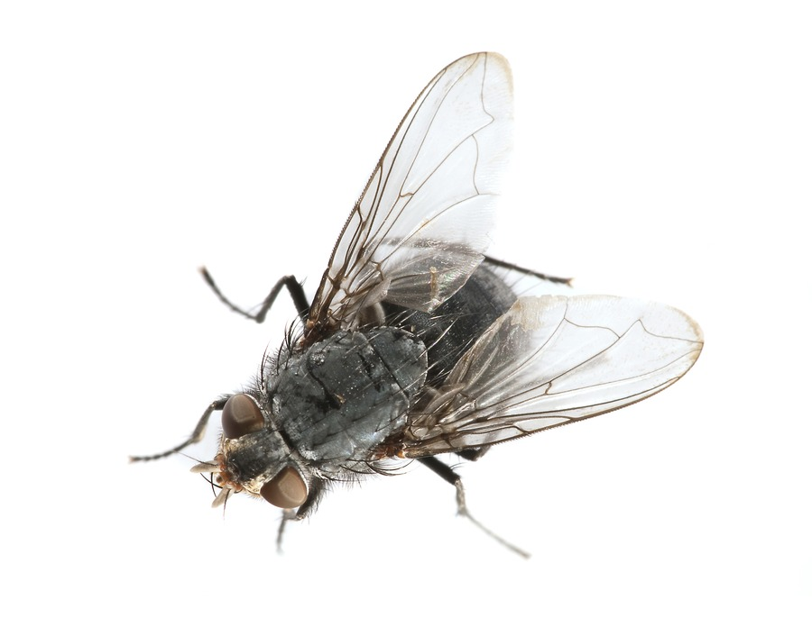
- ``    
- `outdoors (adverb, noun)`  /ˌaʊtˈdɔːrz/   not in a building; outside (OPPOSITE: indoors): In summer we sometimes eat outdoors - Come to Canada and enjoy the great outdoors
- `indoors (adverb)`  /ˌɪnˈdɔːrz/   in or into a building: Let's go indoors. I'm cold (OPPOSITE: outdoors)
- `indoor (adjective)`  /ˈɪndɔːr/   done or used inside a building: an indoor swimming pool - indoor games (OPPOSITE: outdoor)
- `outdoor (adjective)`  /ˈaʊtdɔːr/   happening, existing or used outside a building: an outdoor swimming pool/festival - outdoor clothes
- `pickleball`  /ˈpɪk.əl.bɑːl/   a game played in the US that is similar to tennis, but played close to the net with short wooden bats and a plastic ball with holes in it   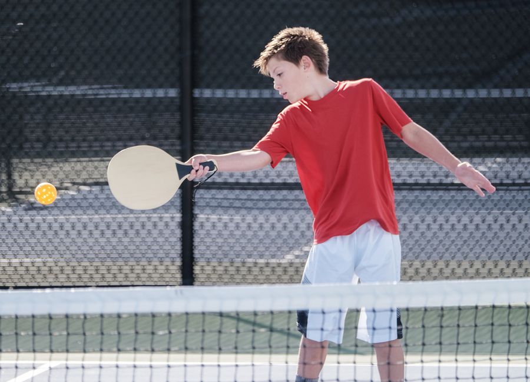
- `sneaker`  /ˈsniːkər/   a type of light, comfortable shoe that is suitable for playing sports   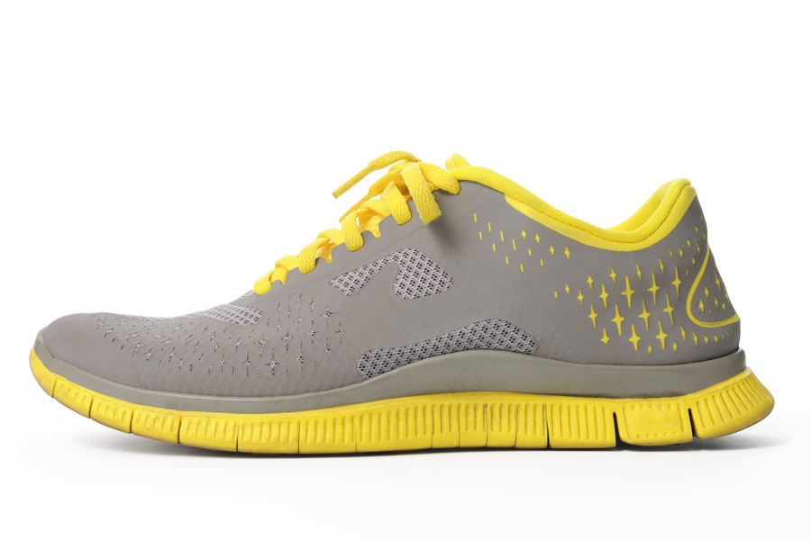
- `sheet`  /ʃiːt/   1. a big piece of thin material for a bed: I put some clean sheets on the bed   2. a thin flat piece of something like paper, glass or metal: a sheet of writing paper
- `swept`  /swept/   past simple and past participle of sweep
- `sweep`  /swiːp/   1. to clean something by moving dirt or rubbish away with a brush: I've swept the floor   2. to push something along or away quickly and strongly: The bridge was swept away by the floods
- `hand (verb)`    to put something into somebody's hand: Can you hand me the scissors, please? - I handed the money to the shop assistant   `hand something down` to pass something from an older person to a younger one: He never had any new clothes _ they were all handed down from his older brothers   `hand something in` to give something to somebody: The teacher asked us to hand in our homework   `hand something out` to give something to many people: Please hand out these books   `hand something over` to give something to somebody: 'Hand over your weapons'
- `cereal`  /ˈsɪr.i.əl/   1. (plural cereals) a plant that farmers grow so that we can eat the grain (= the seed): Wheat and oats are cereals   2. (no plural) a food made from grain, that you can eat for breakfast with milk: a bowl of cereal with milk   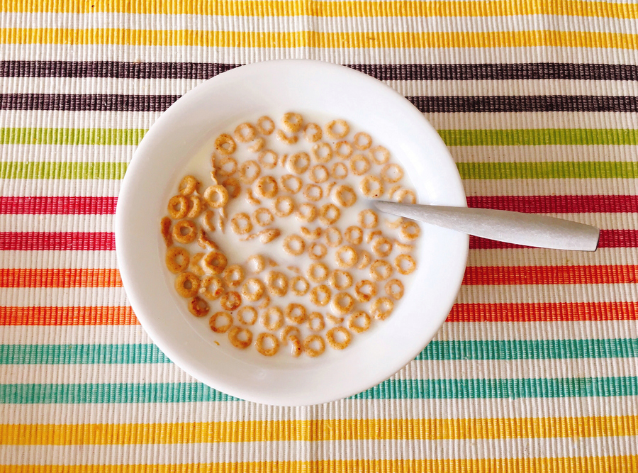
- `lucky (adjective)`  /ˈlʌk.i/   1. having good luck: She is lucky to be alive after the accident (OPPOSITE: unlucky)   2. bringing success or good luck: My lucky number is 3 (OPPOSITE: unlucky)
- `potato chip`  /pəˈteɪ.t̬oʊ ˌtʃɪp/   a very thin, often round piece of fried potato, sometimes with a flavour added, sold especially in plastic bags   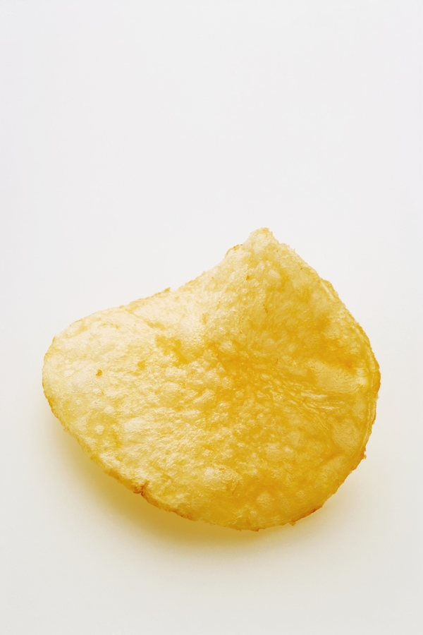
- `potato`  /pəˈteɪ.t̬oʊ/   a round vegetable that grows underground and has white flesh with light brown, red, or pink skin, or the plant on which these grow   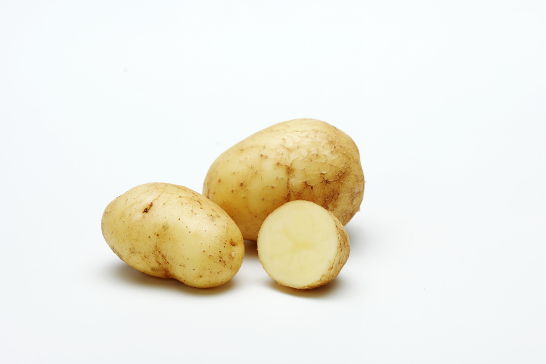
- `religion (noun)`  /rɪˈlɪdʒ.ən/   1. (no plural) believing in a god or gods and the activities connected with this   2. (plural religions) one of the ways of believing in a god or gods: Christianity, Islam and other world religions
- `patience (noun)`  /ˈpeɪ.ʃəns/   ability to wait calmly; staying calm and not getting angry when you are waiting for something, or when you have problems: Learning to play the piano takes hard work and patience - She was walking so slowly that her sister finally lost patience with her (= became angry with her) (OPPOSITE: impatience)
- `tax (noun)`  /tæks/   money that you have to pay to the government. You pay tax from the money you earn or when you buy things: There is a tax on cigarettes in this country
- `accountant`  /əˈkaʊntənt/   a person whose job is to make lists of all the money that people or businesses receive and pay; someone who keeps or examines the records of money received, paid, and owed by a company or person: Nicky is an accountant
- `crane (noun)`  /kreɪn/   1. a big machine with a long metal arm for lifting heavy things   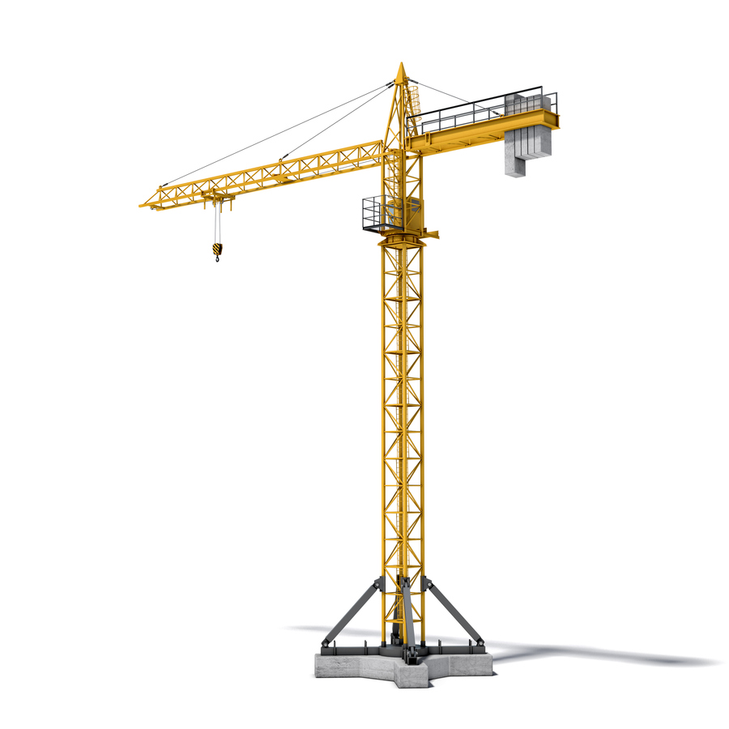   2. a large bird with long legs and necks   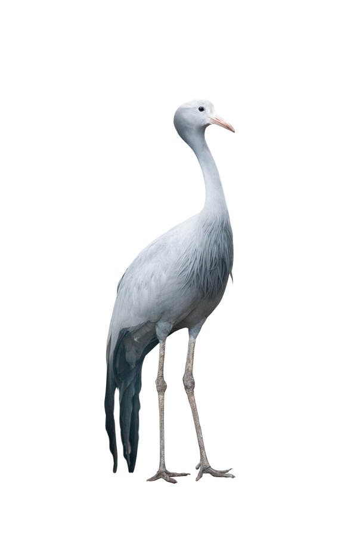
- `deadline`  /ˈded.laɪn/   a day or time before which you must do something: The deadline for finishing this essay is next Tuesday
- `fold (verb)`  /foʊld/   1. to bend something so that one part is on top of another part: I folded the letter and put it in the envelope - Fold up your clothes (OPPOSITE: unfold)   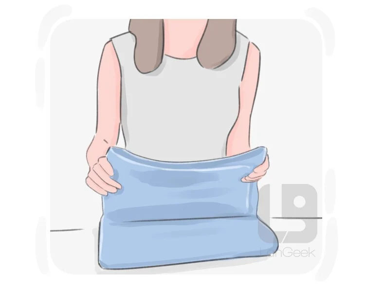   2. to be able to be made smaller in order to be carried or stored more easily: a folding chair - This table folds up flat   `fold your arms` If you fold your arms, you cross them in front of your chest: She folded her arms and waited   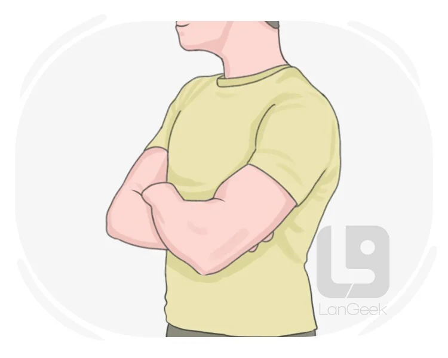
- `fold (noun)`  /foʊld/   a line that is made when you bend cloth or paper
- `paper crane`    a bird shape made of paper   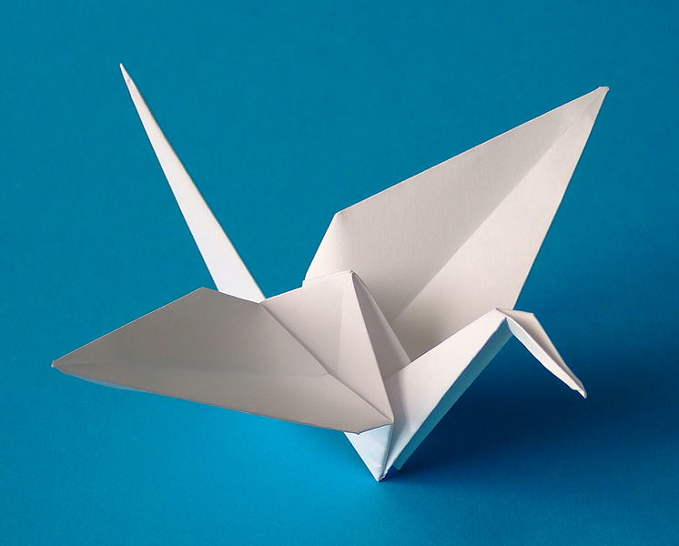
- `spooky (adjective)`  /ˈspuː.ki/   strange and frightening: spooky house

### Romance (34 words)
- `romance`  /roʊˈmæns/   1. a time when two people are in love: a romance between a doctor and a nurse   2. a story about love: She writes romances
- `workout`  /ˈwɜːrkaʊt/   a period of physical exercise
- `tear (verb)`  /ter/   1. to damage something by pulling it apart or making an untidy hole in it: She tore her dress on a nail - I tore the piece of paper in half - I can't use this bag _ It's torn   2. to come apart; to break: Paper tears easily   3. to take something from somebody or something in a quick and violent way: He tore the bag out of her hands   4. to move somewhere very fast: He tore down the street   `tear something up` to destroy something by pulling it into small pieces: I tore the letter up and threw it away
- `tear 1 (noun)`  /ter/   where it has been torn; an untidy hole in something like paper, cloth, or other material: You've got a tear in your jeans
- `tear 2 (noun)`  /tɪr/   a drop of water that comes from your eye when you cry: I was in tears (= crying) at the end of the film - She read the letter and burst into tears (= suddenly started to cry)
- `nightclub`  /ˈnaɪt.klʌb/   a place where you can go late in the evening to drink and dance (SAME MEANING: club)
- `social`  /ˈsoʊ.ʃəl/   connected with people together in society; connected with being with other people: the social problems of big cities - Anne has a busy social life (= she goes out with friends a lot)
- `break (verb)`  /breɪk/   1. to make something go into smaller pieces, for example by dropping it or hitting it: He broke the window - She has broken her arm   2. to go into smaller pieces, for example by falling or hitting: I dropped the cup and it broke   3. to stop working; to damage a machine so that it stops working: You've broken my watch   4. to do something that is against the law or against what has been agreed or promised: People who break the law must be punished - I never break my promises   `break down` 1. If a machine or car breaks down, it stops working: We were late because our car broke down   2. If a person breaks down, they start to cry: He broke down when he heard the news   `break in; break into something` to go into a place by breaking a door or window so that you can steal something: Thieves broke into the house. They broke in through a window   `break off` to take away a piece of something by breaking it: He broke off a piece of chocolate for me   `break out` 1. to start suddenly: A fire broke out last night   2. to get free from a place like a prison: Four prisoners broke out of the jail last night   `break up` (British) to start the school holidays: We break up at the end of July   `break up with somebody` to end a relationship with somebody: Susy broke up with her boyfriend last week
- `upset (adjective)`  /ʌpˈset/   1. unhappy or worried: The children were very upset when their dog died   2. ill: I've got an upset stomach
- `nap`  /næp/   a short sleep
- `point (noun)`  /pɔɪnt/   1. a fact, an idea or an opinion: You made some interesting points (= said some interesting things) in your essay   2. the purpose of, or the reason for, doing something: The point of going to school is to learn - What's the point of going to her house? She's not at home - There's no point in waiting for Julie _ she isn't coming   3. a particular moment in time: It started to rain and at that point we decided to go home   4. a particular place: No parking beyond this point   5. a small round mark (.) that we use when writing part of a number (called a decimal): 2.5 (= two point five)   6. the sharp end of something: the point of a needle   7. a mark that you win in a game or sport: Our team scored six points   `be on the point of doing something` If you are on the point of doing something, you are going to do it very soon: I was on the point of leaving when he turned up
- `needle`  /ˈniː.dəl/   1. a thin metal pin, used in sewing, that is pointed at one end and has a hole called an eye at the other end for thread   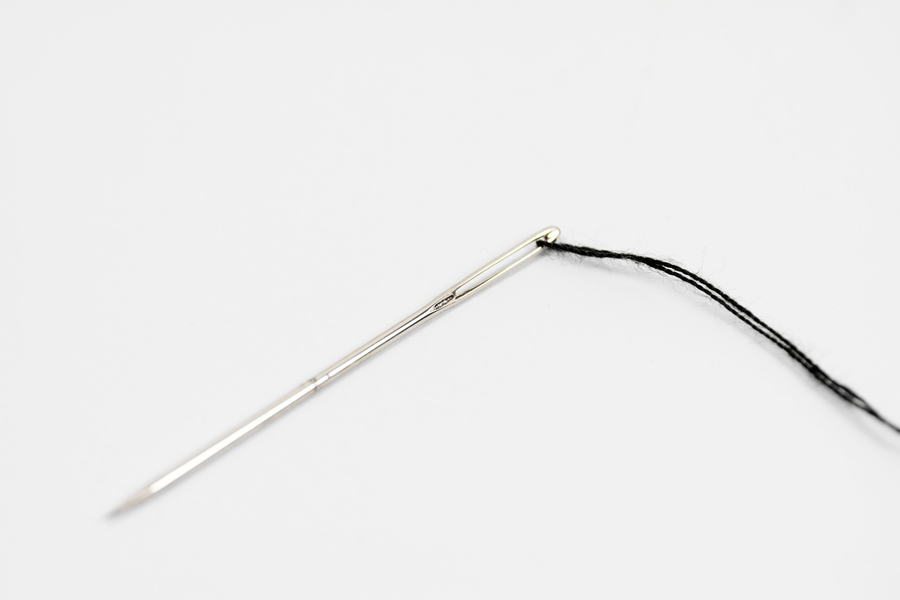   2. a very thin, hollow, pointed piece of metal that is connected to a syringe and used to take blood from the body or to put drugs or medicine in   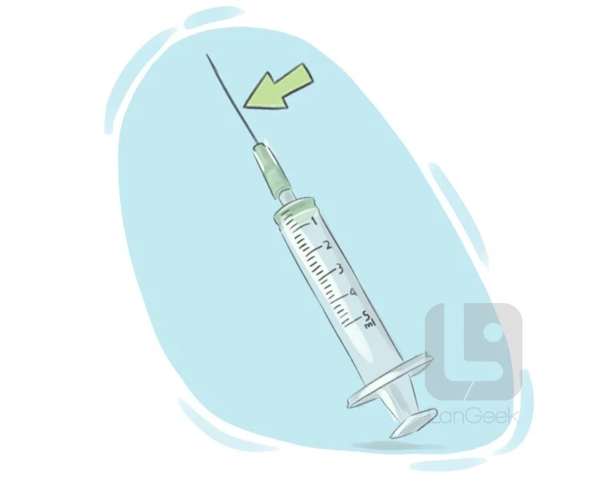   3. a pine tree's leaf that is thin and hard: cactus needle   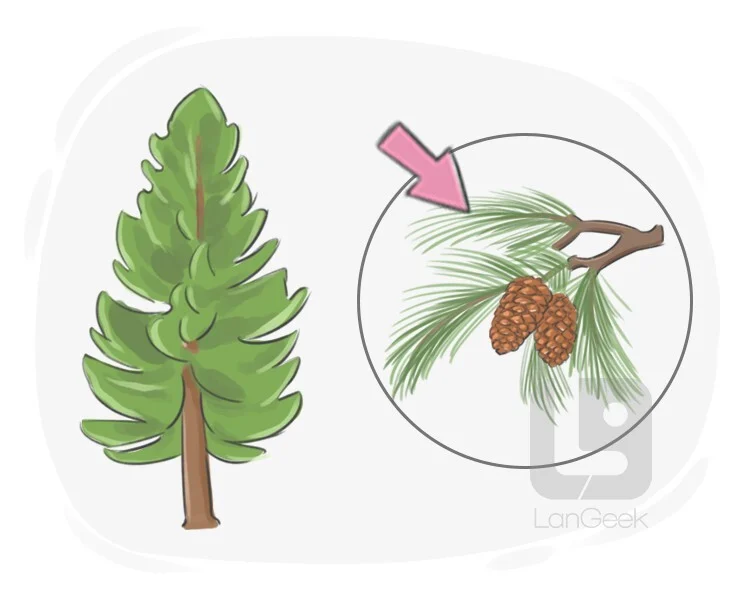
- `nightlife (noun)`  /ˈnaɪt.laɪf/   things to do in the evenings in a particular area, such as dancing or going to bars: What's the nightlife like round here?
- `wives`  /waɪvz/   plural of wife
- `have (verb)`  /hæv/   1. (also have got) to own or keep something: She has blue eyes - They've got (= have got) a big car - Do you have any brothers and sisters?   2. a word that you use with many nouns to talk about doing something: What time do you have breakfast? - Let's have a drink - I had a shower - Jill and I have had a fight   3. a word that you use with many nouns to talk about experiencing something: Have fun! - He has had an accident - Did you have a good holiday? - I have an idea - Have you got time to help me?   4. (also have got) to be ill with something: She's got (= has got) a headache - I have flu   `have something done` to let somebody do something for you: I had my hair cut yesterday - Have you had your car mended?   `have somebody over` to invite someone to your home for a visit, meal, etc.: We're having some friends over for dinner on Saturday - Why don't you have them over sometime? - We had my parents over last weekend
- `babysitting (noun)`  /ˈbeɪ.biˌsɪt̬.ɪŋ/   taking care of a child
- `craft (noun)`  /kræft/   a job or activity for which you need skill with your hands: Pottery is a traditional craft
- `supply (noun)`  /səˈplaɪ/   a store or an amount of something that you need: Food supplies were dropped by helicopter - The water supply was cut off - bag of art supplies (= materials used for making art)
- `supply (verb)`  /səˈplaɪ/   to give or sell something that somebody needs: The school supplies us with books - The lake supplies water to thousands of homes
- `glitter (noun)`  /ˈglɪdər/   small pieces of shiny material used as decoration   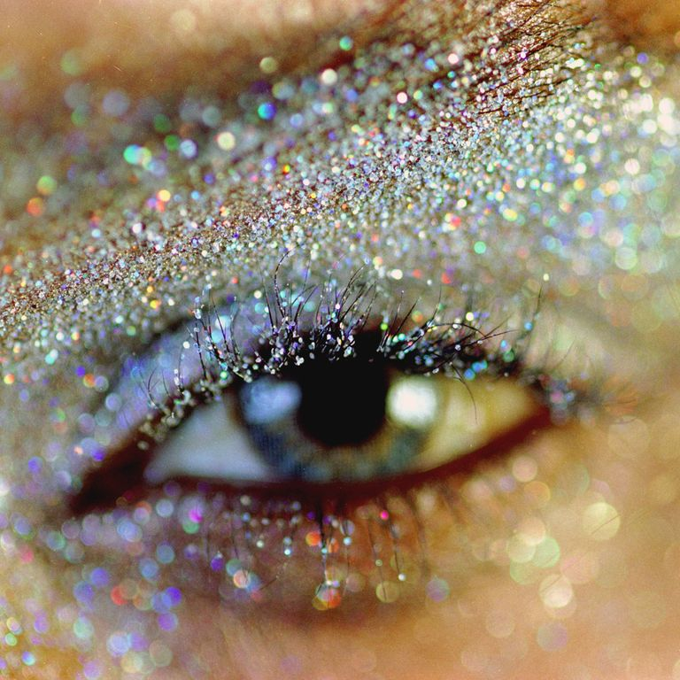
- `owe (verb)`  /oʊ/   1. to have to pay money to somebody: I lent you $10 last week and $10 the week before, so you owe me $20   2. to have something because of a particular person or thing: He owes his life to the man who pulled him out of the river - She owes her success to hard work
- `brush`  /brʌʃ/   an object with short pieces of stiff hair, plastic, or wire attached to a base or handle, used for cleaning, arranging your hair, or painting   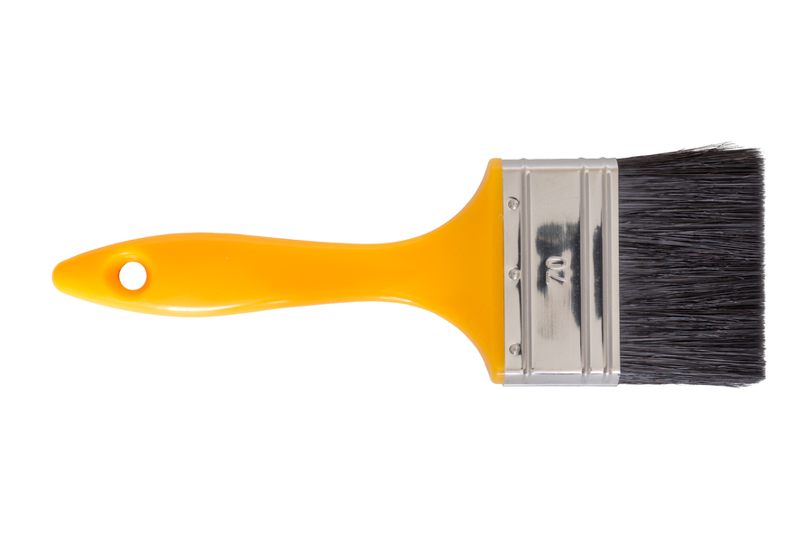
- `memories`  /ˈmɛm ə riz /   plural of memory
- `hurry (noun)`  /ˈhʌri/   `in a hurry` needing or wanting to do something quickly: I can't talk to you now _ I'm in a hurry
- `grape`  /ɡreɪp/   a small, round, purple or pale green fruit that you can eat or make into wine   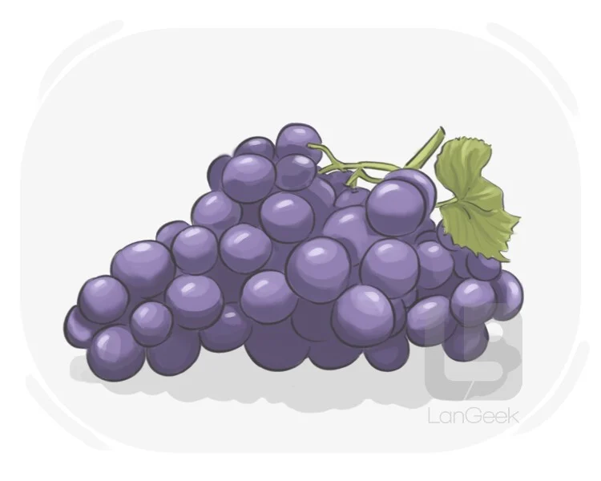
- `passionate (adjective)`  /ˈpæʃ.ən.ət/   having or showing very strong feelings: a passionate kiss
- `careless (adjective)`  /ˈker.ləs/   not thinking enough about what you are doing so that you make mistakes: Careless drivers can cause accident
- `chip (verb)`  /tʃɪp/   to break a small piece off something   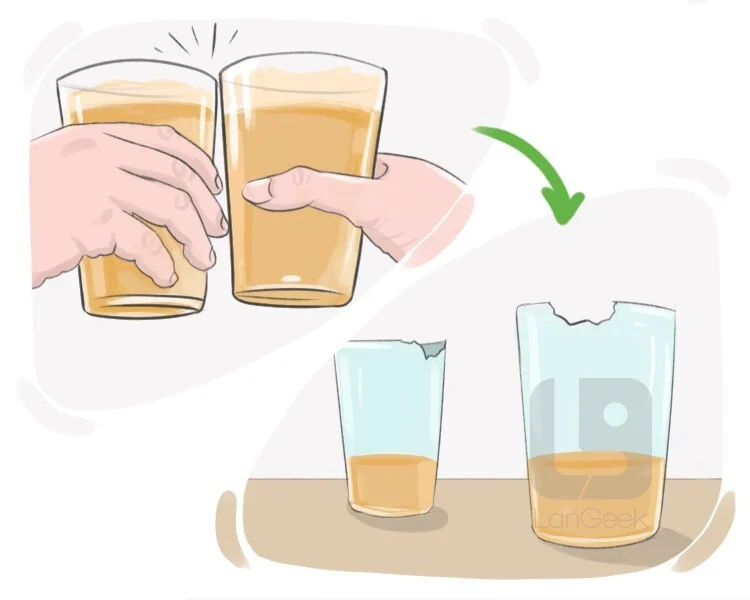
- `slip (verb)`  /slɪp/   1. to move smoothly over something by accident and fall or almost fall; fall because of losing balance: He slipped on the ice and broke his leg   2. to go quickly and quietly so that nobody sees you: Ann slipped out of the room - We slipped away when no one was looking   3. to put something in a place quickly and quietly: He slipped the money into his pocket   `slip up` (informal) to make a mistake
- `mysterious (adjective)`  /mɪˈstɪr.i.əs/   not easy to understand or explain; strange, not known, or not understood: The story is very mysterious
- `nachos`  /ˈnɑːtʃəʊz/   crispy chips with cheese or toppings   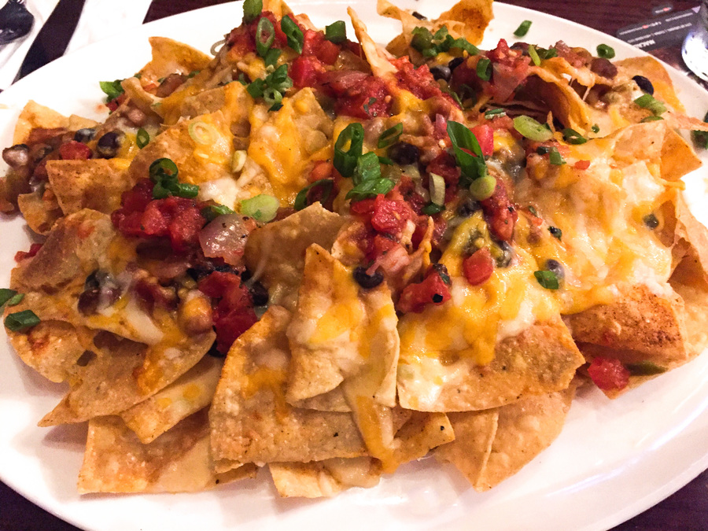
- `attic`  /ˈætɪk/   the room or space under the roof of a house (SAME MEANING: loft): My old clothes are in a box in the attic   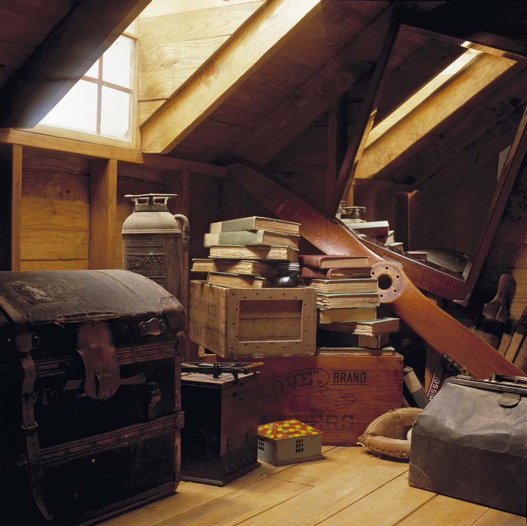
- `waitress`  /ˈweɪtrəs/   a woman whose job is to serve customers at their tables in a restaurant   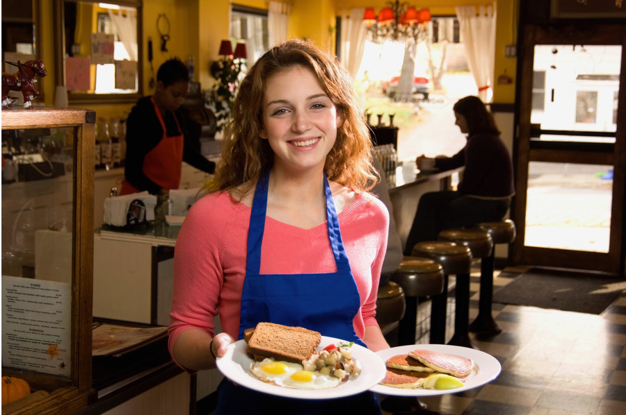
- `waiter`  /ˈweɪtər/   a man whose job is to serve customers at their tables in a restaurant   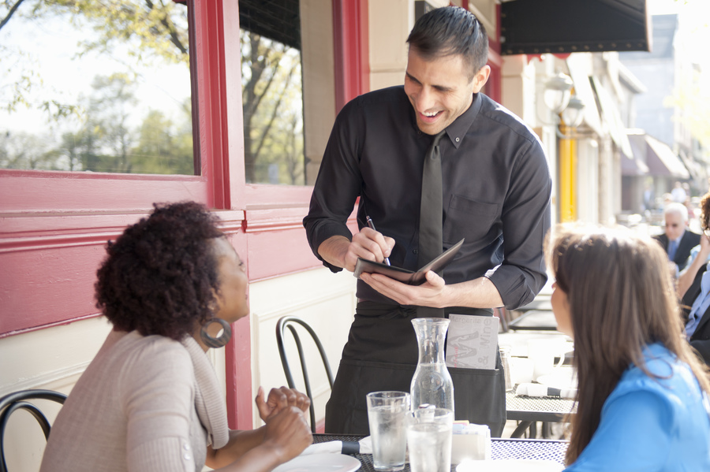

### Party (21 words)
- `day off`    day without work: I won't be in on Thursday _ it's my day off
- `shrimp`  /ʃrɪmp/   a small sea creature with a shell and ten legs, that can be eaten: grilled shrimp   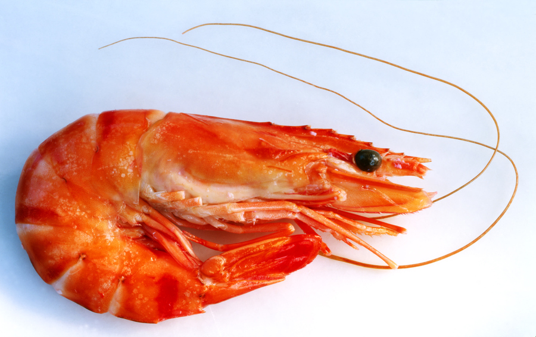
- `inflation`  /ɪnˈfleɪ.ʃən/   a general, continuous increase in prices: 13 percent inflation
- ` mascot-is-lion  `    
- `increase (verb)`  /ɪnˈkriːs/   to become bigger or more; to make something bigger or more (OPPOSITE: decrease): The number of women who go out to work has increased - I'm going to increase your pocket money to $5
- `increase (noun)`  /ˈɪŋkriːs/   a rise in the amount, number or value of something (OPPOSITE: decrease): There has been an increase in road accidents - a price increase
- `rise (noun)`  /raɪz/   an increase in an amount, a number or a level
- `cape`  /keɪp/   1. a piece of clothing that covers your body and your arms, but does not have separate sleeves   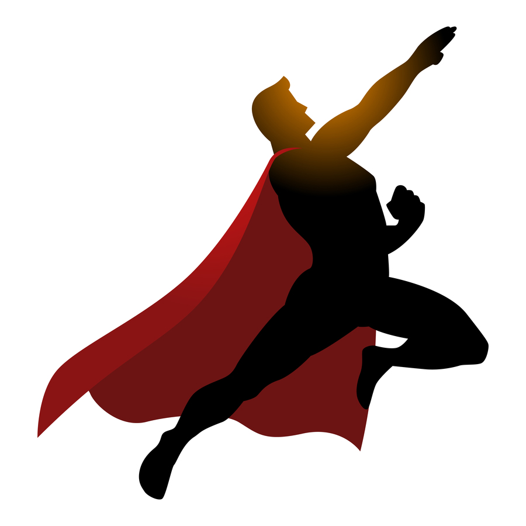   2. a high part of the land that goes out into the sea: the Cape of Good Hope
- `sparkle (verb)`  /ˈspɑːr.kəl/   to shine brightly with a lot of small points of light: The snow/sea sparkled in the sunlight
- `sparkle (noun)`  /ˈspɑːr.kəl/   bright shine: the sparkle of diamonds
- `mascot`  /ˈmæs.kɑːt/   a person, animal or thing that people think brings them good luck
- `pea`  /piː/   a green seed, eaten as a vegetable   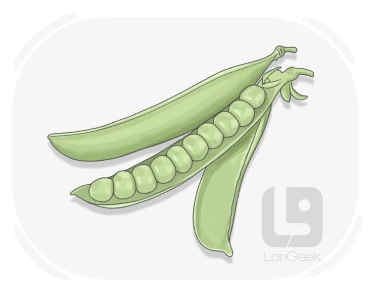
- `cabbage`  /ˈkæb.ɪdʒ/   a large, round vegetable with large green, white, or purple leaves that can be eaten cooked or uncooked   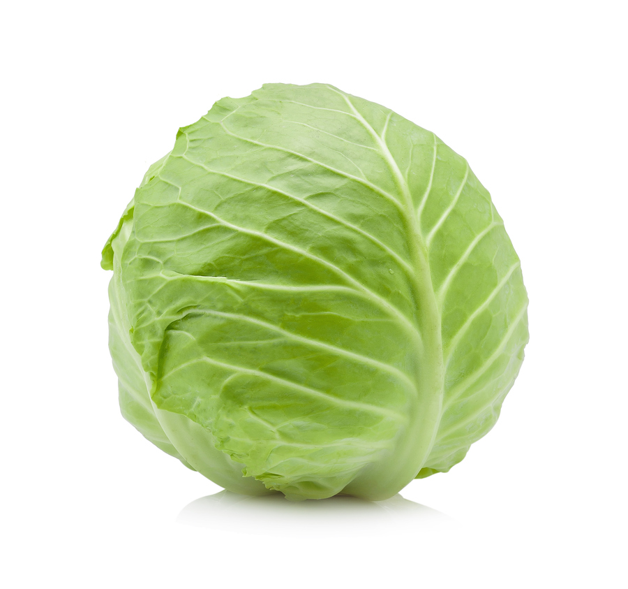
- `topping`  /ˈtɑː.pɪŋ/   a substance, especially a sauce or pieces of food, that is put on top of other food to give extra flavour and to make it look attractive: pizza topping
- `lift (verb)`  /lɪft/   to move somebody or something to a higher position: I can't lift this box. It's too heavy - Lift your arm up
- `sidewalk`  /ˈsaɪd.wɑːk/   a path for people to walk on   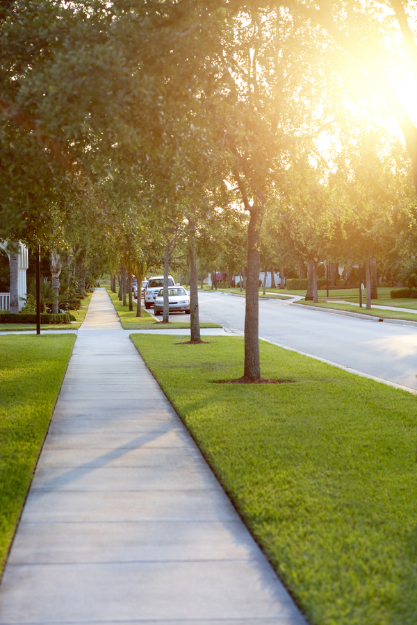
- `bend (verb)`  /bend/   1. to make something that was straight into a curved shape: Bend your legs   2. to be or become curved: The road bends to the left - I bend to pick it up   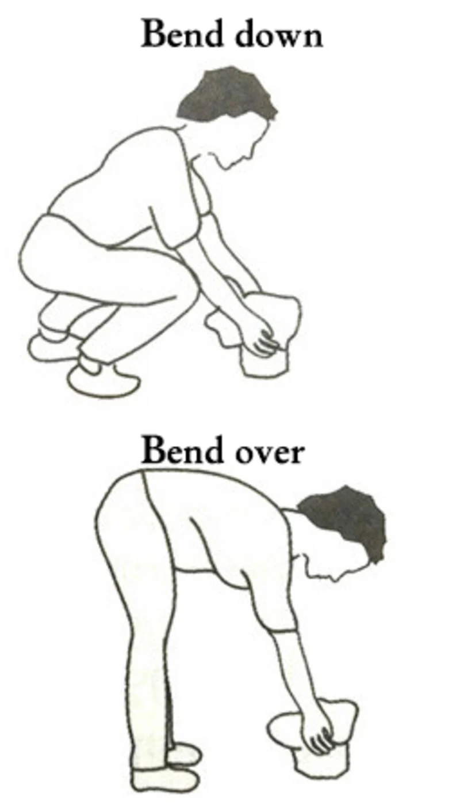
- `curved (adjective)`  /kɜːrvd/   having the form of a curve
- `curve (noun)`  /kɜːrv/   a line that is not straight; a bend   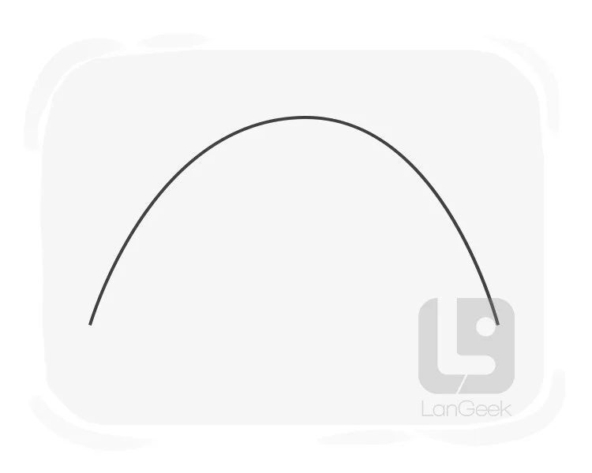
- `band (noun)`  /bænd/   1. a group of people who play music together: a rock band - a jazz band   2. a thin flat piece of material that you put around something: I put an elastic band round the letter to keep them together - The hat had a red band round it   3. a line of color or material on something that is different from the rest of it: She wore a red jumper with a green band across the middle
- `safety (noun)`  /ˈseɪf.ti/   being safe: He is worried about the safety of his children
---
