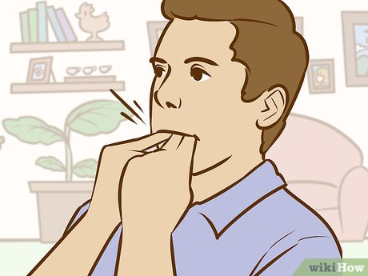
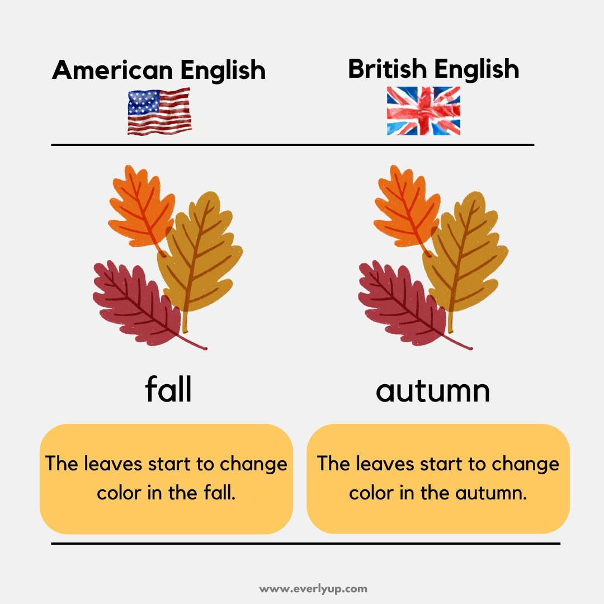

# General - Vocabulary

**Total words: 38**

## 📑 Table of Contents

- [game (5 words)](#game-5-words)
- [news (3 words)](#news-3-words)
- [social media (17 words)](#social-media-17-words)
- [other (13 words)](#other-13-words)

---

## game (5 words)
- **swipe** /swaɪp/ : 1. to hit or try to hit something by swinging your arm: he swiped at the ball and missed   2. to steal something
- **hit (verb)** /hɪt/ : to touch somebody or something hard: He hit me on the head with a book - The car a wall wall - I hit my knee on the door
- **swing (verb)** /swɪŋ/ : 1. to move backwards and forwards or from side to side through the air; to make somebody or something do this: Monkeys were swinging from the trees - He swung his arms as he walked   2. to move in a curve: The door swung open
- **chief (noun)** /tʃiːf/ : the leader or ruler of a group of people: the chief of an African tribe - police chief
- **chef** /ʃef/ : a professional cook, especially the head cook in a hotel or restaurant
---

## news (3 words)
- **attention** /əˈtenʃn/ : looking or listening carefully and with interest: Can I have your attention, please? (= please listen to me)
- **pay attention** : to look or listen carefully: Please pay attention to what I'm saying
- **matter (noun)** /ˈmætər/ : something that you must talk about or do: There is a matter I would like to discuss with you
---

## social media (17 words)
- **teenager** /ˈtiːneɪdʒər/ : a person who is between 13 and 19 years old
- **genuinely** /ˈdʒɛnjuɪnli/ : realy: Do you think he's genuinely sorry?
- **deserve** /dɪˈzɜːrv/ : to be good or bad enough to have somethong: You have worked very hard and you deserve a rest - They stole money from old people, so they deserve to go to prison
- **wear (verb)** /wer/ : to have clothes, jewellery, etc. on your body: She was wearing a red dress - I wear glasses
- **even (adverb)** /ˈiːvən/ : 1. a word that you use to say that something is surprising: The game is so easy that even a child can play it - He didn't laugh _ he didn't even smile   2. a word that you use to make another word stronger: Their house is even smaller than ours
- **pretty (adverb)** /ˈprɪti/ : quite; fairly: It's pretty cold today
- **quite** /kwaɪt/ : 1. not very; rather (SAME MEANING: fairly): it's quite warm today, but it's not hot - He plays the guitor quite well - We waited quite a long time   2. completely: Dinner is not quite ready
- **fairly** /ˈferli/ : 1. quite; not very : She speaks French fairly well - I'm fairly certain it was him   2. in a way that is right and honest: This company treats its workers fairly (OPPOSITE: unfairly)
- **worried** /ˈwɜːrid/ : unhappy because you think that something bad will happen or has happened: Fiana is worried that she's going to fail the exam - I'm worried about my brother _ he looks ill
- **stupid** /ˈstuːpɪd/ : not intelligent; silly: Don't be so stupid! - What a stupid question!
- **silly** /ˈsɪli/ : not sensible or clever; stupid: Don't be so silly - It was silly of you to leave the door open when you went out
- **sensible** /ˈsensəbl/ : able to think carefully about something and to do the right thing: It wasn't very sensible of you to run away - a sensible answer (OPPOSITE: silly)
- **clever** /ˈklevər/ : quick at learning and understanding things (SAME MEANING: intelligent): a clever student (OPPOSITE: stupid)
- **crazy** /ˈkreɪzi/ : 1. stupid; not sensible: You must be crazy to ride a bike at night with no lights   2. very angry: My mum will go crazy if I get home late   3. if you are crazy about something or somebody, you like them very much: She's crazy about football - He's crazy about her (SAME MEANING: mad)
- **comfortable** /ˈkʌm.fɚ.t̬ə.bəl/ : 1. nice to sit in, to be in, or to wear: This is a very comfortable bed - comfortable shoes   2. physically relaxed; with no pain or worry: Sit down and make yourself comfortable (OPPOSITE: uncomfortable) - راحت
- **whistle (verb)** /ˈwɪsl/ : to make a long high sound by blowing air out between your lips or through a whistle: He whistled a tune to himself   
- **literally** /ˈlɪtərəli/ : 'really' or 'truly'; It means something is a fact, not a joke: I'm literally the wrong colour (= I am really the wrong colour)
---

## other (13 words)
- **benefit (verb)** /ˈbenɪfɪt/ : to be good or helpful for somebody: The new law will benefit families with children   **benefit from something** to get something good or useful from something: She will benefit from a holiday
- **purpose** /ˈpɜːrpəs/ : the reason for doing something: What is the purpose of your visit?
- **reason** /ˈriːzn/ : a cause or an explanation for why you do something or why something happens: The reason I didn't come to the party was that I was ill - Is there any reason why you were late? - She gave no reasons for her decision
- **cause (noun)** /kɔːz/ : 1. a thing or person that makes something happen: Bad driving is the cause of most road accidents   2. something that people care about and want to help: They gave the money to a good cause _ it was used to build a new hospital
- **against** /əˈɡenst/ : 1. on the other side in a game, fight, etc.: They played against a football team from another vilage   2. if you are against something, you do not agree with it: Many people are against the plan   3. touching somebody or something for support: I put the ladder against the wall   4. to stop something: Have you had an injection against the disease?
- **vehicle** /ˈviːəkl/ : a car, bus, lorry, bicycle, etc.; a thing that takes people or things from place to place: Are you the owner of this vehicle?
- **vacation** /veɪˈkeɪʃən/ : (British holiday) a period of time when you are not working or studying: They're on vacation in Hawaii
- **amazing** /əˈmeɪzɪŋ/ : if something is amazing, it surprises you very much and is difficult to believe (SAME MEANING: incredible): he has shown amazing courage - I've got an amazing story to tell you
- **to** : 1. a word that shows direction: She went to Italy - James has gone to school - this bus goes to the city center   2. a word that shows the person or thing that receives something: I gave the book to Paula - He sent a letter to his parents - Be kind to animals   3. a word that shows the end or limit of something: The museum is open from 9:30 to 5:30 - Jeans cost from $20 to $45   4. on or against something: He put his hands to his ears - They were sitting back to back   5. a word that shows how something changes: The sky changed from blue to grey   6. a word that shows why: I came to help   7. a word that you use for comparing things: I prefer football to tennis   8. a word that shows how many minutes it is before the hour: It's two minutes to six   9. a word that you use before verbs to make the infinitive (= the simple from of a verb): I want to go home - Don't forget to write - She asked me to go but I didn't want to (= to go)
- **for (preposition)** : 1. a word that shows who will get or have something: These flowers are for you   2. a word that shows how something is used or why something is done: We had fish and chips for dinner - Take this medicine for your cold - He was sent to prison for murder   3. a word that shows how long something has been happening: She has lived here for 20 years   4. a word that shows how far somebody or something goes: We walked for miles (= a very long way)   5. a word that shows where a person or thing is going: Is this the train for Glasgow?   6. a word that shows the person or thing you are talking about: It's time for us to go   7. a word that shows how much something is: I bought this book for $9   8. a word that shows that you like an idea: Some people were for the strike and others were against it (OPPOSITE: against)   9. on the side of somebody or something: He plays football for Italy   10. with the meaning of: What is the word for 'table' in Persian?
- **fantastic** /fænˈtæstɪk/ : very good; wonderful (SAME MEANING: great) or brilliant: We had a fantastic holiday
- **abbreviation** /əˌbriːviˈeɪʃən/ : a short form of a word or phrase
- **autumn** /ˈɑːtəm/ : the season of the year between summer and winter, when leaves fall from trees   
---
